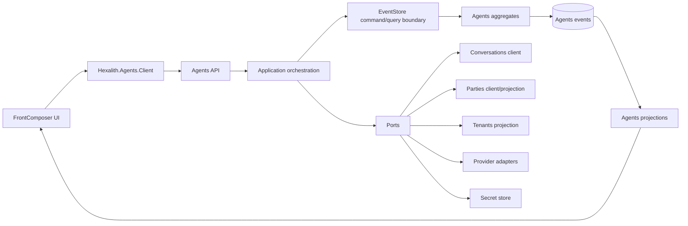
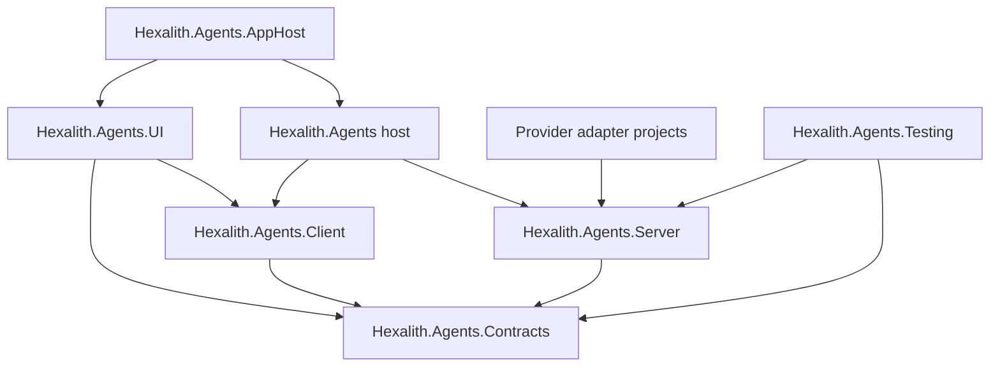
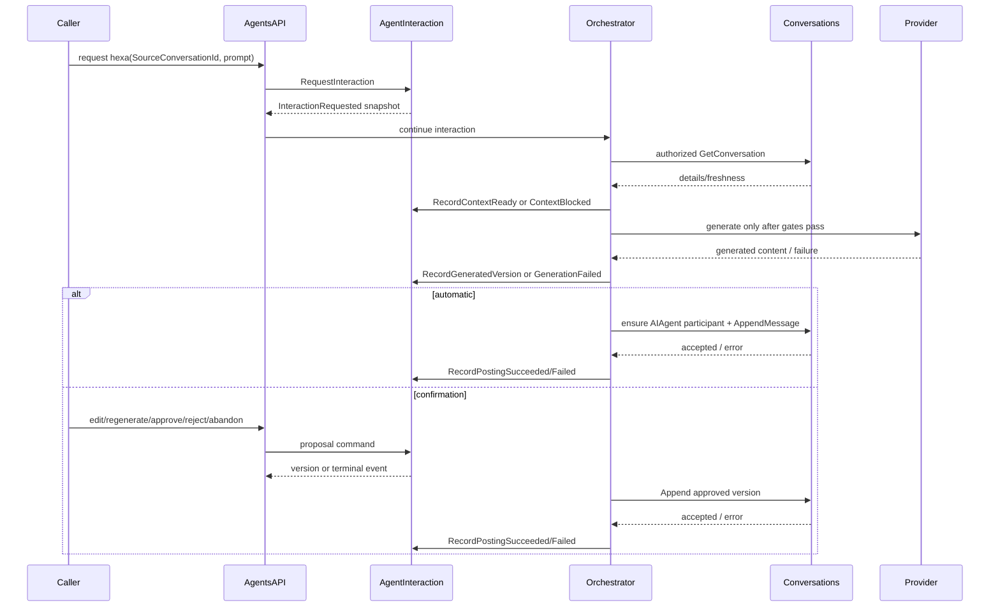
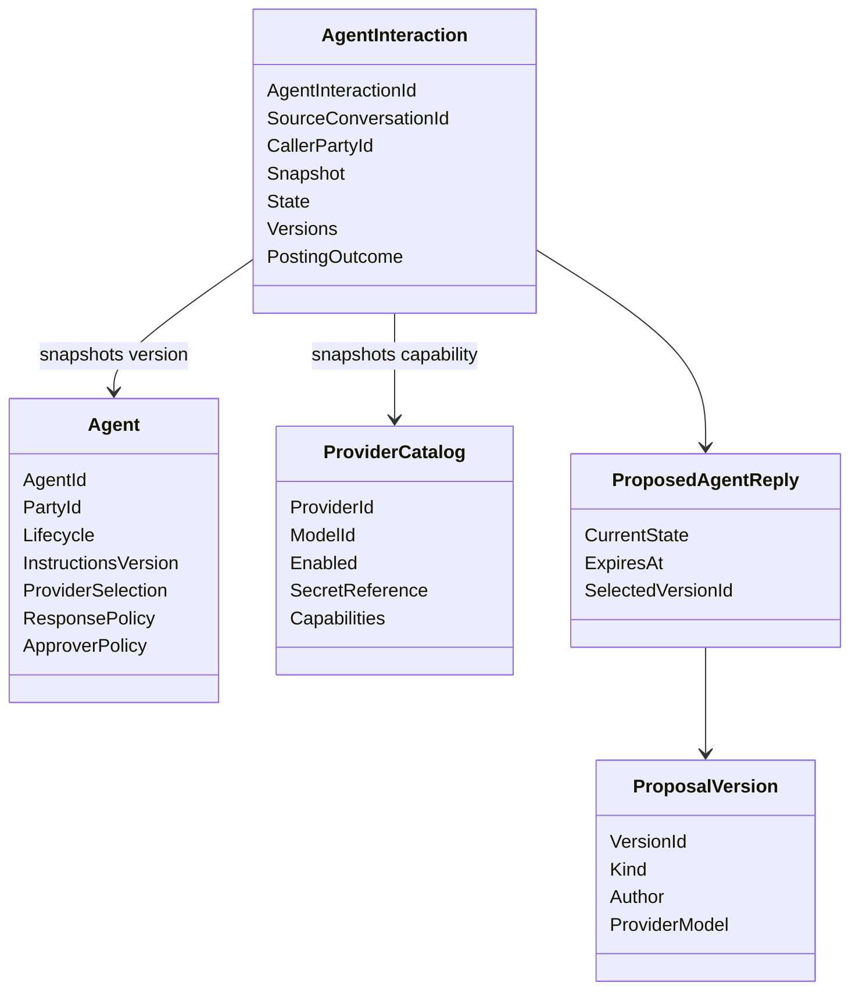

# Architecture Spine - Hexalith Agents

## Design Paradigm

Hexalith Agents is an event-sourced hexagonal Hexalith domain module.

The domain core is EventStore-backed: aggregates decide from commands and current state, then emit domain or rejection events. Application services coordinate side effects through ports. Adapters implement Conversations, Parties, Tenants, provider, secret, notification, and FrontComposer integration.



## Invariants & Rules

### AD-1 - Agents Is A Full EventStore Domain Module [ADOPTED]

- **Binds:** all V1 capabilities.
- **Prevents:** proposal, provider, and audit state being split between a transient orchestrator and unrelated modules.
- **Rule:** Hexalith Agents owns durable Agent configuration, provider governance, Agent interactions, generated/edited/regenerated proposal versions, approval decisions, posting outcomes, audit evidence, and operational status as EventStore-backed domain state.

### AD-2 - Aggregate Boundaries

- **Binds:** FR-1..FR-18, FR-24, FR-25.
- **Prevents:** one tenant-wide hot aggregate or split call/proposal records with incompatible audit history.
- **Rule:** Use separate aggregate boundaries: `Agent` owns identity link, lifecycle, instructions, provider/model selection, response policy, and approver policy; `ProviderCatalog` owns provider/model records, capability metadata, enablement, and secret references; `AgentInteraction` owns each call, generation attempt, proposal lifecycle when applicable, version history, approval/rejection/abandonment/expiry, automatic-post evidence, and posting outcome.

### AD-3 - Pure Aggregates, Side Effects Outside

- **Binds:** all write paths.
- **Prevents:** replay-unsafe provider calls, HTTP calls, timers, or dependency reads inside aggregate logic.
- **Rule:** Aggregate `Handle` methods emit events only. Provider calls, Conversations reads/posts, Parties validation/provisioning, Tenants projection reads, expiry timers, and notifications run in application orchestration/adapters and feed results back through commands.

### AD-4 - Interaction Snapshot

- **Binds:** FR-5, FR-6, FR-7, FR-13..FR-18, FR-24.
- **Prevents:** pending interactions changing model, instructions, response mode, or approval authority when administrators edit configuration later.
- **Rule:** `AgentInteraction` snapshots Agent configuration version, instructions version, response mode, approver policy version, `ProviderId`, `ModelId`, provider capability version, caller `PartyId`, source `ConversationId`, and context-build policy at request time. Later Agent or ProviderCatalog changes affect future interactions only.

### AD-5 - Proposal Lifecycle

- **Binds:** FR-13..FR-18, FR-24.
- **Prevents:** drafts being mistaken for Conversation messages or edits overwriting generated versions.
- **Rule:** Proposal state is append-only: generated, edited, regenerated, approved, rejected, abandoned, expired, posting pending, posted, posting failed. Each generated/edited/regenerated content version is immutable. Approval selects exactly one version. Rejected, abandoned, and expired interactions preserve all versions and cannot later post.

### AD-6 - Conversations Boundary

- **Binds:** FR-2, FR-8..FR-12, FR-17.
- **Prevents:** Agents bypassing Conversations authorization, idempotency, governance, and typed error contracts.
- **Rule:** Agents reads context and posts final messages through supported `Hexalith.Conversations.Client`/API boundaries, especially `GetConversationAsync` and `AppendMessageAsync`. Agent membership must be established only through an official Conversations `AddParticipant` command/API/client seam; if that seam is not public when Agents implementation starts, adding or exposing it is a prerequisite. Agents never writes Conversation streams/events directly, and a Proposed Agent Reply is never a Conversation Message.

### AD-7 - Agent Party Identity And Membership

- **Binds:** FR-2, FR-11, FR-17.
- **Prevents:** anonymous system authors, caller-authored AI messages, or duplicated Party PII.
- **Rule:** Agents stores stable `PartyId` references only. Agent creation/linking validates or provisions identity through Parties adapters. Before posting, Agents ensures the Agent `PartyId` is valid and present in the source Conversation as `ParticipantType.AiAgent` with an approved role through a Conversations-owned membership command. Posting fails closed if Party state, membership state, or the Conversations membership seam is missing, disabled, ambiguous, or unavailable.

### AD-8 - Approver Policy Resolution

- **Binds:** FR-7, FR-15..FR-18, FR-20.
- **Prevents:** each proposal workflow inventing a different meaning for owner, caller, role, or predefined approver.
- **Rule:** ApproverPolicy is Agents-owned configuration with V1 sources: caller `PartyId`, predefined `PartyId`s, tenant roles resolved from the local Tenants projection, and conversation authority resolved from Conversations detail. Current Conversations contracts expose `ParticipantRole.Facilitator` but no owner field; V1 treats product "conversation owner" authority as Conversation Facilitator unless Conversations adds an explicit owner resolver before implementation.

### AD-9 - Provider Adapter And Catalog Boundary

- **Binds:** FR-4, FR-5, FR-10, FR-24, FR-25.
- **Prevents:** provider SDK types, credentials, or provider-specific errors leaking into public contracts, UI, audit, or events.
- **Rule:** Provider integration is hidden behind Agents-owned generation adapters. Public contracts and durable events expose only `ProviderId`, `ModelId`, safe capability metadata, usage/status, safe error classes, and secret reference/configured state.

### AD-10 - Provider Capability Floor

- **Binds:** FR-4, FR-5, OQ-7.
- **Prevents:** incompatible provider metadata shapes across admin UI, runtime checks, and audit.
- **Rule:** `ProviderCatalog` V1 capability metadata includes `ProviderId`, `ModelId`, display label, enabled state, secret reference/configured state, text-generation capability, context-window token limit, max-output token limit, timeout policy, and optional safe capability flags. Provider-specific knobs stay adapter-local until promoted by a new architecture decision.

### AD-11 - Conversation Context Bounds

- **Binds:** FR-9, FR-10, OQ-10.
- **Prevents:** silent truncation, summary substitution, or provider calls on stale/partial context.
- **Rule:** V1 context is built only from authorized Conversations detail and visible timeline content. If full source context cannot be loaded fresh enough or cannot fit the selected model context budget after reserving configured output tokens, record context-blocked failure and create no provider call, proposal, or Conversation Message.

### AD-12 - Authorization And Dependency Uncertainty

- **Binds:** FR-19..FR-21.
- **Prevents:** JWT-only authorization, UI-only authorization, or side effects on stale projections.
- **Rule:** Authorization gates run before every side effect and fail closed on missing, stale, ambiguous, disabled, or unavailable dependency state. Tenant access comes from Agents' local Tenants projection; conversation access/context from Conversations authorized queries; Party state from Parties adapters/projections; provider/model readiness from ProviderCatalog projections; approver rights from the AgentInteraction policy snapshot plus current dependency availability.

### AD-13 - Idempotent External Effects

- **Binds:** FR-10..FR-18, FR-24.
- **Prevents:** duplicate provider attempts, duplicate messages, or duplicate proposal versions during retry/replay.
- **Rule:** External side effects are causally tied to deterministic Agents ids. Generation attempts use deterministic attempt ids. Conversation posting uses deterministic `MessageId` and idempotency key derived from `AgentInteractionId` plus approved/generated `VersionId`. Retries record outcomes without creating duplicate Conversation Messages or duplicate versions.

### AD-14 - Sensitive Content And Secret Safety

- **Binds:** FR-4, FR-22, FR-24, data governance NFRs.
- **Prevents:** generated content, prompts, provider credentials, or provider payloads leaking through logs, telemetry, status, UI, or audit summaries.
- **Rule:** Generated, edited, prompt-derived, and context-derived content is sensitive conversation-derived content. Content-bearing Agents events/projections must use EventStore payload-protection/redaction conventions before production use; if protection is unavailable, content-bearing workflows stay disabled. Logs, telemetry, status, and audit summaries never include raw content, raw provider payloads, stack traces, or secrets. Provider credentials live only in configured secret stores or host configuration behind secret references.

### AD-15 - Public Surface And UI Parity

- **Binds:** FR-22, FR-23, UX spine.
- **Prevents:** UI-only workflows or client integrations that need EventStore/provider internals.
- **Rule:** Admin UI and API/client surfaces share the same public Agents contracts and authorization outcomes. FrontComposer UI registers an Agents domain/nav like Tenants, uses policy-gated entries, and calls Agents API/BFF/client boundaries rather than EventStore streams, provider SDKs, or aggregate internals.

### AD-16 - Module-Local Operational Topology

- **Binds:** deployment and environments.
- **Prevents:** the root workspace becoming an accidental product topology or stories guessing where to compose dependencies.
- **Rule:** Hexalith.Agents owns its own AppHost/local orchestration and deployable workloads. The root `agents` workspace remains a coordination/super-repo. Agents AppHost composes Agents service/UI with existing EventStore, Conversations, Parties, Tenants, and provider adapter dependencies for local/dev/test.

### AD-17 - Contract And Test Gates

- **Binds:** implementation readiness.
- **Prevents:** launch-critical invariants relying on manual QA or undocumented client behavior.
- **Rule:** Public contracts are versioned and additive-first. Tests must cover aggregate transition purity, authorization fail-closed paths, proposal version immutability, idempotent generation/posting retries, tenant isolation, context-too-large blocking, provider-secret non-disclosure, FrontComposer UI/contract conformance, and audit completeness for every posted response.





## Consistency Conventions

| Concern | Convention |
| --- | --- |
| Naming | Domain terms are `Agent`, `ProviderCatalog`, `AgentInteraction`, `ProposedAgentReply`, `VersionedProposalContent`, `ApproverPolicy`, `AgentCall`, `AgentResponse`, `AuditEvidence`. Use `hexa` only as the first configured Agent, not as a type name. |
| Identity | Agents owns `AgentId`, `AgentInteractionId`, `ProposalVersionId`, `ProviderId`, `ModelId`. Parties owns `PartyId`; Conversations owns `ConversationId` and `MessageId`; Tenants owns tenant membership/roles. |
| Mutation | Only EventStore commands mutate Agents state. External effects return through follow-up commands/events. |
| Time | Expiry and time-based decisions use injected time and snapshotted policy; no aggregate wall-clock reads. |
| Idempotency | API commands accept idempotency metadata. Provider attempts, version ids, and Conversation posts derive deterministic ids from interaction/version context. |
| Errors | Business failures are typed rejection/status events or structured public errors. Provider errors are mapped to safe classes. |
| Content | Prompt/generated/edited/context content is sensitive. No raw content in logs, telemetry dimensions, status badges, queue summaries, or provider errors. |
| Authorization | Every API/UI/provider/post/proposal/audit path evaluates tenant, Party, Conversation, Agent, Provider, and ApproverPolicy gates before side effects. |
| Projections | Read models expose freshness/degraded/blocked states. Stale state must not be rendered or treated as fresh. |
| UI | Agents UI inherits FrontComposer and Fluent UI semantics; proposed replies are visually and behaviorally distinct from Conversation Messages. |

## Stack

| Name | Version |
| --- | --- |
| .NET SDK | `10.0.300`-`10.0.301` local Hexalith baseline |
| Target framework | `net10.0` |
| Solution format | `.slnx` |
| Package management | Central Package Management via `Directory.Packages.props` |
| Hexalith.EventStore | local sibling source commit `c3ce4a40` |
| Hexalith.Conversations | local sibling source commit `46df0cd` |
| Hexalith.Parties | local sibling source commit `0191a6c` |
| Hexalith.Tenants | local sibling source commit `9a3567b` |
| Hexalith.FrontComposer | local sibling source commit `eee5e6b` |
| Dapr packages | `1.18.4` local sibling baseline |
| .NET Aspire Hosting | `13.4.6` local sibling baseline |
| MediatR | `14.1.0` local sibling baseline |
| FluentValidation | `12.1.1` local sibling baseline |
| OpenTelemetry | `1.15.x`-`1.16.0` local sibling baseline |
| Fluent UI Blazor | `5.0.0-rc.3-26138.1` through FrontComposer baseline |
| xUnit v3 | `3.2.2` local sibling baseline |
| Shouldly | `4.3.0` local sibling baseline |
| Provider SDK | Deferred; adapter-local when selected |

## Structural Seed

```text
Hexalith.Agents/
  Hexalith.Agents.slnx
  global.json
  Directory.Build.props
  Directory.Packages.props
  src/
    Hexalith.Agents.Contracts/
    Hexalith.Agents.Client/
    Hexalith.Agents.Server/
      Aggregates/
      Application/
      Ports/
      Projections/
    Hexalith.Agents/
    Hexalith.Agents.UI/
    Hexalith.Agents.AppHost/
    Hexalith.Agents.Aspire/
    Hexalith.Agents.ServiceDefaults/
    Hexalith.Agents.Testing/
  tests/
    Hexalith.Agents.Contracts.Tests/
    Hexalith.Agents.Server.Tests/
    Hexalith.Agents.Client.Tests/
    Hexalith.Agents.UI.Tests/
    Hexalith.Agents.IntegrationTests/
```



## Capability To Architecture Map

| Capability / Area | Lives In | Governed By |
| --- | --- | --- |
| Agent identity/config/lifecycle | `Agent` aggregate, Agents API/UI | AD-1, AD-2, AD-4, AD-7, AD-15 |
| Provider governance/model selection | `ProviderCatalog` aggregate, provider adapters | AD-2, AD-9, AD-10, AD-14 |
| Explicit conversation invocation | Agents API/client, invocation adapters | AD-3, AD-6, AD-11, AD-12 |
| Automatic response posting | `AgentInteraction` + Conversations client | AD-5, AD-6, AD-7, AD-13 |
| Confirmation/proposal workflow | `AgentInteraction` proposal state | AD-4, AD-5, AD-8, AD-13 |
| Authorization/tenant isolation | Agents application gates/projections | AD-8, AD-12 |
| Admin UI/API contracts | Agents Client/API/UI | AD-15, AD-17 |
| Audit/status evidence | Agents events/projections/queries | AD-5, AD-13, AD-14, AD-17 |
| Deployment/dev topology | Agents AppHost/host/service defaults | AD-16 |

## Deferred

| Decision | Reason It Can Wait |
| --- | --- |
| Exact Conversation invocation affordance: mention, command, action button, membership UI, or combination | UX/Product owns the entry pattern; architecture normalizes all entries into the same Agents command. |
| Public Conversations `AddParticipant` client/API seam if absent | Agents must use a Conversations-owned membership command before posting; exposing that seam is a prerequisite if the current public client/API does not support it. |
| Whether Conversations adds a first-class owner field | V1 has a facilitator-based resolver assumption; this only changes the resolver, not proposal state. |
| Exact proposal expiry default and allowed min/max | Product/launch policy can choose values; architecture already fixes where expiry lives and how it is snapshotted. |
| Notification channel and templates | Notifications are non-authoritative adapters over proposal events and queues. |
| Tenant-wide quota/budget enforcement | V1 has per-call guardrails and usage capture; quotas require product pricing/launch thresholds. |
| Concrete provider SDK and provider-specific options | Provider adapters are leaves; selecting an SDK does not alter public contracts or aggregate boundaries. |
| Launch latency targets | Operational metrics and timeout policy are in place; exact SLOs need release planning. |
| Audit retention/legal hold/export/deletion policy for Agents audit records | Product/governance decision; architecture already keeps content and evidence durable and tenant-scoped. |
| Safety filters/content policy provider | Launch security/product decision; provider adapters and generation gates can host it without changing aggregate boundaries. |
| V2 memory, tools, project/folder activation, ambient triggers, external channels, and multiple named Agents | Explicitly out of V1; current model avoids blocking future generalized Agents. |
