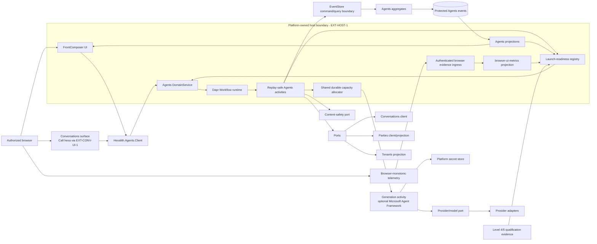
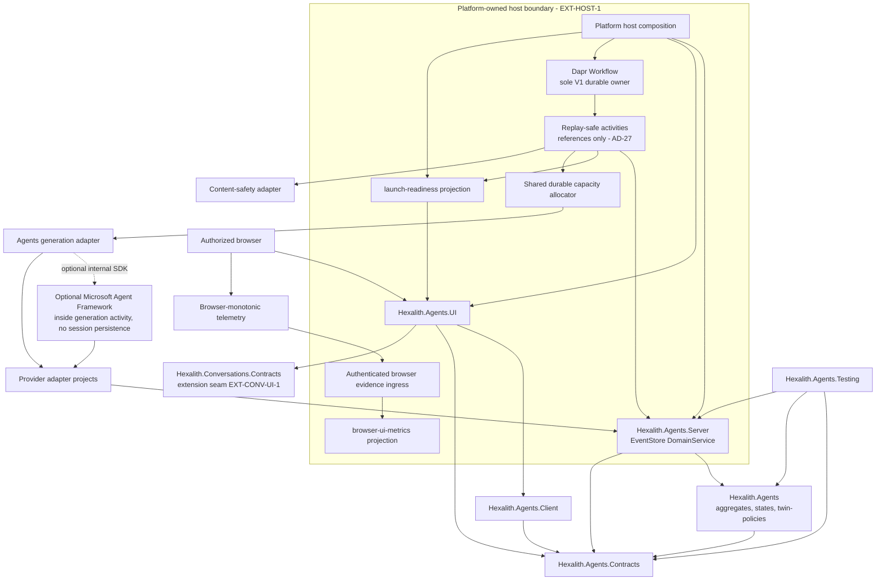
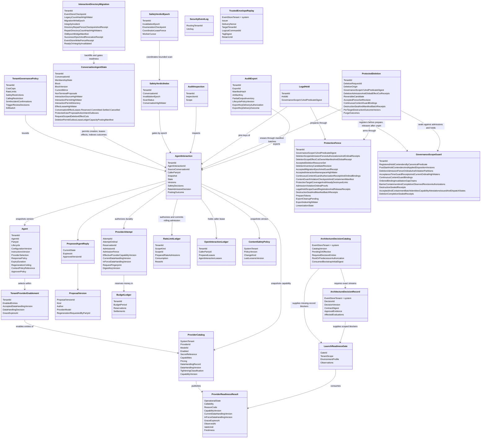

# Architecture Spine - Hexalith Agents

## Design Paradigm

Hexalith Agents is an event-sourced, Dapr-Workflow-orchestrated, hexagonal Hexalith domain module: EventStore aggregates in the `Hexalith.Agents` domain assembly are business truth, replay-safe Server orchestrators and workflow activities coordinate every side effect through ports, adapters implement Conversations, Parties, Tenants, Provider, safety, secret, and FrontComposer integration, and a platform-owned host composes it all.


```mermaid
flowchart LR
  Browser[Authorized browser] --> UI
  Browser --> BrowserTelemetry[Browser-monotonic telemetry]
  Browser --> ConvSurface[Conversations surface<br/>Call hexa via EXT-CONV-UI-1]
  ConvSurface --> Client
  subgraph PlatformBoundary[Platform-owned host boundary - EXT-HOST-1]
    API[Agents DomainService]
    UI[FrontComposer UI]
    Workflow[Dapr Workflow runtime]
    App[Replay-safe Agents activities]
    CapacityGate[Shared durable capacity allocator]
    ReadinessRegistry[Launch-readiness registry]
    Proj[Agents projections]
    EvidenceIngress[Authenticated browser evidence ingress]
    BrowserMetrics[browser-ui-metrics projection]
  end
  UI --> Client[Hexalith.Agents.Client]
  Client --> API
  API --> Workflow
  Workflow --> App
  App --> ReadinessRegistry
  App --> CapacityGate
  CapacityGate --> Generation[Generation activity<br/>optional Microsoft Agent Framework]
  App --> Ports[Ports]
  App --> ES[EventStore command/query boundary]
  ES --> Agg[Agents aggregates]
  Agg --> Events[(Protected Agents events)]
  Ports --> Conversations[Conversations client]
  Ports --> Parties[Parties client/projection]
  Ports --> Tenants[Tenants projection]
  Generation --> ProviderPort[Provider/model port]
  ProviderPort --> Provider[Provider adapters]
  App --> Safety[Content-safety port]
  Generation --> Secrets[Platform secret store]
  Events --> Proj
  Proj --> UI
  Proj --> ReadinessRegistry
  BrowserTelemetry --> EvidenceIngress
  EvidenceIngress --> BrowserMetrics
  BrowserMetrics --> ReadinessRegistry
  Evidence[Level 4/5 qualification evidence] --> ReadinessRegistry
  ReadinessRegistry --> API
```

## Invariants & Rules

### AD-1 - Agents Is A Full EventStore Domain Module [ADOPTED]

- **Binds:** all V1 capabilities.
- **Prevents:** proposal, provider, governance, and audit state being split between a transient orchestrator and unrelated modules.
- **Rule:** Hexalith Agents owns durable Agent configuration, provider governance, tenant enablement, Agent interactions, generated/edited/regenerated proposal versions, approval decisions, posting outcomes, budget, safety and governance policy, legal hold, export, deletion, readiness evidence, and operational status as EventStore-backed domain state.

### AD-2 - Aggregate Boundaries And Tenant Scope

- **Binds:** FR-1..FR-18, FR-24..FR-26, FR-28, FR-30, FR-32..FR-34, OQ-20, OQ-28.
- **Prevents:** two owners for one entity, an unbounded tenant-wide hot aggregate, a cross-tenant catalog, or governance state that lives only in a projection.
- **Rule:** V1 aggregates are exactly, with identity key and tenant scope: `Agent` (`TenantId`, `AgentId`; `hexa` is provisioned exactly once per tenant at tenant enablement by an idempotent create-only orchestration under the `Platform` principal, with a tenant-wide response mode, proposal expiry duration, regeneration ceiling, Conversation Context Policy, and immutable Party identity link; the orchestration obtains or creates the Party identity selected by the committed `EXT-PARTIES-1` branch through the Parties adapter under the Agents Service Principal before dispatching the Agent create command; exact replay is a no-op, a divergent second provision is a conflict, and no tenant role may create a second Agent, delete `hexa`, or replace its Party identity), `ProviderCatalog` (reserved EventStore tenant `system`, one stream per `ProviderId` + `ModelId`; provider/model records, capability metadata, versioned pricing, secret reference state, platform enablement), `TenantProviderEnablement` (`TenantId`; which platform entries the tenant may see and select, mutated by the Platform Operator [ASSUMPTION A-10]), `AgentInteraction` (`TenantId`, `AgentInteractionId`; each call, prepared attempts, safety decisions, proposal lifecycle, version history, approval/rejection/abandonment/expiry, posting outcome), `RateLimitLedger` (`TenantId`, `ScopeKind`, `ScopeId`; immutable per-Party or per-Conversation rolling-window consumption), `OpenInteractionLedger` (`TenantId`, `CallerPartyId`; one lease per nonterminal caller interaction), `BudgetLedger` (`TenantId`, `BudgetPeriod` as the UTC calendar month; monetary reservations and settlement in the original period), `TenantGovernancePolicy` (`TenantId`; cost caps, rate limits, tenant safety restrictions, calling restriction [ASSUMPTION A-11], durable SM-4 incident confirmations, trigger-review decisions, and the per-tenant kill switch, all serialized on one governance revision), `ConversationAgentState` (`TenantId`, `ConversationId`; exactly one of `NeverJoined`, `Joined`, `ExternallyRemoved`, `Blocked`, and `ReadmitPending`; monotonic `BlockVersion`; one `CurrentMirror(BlockVersion, Direction, Outcome, AttemptId)`; and an idempotent nonterminal-proposal materialization with interaction-source-revision high-water), `InteractionDirectoryMigration` (`TenantId`; one Platform-Operator-started content-free Workflow/cutover checkpoint, finite legacy-stream count/hash/high-water manifest, per-Conversation reconciliation positions, EventStore namespace write-fence epoch/revocation receipt, directory-repair boundary/checkpoint, and completion/integrity-invalidated state), `AuditInspection` (`TenantId`, `InspectionId`; compliance inspections, never under an interaction key), `SecurityEventLog` (`RoutingTenantId`, `UtcDay`; content-free authorization denials and security events routed exactly by AD-30, where `RoutingTenantId` is an authenticated actor/workflow tenant or reserved `system`, daily-partitioned by the aggregate key as the sole V1 volume mitigation [ASSUMPTION ARCH-A-9]), `TrustedEnvelopeReplay` (reserved tenant `system`, `Issuer`, `DeliveryNonce`; one content-free first-seen record binding target tenant, logical command, canonical-envelope tag digest, key version, and retention deadline), `ContentSafetyPolicy` (`system`; published policy versions with `ChangeKind` and `LastLoosensVersion`), `SafetyVerdictEpoch` (`TenantId`; current/pending epoch, frozen content-free safety-index checkpoint/manifest, bounded worker cursor, and expiring fenced coordinator lease) and `SafetyVerdictIndex` (`TenantId`, `ConversationId`; epoch-local verdict status and source high-water), `LaunchReadinessGate` (`GateId`, `TenantScope`, `EnvironmentProfile`), `ArchitectureDecisionCatalog` (reserved tenant `system`, one fixed stream; append-only pending/effective catalog versions enumerating every required stable `DecisionId`, minimum contract version, baseline affected evaluations, and root/predecessor authorization), `ArchitectureDecisionRecord` (reserved tenant `system`, one stream per catalog-listed `DecisionId`; append-only pending/effective contract versions, immutable predecessor/root-governance authorization, outcome approval evidence, and union-preserving affected evaluations feeding `launch-readiness`), `LegalHold` (`TenantId`, `HoldId`; canonical `GovernanceScopeV1` plus predicate digest), `ProtectionFence` (`TenantId`; low-volume tenant-serialized hold/deletion/export intent, request-scoped admission/effect-cut receipts, continuous content-guard binding receipts, reversible deletion candidates accepted as immutable resource sets only at the fence expected revision with one once-assigned stable `DestructionSealId`, prepare tokens, mutually exclusive prepare-recovery dispositions, and sole export-commit decisions with committed-export index high-water), `GovernanceScopeGuard` (`TenantId`; canonical-predicate hold contenders and releases, deletion admission-fence ordinals and violation partitions, continuous content-guard bindings and ordered invalidation-gap chains, barrier/containment observed-revision compare tokens, immutable destruction seals with actual committed guard revisions, and accepted/containment stable-seal manifest-batch identities plus non-expiring capability key versions and issued state; the protection owner separately owns consumed/revoked outcome), `AuditExport` (`TenantId`, `ExportId`; canonical scope, frozen interaction set, lifecycle-policy version, fence token, manifest and artifact outcome), and `ProtectedDeletion` (`TenantId`, `DeletionRequestId`; origin and canonical scope, admission/effect-cut receipts, reversible inventory candidates, exact `ProtectionFence` accepted-set acknowledgement, prepare acknowledgements, destruction and purge receipts). After provisioning, the Tenant Agent Administrator may configure, activate, disable, and inspect `hexa` but never invoke the provisioning operation. The `Agent` aggregate stores no safety policy; the interaction snapshot's safety version is the pair (`ContentSafetyPolicy` version, `TenantGovernancePolicy` version). Any decision whose wrong answer is unrecoverable (deletion under hold, key destruction, export scope) reads hold and policy state from the owning aggregate at an expected revision, never from a projection. `TenantId` is a mandatory component of every aggregate identity, deterministic id, idempotency tuple, projection key, query cursor scope, allocator call, and ledger call; a query for a key outside the caller's tenant, or for a platform entry not enabled for it, returns exactly the absent-key response, except that a query scoped to an Agent's own currently-selected `ProviderId`/`ModelId`, or to an in-flight interaction's previously-snapshotted entry, may instead report `EntryMissing` or a reason-coded `Blocked` `ProviderReadinessResult` inside `AgentReadinessStatus`, per AD-10 — the one named carve-out from the absent-key rule. A terminal historical interaction uses its immutable snapshot and authorized Audit Evidence and never receives this catalog-existence carve-out.

**Provider data-handling ownership:** `ProviderCatalog` owns the four-field data-handling record (retention term, training-use status, processing region, retained contractual reference), its monotonic `DataHandlingVersion`, and any Platform-Operator-declared tightening classification with the recorded field-level diff. `TenantProviderEnablement` owns the tenant's last accepted version and an explicit accept or decline decision for the current version; platform enablement permits selection but never constitutes tenant acceptance.

**Trusted replay namespace:** The `TenantId` component of every `TrustedEnvelopeReplay` identity is the reserved EventStore tenant `system`, not the target tenant authenticated by the envelope. Its entity key is (`Issuer`, `DeliveryNonce`), and the content-free first-seen record separately binds `TargetTenantId`. Nonce uniqueness is therefore platform-wide per issuer, so reusing one issuer/nonce against a different tenant addresses the same stream and is rejected as changed authenticated data.

**Canonical governance scope:** Every hold, export, deletion request, deletion effect cut, inventory candidate/acceptance, EventStore scope fence, violation, and completion carries one versioned `GovernanceScopeV1` discriminated value plus `ScopePredicateDigest = SHA-256(canonical length-prefixed scope bytes)`. Its wire variants are `ExactInteractions(TenantId, sorted-distinct AgentInteractionIds)` and `ExactConversation(TenantId, ConversationId)`; a `ConversationApprovedDeletion` is always the latter and cannot be coerced. Exact-interaction membership is the tenant-bound target stream plus immutable first-event/directory-permit binding. Exact-Conversation membership is the `ConversationAgentState` identity plus immutable permit/first-event `SourceConversationId`; later appends match that stored binding and exact permit/effect capability, never caller metadata. A permit/action intent exposes membership from its Conversation owner and interaction id; every interaction effect-phase authorization or lease acquire/commit exposes it from the referenced permit. Missing, malformed, unknown-version, cross-tenant, absent-permit, changed-source, or unverifiable membership rejects the write and makes verification incomplete. Only exact interactions and the PRD-fixed `ConversationApprovedDeletion` exact-Conversation variant are executable without another Product choice. Human-origin exact-Conversation hold, export, and operator deletion reject before fence/cut/inventory work while `OD-HUMAN-EXACT-CONVERSATION-SCOPE-1` is Open; Architecture does not choose point-in-time versus prospective semantics, later-content treatment, fence lifetime, or public effect.

The earlier `class:<ContentClass>` plus UTC-range notation is a reserved `ClassUtcRange` variant only; it is not executable while `OD-GOVERNANCE-CLASS-RANGE-SCOPE-1` is Open. That Product + Governance + Security decision must select the closed vocabulary/classification owner, authoritative UTC instant, boundary semantics, and public meaning. Architecture supplies no default. An approved successor adds its canonical fields and EventStore proof to the same schema/digest contract; exact interactions and source-approved exact-Conversation deletion remain independently evaluable.

**Conversation interaction directory, effect cutover, migration, and deletion-origin ownership:** `ConversationAgentState` retains exactly the five FR-2 membership states; orthogonally, it is the EventStore-authoritative content-free directory and effect owner for every derived interaction/failure record of (`TenantId`, `ConversationId`). Its immutable permits name interaction id, logical/request fingerprint, stored source Conversation/revision, creation outbox, protection-key alias, and monotonic high-water; payload exists only as AD-22 `ProtectedContent` sealed under the target interaction DEK and is absent from the directory projection. The aggregate also owns deterministic content-free leases for `WorkflowStart`, `ApproverResolution`, `ContextRead`, `ConversationMembership`, `ProviderInvocation`, `ProposalMutation`, and `ConversationPosting`, each bound to one permit, operation/attempt/target, revisions, and exactly one of `Reserved`, `CommittedToEffect`, `Settled`, or `CancelledBeforeCommit`. Reservation authorizes nothing. Only a same-owner `CommitConversationEffect` won before the first protected read, target mutation, dependency read, or external effect authorizes that exact phase and typed result. After an EventStore scope admission-fence receipt, an immutable owner-cycle `DeletionEffectCut(DeletionRequestId, ScopePredicateDigest, AdmissionFenceOrdinal)` may enter Closing on that owner: it cancels matching reservations/intents and manifests committed work as non-revocable. Effective is terminal for that ordinal and requires every matching outbox acknowledgement, cancellation, target/external result, ledger/capacity/posting settlement, and lease settlement. A successor ordinal never reopens or mutates that Effective fact; after a recorded admission violation invalidates the old global cut, it creates a separately keyed Closing cycle whose manifest is the union of every still-restrictive prior-cycle obligation and every newly visible/violating winner. The finite same-ordinal owner receipts then produce that ordinal's global effect-cut fixed point; no matching content-producing read, mutation, or external effect can escape it.

For a human edit, regeneration request, approval, rejection, or abandonment, `ProposalMutation:ReserveUserActionIntent` atomically appends the `Reserved` lease plus an immutable target-limited action intent/outbox on `ConversationAgentState`. The intent binds the original `User` principal's stable actor/Party/role/binding evidence, exact operation and target version, client/logical-command/idempotency identity, expected owner revisions, protection-key alias, and—only for an edit—the submitted bytes sealed under the target interaction DEK; the directory projection exposes no content. `CommitConversationEffect` binds that exact intent revision and digest. A reserved intent authorizes nothing and Closing cancellation consumes its outbox without a target read or mutation. After commit, either the still-authenticated original request or the existing `Interaction` Workflow may execute `RecoverCommittedUserProposalMutation` from that outbox. The recovery principal re-evaluates every current role, Party, Conversation, safety, lifecycle, and target precondition inside the committed lease and records the exact positive action or typed negative result; actor revocation or dependency failure therefore converges rather than impersonating the human or cancelling the lease. It cannot change operation, payload, actor, target, or expected intent, initiate an action, satisfy a second-party requirement, or expose the sealed bytes through workflow state. The target append records both original-human decision evidence and Workflow execution evidence, then the exact target revision acknowledges the outbox and settles the lease. API/workflow races use the same idempotency identity and expected target revision; crash or lost acknowledgement reads only the directory intent, interaction, and lease owners.

**Common deletion admission/effect cut:** Both deletion origins execute the same scope-aware cut before any deletion inventory candidate can be built. Every unleased external phase first has an interaction-owned authorization append whose exact revision is the sole capability for its external owner: existing `RateAdmissionAuthorized` plus `OpenInteractionLeaseAuthorized` for rate/open, `BudgetReservationAuthorized` for Budget reserve, and `CapacityAdmissionAuthorized` for allocator acquire/queue. Their external result/acknowledgement appends are distinct and cannot create a new phase. From the recorded origin, approved `GovernanceScopeV1`, current migration `Ready` epoch/guard, and authoritative directory/effect-authorization namespace high-water, the deletion Workflow records `DeletionScopeAdmissionFenceAuthorized`; only that revision lets `EXT-HOST-1` atomically install the predicate. The guard rejects every later matching permit, User-action-intent reservation, lease acquire/commit, or rate/open/Budget/capacity phase-authorization append, while permitting only exact result, settlement, cancellation, acknowledgement, deletion-cut, and guard-repair commands for work authorized before its receipt. It is independent of writer process/migration epoch and preserved across repair. Exact lookup resolves lost acknowledgement.

After the admission-fence receipt, the Workflow enumerates the finite authoritative `ConversationAgentState` owner cohort at that receipt: source deletion has its one owner, while exact interactions group permits by stored source Conversation and fail closed on unresolved binding. Each owner appends Closing for the exact `AdmissionFenceOrdinal` and manifests matching permits, creation/workflow-start/User-action-intent outboxes, leases, and every interaction-owned rate/open/Budget/capacity/posting authorization, decision, result, and acknowledgement through exact count/hash/high-waters. The fence makes every pre-boundary authorization a manifested obligation and every post-boundary authorization append lose. A successor cycle carries forward every prior ordinal's still-restrictive obligation and adds the violating/new winner; it never overwrites the prior Effective receipt. Closing cancels reserved work, retains committed/authorized work as must-converge, and the origin-matching Workflow may use only manifest-bound result, lookup, cancellation, ledger/capacity/posting settlement, acknowledgement, and lease-settlement variants. An owner reaches Effective only at that ordinal's fixed point; the complete same-ordinal owner receipt manifest produces `RecordDeletionScopeEffectCutEffective`. Candidate construction and acceptance require its exact admission-fence id/ordinal, install checkpoint, and `ZeroAcceptedViolationsSinceInstall` high-water for that ordinal. Partial cut acquisition remains restrictive pending.

**Admission-fence integrity recovery:** The EventStore guard owns one append-only request ledger partitioned immutably by `(DeletionRequestId, AdmissionFenceOrdinal)`, distinct from the content-fence ledger. Prior ordinal violations remain forever visible. Only the current installed ordinal can produce `ZeroAcceptedViolationsSinceInstall(InstallCheckpoint, VerifiedHighWater)`; “zero” never means request-lifetime zero and a successor cannot erase or relabel a prior violation. Candidate construction, acceptance, content-fence authorization/binding, and prepare directly verify the current ordinal proof still equals the proof bound to the current global effect-cut receipt. `ContainDeletionScopeAdmissionFenceViolation` records the exact violating phase authorization/permit/intent/lease, authoritative canonical-scope proof, guard receipt/ordinal, security observation, and expected fence revision, then assigns the one next ordinal idempotently. Before a first global cut it requires the explicit `NoCurrentGlobalCutCandidateOrAcceptedToken` branch and invalidates nothing nonexistent; after a cut it invalidates only each cited global cut/candidate/token whose exact revision exists. Both branches leave every existing fence and immutable owner-cycle receipt restrictive and authorize only the same successor admission-fence ordinal followed by new separately keyed owner Closing/Effective/global-cut cycles whose manifests carry forward prior obligations and include the violator. Concurrent detection and lost acknowledgement resolve to the same containment receipt and successor ordinal. If the continuous content guard is already installed, a later violation need not wait for an invalid token to be bound: every containment receipt forms one ordered gap link. Any in-flight binding authorization for an invalidated ordinal becomes the authenticated terminal result `ObsoleteBindingAuthorization(CurrentOrdinal, ContainmentChainHighWater)` and appends no guard binding. The next binding authorization must name the latest actually installed binding plus the complete gap-free ordered chain of every intervening invalidated or tokenless ordinal receipt through the current accepted token; the EventStore guard checks that chain and current admission ordinal atomically before appending one new current binding. Thus repeated violations can neither strand an unbound predecessor nor silently skip evidence. Exact lookup resolves containment, obsolete, install, and binding-result loss; no prepare/destruction step may use an old receipt.

The final irreversible boundary is not a direct read followed by a `ProtectionFence` append. One tenant `GovernanceScopeGuard(TenantId)` is the shared EventStore owner for overlapping hold intent and deletion sealing. Every already-authorized `LegalHold` request must first call `RegisterLegalHoldScopeGuardEffect`; the conditional guard commit is the hold's linearization instant and records its request/scope/revision as `HoldContenderRegistered` unless an overlapping deletion is already `DestructionSealed`. `RecordLegalHoldScopeGuardRegistration` mirrors the authenticated result to `ProtectionFence`; loss uses exact guard lookup. A registered contender remains restrictive through preparation/Active and is released at the same guard only after the exact approved hold-release, unpin, and fence-release receipts. If it overlaps an armed but unsealed deletion, both branches remain pending while `OD-HOLD-DELETION-PRECEDENCE-1` is Open. An approved outcome is recorded on `ProtectionFence`; the deletion-allowed outcome may be consumed only inside the guard's seal operation, while a hold-allowed outcome keeps the contender restrictive. This defines before/at/after ordering without choosing either Product outcome.

After prepare/arm, `AuthorizeDeletionDestructionStartBarrier` reads and persists the exact current `GovernanceScopeGuard` revision/compare token and appends a target-limited authorization on `ProtectionFence`, binding the once-assigned `DestructionSealId`, that observed guard revision, the current admission-fence ordinal and zero proof, current content-fence ordinal binding/checkpoint, migration guard, accepted token, immutable sorted accepted key-target manifest/digest, policy/lifecycle/store pins, and expected revisions. Only that exact authorization and observed guard revision may call `CommitDeletionDestructionStartBarrierEffect` on `GovernanceScopeGuard`; the operation conditionally appends at that revision. In one conditional operation serialized with every matching permit/intent/lease/phase-authorization append and every overlapping `RegisterLegalHoldScopeGuardEffect`, it verifies the current ordinal and both separate violation checkpoints, continuous content-fence binding, migration/fence receipts, and no compromise. It also requires either no overlapping registered hold contender or the exact effective `OD-HOLD-DELETION-PRECEDENCE-1` version/outcome that permits deletion and consumes that disposition in the same commit. Any registration, release, or other guard mutation after authorization makes the compare fail with authenticated `BarrierAuthorizationStale(CurrentGuardRevision)` and no seal; a new authorization may bind the new revision only after that result is mirrored and any overlapping contender has an exact approved disposition or release. The operation then commits immutable `DestructionSealed` and returns an authenticated non-expiring, revocable, single-use `DestroyDekManifest` capability bound to the exact accepted key-target manifest—not a reusable barrier bearer. It carries no `ExpiresAt`; its signing-key version remains verifiable for the full retention of the batch identity and terminal outcome, including exact retry/lookup after consumption or revocation, so outage, migration, and restore reuse the same immutable seal and batch ids rather than minting or renewing authority. The authenticated successful append result records the actual `CommittedDestructionSealGuardRevision` separately; no pre-issue identity or signed byte contains an anticipated seal revision. That guard commit instant is `DestructionStarted`; all later matching admissions are unconditionally rejected. `RecordDeletionDestructionStarted` mirrors only that exact seal/batch receipt to `ProtectionFence`. The protection engine atomically consumes the deterministic batch id, either destroys every listed DEK and returns the ordered per-target irreversible receipt vector or destroys none, and exposes exact lookup after crash/lost acknowledgement; changed manifests conflict and no second batch id is minted. Each first previously uncovered complete protection target from an authoritative post-seal same-predicate content violation is serialized on `ProtectionFence`, receives one monotonic `ContainmentOrdinal`, and freezes a singleton sorted manifest/digest; later resources for that target receive coverage links only, while concurrent distinct uncovered targets receive distinct ordinals. `AuthorizeDeletionContainmentBatch` persists the exact seal, violation receipt, containment ordinal/manifest, current continuous content binding, and observed scope-guard revision. Only that revision may call `CommitDeletionContainmentBatchEffect`, which conditionally appends `ContainmentBatchIssued` on `GovernanceScopeGuard` after atomically verifying the current guard/ledger state and no admission-integrity compromise, then returns the deterministic non-expiring, revocable, single-use capability; stale or lost results are authenticated and exact lookup cannot mint a second identity. `RecordDeletionContainmentBatchIssued` mirrors only that result before protection consumption. A later resource on the same complete target receives only a coverage link; only a distinct previously uncovered target receives a later ordinal/batch, and no frozen manifest is mutated. An EventStore-accepted matching admission after sealing is necessarily an integrity failure: it invokes `BlockDeletionBatchConsumption` for every affected batch to race `ReserveAndConsumeDeletionBatch` at the protection-engine owner, records `DeletionIntegrityCompromised`, blocks every new containment batch, remaining destructive authorization, and successful completion, and cannot become resource-only containment. If batch consumption won, its irreversible vector cannot be recalled; if revocation won, destruction does not begin. Unknown, malformed, outside-scope, or unresolved hold/violation/barrier/batch evidence blocks. Both origins use this protocol; no Product outcome is inferred.

`InteractionDirectoryMigration` owns the tenant cutover from legacy direct interaction streams. A fresh Platform Operator starts one target-limited `InteractionDirectoryMigration` Workflow through the Platform host; its deterministic principal may invoke only the migration variants for that tenant, cutover id, manifest, and expected revisions. While call and legacy interaction writers are durably quiesced across the recorded topology cohort, Begin freezes a finite EventStore checkpoint/inventory without requiring the circular audit/protection/deletion gate. The Workflow then installs an authoritative EventStore namespace write fence: every later create or content-bearing append to an `AgentInteraction` or `GenerationFailureRecord` stream must present the current tenant migration epoch plus an exact directory permit or committed-effect capability, and the legacy direct-write credential/epoch is revoked at the EventStore boundary before readiness. Disconnected, queued, restored, or old-version writers cannot bypass that boundary; a rejected late attempt is containment evidence, while an accepted post-fence legacy append is an integrity failure that appends `DirectoryInvalidated`, blocks calls, deletion, new permits, lease acquisitions, and lease commits, and enters the repair protocol below.

Repair always rotates the epoch and never strands an already-authorized old-epoch operation. `BeginRepairEpochTransition` quiesces the exact topology cohort and records the proposed old/successor epoch transition but does not yet freeze a directory cohort. Only its committed revision authorizes `InstallDirectoryRepairFence`, an `EXT-HOST-1` EventStore guard effect that atomically revokes the current capability for every new `ConversationAgentState` permit, creation/workflow-start/User-action-intent outbox, lease acquisition/commit, and interaction-owned rate/open/Budget/capacity phase authorization, and returns the tenant directory/effect-authorization namespace checkpoint. Every one of those ordinary appends is conditional on the current migration epoch capability at EventStore, so a pre-revocation winner is before that checkpoint and a stale/disconnected/restored post-revocation loser appends nothing. `RecordDirectoryRepairFence` records the exact outcome; unknown/lost acknowledgement is resolved by guard lookup. Only then may `FreezeRepairCohort` append the current epoch, directory-repair receipt/checkpoint, every directory permit, creation outbox, workflow-start outbox, protected User-action-intent outbox, effect lease, rate/open/Budget/capacity phase authorization/result/acknowledgement, and every active deletion admission-fence ordinal and violation-partition high-water, immutable owner/ordinal cycle receipt, continuous content-guard identity, ordinal/token binding and ordered invalidation-gap chain, legal-hold contender/release receipt, barrier/containment observed guard-revision authorization and stale result, destruction seal, and accepted/containment manifest-batch identity/capability-key/guard-issued state plus referenced protection-owner consumed-or-revoked outcome receipt. An intent paired with a reserved lease is cancelled and consumed; an intent paired with `CommittedToEffect` must reach its exact target result, outbox acknowledgement, and lease settlement. Every pre-fence unleased phase authorization must likewise reach its exact result/disposition and acknowledgement without starting a new phase.

`InstallOldEpochRepairBridge` then installs and records the EventStore guard receipt for a bridge that accepts the old epoch only for those exact frozen pending outboxes, `CommittedToEffect` leases, and already-recorded unleased phase authorizations while continuing to enforce every active deletion admission-fence ordinal and violation partition, immutable owner/ordinal cut cycle, continuous content-guard identity/binding and ordered invalidation-gap chain, legal-hold contender/release fact, barrier/containment observed guard-revision authorization and stale result, destruction seal, and accepted/containment manifest-batch identity/capability-key/guard-issued state plus referenced protection-owner consumed-or-revoked outcome receipt. None of these steps authorizes a new permit, reservation, commit, phase, target, or effect. `DrainOldEpochRepairMember` delivers each frozen creation outbox to its deterministic target, consumes each reserved User-action intent after cancellation, drives each committed intent/lease through its already-authorized result, outbox acknowledgement, settlement, and `Settled` acknowledgement, and drives each authorized rate/open/Budget/capacity phase only to its recorded or directly observed exact result/disposition and acknowledgement. A workflow-start outbox starts only when its matching `WorkflowStart` lease was already `CommittedToEffect`; otherwise, after any matching `Reserved` lease becomes `CancelledBeforeCommit`, the bridge consumes the outbox through `StartSuppressedByMigrationRepair` and terminalizes the interaction without normal work. Every other frozen `Reserved` lease likewise changes to `CancelledBeforeCommit` at its `ConversationAgentState` expected revision; a committed lease is never cancelled or rebound. Unknown outcomes remain pending. Only after every frozen member is exactly acknowledged may `InstallSuccessorWriteFence` compare the repair checkpoint and every directory/effect-authorization high-water plus admission ordinal/violation partition, immutable owner-cycle receipt, continuous content binding/gap chain, legal-hold contender/release, barrier/containment compare authorization/stale result, destruction seal, and accepted/containment manifest-batch guard-issued receipt plus protection-owner consumed-or-revoked outcome receipt, increment `FenceOrdinal`, make the successor `MigrationWriteEpochId` current, preserve and acknowledge all those active deletion and hold guard facts, and atomically revoke the old epoch, repair fence, and bridge. The Workflow then re-materializes the accepted late stream/revision, reconciles the complete legacy and directory cohorts, and repeats the two identical post-fence scans before `CompleteRepair` restores `DirectoryReady`. Crash or lost acknowledgement reads the migration owner, directory owners, target streams, and EventStore guard receipt by the same ids; restore tests prove a stale directory capability or old epoch cannot append outside its bridge manifest, drop an admission ordinal/violation partition, owner cycle, content binding/gap chain, legal-hold contender/release, barrier/containment compare authorization/stale result, destruction seal, or manifest-batch guard-issued identity or referenced protection-owner consumed-or-revoked outcome, or survive successor installation.

The initial Workflow materializes each existing stream as a content-free `MigratedFrom(StreamId, Revision)` directory member with current owner outcome and protection-state evidence, then requires the fence installation receipt, count/hash/high-water reconciliation, and two identical post-fence scans before `DirectoryReady`. Legacy plaintext is never treated as retroactively erasable: it retains `PayloadProtectionUnavailable` and blocks calls, directory completion for that data, Conversation deletion, and `RQ-1` under the surfaced `OD-LEGACY-PLAINTEXT-DISPOSITION-1`; Architecture chooses no migration, eradication, or unsupported-deployment outcome. Only an already-protected inventory or a signed, independently verified exact-empty inventory can complete under this spine until that decision is approved and an outcome-specific authorize/effect/result/recovery procedure is added. `ProtectedDeletion` stores a closed `DeletionOrigin`: `OperatorApprovedDeletion` carries the Platform requester and distinct Compliance Inspector approval evidence; `ConversationApprovedDeletion` carries authenticated Conversations source identity, stable signal id, source stream/revision, source approval reference, and source-contract version, with human requester/approver fields structurally absent. Common deletion state carries only policy/decision versions, frozen scope, instants, receipts, and safe result. Neither origin can be parsed or coerced into the other.

Before `EXT-PARTIES-1` commits its branch, create-only development paths may use the PRD A-27 Organization-typed transitional Party and bind it immutably by deterministic identity, but they produce no launch evidence. Every lookup verifies that exact provisioned Party by id; Branch A additionally requires AI Party type, while Branch B commits identity-by-id. Neither branch replaces an existing provisioned identity.

**Normative deletion guard refinements:** The following definitions narrow every earlier use of “violation,” “duplicate,” “capability,” and “completion” in this decision. The EventStore append guard, not caller evidence or detection time, assigns `AcceptedAtAdmissionFenceOrdinal` and `AcceptedAtGuardHighWater` at the linearization instant of every matching accepted append. It atomically records an `AdmissionGuardEvaluationReceipt` in the partition that was current at acceptance, retains any caller-presented stale ordinal only as diagnostic evidence, and contaminates that current partition before it can attest zero. Installation of a successor ordinal and a matching append serialize on this rule. Delayed detection uses the stored acceptance receipt; a matching accepted append without a verifiable receipt is `AdmissionIntegrityUnattributable`, invalidates current clean evidence, and blocks destructive progress rather than being assigned by guesswork.

A post-seal hold attempt never disappears behind a read-only `DestructionAlreadySealed` response. `RegisterLegalHoldScopeGuardEffect` conditionally appends `PostStartHoldContenderObserved(HoldId, CanonicalScope, ScopePredicateDigest, HoldRequestRevision, DestructionSealRevision, GuardRevision, Result=DestructionAlreadySealed)` on `GovernanceScopeGuard`, advances its compare revision, and returns that authenticated fact for exact lookup and fence mirroring. It is not silently promoted to an active hold and does not choose Product precedence. Until the exact effective `OD-HOLD-DELETION-PRECEDENCE-1` post-start outcome is recorded, current, and explicitly deletion-allowed for the affected batch/completion step, every still-preventable accepted-batch consumption, containment authorization/issuance/consumption, purge, and successful completion remains blocked. An already-consumed vector is immutable and cannot be recalled. A hold-allowed outcome grants no new destructive authority; a deletion-allowed outcome is bound as `PostStartHoldDispositionApplied(HoldId, DecisionVersion, Outcome, BatchKind, BatchOrdinal)` to each permitted batch dispatch and to completion. Missing, Open, stale, mismatched, or unavailable outcome evidence stays restrictive.

Batch issue is not a raceable read-before-effect grant. Before either an accepted or containment batch may reach protection, `AuthorizeDeletionBatchDispatch` appends on `ProtectionFence` the exact batch/manifest/active attestation, any required post-start disposition, and observed guard revision. `CommitDeletionBatchDispatchEffect` conditionally appends `DeletionBatchDispatchAuthorized` on `GovernanceScopeGuard` at that revision, serialized with hold observation, admission/content compromise, capability compromise/re-attestation, and completion. A prior post-start hold with no exact deletion-allowed outcome or any intervening mutation yields authenticated `DeletionBatchDispatchAuthorizationStale(CurrentGuardRevision)` and no dispatch; the stale result is mirrored before retry. A winning dispatch commit is uninterruptible only against a later hold for that batch: the hold records that dispatch already won and cannot cancel an effect that may have begun, although it still blocks any other batch, purge, or completion until its Product disposition is exact. Protection consumes only the exact active dispatch receipt; a later capability compromise must win the protection-owner block-versus-reservation race before physical consumption and requires same-batch re-attestation, a new dispatch authorization, and protection-owner activation, while a consumed vector is immutable.

Containment deduplicates on the complete protection target `(TenantId, AgentInteractionId, TargetProtectionKeyAlias)`, not on violation-resource identity. `ProtectionFence` owns an append-only target-coverage index mapping every post-seal violation receipt/resource to exactly one accepted or containment batch target and its terminal per-target receipt. If the target is already in the accepted manifest or an existing containment batch, it appends non-authorizing `ViolationCoveredByDeletionBatch(ViolationReceiptId, Target, OriginalBatchId, OriginalTargetOrdinal, OutcomeState)` and allocates no containment ordinal or capability; an issued/unconsumed original remains the only batch to consume, and a consumed original supplies `AlreadyDestroyedByBatch(OriginalBatchId, OriginalPerTargetReceipt)` while copy purge still accounts for the newly observed resource. Only a previously uncovered target receives the next monotonic containment ordinal and immutable singleton manifest. Concurrent same-target observations serialize to the same coverage result; different uncovered targets receive different ordinals. The protection owner also returns `AlreadyDestroyedByBatch` only for an exact tenant/interaction/alias match, never for a changed or cross-tenant target.

Every destruction capability is a `DeletionBatchCapabilityV1` detached JWS using RFC 8785 canonical JSON and ES256. Its signed bytes are exactly `Issuer`, `Audience`, `TenantId`, `DeletionRequestId`, `DestructionSealId`, `BatchKind`, `BatchOrdinal`, `BatchId`, `ManifestDigest`, `GuardStreamId`, `IntendedIssuedGuardRevision`, `AttestationOrdinal`, `SigningAttemptOrdinal`, and `CapabilityKeyVersion`; `Audience` names the committed `EXT-PROTECTION-1` target. `EXT-SECRETS-1` alone custodies the private per-tenant `DeletionBatchCapabilitySigningKey` family and publishes versioned public anchors; the host and EventStore store only signatures, anchor ids, versions, digests, and status. A target-limited authorize/sign/result step obtains the deterministic attestation before the guard issue commit; a signature whose exact stable seal/batch/manifest/attestation was not conditionally recorded as active on `GovernanceScopeGuard` is unusable. Routine rotation selects the current non-revoked version for new issue and retains old public anchors for the entire referenced batch/outcome lifetime. Emergency compromise enters through the non-public registrar, installs the tenant/key-version block at the protection owner, then records the guard fact and reconciles every issued batch using the authenticated owner outcomes. Already-consumed batches retain their exact vector. Only a batch in protection-owned `ConsumptionBlocked(CapabilityKeyCompromise)` may be re-attested under a healthy current key through a guard-expected-revision authorize/sign/commit/result protocol followed by successor dispatch and protection-owner activation that keeps the same immutable batch id and manifest, increments only `AttestationOrdinal`, marks the old attestation revoked, and leaves exactly one active attestation; this is credential replacement, never capability renewal or a second batch. Unknown protection state or incomplete enumeration remains blocked. At consumption, `EXT-PROTECTION-1` verifies the JWS/anchor/audience and performs linearizable exact guard-issued-state validation for the active attestation, batch, manifest, compromise state, and any applicable post-start hold disposition; signature-only acceptance is forbidden.

The online protection check accepts only `DeletionBatchDispatchAuthorized` for this same batch, manifest, and active attestation. It treats a later hold as ordered after that batch-specific uninterruptible authorization, never as absence; that later fact still restricts every not-yet-dispatched batch and completion. An authorization made stale by an earlier hold, compromise, or other guard mutation cannot be revived by lookup.

**Protection-owner consumption linearization:** A successful guard dispatch is uninterruptible only against a later legal-hold observation for that same batch, because Product precedence is ordered at dispatch; it is not the irreversible-effect instant for admission-integrity or capability-key compromise. After dispatch, every compromise-versus-consume decision occurs at the single `EXT-PROTECTION-1` batch owner. That owner maintains the closed local states `Unconsumed`, `ConsumptionBlocked(Reason, SourceRevision)`, `ConsumptionReserved(AttestationOrdinal, DispatchReceiptId)`, and terminal `Consumed(Vector)` or `RevokedBeforeConsumption`. `ReserveAndConsumeDeletionBatch` first verifies the exact guard-issued attestation and dispatch, then in one owner-linearized operation conditionally changes `Unconsumed` to `ConsumptionReserved` and performs the all-or-none physical destroy; `ConsumptionReserved` is the precise irreversible-effect instant and crash recovery must finish or return the exact same batch outcome. A target-limited `BlockDeletionBatchConsumption` for a post-seal admission-integrity fact, and the non-public compromise registrar's per-tenant/key-version block, contend with that same local transition. If the block wins, no old-attestation destruction can start; if reservation or terminal consumption wins, the immutable reservation/vector is returned and cannot be reclassified. A guard-side fact immediately blocks every new issue, dispatch, purge, and completion, but for an already-dispatched batch it is `BatchBlockPending` until the exact protection-owner outcome is mirrored; no guard read followed by a separate protection write is treated as the ordering boundary. Exact block/reserve/consume lookup resolves loss, an unknown owner result stays restrictive, and migration/restore preserves the local state and source receipt.

**Capability compromise and replacement:** `EXT-SECRETS-1` uses a per-tenant deletion-capability signing-key family. Its authenticated emergency-revocation delivery reaches the platform-composed non-public `IDeletionCapabilityCompromiseRegistrar`, which first installs the exact tenant/key-version/revocation-revision block at `EXT-PROTECTION-1` and then records `DeletionBatchCapabilityKeyCompromiseObserved` plus the authenticated protection outcome on `GovernanceScopeGuard`; neither step carries an Agents command principal. Re-attestation is authorized only from `ConsumptionBlocked(CapabilityKeyCompromise, ExactRevocationRevision)`, never from a prior `Unconsumed` read. The guard may then replace the credential for the same immutable batch/manifest and increment only `AttestationOrdinal`; the protection batch stays blocked. After the guard records that replacement and a successor `DeletionBatchDispatchAuthorized`, `ActivateReattestedDeletionBatch` binds the replacement key version, next attestation, successor dispatch receipt, expected blocked-batch revision, and expected tenant-key block-set revision; in one protection-owner transaction it changes the same state from that exact block to `Unconsumed` only when no block exists for the replacement key at that revision. If a replacement-key compromise is already present or wins the compare, activation returns `ActivationBlockedByReplacementKeyCompromise(NewKeyVersion, NewRevocationRevision, NewBlockReceiptId)` and conditionally retains or changes the batch to the exact `ConsumptionBlocked(CapabilityKeyCompromise, NewRevocationRevision)` state required for another same-batch re-attestation; activation never clears or consumes a tenant-key block. If reserve/consume won before the block, the registrar returns the reservation/vector and no re-attestation or successor authority is legal. Concurrent, duplicate, lost-ack, unavailable, migration, and restore paths resolve only through the exact activation identity, tenant-key block-set revision, and protection state; compromise before replacement, before successor dispatch, before/at activation, or after activation but before reservation converges through the same owner, and at most one old consume or replacement path can win.

**Signed-but-unissued recovery:** The signed `DeletionBatchCapabilityV1` bytes and `DeletionBatchCapabilitySigningRequestId` bind the once-assigned `DestructionSealId`, `SigningAttemptOrdinal`, and `IntendedIssuedGuardRevision` in addition to the immutable batch, manifest, `AttestationOrdinal`, key version, and audience. If the conditional guard issue loses after signing, exact guard lookup must prove that this signing attempt was never issued before `SignedAttestationObsoleteUnissued(SigningRequestId, SigningAttemptOrdinal, IntendedIssuedGuardRevision, StaleGuardRevision, SignerOutcomeDigest)` is recorded. A successor pre-issue attempt keeps the same `DestructionSealId`, batch, manifest, and `AttestationOrdinal`, increments `SigningAttemptOrdinal`, binds the returned current guard revision and a currently healthy key, and obtains a new signature. The obsolete JWS is permanently unusable because no matching active guard issue exists. The eventual successful guard append records its actual `CommittedIssuedGuardRevision` (for the accepted batch, `CommittedDestructionSealGuardRevision`) separately from the stable seal/batch identity; `DestructionSealRevision` always means that actual committed event revision and is never predicted or included in pre-issue identity or JWS bytes. Unknown signing or guard outcome remains pending; emergency re-attestation is reserved for a capability that was actually guard-issued and is a separate post-issue path.

Successful deletion completion uses a final authorize/effect/result barrier. After every accepted/coverage/containment resource maps to an exact consumed per-target vector and every physical-copy receipt is complete, `AuthorizeDeletionCompletionBarrier` appends on `ProtectionFence` the immutable completion-manifest digest, every current ordinal/binding/ledger high-water, its complete target-coverage index digest, every batch/vector and copy receipt, any exact post-start hold disposition, the observed `GovernanceScopeGuard` revision, and a once-assigned attempt ordinal. Only it may call `CommitDeletionCompletionBarrierEffect`, which conditionally appends at that exact guard revision. The guard atomically rechecks its current acceptance-time ordinal partitions, continuous content binding/checkpoint, complete guard-issued batch-target set, no compromise/unattributable/uncontained violation, and no unresolved hold, then requires the authorization's immutable fence-owned coverage digest and authenticated protection/copy receipts to cover every guard-issued target. An intervening admission, content, hold, release, containment issue, capability-status, batch-dispatch, or other guard mutation returns authenticated `DeletionCompletionAuthorizationStale(CurrentGuardRevision)` and no completion; a concurrent `ProtectionFence` coverage mutation instead makes the authorization lose at its fence expected revision. Exact lookup and `RecordDeletionCompletionBarrierStale` precede reauthorization. A winning commit records immutable `DeletionCompletionSealed`, after which every matching admission/content write rejects. `RecordDeletionCompleted` mirrors only that exact authenticated seal at the deletion/fence expected revisions. Thus neither a clean read nor a direct `ProtectedDeletion` append can claim completion.

### AD-3 - Pure Aggregates, Side Effects Outside

- **Binds:** all write paths.
- **Prevents:** replay-unsafe provider calls, HTTP calls, timers, or dependency reads inside aggregate logic.
- **Rule:** Aggregate `Handle` methods emit events only and live, with their states and internal twin-policies, solely in the `Hexalith.Agents` domain assembly. Provider calls, Conversations reads/posts, Parties validation/provisioning, Tenants projection reads, expiry timers, secret resolution, and notifications run in Server orchestration, workflow activities, or adapters and feed results back through commands under the [implementation convention](IMPLEMENTATION-CONVENTIONS.md). AD-30 defines the only three pre-command security primitives: `RegisterTrustedEnvelopeFirstSeen` invokes the pure `TrustedEnvelopeReplay` handler and performs one target-limited EventStore conditional append before an ordinary Agents command exists; `RecordSecurityObservation` durably spools one content-free event and invokes the pure `SecurityEventLog` handler through a credential limited to the computed day stream; and `RegisterDeletionCapabilityKeyCompromise` uses the non-public `IDeletionCapabilityCompromiseRegistrar` to install one authenticated tenant/key-version block at the protection owner before mirroring its exact outcome through the pure `GovernanceScopeGuard` handler. None is an external-result shortcut or a general raw-append API, and no other aggregate mutation is exempt from the command convention.

### AD-4 - Interaction Snapshot

- **Binds:** FR-5, FR-6, FR-7, FR-13..FR-18, FR-24.
- **Prevents:** pending interactions changing model identity, instructions, response mode, or approval authority when administrators edit configuration later, and pending interactions approving or posting under a disabled Agent or a stopped tenant.
- **Rule:** `AgentInteraction` snapshots at request time the Agent `ConfigurationVersion`, `InstructionsVersion`, response mode, proposal expiry duration, regeneration ceiling, `ApproverPolicyVersion`, `ProviderId`, `ModelId`, the `ProviderCapabilityVersion` read from the tenant enablement view of the platform catalog entry, the safety version pair, caller `PartyId`, source `ConversationId`, and `ContextPolicyReference`. `ConfigurationVersion`, `InstructionsVersion`, and `ApproverPolicyVersion` are three independent monotonic counters on the `Agent` aggregate, not one counter under three names: `ConfigurationVersion` increments on every accepted `Agent` configuration or lifecycle event, including an edit that also bumps one of the other two; `InstructionsVersion` increments only on an accepted edit to Agent Instructions text; `ApproverPolicyVersion` increments only on an accepted edit to `ApproverPolicy`'s source list under AD-8. A regeneration-ceiling, proposal-expiry, or response-mode edit through AD-21's `AgentSetupMutation` bumps `ConfigurationVersion` alone. Later configuration and selection changes affect future interactions only. Agent lifecycle state, tenant Provider enablement, the per-Conversation Agent block, and the tenant kill switch are never frozen: every side-effecting step re-reads them under AD-12 and fails closed. Current Provider readiness and safe limits are re-evaluated under AD-10 and may tighten or block an in-flight interaction but never retarget it.

### AD-5 - Proposal Lifecycle

- **Binds:** FR-13..FR-18, FR-24, FR-25.
- **Prevents:** drafts being mistaken for Conversation messages, edits overwriting generated versions, or a second version posting after approval.
- **Rule:** A Proposed Agent Reply occupies exactly one public `ProposedAgentReplyState`: `Pending`, `Edited`, and `Regenerated` await a decision and differ only in the latest version kind; `Approved`, `PostingPending`, and `PostingFailed` follow a decision; `Posted`, `Rejected`, `Abandoned`, and `Expired` are terminal; `Unknown = 0` is a sentinel, never recorded. Every generated, edited, or regenerated version is immutable. Approval selects exactly one version, pins `ApprovedVersionId`, removes edit, regenerate, and approve, and freezes expiry. `ExpiresAt` applies only while awaiting a decision and is enforced on every read and command regardless of timer delivery. `PostingPending` is uninterruptible: nothing leaves it except the posting attempt's own conclusion, so no removal, block, suspension, or abandonment can act on a post in flight; each is applied on exit if the attempt did not post. The attempt carries a stored deadline — no shorter than the AD-6 `EXT-CONV-AI-1` seam-2 posting timeout, with no more specific duration fixed by the PRD or this spine [ASSUMPTION ARCH-A-14] — evaluated on every read, command, and recovery after a process loss regardless of timer delivery, and never extended: an elapsed deadline concludes the attempt as timed out, the `MessageId` lookup below then runs, and the proposal moves to `Posted` with `LateConfirmed` if the message is found or to `PostingFailed` if the lookup finds no posted message; an unavailable lookup leaves it `PostingPending` and the lookup is repeated on the next read, command, or recovery. `PostingFailed` allows a bounded audited retry of at most 3 attempts within 15 minutes of the first `PostingFailed` command's `EvaluatedAt` [ASSUMPTION A-7] — a deadline computed as origin plus window plus AD-12's `PausedDuration`, since AD-12 pauses this clock while the tenant kill switch is pulled or the Agent is disabled — and an administrative retry is one audited attempt per command, after which the proposal persists until an Eligible Approver abandons it, the Tenant Agent Administrator administratively retries it or, audited and without Conversation read access, abandons it only when the Source Conversation is gone or inaccessible to the Agents service principal, or the system abandons it on a detected removal or an unresolvable Source Conversation (below). Failed or incomplete generated content, when retained, is a separate `GenerationFailureRecord` under AD-14 protection and is never a `ProposalVersion`. Abandon is legal from every awaiting-decision state, from `Approved`, and from `PostingFailed`; `PostingPending` accepts no abandon at all and completes or fails on its own terms. An Eligible Approver may abandon an `Approved` or `PostingFailed` proposal; the Tenant Agent Administrator may also abandon an `Approved` proposal, or a `PostingFailed` proposal whose Source Conversation is gone or inaccessible, audited and needing no Conversation read access (FR-33); both are permitted while the Agent is `Disabled` or the tenant is `Suspended`. A proposal that has stood in `Approved` or `PostingFailed` for longer than its original expiry duration in total, excluding `PausedDuration`, is system-abandoned with reason `PostingWindowElapsed` — for `PostingFailed`, once the `MessageId` lookup below finds no posted message — and counts as decided for SM-3; an administrative retry is refused with a typed reason once this bound has elapsed. The administrative retry and the Tenant Agent Administrator's human abandon are `ProposalResolution` commands needing no Conversation read access. System abandonment carries a typed reason (`NoEligibleApprover`, `SourceConversationUnavailable`, `RemovedInConversations`) and, per AD-7's membership re-check, now also fires from `Approved` and `PostingFailed` on a detected removal or block, not from `PostingFailed` alone: the `Approved`/`PostingFailed` -> `Abandoned` (`RemovedInConversations`) transition runs only after the `MessageId` lookup below finds no posted message. Posting is at-least-once, so before every retry attempt and before any exit from `PostingFailed` — covering a human or administrative abandon, an automatic or administrative retry, and the system's own `RemovedInConversations`, `SourceConversationUnavailable`, or `PostingWindowElapsed` abandonment — the system looks the approved version's `MessageId` up through the AD-6 `EXT-CONV-AI-1` seam-2 existence read (skipped only for a `PostingFailed` proposal whose failure was a pre-post re-validation that never attempted a post). The lookup is always skipped for an exit from `Approved` — a human abandon, or the system's `RemovedInConversations` or `PostingWindowElapsed` abandonment — because no post was ever attempted from `Approved`, so a detected removal or an elapsed posting window abandons it directly. A found message moves the proposal to `Posted` with `LateConfirmed` recorded in Audit Evidence and status, and the requested exit is rejected with a typed reason instead; a proposal whose approved version is in the Conversation is never recorded `Abandoned`. For an abandon exit, a typed absence and a typed `ConversationDeleted`/`PrincipalRemovedFromConversation` answer both count as no posted message; for a retry exit, only a typed absence permits the retry. An unavailable lookup refuses the `PostingFailed`-origin exit and the proposal stays `PostingFailed`; it is re-evaluated on the next post attempt or membership re-check instead. An automatic post is carried by a system-approved posting record — not a Proposed Agent Reply, and with no human Approver — that reuses these same `ProposedAgentReplyState` posting values from `Approved` onward and is referenced by the Agent Call, so proposal state is never duplicated (FR-8, FR-11, FR-18): the generated version is the approved version and the generation success instant is the approval instant; the pre-post re-validation, `PostingPending` with its stored deadline, `PostingFailed` with the same bounded retry — automatic and administrative, on the same terms and bound as a human-decided proposal above, not "no further retry" — the `MessageId` lookup, `LateConfirmed`, and the `PostingWindowElapsed` bound all apply on the same FR-18 terms. No Eligible Approver is resolved or referenced in Automatic Response Mode: wherever an FR-18 row names an Eligible Approver, the posting record substitutes any current Conversation Facilitator of the Source Conversation, and the Tenant Agent Administrator's abandon of a `PostingFailed` posting record carries no accessibility condition (FR-33). The posting record remains in the AD-7 `ConversationAgentState` non-terminal-proposal index until it reaches a terminal `AgentInteractionStatus` member — `Posted` when the record is `Posted`, `PostingFailed` when it is `Abandoned` — which releases the caller's per-Party concurrency slot and starts the §9 retention clock; an automatic call whose posting record is non-terminal is non-terminal. Terminal proposals preserve all versions and never post.

**Durable-before-post protocol:** Human approval at the expected proposal revision appends only `Approved` with the immutable selected version and approval evidence. Automatic mode creates the equivalent system-approved record without a human Approver. After every required pre-post validation passes, a separate deterministic `BeginPosting` command at the then-current expected revision appends only `PostingPending(PostingAttemptId, MessageId, ApprovedVersionId, PostingDeadline)`; that committed event is the sole authorization for the Conversations append. The workflow then calls `AppendMessage` with the recorded `MessageId`, and a later `RecordPostingSucceeded`/`RecordPostingFailed` command records the authenticated result or the seam-2 lost-ack lookup. No command, policy, orchestrator, or recovery path may perform the append before `PostingPending` is committed or emit approval, posting-pending, and a posting result as one EventStore result.

**Operation-family classification:** The administrative-retry request and the Tenant Agent Administrator's human abandon are lock-bearing `ProposalResolution` public commands needing no Conversation read access. Once an administrative-retry request is accepted, the workflow's `MessageId` lookup, full pre-post re-validation, durable `BeginPosting`, and posting attempt each declare `ConversationPosting`; the command/activity split prevents the administrator request from inheriting Conversation membership while ensuring that the actual post cannot bypass posting gates.

**Administrative-retry availability:** API, BFF, and UI consume one server-evaluated `CanAdministrativeRetry` verdict covering a remaining attempt in the shared three-attempt bound, the adjusted 15-minute retry deadline, a non-safety failure reason, active Agent and unsuspended tenant state, and the latest `MessageId` lookup result. An administrative retry may consume any remaining shared attempt; it does not wait for an automatic sub-budget to exhaust. Automatic and administrative retry authorizations append at the same expected proposal revision, so exactly one concurrent winner consumes an attempt and every loser refreshes without posting.

### AD-6 - Conversations Boundary

- **Binds:** FR-2, FR-8..FR-12, FR-17, FR-30.
- **Prevents:** Agents bypassing Conversations authorization, idempotency, governance, and typed error contracts.
- **Rule:** Agents reads context and posts final messages only through supported `Hexalith.Conversations.Client`/API boundaries. The six Conversations-owned core seams specified by `EXT-CONV-AI-1` [ASSUMPTION A-1, A-2, A-3, A-4, A-15, A-16] (idempotent AI membership with participant-state read and AI-participant removal, idempotent posting with trace and provenance metadata, Facilitator resolution, active-Conversation count, tenant-scoped content/roster/existence reads under the Agents service principal, and a Conversation deletion signal) are the only V1 membership, posting, resolution, and deletion-propagation paths; an `Uncommitted`, unavailable, or incompatible record blocks consuming stories and runtime callability. Optional message retraction is a separate `EXT-CONV-RETRACTION-1` seam [ASSUMPTION A-28], remains `Uncommitted`, and has no consumer unless OQ-23 selects the automatic-retraction branch. Conversations persists the Agents-supplied `MessageId` and idempotency key verbatim or rejects the append. Agents never writes Conversation streams or events directly, and a Proposed Agent Reply is never a Conversation Message.

**Conversation-deletion delivery and intake:** Seam 6 is a Conversations-owned durable outbox or ordered tenant/source feed entry created atomically with the approved Conversation-deletion decision. One immutable `ConversationDeletionSignalId` is bound one-to-one to that logical source decision and stable source stream/revision; retransmission or target-contract rollover reuses them, while a separate delivery-attempt identity may vary and never enters Agents domain identity. Conversations retains the entry, supports ordered reconnect/backfill from a durable checkpoint, and retries every typed refusal or lost acknowledgement until an authenticated Agents `DeletionSignalAccepted(ConversationDeletionSignalId, SourceRevision, ProtectedDeletionRevision)` acknowledgement advances the source checkpoint. Agents emits that acknowledgement only after the exact signal is durable. A changed payload at the same logical id is quarantined as a compatibility conflict, remains unacknowledged, blocks the seam's readiness evidence, and cannot be skipped; poison handling exposes only safe metadata. Target-version change preserves unacknowledged entries and replays them against the newly accepted contract. Thus an Agents outage or fail-closed gate cannot lose the PRD A-16 trigger.

The signal is accepted only from the authenticated committed `EXT-CONV-AI-1` target after Conversations has durably approved the deletion. Its closed content-free envelope is (`ConversationDeletionSignalId`, `TenantId`, `ConversationId`, source stream/revision, approval reference, source-contract version); the target tenant and Conversation are never caller-rewritten. After source authentication, availability, contract-version, exact source-revision, approved OQ-31 version, and idempotency validation, platform composition derives the AD-29 `DeletionRequestId` and constructs the target-limited AD-30 `ConversationDeletionPropagation` Workflow principal for `Intake` only. That command records the `ConversationApprovedDeletion` origin on `ProtectedDeletion`, atomically emits the workflow-start outbox, and returns the durable acknowledgement above. Only the recorded origin/start outbox permits later workflow variants. Exact signal replay returns that same acknowledgement; changed authenticated fields conflict. Unavailable, stale, forged, or cross-tenant evidence changes no Agents state and discloses no content.


Before either deletion origin may build a candidate, its origin-matching Workflow records `DeletionScopeAdmissionFenceAuthorized` for the canonical `GovernanceScopeV1`/predicate, current migration epoch/guard, and directory/effect-authorization high-waters. Only that revision authorizes `EXT-HOST-1` to install the ordinal EventStore admission fence. The fence rejects every later matching permit, protected User-action-intent, lease acquisition, same-owner `CommitConversationEffect`, or rate/open/Budget/capacity phase-authorization append, independent of process or migration epoch, and returns an authenticated namespace checkpoint; an exact lookup resolves a lost acknowledgement. A pre-fence winner is before that checkpoint and a post-fence loser appends nothing.

From the recorded admission-fence receipt, the Workflow freezes the finite authoritative `ConversationAgentState` owner cohort. Each owner conditionally appends Closing for the exact `AdmissionFenceOrdinal` at its current revision and freezes the matching permit, creation/workflow-start/User-action-intent outbox, effect lease, and rate/open/Budget/capacity/posting authorization/decision/result/acknowledgement count/hash/high-water manifest. A successor ordinal uses a separately keyed cycle and its manifest is the union of every prior still-restrictive obligation and every newly visible/violating winner; prior Effective facts never transition backward. Closing cancels every `Reserved` lease and consumes its intent, while committed or phase-authorized work remains must-settle. Queued creation may materialize its exact permitted owner; a cancelled start records `StartSuppressedByDeletion`; committed leases and authorized unleased phases require their authenticated result/lookup/settlement. A returning Provider payload whose generated-output lease lost is discarded. If capacity queued/admitted before a Provider authorization branch, exact allocator lookup and proof that no authorization/begin/active state exists permits only the recorded pre-Provider cancellation disposition, release, and acknowledgement. Posting remains bound to AD-5's exact `MessageId` lookup. An operator-origin owner containing awaiting/`Approved` or otherwise nonterminal work with no ordinary terminal transition remains Closing while `OD-OPERATOR-DELETION-NONTERMINAL-DISPOSITION-1` is Open; no architecture default terminalizes it. An owner otherwise reaches `DeletionEffectCutEffective(AdmissionFenceOrdinal)` only after every manifest member and settlement is exact. `RecordDeletionScopeEffectCutEffective` requires the complete finite same-ordinal owner/Closing/Effective receipt manifest plus that ordinal's authenticated `ZeroAcceptedViolationsSinceInstall` proof and binds the admission fence id/ordinal/install checkpoint/verified high-water as the global cut.

After that global receipt, the operator origin uses `BuildDeletionInventoryCandidate` and the Conversation origin uses `FreezeDeletionSet`; each records a reversible complete candidate on `ProtectedDeletion`, not destructive authority, only while the current ordinal's admission-violation ledger still equals its bound zero proof. `ProtectionFence:AcceptDeletionInventory` conditionally compares the candidate and canonical predicate/global cut/admission ordinal proof with current hold, export-prepare/commit/cleanup, copy, migration `Ready` epoch/guard, authoritative interaction namespace revision, and the still-zero current-ordinal partition. The same expected-revision append owns the accepted immutable set and deletion token and assigns the stable `DestructionSealId` from that token, predicate digest, and accepted-manifest digest before any barrier authorization. A competing owner supersedes the candidate, which is rebuilt under the same `DeletionRequestId` and predicate. An accepted admission violation instead invalidates that ordinal's global cut and every derived candidate/accepted token; it cannot be handled as ordinary resource refreeze. `AcknowledgeAcceptedDeletionInventory` copies only the exact fence decision/revision back to `ProtectedDeletion`; lost acknowledgement reads `ProtectionFence`.

Acceptance still authorizes no irreversible work. The content guard has stable identity `(DeletionRequestId, ScopePredicateDigest)` and an append-only ordinal/token binding ledger. On its first accepted token the Workflow appends `DeletionScopeWriteFenceAuthorized` on `ProtectionFence`, binding the set/token, predicate/global cut, admission-fence ordinal/zero proof, migration `Ready` epoch/guard receipt, and namespace high-water. Only that revision authorizes `InstallDeletionScopeWriteFenceEffect`, which conditionally installs the persistent guard and its first binding, rejects every later matching interaction/failure create or content append regardless of epoch, and returns its authenticated receipt/revision; `RecordDeletionScopeWriteFence` records only that result. If pre-seal admission violations force one or more new ordinals after this guard exists, `AuthorizeDeletionScopeWriteFenceSuccessorBinding` names only the same request/predicate, continuous original fence receipt, latest actually installed binding, complete gap-free ordered chain of every intervening invalidated/tokenless ordinal containment receipt, and new global cut/current-ordinal zero proof. `BindDeletionScopeWriteFenceSuccessorEffect` atomically compares that chain and the current admission ordinal before appending one new binding to the same installed guard without a remove/reinstall gap; if a newer violation won, it returns terminal `ObsoleteBindingAuthorization(CurrentOrdinal, ContainmentChainHighWater)` without binding the invalid token. `RecordDeletionScopeWriteFenceSuccessorBinding` records either authenticated result, after which the next authorization extends the chain from the latest installed binding. Changed scope, missing/gapped containment evidence, discontinuity, removal, or unknown lookup writes no binding and remains pending. Prepare and the destruction barrier require the current ordinal's install-or-successor-binding receipt. A pre-install content conflict performs no preparation and permits only same-id/same-predicate supersession/refreeze. No migration may revoke any admission-fence ordinal or violation partition, immutable owner-cycle receipt, content guard/binding, hold contender/release fact, destruction seal, or accepted/containment manifest-batch identity; successor activation preserves and acknowledges all of them.

`DeletionPrepare` and `DeletionArmed` require the current-ordinal global cut, current admission-fence receipt, continuous content-guard receipt with the current ordinal/token binding, and that ordinal's admission ledger still equal to the bound zero proof. They do not directly authorize destruction. `AuthorizeDeletionDestructionStartBarrier` reads and records the exact current `GovernanceScopeGuard` revision/compare token together with the stable `DestructionSealId`, accepted token, current admission ordinal/proof, content binding/checkpoint, migration guard, sorted key-target manifest/digest, and phase-pinned policy/lifecycle/store values on `ProtectionFence`. Only that authorization may conditionally append at its recorded guard revision through `GovernanceScopeGuard`'s target-limited `CommitDeletionDestructionStartBarrierEffect`, which atomically serializes against matching admission writes and overlapping hold-contender registration/release, rechecks both separate guard ledgers/receipts, consumes an exact approved deletion-allowed armed-contention disposition when one is required, and commits `DestructionSealed`; any intervening guard mutation returns authenticated stale and requires a newly revision-bound authorization. Its authenticated result makes that instant `DestructionStarted` and contains one deterministic non-expiring, revocable, manifest-bound `DestroyDekManifest` capability whose key version remains verifiable for the full retention of its identity and terminal outcome, including exact retry/lookup after consumption or revocation; the actual `CommittedDestructionSealGuardRevision` is result evidence excluded from seal/batch identity and signed bytes; `RecordDeletionDestructionStarted` later mirrors it on `ProtectionFence`, with exact lookup resolving loss. The protection owner consumes that batch once, all targets or none, and exact lookup recovers its per-target receipt vector. Change, invalidation, unknown, mismatch, accepted/unresolved violation/hold contention, or unavailable verification commits no barrier and retains every fence/cut. A pre-barrier admission violation runs `ContainDeletionScopeAdmissionFenceViolation`: the pre-global-cut branch proves the cut/candidate/token are absent, while the later branch invalidates only exact existing revisions; both preserve restrictive evidence and assign one higher ordinal for a separately keyed complete owner recut. When the content guard is already installed, the recut must also append its continuous successor binding before prepare. A content conflict refreezes/reaccepts under the same request/predicate after exact lookup. After sealing, only an authoritative content-fence violation may allocate one ProtectionFence-serialized monotonic containment ordinal for its single immutable target alias; exact duplicates reuse it and distinct resources get distinct ordinals. The frozen singleton manifest then follows `AuthorizeDeletionContainmentBatch`, guard-revision-conditional `CommitDeletionContainmentBatchEffect`, and `RecordDeletionContainmentBatchIssued`; the guard atomically verifies the seal, continuous content guard, violation receipt, and no admission-integrity compromise, returns/looks up one deterministic non-expiring revocable capability, and no later observation mutates that manifest. Only the recorded result may use the common destruction/purge/all-copy/tombstone protocol. A matching admission accepted after `DestructionSealed` races revocation against any unconsumed batch at the protection owner, records `DeletionIntegrityCompromised`, and blocks new batches, further destruction, and completion; a consumed vector cannot be recalled. Unknown, malformed, outside-scope, or unresolvable proof records a content-free security incident and blocks completion pending new human authority. No projection scan, momentary absence, expired local lease, caller-supplied classification, or read-then-append check is completeness evidence.

**Closing-manifest completeness:** “permit/outbox/lease/phase authorization” is every permit, creation outbox, workflow-start outbox, protected User-action-intent outbox, effect lease, `RateAdmissionAuthorized`, `OpenInteractionLeaseAuthorized`, `BudgetReservationAuthorized`, and `CapacityAdmissionAuthorized` through exact count/hash/high-waters. Effective also requires every external result, rate-admission and both scope-ledger acknowledgements, open-interaction decision, pre-Provider Budget disposition/release, pre-Provider capacity disposition/release, Provider Budget/capacity settlement, posting outcome, and lease settlement. A successor ordinal carries forward every unresolved prior-cycle member plus every new/violating winner and keeps the old receipt immutable. The ordinary Interaction Workflow may drive its existing owner decision; an origin-matching deletion Workflow may recover only an exact manifested member and can neither reserve/acquire/authorize/invoke nor invent/change an outcome.

The signal supplies authority only for derived Agents content of its exact source Conversation: it grants no human principal, cannot expand scope, bypass OQ-31, or locally cancel/Abort. Failures remain restrictive pending and Resume/retry; a future cancellation needs a committed Conversations supersession seam and Product/Governance authority. Failure injection covers source delivery; both-origin admission-fence pre/post-boundary directory and rate/open/Budget/capacity phase-authorization writes; every owner/ordinal Closing race; queued creation, starts, Approver resolution, membership, Provider branch/result/output-safety, generated output, User intents, rate/open/Budget/pre-Provider and Provider capacity, posting, settlement and acknowledgement loss; current-ordinal zero-since-install global fixed point; accepted violation before the first cut and after candidate/acceptance/content-fence/preparation; one-successor assignment; repeated violations before binding with a gap-free invalidation chain and terminal obsolete authorizations; immutable higher-ordinal recut and continuous content-guard rebinding; legal-hold guard registration/release before, at, and after guard-revision-bound barrier authorization/seal; authenticated stale compare results and reauthorization; atomic admission/hold versus `DestructionSealed` serialization; non-expiring capability restore, exact manifest-batch all-or-none destruction, lost outcome lookup, revocation race, and guard-owned singleton containment-batch authorize/effect/result; hold/export/migration and fence-removal races; content-fence install/lookup/violation; integrity-compromised blocking; and completion.

### AD-7 - Agent Party Identity And Membership

- **Binds:** FR-2, FR-11, FR-17, FR-25, FR-33.
- **Prevents:** anonymous system authors, caller-authored AI messages, duplicated Party PII, an Agent silently re-joining a Conversation a Facilitator removed it from, or a Facilitator clearing a block the Tenant Agent Administrator set.
- **Rule:** Agents stores stable `PartyId` references only; `hexa`'s Party identity is established exclusively by the AD-2/AD-30 `ProvisionHexa` create-only orchestration at tenant enablement, and a missing identity is the `MissingPartyIdentity` activation blocker. The link and replace commands that once offered a live post-provisioning identity path are retired to the FR-23 deprecate-and-reject register: no principal, including the Tenant Agent Administrator, can link, replace, or clear `hexa`'s Party identity after provisioning in V1. This PartyId-reference-only rule binds every Party-adjacent field anywhere in the Agents domain and its projections — the `Agent` Party identity link (AD-2), `ApproverPolicy`'s predefined Parties (AD-8), and every principal-carried `PartyId` field (AD-30's `User.PartyId`, `CallerPartyId`, and `OnBehalfOfPartyId`); every human-originated `User`, `Administrator`, and `Platform` principal also carries the stable non-Party `AuthenticatedHumanActorId` required by AD-30 — none of which may cache a Party attribute (display name, email, or other PII) without an AD-7 amendment. Product-fixed FR-8 makes roster-dependent membership/join step 10: durable directory registration and interaction creation may precede acceptance, but joint rate/open admission is step 5, Confirmation-only Approver resolution is step 6, Context is step 7, cost reservation is step 8, safety is step 9, and membership is the final step immediately before `AgentCallAccepted`. Steps 1-9 failures therefore cause no membership mutation. Step 10 reserves then commits a `ConversationMembership` effect lease at the `ConversationAgentState` expected revision before the roster read or idempotent add. Its three ordered parts are: read `hexa`'s participant state; if `ConversationAgentState` records membership as established there and `hexa` is now absent, record the external removal and lease result on that aggregate at expected revisions, set the block, abandon that Conversation's non-terminal proposals, and reject with `RemovedInConversations`; otherwise, and only when no block is set, add `hexa` as `ParticipantType.AiAgent` with `ParticipantRole.Member` under the Agents service principal, idempotently, record the exact result, and settle the lease before acceptance. If Closing wins before lease commit, no roster read/add begins and the interaction follows the typed pre-acceptance deletion outcome; if commit wins, Closing manifests and waits for the exact membership result and settlement. The block is set by the Tenant Agent Administrator, the Conversation Facilitator [ASSUMPTION A-9], or the membership step on detecting an external removal, is audited, and is mirrored to the Conversations participant list through the removal seam; clearing authority is role-bound for the Tenant Agent Administrator and identity-bound for a Facilitator: a block the Tenant Agent Administrator set is cleared only by whichever Party currently holds Tenant Agent Administrator, regardless of which individual set it or previously held the role, and a Facilitator can never clear it; a block a Facilitator set is cleared by that same Party only while they still currently hold the Conversation Facilitator role at clear time (a Party who has since lost the role cannot clear a block they set), or by the current Tenant Agent Administrator at any time. A system-set `ExternallyRemoved` block, having no setting Party, is clearable by the current Tenant Agent Administrator or any current Facilitator. Before every post the same three-part step re-runs inside the committed `ConversationPosting` lease together with block, Party state, Agent lifecycle, and Conversation accessibility checks; an external removal found there sets the block, abandons the Conversation's other non-terminal proposals, and — per AD-5's `Approved`/`PostingFailed` -> `Abandoned` transition — moves the proposal being posted to `Abandoned` with reason `RemovedInConversations` once AD-5's `MessageId` lookup confirms no posted message exists, never to `PostingFailed`; `MembershipUnavailable` and `MembershipRejected` remain `PostingFailed` reasons, produced only by this re-validation for a pre-post failure that is not a removal or block, never by acceptance. `AgentInteraction` events are the sole proposal-state truth. The same append that changes proposal terminality emits an outbox record keyed by (`AgentInteractionId`, source revision); `ConversationAgentState` applies that record idempotently and advances a source-revision high-water. Before Conversation removal completes, the orchestrator freezes a source checkpoint, blocks acceptance of new proposals for that Conversation, reconciles the materialized nonterminal index against authoritative by-Conversation interaction truth through the checkpoint, abandons every match, drains and reapplies outbox records, and repeats until no authoritative nonterminal proposal remains. Crash recovery resumes from the recorded checkpoint, and failure injection must cover the interaction-append/outbox and outbox/index boundaries. `hexa`'s own Party identity, once provisioned, is never re-read from Parties as a liveness check; a deactivation or record change at the Parties adapter surfaces only through the AD-12 Party-state gate, which explicitly covers the Agent's own identity link on the same terms as any caller's — a resolution failure, missing record, or deactivated state on `hexa`'s linked `PartyId` fails every side-effecting step closed tenant-wide, surfaced as `MissingPartyIdentity` on `AgentReadinessStatus`, exactly as if provisioning had never completed. Because `ProvisionHexa` is create-only, no live V1 command repairs or replaces a deactivated identity; recovery is an out-of-V1 operational procedure, named here as an open item rather than a promised path.

**Membership protocol:** Party verification always uses the immutable provisioned id and additionally uses AI Party type only under `EXT-PARTIES-1` Branch A. `NeverJoined` or `ReadmitPending` adds the participant; `Joined` plus present succeeds without writing; `Joined` plus absent records `ExternallyRemoved` only when the roster read is at least as fresh as the last confirmed add and `CurrentMirror` is absent or `Confirmed`. A stale read, unavailable read, or absence while the current `Readmit` is `Pending` or after a superseding clear is not external-removal evidence and changes no membership state. `Blocked` rejects unconditionally. `ExternallyRemoved` rejects regardless of presence while `[ASSUMPTION A-22]` stands; only the FR-33 clear path re-admits through `ReadmitPending`. Set and authorized clear name the current `BlockVersion`, increment it, and create a successor `CurrentMirror`; they are not refused merely because a lower-version attempt is pending or refused. The current-mirror record below governs supersession, direction-specific refusal, and late outcomes. Clearing never records `Joined`; the next accepted membership step performs the idempotent add and records it.

**Interaction permit, cutover, and migration protocol:** After pre-creation authorization, readiness, Source Conversation access, Provider-selection, payload-protection, directory-migration, and barrier/block gates pass—but before an `AgentInteraction`, rate/open/budget/capacity preparation, membership effect, content read, workflow, or Provider effect exists—`AgentCallAcceptance:RegisterInteractionPermit` conditionally appends `InteractionCreationPermitted` plus one durable target-limited creation-outbox record to `ConversationAgentState` at its expected revision. This is durable intake registration, not the later `AgentCallAccepted` decision, and it does not claim that FR-8 membership already passed. The content-free permit names the AD-29 interaction/logical-command ids, request fingerprint, source Conversation revision, outbox id, assigned `InteractionPermitHighWater`, and explicit protection-key alias; its same-event outbox payload is only the sealed `ProtectedContent` request envelope under the target interaction DEK, never plaintext or a directory projection field. The command rejects when directory migration is not complete or the barrier is Closing/Effective. The outbox may create only that exact `AgentInteraction` stream using the recorded permit and protected request; exact retry/lost acknowledgement reads the target stream and changed payload conflicts. The first interaction append atomically emits its directory-acknowledgement outbox and one workflow-start outbox. Consuming the latter reserves and commits deterministic `WorkflowStart` on `ConversationAgentState`; a committed lease starts only that workflow and its first durable checkpoint appends the exact `Settled` lease event/revision, while Closing cancels an uncommitted reservation and consumes the outbox as `StartSuppressedByDeletion`, terminalizes the interaction without normal work, and acknowledges the permit. Later content/external-effect phases follow the same reserve/commit/effect/result/settle protocol. Startup recovery drains creation, start, lease, result, and directory-acknowledgement outboxes without treating expiry or projection absence as completion.

Story 6.1 also owns the Platform-Operator-started `InteractionDirectoryMigration` Workflow and EventStore write-fence cutover. Begin is an explicit bootstrap/repair variant that omits the circular `LR-AUDIT-PROTECTION-DELETION` record and directly proves tenant, topology, EventStore, protection, audit-spool, principal, and expected-revision prerequisites. It quiesces ingress and all legacy writers over the exact topology cohort, freezes the finite inventory, installs the current migration-epoch/directory-capability append guard at the EventStore boundary, revokes the legacy direct-write capability, idempotently writes content-free `MigratedFrom` members/outcomes/protection evidence, and proves two identical post-fence high-water scans before `DirectoryReady`. Every disconnected, queued, restored, or stale writer is rejected at append; an accepted post-fence legacy write is impossible under ready evidence and invalidates the gate as an integrity failure. The protected-or-exact-empty predicate is mandatory. Legacy plaintext remains `PayloadProtectionUnavailable` and is governed by Open `OD-LEGACY-PLAINTEXT-DISPOSITION-1`; no migration/eradication outcome or immutable-history exception is inferred. Restart, duplicate, wrong principal, cross-tenant/wrong-stream, unavailable protection/spool, concurrent Begin, EventStore-fence installation/revocation, stale/disconnected/restored writer, projection lag, accepted-write invalidation, cross-tenant key-alias substitution, repair, and migration-outbox loss are required fixtures.

**Mirror outcome:** A typed permanent refusal from Conversations ends retry for that current mirror attempt and derives `MirrorRefused`. A refused `Remove` leaves `Blocked` authoritative; a refused `Readmit` leaves `ReadmitPending`. The authorized successor action is direction-aware: re-set starts a fresh `Remove`, clear starts or repeats `Readmit`, and re-set from a refused readmission returns to `Remove`. `ConversationAgentState`, public reads, status, and `product-metrics` carry the current record and its mutually exclusive derived status; SM-C4 counts only Conversations whose current outcome is `Refused`.

**Mirror record:** `ConversationAgentState` stores one versioned `CurrentMirror(BlockVersion, Direction, Outcome, AttemptId)` where `Direction` is `Remove` or `Readmit` and `Outcome` is exactly one of `Pending`, `Confirmed`, or `Refused`; `MirrorPending` and `MirrorRefused` are mutually exclusive public derivations of that record, never independent flags. A set or clear at the current expected `BlockVersion` increments the version, creates a new deterministic mirror attempt, and supersedes every lower-version record; late acknowledgements or refusals for a superseded attempt are audited but cannot change current state. A refused `Remove` leaves `Blocked` authoritative; re-setting starts a new `Remove`, while an authorized clear starts `Readmit`. A refused `Readmit` leaves `ReadmitPending`; an authorized clear repeated at the current version starts a fresh `Readmit`, while re-setting the block starts `Remove`. Starting either successor replaces the current `Refused` outcome with `Pending`; no standalone command clears the flag. SM-C4 counts a Conversation only when its current mirror outcome is `Refused`, never for superseded history.

**Mirror execution:** The Agents Dapr membership-mirror workflow is the sole initiator whenever the current record is `Pending`: `Remove` invokes the AD-6 AI-participant removal seam and `Readmit` invokes its idempotent membership seam under the same deterministic `AttemptId`. A lost acknowledgement is resolved through the fresh participant-state read: absent confirms `Remove`; present with the required identity/type/role confirms `Readmit`; the opposite state retries the same id unless the seam returns a typed permanent refusal, and unavailable or stale evidence leaves `Pending`. Startup and bounded recovery sweep every pending current record. Confirmation/refusal appends at the named `BlockVersion`; a superseded result is audit-only.

**Party-type check:** AD-7 always validates `hexa` by the immutable provisioned Party id. Its earlier unqualified AI-type check applies only when `EXT-PARTIES-1` selects Branch A; under Branch B the PRD A-27 Organization-typed identity is valid by id and is never replaced merely because an AI type later becomes available. While the record is `Uncommitted`, either branch may support contract development but neither can support launch evidence or `RQ-1`.

### AD-8 - Approver Policy Resolution

- **Binds:** FR-7, FR-13, FR-15..FR-18, FR-20.
- **Prevents:** each proposal workflow inventing a different meaning for facilitator, role, or predefined approver, or a caller approving their own call.
- **Rule:** ApproverPolicy is Agents-owned configuration with V1 sources Conversation Facilitator, predefined `PartyId`s, and tenant roles; the caller source is retired on the FR-23 deprecate-and-reject register. Conversation authority resolves to `ParticipantRole.Facilitator` [ASSUMPTION A-3], carried on the stable legacy wire identifier `ApproverPolicySourceKind.ConversationOwner` and labelled Conversation Facilitator on every surface; adopting a Conversations owner field requires an AD-8 amendment and a new `ApproverPolicyVersion`, and in-flight interactions keep their snapshot. Resolution is Conversation-scoped and Parties-authoritative: a source contributes only current Participants holding read access whose Party record is freshly resolved as active and human through `EXT-PARTIES-1`. The Eligible Approver predicate (resolved now, not the caller, not the last editor of the version, not the Approver who requested a regeneration of the version under decision, holding current Conversation read access) is applied at configuration time (every predefined Party is freshly validated as active and human; a non-human Party is rejected as `ApproverPartyInvalid(NonHuman)`, and a policy naming no Conversation-dependent source and fewer than two predefined Parties is rejected; Facilitator-only is valid), call time (typed `NoEligibleApprover` before Provider work), edit time (refuse an edit that leaves none), regeneration time (refuse before Provider work when excluding the requester leaves none), and approval time; current read access and Parties-owned human type and liveness are re-read at discovery, edit, regeneration, approval, rejection, abandonment, scheduled recheck, and audit-content inspection. A runtime source resolving to a non-human Party contributes no Approver; unavailable, stale, inactive, ambiguous, or missing Party evidence fails the action closed under the typed `ApproverPartyInvalid` reason family and never terminalizes a proposal. Every resolution appends an `AgentInteraction` event listing each resolved `PartyId` together with its stable `AuthenticatedHumanActorId`, `HumanActorBindingVersion`, and binding-validity evidence observed at that action; the action's human principal must match the authoritative actor bound to its `PartyId`, or it is rejected and audited. Later segregation-of-duties and anti-collusion checks compare these recorded actor ids rather than reinterpreting a current Party mapping. Discovery, queue, and count return full content only to a currently-readable resolved Approver, existence and state only to a previously-resolved Party that lost read access, and the absent-key response to anyone never resolved. Every source declares a PRD FR-7 disclosure category defaulting to operator-only, shared by API and UI; a restricted tenant-role source can never be user-visible.

**Regeneration segregation guard:** Before preparing a regeneration attempt, the server evaluates the same Eligible Approver predicate against the prospective regenerated version with the requesting Approver excluded; when no other Eligible Approver remains, regeneration is rejected before Provider work and the existing proposal remains decidable.

**Deletion-cutover lease:** Confirmation-mode call-time resolution is FR-8 step 6 and uses its own directory-owned `ApproverResolution` lease before step 7 begins. After closed content-free owner-local checks, the interaction Workflow reserves then same-owner commits the lease before the first Conversations roster/access or Parties classification/liveness/binding read; the exact resolved set or typed `ApproverResolutionUnavailable`/`NoEligibleApprover` result appends on `AgentInteraction` with the commit revision and settles the lease before Context. The scheduled per-proposal recheck uses the same lease kind with its own deterministic operation identity before its Conversations/Parties reads. A Closing winner cancels the reservation and no read begins; a commit winner is manifested and must record its exact authoritative/empty/unavailable result and settle. Edit, regeneration, approval, rejection, and abandonment already perform their corresponding action-time resolution inside the committed durable `ProposalMutation` intent protocol, so they do not acquire a second overlapping Approver lease.

**Atomic regeneration authorization:** `ProposalRegeneration` carries the current proposal revision and a client idempotency key. At one expected-revision append, the aggregate either rejects or records `RegenerationAuthorized(AttemptId, BaseVersionId, RequestingPartyId, RequestingAuthenticatedHumanActorId, HumanActorBindingVersion, ApproverPolicyVersion, ResolvedEligibleApprovers)` together with the prepared-attempt authorization, where every resolved approver tuple contains both Party and stable human actor identity; only that event permits Provider work. Concurrent commands race on the same revision, so every loser is rejected before Provider work. The resulting `ProposalVersion` is causally bound to that authorization and durably carries both requester identities and the binding version; approval evaluates the recorded requester actor for that exact version, never a mutable interaction-wide field or a current remapping.

**Scheduled resolution recheck:** Agents owns one durable per-tenant single-flight pass over every awaiting and `PostingFailed` proposal, with at most one in-flight resolution for any proposal, hourly by default and configurable per environment from 15 minutes through 24 hours [ASSUMPTION A-20]. A returned roster, typed `ConversationDeleted`, or typed `PrincipalRemovedFromConversation` is authoritative; timeout, denial, generic error, or any secondary tenant-role/access/Party evidence older than one configured cadence makes the whole pass unavailable. Typed deletion or removal moves either state to `Abandoned(SourceConversationUnavailable)` after the AD-5 `MessageId` rule. An awaiting proposal is abandoned as `NoEligibleApprover` only after two consecutive authoritative empty rosters at least one cadence apart; the first records `ResolutionEmptyPending`, and any intervening nonempty or unavailable pass breaks that two-pass sequence. A `PostingFailed` proposal records that marker but is never abandoned for an empty roster. An unavailable pass records `ResolutionUnavailable`, changes neither state nor `ExpiresAt`, and retries on the next pass. Later actions apply the same authoritative-versus-unavailable distinction, and call-time unavailability rejects as `ApproverResolutionUnavailable`, never `NoEligibleApprover`.

### AD-9 - Provider Adapter And Catalog Boundary

- **Binds:** FR-4, FR-5, FR-10, FR-24, FR-25.
- **Prevents:** provider SDK types, credentials, vault addresses, or provider-specific errors leaking into public contracts, UI, audit, or events.
- **Rule:** Provider integration is hidden behind Agents-owned generation adapters committed through `EXT-PROVIDER-1`; Provider and Agent Framework SDKs remain unselected until that record commits an immutable target and compatibility command — a deliberate deferral to that decision record, not a reflection of ecosystem immaturity, since Microsoft Agent Framework and Dapr Agents are both already GA — and catalog-truth publication is adapter-independent. `SecretReference` is the shipped opaque `ConfigurationReferenceId`: an operator-supplied, pattern-restricted handle with no infrastructure meaning (never a vault address or URI), bound to a secret only inside `EXT-SECRETS-1`; rotation keeps the handle; `SecretConfigured` is a durable catalog fact appended from a server-side resolvability probe (`Resolvable`, `Unresolvable`, `Denied`, `ObservedAt`), never computed in a query path; secrets are resolved only inside the generation activity immediately before transport, held in memory for the request, and never enter events, workflow state, exports, or logs. Public contracts and durable events expose only `ProviderId`, `ModelId`, safe capability/readiness metadata, versioned pricing, usage/status, and safe error classes; the `SecretConfigured` fact and the handle are visible to the Platform Operator only, and a tenant sees configuration problems solely as the AD-10 `PlatformNotReady` readiness code.

### AD-10 - Provider Capability Floor And Readiness

- **Binds:** FR-4, FR-5, FR-9, FR-10, FR-16, FR-21, FR-24, OQ-7.
- **Prevents:** incompatible capability shapes, stale or disabled catalog state trusted at runtime, snapshot and effective version conflated, or a retry reusing one attempt identity with changed provider inputs.
- **Rule:** The V1 capability floor per platform entry is `ProviderId`, `ModelId`, display label, enabled state, `SecretReference` and configured state, text-generation capability, context-window and max-output token limits, timeout policy, an optional per-model retry budget, the complete four-field data-handling record and its `DataHandlingVersion`, input/output pricing with currency and a `PricingVersion` that starts at 1 and strictly increases, and `CapabilityVersion`, a non-reusable unsigned monotonic sequence per (`ProviderId`, `ModelId`) in the `system` catalog; comparisons across keys are undefined and forbidden, and any observed decrease is a blocker. Every catalog write is serialized by the entry's expected EventStore revision (`EntryRevision`), and capability-bearing writes additionally carry an expected `CapabilityVersion`: below the stored value rejects as regressed, above as stale. An Agent whose selected entry is disabled remains inspectable read-only in a named migration state. Tenant-facing readiness is the platform entry joined with `TenantProviderEnablement`; a by-key query for a non-enabled or absent entry returns the not-found response and `EntryMissing` is reported only for the Agent's own currently-selected entry, or an in-flight interaction's previously-snapshotted entry, inside `AgentReadinessStatus`/`ProviderReadinessResult` — matching AD-2's carve-out exactly, no wider. `AgentReadinessStatus` (AD-15, AD-17) is a composite wrapper, never a bare enum: it carries the selected entry's `ProviderReadinessResult` as one field and the Agent-level growth states `ActiveNotProvenCallable`, `Stale`, and `AuthorityUnresolved` (AD-15) as sibling fields alongside it, not as alternate values of the same type. The public `ProviderReadinessResult` fixes `OperationalState`, `Callability`, safe `ReasonCode`, `CapabilityVersion`, `ObservedAt`, `ValidUntil`, and AD-17 `Freshness`, with the enum vocabulary and valid triples bound by `launch-readiness-register.md` section Provider Readiness Contract; that vocabulary includes the required additive `CurrencyMismatch` and `DataHandlingAcceptanceLapsed` members. `Degraded` is callable only when every hard gate passes; missing, stale, unconfigured, unpriced, invalid-limit, failed, disabled, not-enabled, regressed, currency-mismatched (`CurrencyMismatch`, AD-21), data-handling-incomplete or acceptance-lapsed (`DataHandlingAcceptanceLapsed`), unknown, or indeterminate state is `Blocked`, and unknown codes fail closed; a tenant sees platform-only blockers as the additive `PlatformNotReady` code. Enable/disable never bumps `CapabilityVersion`, so version comparison never substitutes for readiness. The interaction's durable capability high-water mark starts at the snapshot version and advances to every identified live version; every provider-dependent step requires a trust-bearing fresh entry with `CapabilityVersion` at least that mark, then advances the mark and re-evaluates every hard gate. The snapshot version is provenance; `EffectiveProviderCapabilityVersion` is the accepted live version a step consumed and is carried through its request, provider call, outcome, and evidence.

**Provider data-handling readiness:** A Provider/model is not eligible for tenant enablement without a complete data-handling record. Activation and every Provider-dependent step require the tenant to have accepted the current `DataHandlingVersion`; otherwise readiness is `Blocked` with `DataHandlingAcceptanceLapsed`, except that a Platform-Operator-declared tightening change carrying its field-level diff may continue under the last accepted version for 30 days. An undeclared or loosening change blocks immediately, and an explicit tenant decline ends any grace immediately.

**Data-handling version and grace contract:** Accept and decline name the current `DataHandlingVersion` and expected catalog and tenant-enablement revisions; a superseded version or stale revision is rejected. Tightening is computed cumulatively from the tenant's last accepted record to the current record, not merely from the immediately previous unaccepted version: retention must not lengthen, training use may only move toward opted out, and the normalized processing-region set may only narrow; any contractual-reference change, undeclared field change, or incomparable value requires fresh acceptance and cannot receive grace. Grace begins at the commit instant of the first unaccepted cumulatively-tightening version and stores one exclusive `GraceExpiresAt = StartedAt + 30 days`; later unaccepted versions never restart or extend it. A strict loosening at any intervening or current version, an explicit decline, or `EvaluatedAt >= GraceExpiresAt` blocks immediately with `DataHandlingAcceptanceLapsed`. Acceptance of the then-current version clears the grace and makes that version the new comparison baseline.

The public `ProviderReadinessResult` carries `CurrentDataHandlingVersion`, `InForceDataHandlingVersion`, and optional exclusive `GraceExpiresAt` in addition to its base readiness fields, so API and UI consumers never reconstruct grace or version state locally.

### AD-11 - Conversation Context Bounds

- **Binds:** FR-8, FR-9, FR-10, FR-31, OQ-10.
- **Prevents:** silent truncation, summary substitution, or provider calls on stale, partial, or over-budget context.
- **Rule:** The Conversation Context Policy is a self-versioned field on the `Agent` aggregate — not a separate AD-2 aggregate, and not independently published like `ContentSafetyPolicy` — snapshotted per interaction as `ContextPolicyReference`; its version is mutated only by the Tenant Agent Administrator and increments only on an accepted edit to the policy's own fields (its Approved Bounded Context Behavior declarations and the context-budget margin below), on the same independent-counter terms AD-4 gives `ConfigurationVersion`, `InstructionsVersion`, and `ApproverPolicyVersion`. V1 declares exactly one policy state, with no Approved Bounded Context Behavior; the public mode enum is `Unknown`, `Full`, `Bounded`, `Blocked`, and a request carrying `Bounded` while the policy declares no behavior is a typed rejection, never a fallback. V1 context is built only from authorized Conversations detail and visible timeline content, treated as untrusted data. Exact measurement uses the Provider/model tokenizer committed through `EXT-TOKEN-1`; a missing, unsupported, stale, or incompatible tokenizer blocks before Provider invocation. The Safe Context Budget is the model context limit minus the reserved output allowance, Agent Instructions, caller prompt plus system framing, and a margin defaulting to 10 percent (range 5 to 25) [ASSUMPTION A-5]; each term is recorded in audit evidence. If the complete source cannot be loaded fresh enough or exceeds the budget, the interaction records the additive `Blocked` context mode with a typed reason and creates no provider call, proposal, or Conversation Message. `ContextReady` authorizes progression but freezes nothing: immediately before generation or regeneration prepares an attempt, the step repeats the authorized fresh read, exact measurement, AD-10 check, and budget calculation, and fails closed on any change.

### AD-12 - Authorization, Dependency Uncertainty, And Emergency Stop

- **Binds:** FR-4, FR-5, FR-19..FR-21, FR-28, FR-33.
- **Prevents:** JWT-only or UI-only authorization, side effects on stale projections, or work continuing under a disabled Agent or stopped tenant.
- **Rule:** Authorization gates run before every side effect and fail closed on missing, stale, ambiguous, disabled, or unavailable dependency state. Tenant access comes from Agents' local Tenants projection; conversation access and context from Conversations authorized queries; Party state from Parties adapters/projections; provider readiness from the AD-10 view; approver rights from the AD-8 predicate on the snapshot policy; role rights from the FR-33 matrix carried by the AD-30 principal. Every side-effecting step (Provider invocation, proposal creation, edit, regeneration, approval, posting) re-reads Agent lifecycle, tenant enablement, the per-Conversation block, `hexa`'s own linked Party state per AD-7, and the per-tenant kill switch. A disabled Agent blocks new side effects for its proposals: awaiting proposals may be rejected or abandoned but never approved, edited, or regenerated; an `Approved` proposal cannot begin posting; only a `PostingPending` attempt already in flight completes or fails on its own terms; and, on the same terms as the kill switch below, a `PostingFailed` automatic or administrative retry is suspended with its retry-window clock paused while the Agent is disabled, resuming on re-enablement [ASSUMPTION ARCH-A-11]. The kill switch is a `TenantGovernancePolicy` fact read at its expected revision by every side-effecting step (family `TenantKillSwitch`). The Platform Operator pulls it immediately on a confirmed cross-tenant or unauthorized action (SM-4). A Release Operator trigger review is mandatory when an FR-28 operational rate exceeds its threshold over the rolling seven-day window — blocked-call share above 50 percent, unavailable-call share above 20 percent, Provider-or-generation failure share above 20 percent, or posting-failure rate above 10 percent — using the PRD numerator/denominator exclusions and minimum sample; below that sample the trigger is `InsufficientEvidence` and is reported rather than acted on, and an overdue review is `TriggerReviewOverdue`. The Release Operator pulls only as the recorded decision of that review. Two consecutive SM-3 or SM-7 misses at the 30-day, 60-day, or monthly launch-health review require a recorded Product disable-or-continue decision [ASSUMPTION A-17]. `product-metrics` is the only trigger source. Pulling the switch blocks call acceptance, Provider invocation, new descriptors, edit, regeneration, and approval tenant-wide; cancels queued admissions; and lets an `InvocationActive` attempt complete and dispatch its outcome command, including a version it records, without permitting a later post to begin while suspended. An `Approved` proposal stays `Approved` without starting a post or consuming a retry attempt. A `PostingPending` attempt already in flight is uninterruptible and completes or fails. `PostingFailed` automatic and administrative retries are suspended and their retry-window clock is paused — the affected proposal accumulates `PausedDuration` recorded at pull and updated at release — on the same terms as the disabled-Agent suspension above; the two causes accrue against the same `PausedDuration` field as the union of wall-clock time either cause was active, so an overlap between a pulled kill switch and a disabled Agent counts once, never twice, and the clock resumes counting down only once both causes have cleared, and AD-5's deadline is `origin + window + PausedDuration` under AD-28. Awaiting proposals remain rejectable or abandonable by humans and otherwise expire on their unchanged `ExpiresAt`; expiry during suspension records `ExpiredWhileSuspended` and leaves the SM-3 and SM-C5 denominators. The switch never system-abandons or deletes a proposal or Audit Evidence. Platform Operator or Release Operator releases it with audited justification; `agent-setup` and `launch-readiness` expose `Suspended` distinctly from Agent `Disabled`. A UI/BFF user session (the authenticated principal plus one browser circuit, identified by an opaque session id carried as the accepted-by reference on pending status) permits at most one pending command per resource within a lock-bearing family; the lock-bearing subset is `ProposalResolution`, `PolicyPublication`, `TenantBudgetUpdate`, `LegalHold` (also `LegalHoldRelease`), `ExportRequest` (also `ExportDownload`), `DeletionRequest`, `ProviderCatalogMutation` (also `TenantProviderEnablement`), `DataHandlingAcceptance`, `AgentSetupMutation` (also `TenantKillSwitch`, and the block/clear commands that set or clear `hexa`'s Conversation block), and `AgentActivation`; `AgentCallAcceptance`, `ProposalEdit`, and `ProposalRegeneration` are not lock-bearing and rely on the AD-29 client idempotency key; the family vocabulary is owned by the register matrix version. The advisory lock begins on submission and clears only on authoritative rejection or a terminal result; a client timeout forces refresh and never implies success.

**Deletion effect gate:** Directory readiness, the EventStore scope admission fence, and each immutable `(DeletionRequestId, ScopePredicateDigest, AdmissionFenceOrdinal)` AD-2 owner-cut cycle are authoritative state, not projection checks. `RegisterInteractionPermit` is the directory-first intake append and has no permit-bound lease; the migration capability and deletion admission fence serialize it. Only after that permit exists does each workflow-start, Approver-resolution, Context, membership, Provider, proposal-mutation, or posting phase reserve and conditionally commit its permit-bound lease. Reservation authorizes nothing, and only `CommittedToEffect` permits the exact target/read/effect and typed result. Unleased rate/open, Budget, and capacity phases instead require their exact interaction-owned phase-authorization revisions before external contact. The admission fence rejects later matching permit, intent, lease acquire/commit, and phase-authorization appends before owner Closing; Closing manifests every earlier winner, cancels reservations/intents, and retains committed/authorized work as must-converge. Effective waits for every outbox, lease, rate/open, Budget, pre-Provider/Provider capacity, posting, result, settlement, and acknowledgement. A successor ordinal creates a new cycle with carried-forward obligations and never reopens an old Effective fact. Its global cut requires every same-ordinal owner receipt plus the current ordinal's `ZeroAcceptedViolationsSinceInstall` proof; pre-cut and post-cut violation containment both assign exactly one successor. An existing predicate-scoped content guard stays continuously installed and gains an exact append-only successor ordinal/token binding from the latest installed binding plus the complete gap-free ordered invalidation chain before prepare; an overtaken binding authorization terminates obsolete without a guard append. Unknown or accepted guard violations invoke AD-2 recovery and cannot prove completion. Only `GovernanceScopeGuard(TenantId)`'s atomic `DestructionSealed` commit, conditionally made at the exact guard revision/compare token persisted by a `ProtectionFence` authorization while serializing against matching admission writes and overlapping hold registration/release, is `DestructionStarted`; an intervening guard mutation returns authenticated stale and no seal. It returns one deterministic non-expiring, revocable, single-use capability for an all-or-none `DestroyDekManifest` over the exact accepted targets; each later content target needs its own ProtectionFence ordinal and guard-owned conditional capability issuance; direct verification plus unrelated append, a stale no-hold authorization, or reuse of a batch capability is forbidden.

**Trigger calculation:** The blocked-call and unavailable-call shares count the distinct calling Parties with at least one blocked, respectively unavailable, call in the rolling seven-day window over the distinct calling Parties that attempted a call in the window, so neither share exceeds 100%; a share convenes a review only when its numerator holds at least 3 distinct Parties, or every calling Party in a tenant with fewer than 5, so one Participant cannot force a review. Excluded are only rejections at a rate limit set by the Platform Operator or Release Operator and `DataHandlingAcceptanceLapsed` rejections; a rejection at a limit the Tenant Agent Administrator lowered counts, is attributed as tenant-caused on the FR-25 surface, and a condition composed only of such rejections is closed by the Release Operator's recorded acknowledgement rather than a convened review; a condition composed only of `RescanPending` unavailability following a policy publication or secret rotation is closed by the Platform Operator's recorded acknowledgement; any other platform-caused condition keeps the one-business-day convening bound. Provider-or-generation failure share and posting-failure rate retain the PRD formulas. The minimum sample is 5 distinct calling Parties and 50 Agent Calls; a tenant with fewer than 5 calling Parties uses every Party that called and 10 Agent Calls per calling Party, never fewer than 20 nor more than 50. Below the minimum sample the trigger is `InsufficientEvidence`, reported and not acted on. A review decision is valid for 7 days or until the triggering rate rises a further 10 percentage points, whichever comes first; a condition persisting beyond that requires a new review [ASSUMPTION A-17]. Exceeding a threshold requires a Release Operator review within one business day; absence is `TriggerReviewOverdue` and blocks qualification. The switch moves only on the recorded review decision, except the Platform Operator's immediate confirmed SM-4 response. Gate and launch-health metrics remain separate calculations.

**Containment-safe switch protocol:** `TenantKillSwitch:ConfirmSm4Incident` and `TenantKillSwitch:PullContainment` never depend on `LR-TOPOLOGY`, `LR-TENANT-ACCESS`, `LR-AUDIT-PROTECTION-DELETION`, or another readiness record whose failure may be the reason for containment. They validate the target tenant, immutable command/idempotency shape, expected `TenantGovernancePolicy` revision, and fresh Platform-Operator authority. The emergency pull is legal only from a durable `Sm4IncidentConfirmed` fact for that target tenant naming immutable incident id, `CrossTenant` or `UnauthorizedAction` classification, confirming actor, source revision, and safe evidence digest; the pull event binds that exact fact and revision. A Release Operator instead uses the normally gated `RecordTriggerReviewDecision` followed by `PullReviewed`, with the tenant-role source freshly available and exact trigger-review decision recorded. Missing, stale, cross-tenant, differently classified, or conflicting evidence changes no switch state; a Platform action without confirmed SM-4 evidence never borrows emergency authority. The containment commands attempt their authoritative EventStore appends directly rather than requiring a prior `LR-EVENTSTORE` pass. If EventStore cannot append, the command returns unavailable and every call/side-effect path is already fail-closed by EventStore unavailability; the exact command is retried until the durable fact is visible. Release is a distinct `TenantKillSwitch:ReleaseReviewed` variant and retains all normal topology, tenant-access, audit, review/containment-evidence, and expected-revision gates. Incident confirmation, reviewed pull, containment pull, and release therefore cannot share one permissive or self-defeating matrix row.

**Kill-switch fact ownership and ordering:** `TenantGovernancePolicy(TenantId)` is the sole owner of `Sm4IncidentConfirmed`, `TriggerReviewDecisionRecorded`, `TenantKillSwitchPulled`, and `TenantKillSwitchReleased`; the immutable incident id is AD-29 `Sm4IncidentId`. `ConfirmSm4Incident` is a Platform-Operator command that verifies an existing content-free `SecurityEventLog` observation at its recorded source revision and appends only the confirmation at the expected governance revision. `RecordTriggerReviewDecision` is a Party-bearing Release-Operator command that binds the exact `product-metrics` contract/window/cohort and decision evidence. `PullContainment` then appends only from an exact unconsumed confirmation; `PullReviewed` appends only from an exact current review decision. Each accepted pull records the source fact and owner revision in the same aggregate history, so no projection, workflow, or UI state can manufacture the permission. Exact replay is idempotent; conflicting incident, review, target, or expected-revision evidence changes no state. This ownership and protocol are architecture mechanics implementing the already-bound FR-33 roles, not a new Product authority choice.

**Operation-family classification:** `DataHandlingAcceptance` is a lock-bearing public command family for a Tenant Agent Administrator's accept or decline decision on one tenant Provider/model version. Workflow-only `ProviderInvocation`, `ConversationPosting`, and `SystemTimer` activities are outside the browser-session advisory-lock classification and rely on aggregate expected revisions plus AD-13/AD-29 deterministic idempotency. The authoritative lock-bearing set therefore contains exactly ten families: `ProposalResolution`, `PolicyPublication`, `TenantBudgetUpdate`, `LegalHold`, `ExportRequest`, `DeletionRequest`, `ProviderCatalogMutation`, `DataHandlingAcceptance`, `AgentSetupMutation`, and `AgentActivation`. An administrative posting retry enters through lock-bearing `ProposalResolution`, then its workflow steps declare `ConversationPosting` as AD-5 specifies.


### AD-13 - Idempotent External Effects

- **Binds:** FR-4, FR-5, FR-8, FR-10..FR-18, FR-24.
- **Prevents:** duplicate provider attempts, duplicate messages, or duplicate proposal versions during retry, replay, or recovery.

- **Rule:** External side effects are causally tied to AD-29 identities. `AgentInteraction` is the sole owner of the prepared-attempt lifecycle and business facts; `RateLimitLedger` owns rolling consumption; `OpenInteractionLedger` owns caller concurrency leases; `BudgetLedger` owns monetary reservation balance and settlement; the shared capacity allocator owns admission leases and queue order only; Dapr Workflow owns execution only. Call processing has one directory-first registration followed by the Product-fixed FR-8 acceptance order. Before a permit: caller authorization, Party state, Source Conversation access, Agent lifecycle and tenant suspension, Party identity/dependency freshness, directory migration readiness plus barrier/block absence, Provider/model eligibility and production-like enablement, and payload-protection readiness pass at named revisions; no membership read or join occurs. `RegisterInteractionPermit` records durable intake registration and its protected creation outbox but does not assert `AgentCallAccepted`. After exact interaction creation, consuming the workflow-start outbox reserves and commits the directory-owned `WorkflowStart` lease; the first durable workflow checkpoint appends `Settled` or Closing cancels before commit and start is suppressed. The interaction workflow performs joint rate/open admission as FR-8 step 5—while `OD-RATE-CONCURRENCY-CONSUMPTION-1` is Open it stops before either ledger—a committed `ApproverResolution` lease for Confirmation-only Eligible Approver resolution as step 6, a committed `ContextRead` lease for complete Context as step 7, prepared-descriptor creation and estimated-cost reservation as step 8, and prompt/context safety as step 9. It then reserves and commits `ConversationMembership`, performs the exact AD-7 roster read/idempotent join as step 10, records the result, and settles that lease. Only complete rate/open acknowledgements, Context, reservation, safety, and membership success permit `AgentCallAccepted`. Any post-permit pre-acceptance denial or failure appends its typed terminal interaction outcome, deterministically aborts every prepared ledger/reservation under its existing protocol, settles every committed lease, and leaves the permit as complete directory evidence rather than deleting it. No Eligible Approver is resolved or referenced in Automatic Response Mode (FR-11): the posting record substitutes any current Conversation Facilitator of the Source Conversation wherever an FR-18 rule names an Eligible Approver, and a zero-Approver configuration never blocks an Automatic-mode call. The commit instant of acceptance starts the NFR-9 clocks and counts the SM-2 numerator.
Immediately after context measurement the interaction (1) appends one prepared descriptor, consuming the next `AttemptOrdinal`, then (2) appends `BudgetReservationAuthorized(ReservationId, descriptor/pricing/period/amount)`; only that revision may reserve with `BudgetLedger`, whose exact outcome is recorded and acknowledged. After acceptance it (3) appends `CapacityAdmissionAuthorized(AdmissionId, AttemptId)`; only that revision may acquire/queue in the allocator, exact lookup resolves loss, and `CapacityAdmissionRecorded` records the fence/state. Both authorization events are rejected by a matching deletion admission fence and, if they won before it, are mandatory owner-manifest members.

Provider invocation then (4) reserves its deterministic directory lease and (5) commits that generic permit-bound lease after only owner-local checks. Only after commit may the Workflow read the reserved-system decision catalog/record. At the interaction expected revision it records exactly one branch: (6a) `ProviderInvocationAuthorized`, binding descriptor, Budget reservation/disposition, capacity fence, lease commit, evaluated readiness/matrix versions, and the exact effective `OD-INITIAL-OUTPUT-SAFETY-STATUS-1` record revision, contract digest, selected status/reason/metric/open-lease mapping, catalog activation, and authority observation evidence; or (6b) content-free `ProviderInvocationNotAuthorized(OutputStatusAuthorityOpen|Missing|Malformed|Unavailable)` with the exact observed safe evidence. The generic committed lease carries no non-owner decision pin. An authority result observed after commit remains the immutable branch once appended; a concurrent/later successor governs only a later branch observation and never relabels an existing authorization. The not-authorized branch cannot begin invocation: it records `BudgetDispositionDecided(NotInvokedRelease)` and `PreProviderCapacityDispositionDecided(CancelNoInvocation)`, drives their exact release/acknowledgement, records the target result, and settles the Provider lease. The authorized branch alone transitions capacity to `InvocationActive`, invokes, records authenticated outcome or lookup-derived `Indeterminate`, settles Budget/capacity, and settles the lease. Crash recovery first reads the interaction branch and never re-enters the decision union after authorization.

If deletion Closing wins after capacity queue/admission but before a Provider authorization branch, or if committed-lease decision evaluation records `ProviderInvocationNotAuthorized`, `AgentInteraction` may append `PreProviderCapacityDispositionDecided(CancelNoInvocation)` only after allocator lookup and proof that no `ProviderInvocationAuthorized`, `BeginInvocation`, or active invocation exists. That revision alone permits cancellation/release and acknowledgement; it cannot coexist with authorization or invent no-use. The same pre-authorization terminal branch appends `BudgetDispositionDecided(NotInvokedRelease)`. After `ProviderInvocationAuthorized` exists, neither pre-invocation release decision is legal; authenticated usage/no-use/Indeterminate drives settlement. A crash before lease commit permits no Provider branch; a crash after commit must record/recover one of the two target branches and cannot cancel the lease. `EXT-PROVIDER-1` remains idempotent by `ProviderIdempotencyKey`; unknown outcome is `Indeterminate` and never retried.

Provider output is not itself authority to persist a proposal. A Provider error or timeout is the exact negative result of the already committed `ProviderInvocation` lease: it appends one content-free `GenerationFailed` result on the owning `AgentInteraction`, with Provider evidence revision and typed reason, while `ProposalVersionId`, proposal kind, sealed generated-output envelope, and live `GenerationFailureRecord` identity are structurally absent. Output-safety denial or unavailability also discards the bytes and creates no proposal, message, or failure-content record, but the public terminal status mapping between `GenerationFailed` and `SafetyFailed` is the unresolved Product decision `OD-INITIAL-OUTPUT-SAFETY-STATUS-1`; Story 6.1/6.3 authorization, that concrete result variant, and `RQ-1` fail closed until an approved version supplies the one status/reason and metric/ledger mapping. No current Product requirement authorizes retaining failed or incomplete generated bytes in V1, so they are discarded; a future retention outcome would require a Product-approved separate non-approvable `GenerationFailureRecord` create/permit/protection/deletion protocol and cannot be inferred by an implementation. Only after output safety allows a complete response does the Workflow separately reserve and commit `ProposalMutation(RecordGeneratedVersion, ProposalVersionId)` before the `AgentInteraction` append. If Closing wins that commit race, returned content is discarded and only the Provider's content-free outcome/usage, Budget settlement, capacity release, and Provider-lease settlement may be recorded. If the generated-output commit wins, only the exact `RecordGeneratedVersion` append is recoverable, Closing manifests it, and the ProposalMutation lease settles only after the target revision acknowledgement; no implementation may treat the Provider lease as proposal-mutation authority. An authorized Provider retry reuses the exact descriptor, reservation, admission, key, and committed lease while rechecking readiness; any change to the fingerprint, version, readiness, fence, or reservation fails closed. The fingerprint covers `TenantId`, `ProviderId`, `ModelId`, `EffectiveProviderCapabilityVersion`, `InstructionsVersion`, the structured role/provenance message sequence with per-message content digests, generation parameters, reserved output tokens, and the immutable snapshot safety-policy pair; then-current safety policy versions and conjunctive outcomes are separate AD-20 evidence. The whole fingerprint and embedded digests use HMAC-SHA-256 under the per-tenant `DigestKey` and retain `DigestKeyVersion`. Conversation posting uses the AD-29 `MessageId` and idempotency key derived from the pinned `ApprovedVersionId` or generated `ProposalVersionId`. UI/BFF locking under AD-12 is advisory; EventStore optimistic concurrency, deterministic identity, and idempotency are authoritative across sessions, tabs, retries, replay, and restarts.

**Open-interaction lease protocol:** Before `OpenInteractionLedger` is contacted, `AgentInteraction` appends `OpenInteractionLeaseAuthorized(AgentInteractionId, CallerPartyId, LeaseDeadline, AdmissionPreparationProfileVersion)` at expected revision. It derives `LeaseDeadline` exactly once as the authorization command's AD-28 `EvaluatedAt + AdmissionPreparationTimeout` from the current versioned `LR-CAPACITY-FAIRNESS` profile; a missing, invalid, stale, or nonpositive bound blocks before authorization. The ledger prepares that exact id, deadline, and profile version at its expected revision, and every preparation counts against `MaxConcurrentNonterminalInteractionsPerParty` until an authoritative interaction decision releases it. `AgentCallAccepted` is the durable commit decision; the durable abort set is exactly every terminal pre-acceptance interaction outcome, including `Denied`, `Blocked`, `ContextBlocked`, and `SafetyFailed`. Ledger commit/abort commands carry the exact decision contract and event revision; a `SafetyFailed` before `AgentCallAccepted` aborts the prepared lease, while a safety or other terminal outcome after acceptance uses the distinct committed-lease release path. Missing, stale, conflicting, or unavailable evidence changes no ledger state. A preparation never expires autonomously: its timer asks the interaction to record the applicable abort when no acceptance decision exists, then drives the ledger to that decision. No capacity admission or Provider step begins until the ledger commit acknowledgement is recorded as `OpenInteractionLeaseCompleted`. A terminal interaction release command likewise carries the authoritative terminal event revision; recovery drives an unacknowledged commit, abort, or release without creating another lease. Exact API replay reuses the original authorization and outcome. Fixtures inject failure before and after the safety decision, budget disposition, lease decision, and acknowledgement and prove that pre-acceptance `SafetyFailed` aborts exactly once without releasing a committed lease.

**Rate/open joint admission:** The individual rate and open-lease protocols above do not select which one commits when the other rejects. That product-visible consumption semantic is the explicit `OD-RATE-CONCURRENCY-CONSUMPTION-1` decision in AD-21 and the register. While it is Open, call acceptance blocks before either owner is contacted. Its approved `DecisionVersion` must define one strict sequence or one common interaction-owned prepare/commit-or-abort decision, whether concurrency rejection consumes each rate window, and the exact typed status/FR-25 metric attribution; every command records that version. This spine deliberately does not invent the unresolved outcome.

**Provider data-handling evidence:** Every prepared `ProviderAttempt` and its Audit Evidence carry both the Provider/model's current `DataHandlingVersion` and the tenant's version in force; they may differ only during the declared-tightening grace. Retries reuse those attempt-bound values and never silently adopt a later record.

### AD-14 - Sensitive Content And Secret Safety

- **Binds:** FR-4, FR-22, FR-24, FR-34, data governance NFRs.
- **Prevents:** generated content, prompts, provider credentials, or provider payloads leaking through logs, telemetry, status, UI, audit summaries, or execution state.
- **Rule:** Generated, edited, prompt-derived, and context-derived content is sensitive conversation-derived content. Content-bearing Agents events and projections use EventStore payload protection under the AD-22 key hierarchy before production use; if protection is unavailable, every content-bearing runtime path fails closed with the typed outcome `PayloadProtectionUnavailable` (FR-34) and content-bearing workflows stay disabled. Execution state carries content only as references under AD-27. Logs, telemetry, browser measurements, status, queue summaries, and audit summaries never include raw content, raw provider payloads, stack traces, Party PII, or secrets. Any HTTP-client or SDK instrumentation wrapping the generation activity's outbound Provider call is configured to exclude request/response headers and bodies from span, metric, and log capture; this exclusion is part of the AD-17 execution-state content sweep. Provider credentials live only behind AD-9 secret handles resolved through `EXT-SECRETS-1`; unavailable or incompatible resolution blocks use.

**Protection attestation:** `EXT-HOST-1` binds the `EXT-PROTECTION-1` engine and the attestation runs at startup, on every readiness evaluation, on a bounded cadence — hourly by default [ASSUMPTION A-24] — and on any host composition change. The attestation has two parts: identity, the proof of protection — Security qualifies the production engine build, its signed identity and version are recorded in the launch readiness register and reach the runtime as an `EXT-SECRETS-1`-custodied value the Release Operator provisions, never a string the engine reports about itself; the runtime verifies the loaded engine's signed identity against that value on every check, pins it, and every seal and unseal call verifies the engine instance against the pin, failing closed with `PayloadProtectionUnavailable` on a missing value, an unsigned engine, or a mismatch — and liveness, which proves only that the qualified engine is operating: a canary protect/unprotect result confirming persisted bytes contain no plaintext, the DEK destroyed, and the field replaying as `Erased`; the canary alone is never proof of protection, only of liveness. The attestation passes only when both parts succeed, and refuses content-bearing activation or workflow progress on missing, stale, incompatible, no-op, or pass-through-wrapper evidence — this is exactly the pass-through-wrapper case the signed-identity pin exists to prevent, which a canary-only check cannot. This is the FR-34 `PayloadProtectionUnavailable` readiness and runtime gate; its integration fixture proves plaintext absence in persisted event, broker, projection, and `workflow-execution-state` payloads.

### AD-15 - Public Surface And UI Parity

- **Binds:** FR-22, FR-23, FR-25, FR-29, FR-33, UX spine.
- **Prevents:** UI-only workflows, client integrations that need EventStore or provider internals, or UI states with no public contract.
- **Rule:** Admin UI and API/client surfaces share the same public Agents contracts, the FR-33 role matrix, and authorization outcomes. FrontComposer UI registers an Agents domain/nav like Tenants, uses policy-gated entries, and calls Agents API/BFF/client boundaries rather than EventStore streams, provider SDKs, or aggregate internals. Every UX-required state has a public contract before its route ships: `ProviderReadinessResult` with a by-Provider/model query, `AgentInteractionStatus` with exactly the PRD FR-8 required members (`Requested`, `Authorized`, `Denied`, `Blocked`, `ContextReady`, `ContextBlocked`, `Generated`, `GenerationFailed`, `SafetyFailed`, `Posted`, `PostingFailed`, `ProposalCreated`, and the six `Proposal*Failed` refused-action outcomes), while rate, budget, capacity, membership, dependency, and suspension remain typed reason/progress fields and proposal posting state remains solely `ProposedAgentReplyState`; the nine PRD FR-23 legacy proposal-state duplicates remain deserializable for migration only and are never emitted, `AgentReadinessStatus`'s Agent-level sibling fields growing to add `ActiveNotProvenCallable`, `Stale`, and `AuthorityUnresolved` alongside its AD-10 `ProviderReadinessResult` field — not alternate values of one enum, per AD-10's composite-wrapper fix — the accepted-by session reference for pending commands, and the `IProjectionChangeDetailNotifier` nudge are owned by the stories the UX Known-gaps table names. Accepted writes return the FR-29 authoritative pending identity and projection version (HTTP 202) through the `*CommandAcceptance` contracts; `Submitted` is a client-local stage claiming no server acceptance, and a write never returns callability. The UI proves projection confirmation only by polling the authoritative projection after an accepted write; `IProjectionChangeDetailNotifier` over the FrontComposer projection-change channel is the only nudge, is filtered to the register's projection ids, triggers an immediate poll, never replaces it, and Agents owns no hub; poll exhaustion keeps the pending state and is never success or `Stale`, and the cadence is UX-owned. Every public read carries its projection id, version, and `Freshness`; proposal reads carry `ExpiresAt`, the configured window, `EvaluatedAt`, `RegenerationCount`, `RegenerationCeiling`, and a server-evaluated per-version approve verdict with a safe reason, so the UI never compares Parties or clocks; `Posted` carries the `MessageId`; `Blocked` with reason `RateLimited` carries scope, window, and `ResetAt`, while capacity-queue progress is a projection field rather than an `AgentInteractionStatus` member; and pending proposals are queryable by `ApproverPolicyVersion`. `agent-setup` and `product-metrics` are the only sources of the per-tenant FR-25 counters (calls blocked by context policy, safety, cost cap, rate limit (`RateLimited`, AD-21), `NoEligibleApprover`, `RemovedInConversations` or the block; system-abandoned proposals by reason; reserved versus settled spend with the 80 and 100 percent states), and a caller's status query returns only the outcomes of that caller's own interactions.

**Required completion parity:** Before their routes or consumers ship, the public surface must carry all five membership states, `BlockVersion`, `CurrentMirror` with direction/outcome/attempt and its mutually exclusive `MirrorPending`/`MirrorRefused` derivations, plus the non-terminal proposal index; `MembershipUnavailable`, `ContextUnavailable`, `ContextReadUnavailable(RescanPending)`, `NoEligibleApprover`, `ApproverResolutionUnavailable`, `ApproverPartyInvalid`, `ResolutionEmptyPending`, `ResolutionUnavailable`, `RemovedInConversations`, `SourceConversationUnavailable`, `LateConfirmed`, and `ExpiredWhileSuspended`; the Agent setup `Suspended` state; rate-limit reset fields and counters; and every launch-readiness blocker named in the register. These are additive and remain distinct rather than being collapsed into generic unavailable or failed states. Stories 5.6, 6.2, 6.6, 7.1, 7.4 through 7.6, and 8.5 own the missing contract and projection work; the current legacy vocabulary is implementation debt, not shipped parity.

**Required operational-status parity:** Public status contracts and `product-metrics` must expose the FR-25/SM-C4 classes without collapsing them: blocked calls by reason; Provider and generation failures; unavailable calls by reason, including `RescanPending`; `DataHandlingAcceptanceLapsed` as its own acceptance-lapsed class; separately reported authorization denials, lifecycle and `TenantSuspended` outcomes, acceptance-time `MembershipRejected`, capacity queue/reject, `DependencyNotAvailable`, and `PayloadProtectionUnavailable`; system-abandoned proposals by reason; proposal `ResolutionUnavailable`/`ResolutionEmptyPending`/`LateConfirmed`; and the per-Conversation current mirror record plus its mutually exclusive `MirrorPending`/`MirrorRefused` derivation. API, BFF, UI, and metric calculations consume the same projection vocabulary, and SM-C4 counts only current `Refused` outcomes.

### AD-16 - Platform-Owned Operational Topology

- **Binds:** deployment and environments.
- **Prevents:** domain modules duplicating or contradicting platform hosting, Dapr, telemetry, health, identity, secrets, or EventStore plumbing.
- **Rule:** Hexalith Agents ships no module-owned AppHost, Aspire, or ServiceDefaults project; guard tests enforce the boundary. It exposes the reusable Agents domain service through the shared EventStore DomainService SDK host and owns domain-specific UI assets. The platform-owned host committed as `EXT-HOST-1` must compose that service and UI with EventStore, Conversations, Parties, Tenants, Provider adapters, the Content Safety adapter, the readiness registry, capacity admission, browser evidence ingestion, and Dapr Workflow for local, test, and deployed environments, and owns Dapr sidecars, telemetry, health, secrets through `EXT-SECRETS-1`, identity, backup/restore procedure, and EventStore security wiring. Hosting package versions are the platform's, not the spine's.

### AD-17 - Readiness Registry, Freshness, Projections, And Test Gates

- **Binds:** FR-23, FR-25, FR-28, FR-34, NFR-11..NFR-14, implementation readiness, `RQ-1`.
- **Prevents:** launch-critical invariants relying on manual QA, host-only configuration, two definitions of fresh, unnamed projections, platform evidence that never satisfies tenant evaluation, or live seams shipped without live tests.
- **Rule:** `launch-readiness-register.md` is the normative readiness authority for the record schema, state vocabulary, minimum GateId inventory with `ScopeKind` and `AuthorizedProducer`, gate sets, `OperationGateMatrix` versions, projection inventory, and measurement contracts; the spine binds only the invariants below. The `LaunchReadinessGate` aggregate is the only writer for each logical key (`GateId`, `TenantScope`, `EnvironmentProfile`); `TenantScope` is the closed grammar `tenant:<TenantId>` or `platform` (`tenant:system` is invalid), evaluation for a tenant reads `platform` records for Platform-scoped gates and `tenant:<id>` records for Tenant-scoped gates, and `EnvironmentProfile` is `<name>@<ProfileVersion>` where a version change invalidates the old profile's records. Observations are immutable, carry the AD-29 `ObservationId`, and are serialized by EventStore revision; an exact duplicate is a no-op, the same id with a different payload is a conflict, and re-observation with an unchanged `SourceVersion` is legal. Submissions whose principal kind is not the gate's `AuthorizedProducer` are rejected before append. The `launch-readiness` projection selects the greatest committed revision; an invalid, incomplete, or stale newest observation blocks without falling back. Every gate-reading evaluation is stamped with `RegistryCheckpoint.Read(RegistryRevision)` for the checkpoint it read and carries it unchanged to API, BFF, UI, and the audit record; an explicitly gate-free matrix row instead carries `RegistryCheckpoint.NotRead` and its direct-owner revisions; `RQ-1` evaluates one consistent checkpoint across all keys, reads the `ReleaseQualificationGateSet`, admits only pre-enablement evidence a qualification cohort can produce, and records an `UnretiredAssumption` blocker only for an unretired Product, Architecture, or Governance assumption whose recorded affected scope includes `RQ-1`; A-28 is `AutomaticModeEnablementEligibility`-only and never enters this checkpoint. Every controlled execution re-evaluates its declared operation family under `OperationGateMatrixVersion 7`; every row declares `EvaluationScope` (`Platform` or `Tenant`). A bootstrap or repair variant omits the whole circular readiness GateId and replaces it with the register's closed typed `DirectPreconditions`, each read from its authoritative owner at an expected revision and recorded with the command; readiness-record subconditions are never parsed or subtracted. All unrelated gates remain mandatory and fail closed. Platform-global `ProviderCatalogMutation` and `PolicyPublication` evaluate only Platform-scoped gates and never `LR-TENANT-ACCESS`; tenant-targeted families require a concrete tenant (`tenant:system` remains invalid). `ProvisionHexa`, catalog or budget setup, tenant Provider enablement, and data-handling acceptance follow the matrix rather than code-local exceptions. A missing family or concrete variant, unknown version, missing/ambiguous target scope, or gate outside the inventory blocks, and every public command and workflow activity declares exactly one family/variant in its contract. Empty-tenant and broken-state contract fixtures are mandatory and pair every circular-gate omission with an unrelated failing gate to prove the unrelated blocker remains effective. The AD-2 tenant-ownership check on a keyed read always strictly precedes any `Freshness`/`RevisionLag` computation for that key, so a foreign-tenant or absent key never reaches freshness evaluation and cannot be distinguished from "not found" by timing or staleness — except the AD-2/AD-10 `EntryMissing` carve-out itself, which is the Agent's own scoped readiness view rather than a cross-tenant existence probe and always computes `Freshness` normally, per AD-10's unconditional requirement that every `ProviderReadinessResult` carries one. `Freshness` is one versioned discriminated value (`Basis` `ValidityWindow` or `RevisionLag`, `EvaluatedAt`, expected and observed revision, `ValidUntil`) evaluated once on the server under AD-28 and carried unchanged to API, BFF, and UI, which never recompute it; readiness records and Provider readiness use `ValidityWindow`, read-your-writes queries use `RevisionLag` with the caller-supplied accepted-write reference as `ExpectedRevision` (absent it, only `ObservedRevision` is reported and the read is fresh; servers never read the aggregate to compute lag), a surface combining both bases is stale if either is, and `ProviderReadinessReasonCode.Stale` maps to `LaunchReadinessRecord` state `Stale` on `LR-PROVIDER` and `Blocked` callability, with no other mapping. `agent-setup` and `provider-catalog` are the shipped setup-detail projections; every other projection id in the register inventory is authoritative for the story that builds it, and readiness, purge, and evidence criteria name ids, never all affected projections. The register's Live-Seam Matrix section maps every seam to its authority, `BindingStatus` (`Deferred`, `DeferredOutOfV1`, or `Live`), and required integration test, and a seam flips only by a register amendment in the same change as its test; the story that flips a seam to `Live` adds and passes the matching `Hexalith.Agents.IntegrationTests` coverage asserting persisted state-store or read-model end state in the same change, and a live seam without its named passing test blocks completion, and the projection and query seams Stories 5.2 and 5.3 bound before the project existed receive their coverage in Story 5.6. Tests cover aggregate purity, authorization fail-closed paths, immutable versions, Dapr Workflow replay/restart/idempotency, identity derivation, tenant isolation including catalog and enablement, context blocking, Provider/tokenizer/safety/secrets/cost/capacity gates, execution-state content sweeps, FrontComposer UI conformance and browser timing, retention/export/deletion, recovery and restore, and audit completeness. Evidence Levels keep their PRD meanings; a Level 4 or 5 claim cites its harness and environment in the evidence manifest or is unproven; production-like readiness requires qualifying Levels 4 and 5; skips, placeholders, lower levels, or conditional results remain visible blockers; any per-Agent readiness value is transitional and reconciles to `launch-readiness` before `RQ-1`; and `RQ-1` records NOT READY naming any gate metric at `InsufficientEvidence`.

**Readiness self-bootstrap:** `ReadinessObservation:ObserveEventStoreBootstrapOrRepair` is the sole matrix-v7 exception to the ordinary `ReadinessObservation` dependency on `LR-EVENTSTORE`. It targets only platform-scoped `LR-EVENTSTORE`, reads no readiness record, and directly validates Platform producer authority, the exact environment/EventStore target identity, a signed live append/read/replay evidence manifest, `ObservationId`, and the expected `LaunchReadinessGate` stream revision (`NoStream` for first use or the exact current revision for repair). The aggregate recomputes all identities and appends normally; if EventStore cannot append, no pass can be recorded and the surface remains implicitly blocked. Every observation for another GateId still requires the current `LR-EVENTSTORE` record but never requires its target gate to pass, so a `Block`, `Stale`, or corrected observation remains recordable. This and AD-12's explicitly gate-free containment-pull variant record the tagged `RegistryCheckpoint.NotRead` plus every direct-owner revision; they never fabricate a `RegistryRevision`.

**Blocker emission:** authoritative producers emit `UnretiredAssumption`, `OpenDecision`, `DependencyNotAvailable`, `GateOutOfScope`, `TriggerReviewOverdue`, `SuspensionReviewOverdue` (FR-28/FR-30: an SM-4 pull's containment review absent after two business days, or a review pull older than 7 days with no recorded review decision), `DeferredAssumption` (FR-28 item 9: a late-added `ARCH-A` row the Release PM defers past the scheduled `RQ-1` evaluation, an `RQ-1` blocker until Product accepts it), and `InsufficientEvidence`; `RQ-1` additionally names `ProhibitedCostControlPosture` and `PayloadProtectionUnavailable` when those conditions stand. Any one blocks or fails closed exactly as specified by `launch-readiness-register.md`.

**Open-decision authority:** `ArchitectureDecisionCatalog` is the runtime-required catalog at the one fixed reserved-`system` stream; absence of that stream, its effective catalog, or its independent root/predecessor authorization emits the existing `OpenDecision` blocker with safe detail `CatalogAbsentOrInvalid` and blocks every decision-dependent operation and `RQ-1` without parsing planning documents. Each immutable catalog entry preserves the validated stable literal `DecisionId`, minimum/current contract version, and baseline affected evaluations. The first `PublishCatalog` after recorder-scope bootstrap must consume the exact initial catalog version and digest recorded in that bootstrap decision; a different first catalog is rejected even when signed by the same source. A successor first appends as `PendingCatalog` only under the ordinary effective-predecessor authorization; the effective catalog and pending union remain authoritative until every newly required decision stream exists at the exact minimum contract and the independently authorized `ArchitectureDecision:ActivateCatalog` command appends `CatalogActivated` at the expected catalog revision with an immutable complete manifest of required DecisionIds, record revisions, contract versions, and digests. That single catalog-stream append is the activation point; exact lost acknowledgement is resolved from the catalog stream, while a changed manifest/version conflicts. Publishing records after PendingCatalog and before activation is safe, and activation before the manifest is complete fails closed. Removing an entry or narrowing its baseline affected set requires explicit predecessor-governance authorization. `ArchitectureDecisionRecord` is the runtime owner of each catalog-listed Spine `OD-*` and binding Deferred PRD decision; a missing listed stream emits `OpenDecision`. In accordance with PRD FR-33, a freshly authorized Release Operator acts only as recorder through the matrix's gate-free `ArchitectureDecision:PublishCatalog`, `ArchitectureDecision:ActivateCatalog`, `ArchitectureDecision:PublishContract`, or `ArchitectureDecision:RecordApproval` command and cannot substitute for an owner or required approver; the recorder's stable `AuthenticatedHumanActorId` must differ from every approval-evidence actor even when one person holds multiple roles. Which tenant/source assignment authorizes this Platform-scoped recorder is deliberately unresolved as `OD-RELEASE-RECORDER-SCOPE-1`; until Product selects and the PRD records that source, all four recording/activation operations and Story 5.5 fail closed rather than allowing any tenant's Release Operator or a Platform principal. `EXT-SECRETS-1` provides only versioned verification anchors and a trust profile for a separately governed decision-authority issuer: Product, Governance, Security, Architecture, and named maintainer signing keys remain outside Agents and platform-host custody, the host/recorder cannot request or mint an approver signature, and every role assertion carries issuer, stable actor id, authority role, issued/expiry/revocation state, and exact catalog/contract digest/version. Genesis version 1 becomes effective only when the independently bootstrapped initial version/digest and root-governance manifest match and authenticate its nonempty owners/required approvers and closed affected-evaluation set; its Product outcome remains `Open` until separate required approval evidence lands. A monotonically increasing successor first appends as `PendingContract`; changing owner, required approvers, contract, or affected evaluations requires exact predecessor-governance authorization under the previous effective contract, and an empty quorum is rejected. A reduced quorum or narrowed affected set is legal only when that authorization names the exact removal. Pending publication never supersedes prior governance: until authorization, candidate approval, and `ContractActivated` are durable, the projection retains every prior blocker and applies at least the effective/pending union. That union governs initial work and branch selection only. Once an immutable prepare disposition, human hold-release decision, export commit decision, or `DestructionStarted` records the effective decision version, its dedicated recovery is phase-pinned to that version, the exact store target where applicable, and direct outcome evidence; later pending/effective successors govern only new branch selection and cannot block, reopen, or change recovery already required to converge. Exact replay is a no-op, a changed payload at one version conflicts, and concurrent catalog/publish/approval/activation uses expected revisions. Story-only decisions never become `RQ-1` inputs. An approval event creates no Product outcome; it records one already-made externally authenticated decision.

**Recorder-scope bootstrap:** `ArchitectureDecision:BootstrapRecorderScope` is the sole exception to the recorder-scope decision's self-block. It targets only the fixed reserved-system `OD-RELEASE-RECORDER-SCOPE-1` stream and can run only after an independently signed Product + Release PM + Governance package has made—rather than the recorder inventing—the exact authority-source choice. Its evaluator recognizes this one stable target literal from the versioned contract and requires neither an `ArchitectureDecisionCatalog` nor a previously effective recorder-scope record; it never parses planning documents and no other id receives this exception. The package binds the proposed source identity/version, stable recorder actor, complete recorder-scope contract/digest, and exactly one `InitialCatalogVersion` plus `InitialCatalogDigest` that the first catalog publication must consume, together with nonempty root authorization, required approvals, expiry/revocation evidence, and expected target revision (`NoStream` or exact current). The same proposed authority source must freshly prove that the submitting Release Operator is its recorder, and the recorder actor must differ from every package approval actor and key custodian. One append records only the matching effective recorder-scope contract/outcome and initial-catalog commitment; exact replay/lost acknowledgement reads that stream and a changed source, actor, digest, initial catalog, or revision conflicts. It cannot publish/activate a catalog or touch another decision. Once effective, the first `PublishCatalog` must match and consume that exact initial commitment, and later catalog/contract/approval/activation commands use the recorded source plus ordinary predecessor authority. This bootstrap defines how a future Product choice becomes runtime truth; it neither selects that choice nor treats planning prose as runtime evidence.

**Export prepare version pin:** A successful `ExportPreparing` fence append is the initial export branch-selection point and records the exact approved lifecycle `DecisionVersion`, store target/contract version, frozen set, and partial-output inventory. Every artifact, manifest, index, prepare disposition, and eventual `ExportCommitDecided` must match those exact recorded values. A later pending/effective lifecycle successor governs only a new export prepare; it cannot relabel, block, or change an already-preparing export. Commit under another version/target is a conflict, never an upgrade, and switching requires the existing preparation to take its authorized cleanup-complete Abort before a new request prepares under the successor. Thus bytes prepared under one lifecycle can never be committed as another.

**Recorded-branch recovery:** Matrix v4 separates initial authorization, prepare-branch decision, and recovery. A reversible prepare records one mutually exclusive `PrepareRecoveryDispositionDecided(Resume|Abort)` at the expected owner revision before another effect. `Resume` is authorized only by the original still-valid prepare intent at its exact revision, the same frozen set/token and policy/decision versions, and proof that no authorized cancellation or abort fact exists; ordinary crash or lost acknowledgement therefore resumes without fabricating a failure. Export `Abort` requires its already-recorded authorized cancellation or closed failure class under the phase-pinned lifecycle/recovery profile; an unmapped failure remains restrictive pending. Neither deletion origin has an executable local Abort while `OD-OPERATOR-DELETION-CANCELLATION-1` is Open: `ConversationApprovedDeletion` has no source supersession and always Resume/retries, while an operator-origin request also Resume/retries because the PRD does not yet say whether an approved deletion may be cancelled or ended by a permanent-failure class. Legal-hold `Abort` additionally requires the exact approved `OD-HOLD-PREPARE-CANCELLATION-1` authority/outcome and a durable cancellation fact: a protection/store/pin failure alone never authorizes hold unpin and instead remains pending for retry and visible escalation.

If an approved `OD-OPERATOR-DELETION-CANCELLATION-1` outcome permits operator Abort, it must name the requesting/approving actors and evidence, allowed source facts, terminal user-visible/audit outcome, and exact scope-cut removal contract. Only after every reversible prepare effect has authenticated never-created or cleanup-complete receipts and before any `DestructionSealed` barrier may `AuthorizeOperatorDeletionFenceRemoval` append `OperatorDeletionAbortAuthorized` at the expected fence revision. That event alone permits `RemoveOperatorDeletionFencesEffect` for every installed admission-fence ordinal plus the content-fence id and scope digest; exact lookup resolves lost acknowledgement, `RecordOperatorDeletionScopeFencesRemoved` records the complete receipt, and only then may `ReleaseOperatorDeletionEffectCut` append `DeletionEffectCutReleasedAfterApprovedAbort` for every exact owner and ordinal before `RecordOperatorDeletionAborted` appends final `DeletionAborted`. Fence-removal authorization and `AuthorizeDeletionDestructionStartBarrier` contend at the same `ProtectionFence` revision, while the EventStore guard refuses barrier commit after a removal authorization; neither a Workflow nor a recovery profile may choose the Product outcome, omit an owner-cycle cut, or widen scope. If the approved decision forbids Abort, these variants are permanently inapplicable and deletion continues to completion.

Each disposition binds its branch-specific source fact, frozen set/token, scope-fence/effect-cut receipts, and every policy/decision version; `Resume` permits only the dedicated resume/acknowledgement row and `Abort` only the approved unwind/fence-removal/cut-release path, with every effect/result carrying the disposition revision. Once a Provider authorization, export prepare, disposition, human hold-release decision, export commit, or `DestructionStarted` records its branch versions, recovery is phase-pinned to those exact versions and store target where applicable and evaluates only its dedicated direct dependency/outcome evidence; a later pending or effective decision successor governs new branch selection only and cannot block, change, or reopen recorded recovery. Unavailability retries and retains the fence; it never converts to success. Current-gate failure may be a closed observation but is never by itself a branch decision, release authority, or destructive permission. Concurrent resume/abort, fence-remove/destruction-start, failure-to-abort, source-deletion attempted Abort, crash-to-resume, successor-publication at every first/last acknowledgement, stale revision, and lost-ack fixtures prove only one branch can advance and must converge.

**Current matrix binding:** For this 2026-09-13 spine, `OperationGateMatrixVersion = 7` is the sole current version and supersedes every earlier current-version reference. Version 7 retains every v6 target-aware bootstrap/repair, replay, governance, acceptance-attribution, post-start-hold, target-coverage, signing, completion, signed-but-unissued, compromise-registrar, and protection-owner row, and adds stable pre-seal destruction identity plus atomic replacement-key block arbitration during re-attestation activation. Consumers reject versions 1 through 6 where the current matrix is required; no Product decision outcome changes through this increment.

### AD-18 - Dapr Workflow Owns V1 Execution

- **Binds:** FR-9..FR-18, FR-24, runtime orchestration, deployment and environments.
- **Prevents:** double orchestration, in-memory background workers, alternate workflow owners, direct provider SDK loops, or framework-specific runtime types leaking into public contracts or aggregates.
- **Rule:** Dapr Workflow is the single durable owner for every V1 `AgentInteraction` lifecycle: context preparation, generation, confirmation waits, proposal expiry, posting, retries, and restart recovery. The workflow instance id is the `AgentInteractionId`; because Dapr 1.18 never re-creates a non-terminal instance id, recovery resumes or terminalizes the existing instance and never re-creates it, and a terminal purged id is re-created only by AD-23 recovery to resume unfinished terminal handling, never to re-run a business step. Each replay-safe activity re-evaluates its declared gates and dispatches at most one deterministic trusted command under AD-30. EventStore remains business truth; workflow history is execution state bound by AD-27 and purged at terminal handling. Microsoft Agent Framework may be used inside a generation activity for typed agent/session and Provider integration with session persistence disabled, but it owns neither orchestration nor domain state; its Durable Task and Azure Functions hosting, Python Dapr Agents `DurableAgent`, and any other workflow owner are excluded from V1. Public contracts and aggregates do not depend on Agent Framework, provider SDK, or workflow SDK types.

### AD-19 - No Tool Or Remote-Agent Surface In V1

- **Binds:** tool integration, remote-agent integration, and their governance.
- **Prevents:** each agent, tool host, or adapter choosing incompatible protocols or bypassing domain commands for business mutations.
- **Rule:** V1 exposes no tools, MCP servers or clients, A2A agents, Python agent workers, or remote-agent protocol surface, and the source tree reserves no folder for them. A future approved scope must select protocol ownership and threat controls before enabling any of them; domain mutations remain domain commands, and any future tool contract carries tenant context, idempotency, correlation, authorization, and audit metadata.

### AD-20 - Two-Stage Content Safety

- **Binds:** FR-10, FR-26, FR-27, FR-28, FR-31.
- **Prevents:** unsafe or unauthorized content reaching a Provider, proposal, or Conversation, a retry evaluating under weaker policy, or a safety decision with no durable record.
- **Rule:** Prompt plus complete authorized Conversation Context pass a fresh versioned decision through the adapter committed as `EXT-SAFETY-1` before Provider invocation; generated output passes before proposal creation; approval evaluates the exact generated or human-edited version; and any non-simultaneous post evaluates the pinned `ApprovedVersionId` again. For every transport retry, regeneration, approval, and pre-post check, authorization is conjunctive: the exact content must pass the interaction snapshot pair (`ContentSafetyPolicy`, `TenantGovernancePolicy`) and every then-current applicable platform and tenant version. Implementations may collapse those evaluations into one pass only when a machine-checkable dominance proof establishes identical or stricter coverage for every category and threshold and the equivalence is contract-tested; unordered, missing, stale, unversioned, or indeterminate policies fail closed. A transport retry never changes its prepared request, descriptor, `AttemptId`, reservation, admission, or Provider idempotency key. For a newly prepared attempt that has no `ProviderInvocationAuthorized`, any snapshot-or-current failure before first transport appends `AttemptCancelled(SafetyFailed)` plus AD-21 `BudgetDispositionDecided(NotInvokedRelease)`, permanently terminalizes that attempt, releases its monetary reservation by that decision revision and any capacity admission/queue entry, and never permits that `AttemptId` to revive after a later policy change. A transport retry exists only after the same attempt's authoritative Provider lookup confirmed no usage and its `InvocationSettlement` disposition is already immutable; a retry-time safety failure appends `AttemptCancelled(SafetyFailed)` without transport, preserves that disposition, and releases/settles only under the confirmed-no-use outcome revision, never by `NotInvokedRelease`; rolling-rate consumption remains until `ResetAt`. For the initial generation the interaction becomes terminal `SafetyFailed` and releases the original-caller open-interaction lease; for regeneration the prior proposal remains decidable and its open-interaction lease remains. A pass reuses the exact descriptor; a later regeneration request creates a new descriptor and rate admission. A generated-output safety failure terminalizes that attempt on the same original-versus-regeneration interaction terms. Approval safety failure rejects the command and marks the version while leaving the proposal awaiting decision; pre-post safety failure records `PostingFailed(SafetyFailed)` with no post and retains the open-interaction lease until AD-5 terminality. Each individual decision is an `AgentInteraction` event carrying `SafetyDecisionId`, the aggregate-assigned evaluation ordinal, stage, snapshot and current policy versions, adapter version, outcome, category codes, dominance proof reference if used, and content fingerprint, never content; AD-13 evidence therefore records both policy outcomes without adding mutable policy versions to the transport fingerprint. The effective policy is the published platform policy plus tenant restrictions, which are declared per response mode and may only add categories or tighten thresholds; each version records `ChangeKind` and `LastLoosensVersion`, and the aggregate rejects a false `Tightens` or `Neutral` declaration. Prepared requests separate Agent Instructions from context using Provider role/message structure, and `ControlBypass` includes instruction-override attempts found in context. Platform policy publication first appends `PendingActivation` with a frozen global EventStore position; its active-tenant cohort is exactly every committed `Agent` provision event at or before that position, enumerated in deterministic (`TenantId`, `AgentId`) order with source high-water/count/manifest hash. It initializes one new durable epoch for every cohort tenant and appends `Activated` only after every exact tenant acknowledgement. `ProvisionHexa` uses a compare-and-append handshake: its `AgentCreated` event records the exact `ContentSafetyPolicy` revision observed, then before callability it re-reads that stream and initializes the tenant at the newest pending or active policy revision; a publication concurrent with creation therefore includes the tenant in the frozen cohort or leaves the new Agent durably responsible for the newer epoch, never neither. Tenant policy publication and tenant `DigestKey` rotation perform the same one-tenant protocol. A crash resumes the pending version, the previous active version remains current until activation, and the new policy version cannot authorize any call before its exact epoch is current. `SafetyVerdictEpoch(TenantId)` and `SafetyVerdictIndex(TenantId, ConversationId)` are the EventStore-authoritative shared rescan/cache state. The affected Conversation cohort is not an invented Conversations-wide enumeration: it is exactly the tenant's existing `SafetyVerdictIndex` keys whose creation events occur at or before a frozen EventStore position, enumerated by a content-free `safety-verdict-directory` projection in deterministic `ConversationId` order with source position, count, and manifest hash; activation waits for that projection to reach the frozen position and for every manifest member's acknowledgement. A Conversation with no index entry at the checkpoint is initialized on demand under the newest epoch by a conditional create plus complete `EXT-CONV-AI-1` read/scan before its first call can proceed. An expiring, monotonically fenced tenant-keyed lease stored on `SafetyVerdictEpoch` and acquired at expected revision permits one coordinator to distribute bounded Conversation scans across replicas, and idempotent workers advance per-Conversation high-water marks. Maximum concurrency, batch size, lease duration, and call-wait bound come from the versioned environment readiness profile; a missing, invalid, or stale bound disables activation and fails calls closed. A call reads durable epoch/status, never consumes a verdict from an earlier epoch, may wait no longer than the profile bound for its Conversation, and otherwise returns exactly `ContextReadUnavailable(RescanPending)`; completed verdict keys are (`TenantId`, `ConversationId`, keyed content digest, platform and tenant policy versions, adapter version, invalidation epoch). A pre-Provider decision event lists every reused verdict digest and originating versions. Fixtures cover tenant creation on both sides of the publication checkpoint, directory catch-up/incomplete-manifest failure, indexed/unindexed Conversations, concurrent conditional initialization, lease loss, and restart. A Conversation whose scanned history fails is blocked as `HistoryFailsSafetyPolicy` until it passes a later complete evaluation. V1 offers no per-message redaction or exclusion while `OD-PRD-OQ18-HISTORICAL-SAFETY-1` remains Open; restricted content requires an explicitly permitted tenant use case and Confirmation Response Mode, and Approvers cannot override a failure.

**Initial output-safety status:** “same original-versus-regeneration interaction terms” above fixes lifecycle and open-lease handling only; it does not choose the public status for an initial output-safety denial/unavailability. `OD-INITIAL-OUTPUT-SAFETY-STATUS-1` owns the choice between `GenerationFailed` and `SafetyFailed` plus reason, metric, and open-lease mapping. Before Provider work, the generic Provider lease commits without reading that non-owner decision. The next target step records either `ProviderInvocationAuthorized` with the exact effective decision record/revision, contract digest, selected mapping, catalog activation, and authority observation, or `ProviderInvocationNotAuthorized` with a typed safe Open/missing/malformed/unavailable result. The latter releases pre-invocation Budget/capacity and settles the committed lease; it never calls the Provider. Negative output-safety result/recovery uses only a recorded authorization pin, even after a successor changes. Architecture selects neither public status; regeneration retains its prior proposal and unsafe/incomplete bytes are always discarded.

### AD-21 - Cost Reservation, Rate Limits, And Settlement

- **Binds:** FR-4, FR-8, FR-10, FR-25, FR-28, FR-32, NFR-10.
- **Prevents:** unpriced calls, concurrent overspend, retry double charging, denial-of-wallet within a tenant, reporting-only launch controls, or outage-wedged budgets.
- **Rule:** Production-like enablement requires `EXT-PROVIDER-1`, `EXT-SECRETS-1`, valid limits, current versioned pricing, numeric monthly and per-call caps, per-Party and per-Conversation rate limits over stated rolling windows, and `MaxConcurrentNonterminalInteractionsPerParty`, all configured in `TenantGovernancePolicy` by the Platform Operator or Release Operator with no implicit defaults. The Tenant Agent Administrator may lower but never raise them; changes affect future admissions and never rewrite consumption or settled spend. The regeneration ceiling and proposal expiry duration remain future-proposal `Agent` configuration through `AgentSetupMutation`; the `PostingFailed` retry bound is fixed by AD-5. `RateLimitLedger(TenantId, ScopeKind, ScopeId)` owns immutable rolling consumption for the current step's `OnBehalfOfPartyId` and Source Conversation. `OD-RATE-CONCURRENCY-CONSUMPTION-1` must decide whether a call rejected by the original-caller concurrency bound consumes either rolling-rate window and bind the resulting joint decision order and metric/status attribution. Until that Product/Architecture decision is approved, `AgentCallAcceptance` and Story 6.4 fail closed before either rate or open-interaction ledger is contacted; no implementation may infer an order. After an approved version is bound, before either rate-scope ledger is contacted, `AgentInteraction` appends `RateAdmissionAuthorized(RateAdmissionOrdinal, RateAdmissionId, OnBehalfOfPartyId, SourceConversationId, PartyWindow, ConversationWindow, AdmissionEvaluatedAt, PartyResetAt, ConversationResetAt, PreparationDeadline, AdmissionPreparationProfileVersion, RateConcurrencyDecisionVersion)` at expected revision; the ordinal is aggregate-assigned, starts at 1 for original generation, increments for each regeneration, and is reused only by an exact idempotent replay. `AdmissionEvaluatedAt` is that authorization command's AD-28 `EvaluatedAt`; `PartyResetAt` and `ConversationResetAt` are derived once as `AdmissionEvaluatedAt +` their respective frozen windows, and `PreparationDeadline` is derived once as `AdmissionEvaluatedAt + AdmissionPreparationTimeout` from the current versioned `LR-CAPACITY-FAIRNESS` profile; absence, staleness, invalidity, or a nonpositive timeout blocks before authorization. Both scope ledgers must prepare the same AD-29 `RateAdmissionId`, `AdmissionEvaluatedAt`, scope-specific frozen window and `ResetAt`, preparation deadline, profile version, and approved rate/concurrency decision version at expected revisions; any mismatch is a no-state-change conflict; every prepared admission whose authoritative interaction decision is not `RateAdmissionAbortDecided` reserves capacity and is included when evaluating the rolling limit, including after its deadline while decision evidence is unavailable, so concurrent or recovery-delayed preparations cannot oversubscribe either scope. Neither ledger records consumption before both preparations are acknowledged. After both preparation acknowledgements, the interaction appends `RateAdmissionCommitDecided` at expected revision; a failed or deadline-expired preparation instead appends `RateAdmissionAbortDecided` at expected revision. These mutually exclusive interaction facts are the durable linearization and recovery authority. A ledger never expires or aborts a preparation autonomously: at its stored deadline the timer asks the interaction to decide abort, and each ledger commit or abort command carries the authoritative decision event revision. Missing, conflicting, stale, or unavailable decision evidence changes no ledger state. Recovery must drive both ledgers to the one recorded decision, so a crash after either decision or either first acknowledgement cannot split the scopes. No Provider/capacity step or accepted regeneration continues until both commit acknowledgements are recorded as `RateAdmissionCompleted`. Committed Party consumption remains until the authorization's exact `PartyResetAt`, Conversation consumption until its exact `ConversationResetAt`; neither ledger derives time from prepare/commit receipt, and neither consumption is released by attempt or interaction terminality. Recovery always completes or aborts the same id; no retry creates a second consumption. `OpenInteractionLedger(TenantId, CallerPartyId)` separately owns one lease keyed by `AgentInteractionId` under AD-13's prepare/decision/ack protocol; `AgentCallAccepted` is its commit decision and a terminal pre-acceptance status is its abort decision; it is acquired once for the original caller, is not reacquired or transferred for regeneration, and releases only when the overall interaction and any automatic posting record reach the AD-5 terminal condition. A failed acceptance aborts its prepared lease; Provider-attempt settlement never releases it. After context measurement and before safety, capacity admission, and `ProviderInvocationAuthorized`, `BudgetLedger(TenantId, BudgetPeriod)` reserves estimated attempt cost under `ReservationId`, measured input plus reserved output at the current pricing version. `BudgetPeriod` is the UTC calendar month of the reserving command's `EvaluatedAt`; the reservation, usage settlement, reconciliation, and period-close disposition remain in that original stream across month rollover, and a new-period admission evaluates only the new UTC-month stream: no reservation or settlement migrates between months or consumes another month's cap. The interaction records the reference and transport retries reuse it. Budget percentage is settled usage plus outstanding and `Unreconciled` reservations over the cap; it warns at 80 percent and fails closed at 100 percent. The tenant budget currency is authoritative; a pricing-currency mismatch blocks as `CurrencyMismatch`, and a currency change never converts settled spend. After reservation, `AgentInteraction` owns one mutually exclusive durable `BudgetDispositionDecided` per `ReservationId`: `NotInvokedRelease` records the exact terminal pre-Provider reason, or `InvocationSettlement` is appended in the same expected-revision EventStore batch as `ProviderInvocationAuthorized` and binds the descriptor and reservation. Only a `NotInvokedRelease` event and its exact revision authorize `BudgetLedger` release before transport; absence of `ProviderInvocationAuthorized`, timeout, or a recovery read never does. The invocation disposition forbids release and instead authorizes settlement from confirmed usage/no-usage outcome or the indeterminate path. Budget release/settle commands carry the disposition and outcome event revisions, and the ledger acknowledges each result; missing, stale, conflicting, or unavailable evidence changes no ledger state. Confirmed no use after invocation releases it; usage settles to actuals; an `Indeterminate` outcome holds it for the configured 24-hour default, range 1 to 72 [ASSUMPTION A-8], then settles `ChargedAtMaximum`; an overdue unresolved reservation becomes `Unreconciled`, stays counted, and settles only by audited `TenantBudgetUpdate` or period close as `ChargedAtMaximum` [ASSUMPTION ARCH-A-6]. Recovery follows only the recorded disposition, resolves Provider lost acknowledgements before settlement, and drives an unacknowledged release or settlement without changing the decision. Fixtures cover timeout before a decision, concurrent workflow resume, and failure before/after each decision and acknowledgement, proving that a released reservation can never support `ProviderInvocationAuthorized`. Every rate, concurrency, or budget rejection is typed and creates no Provider call; only `Quotas`, `Budgets`, and `ProviderModelLimits` satisfy readiness, while reporting-only or accepted-risk postures are rejected as `ProhibitedCostControlPosture`. A cap override is audited, scoped, justified, Platform-Operator-only, numerically bounded, and expires at the earlier configured boundary.

**Rate-preparation bound:** Before `RateAdmissionAuthorized` or either ledger contact, the frozen profile is valid only when `AdmissionPreparationTimeout` is positive and strictly shorter than both the Party and Conversation rolling windows. Therefore `PreparationDeadline < PartyResetAt` and `PreparationDeadline < ConversationResetAt` for every authorization. Equality, a longer timeout, missing windows, or overflow blocks before state change; a preparation that reaches either reset boundary without both acknowledgements records the same interaction-owned abort decision even if its separate preparation deadline has not otherwise elapsed. Boundary, concurrent, delayed-acknowledgement, and restart fixtures prove no consumption can commit already expired.

### AD-22 - Sensitive Audit Governance

**Current hold-decision scope (controls the base rule below):** The pre-start-only word “only” in AD-22's base rule is qualified and superseded by this current scope. `OD-HOLD-DELETION-PRECEDENCE-1` governs both a guard-registered contender after `DeletionArmed` but before `DestructionStarted` and a `PostStartHoldContenderObserved` fact after sealing but before completion. Its runtime affected-evaluation set includes every exact legal-hold branch, containment issue, batch dispatch, protection-owner consumption reservation, purge, and completion step that can consume the outcome, plus StoryAuthorization 8.1/8.3 and `RQ-1`. While the decision is Open, missing, stale, mismatched, or not explicitly deletion-allowed for the affected post-start step, that step remains blocked; this scope correction selects no Product outcome.

- **Binds:** FR-24, FR-25, FR-28, FR-30, FR-33, data-governance NFRs.
- **Prevents:** indefinite sensitive-content retention, unaudited or unverifiable exports, apparent deletion that leaves readable copies, undecidable erasure, rewriting immutable EventStore history, or an operationally unrotatable compromised digest key.
- **Rule:** Sensitive Agent content is retained 365 days after the AD-28 terminal instant unless legal hold suspends expiry. Sensitive content lives only in a field-level `ProtectedContent` envelope sealed by the Agents orchestrator with a per-`AgentInteraction` data-encryption key wrapped by a per-tenant key-encryption key custodied through `EXT-SECRETS-1` (operations `WrapDek`, `UnwrapDek`, `PinDek`, `UnpinDek`, per-key `DestroyDek`, atomic `DestroyDekManifest`, `BlockDeletionBatchConsumption`, `ReserveAndConsumeDeletionBatch`, `ActivateReattestedDeletionBatch`, and authenticated exact outcome lookup with irreversible per-target receipts) and supplied by the engine committed as `EXT-PROTECTION-1`; every other event field stays plaintext, `Apply` treats a destroyed-key field as the typed value `Erased` so streams stay replayable after erasure, the envelope stays sealed on the broker, in read models, and in any adapter cache, and content-bearing workflows stay disabled while that record is not `Available`. Cryptographic erasure destroys the DEK at interaction granularity; redaction rewrites projection copies only and never completes an EventStore erasure. Every class-scoped deletion builds a reversible complete interaction/export/copy candidate at a recorded checkpoint; only the expected-revision `ProtectionFence:AcceptDeletionInventory` append makes that set immutable and owns its deletion token. If any member is covered by an active or preparing hold before `DeletionArmed`, the request is durably recorded as `DeletionDeferredByHold` with that whole fence-owned accepted set; it performs no preparation or irreversible work, remains visible, and is automatically reconsidered at a successor fence revision after the last overlapping hold releases. An unresolvable member fails the request closed before preparation. Snapshots and replay caches inherit the DEK so a restore cannot revive erased content. A hold protects keys, not queries. `LegalHold`, `AuditExport`, and deletion-inventory acceptance use the tenant `ProtectionFence` for domain decisions, while every authorized hold must first register its canonical scope at the single EventStore `GovernanceScopeGuard(TenantId)` that also owns deletion sealing; hold registration and `DestructionSealed` are the final irreversible linearization for overlapping scopes. `ApplyHold` resolves an explicit frozen set at a checkpoint, records a prepare token on the fence, pins every DEK and export artifact, and becomes `Active` only after every idempotent acknowledgement; a recorded `PrepareRecoveryDispositionDecided(Abort)` authorizes only the dedicated unwind path for the same frozen token and confirmed pins, while `Resume` authorizes only completion of their acknowledgements; failure alone selects neither branch. Deletion proceeds only from the fence-owned accepted set and acquires every interaction, projection, workflow-state, export-index, and artifact-store reservation before the fence may append `DeletionArmed`; a pre-acceptance candidate conflict refreezes under the same request id and performs no preparation. An active or preparing overlapping hold observed before `DeletionArmed` moves the whole deletion to `DeletionDeferredByHold`; it is not rejected or discarded. `DeletionArmed` remains reversible and authorizes no destruction. `OD-HOLD-DELETION-PRECEDENCE-1` must define the fence disposition, recovery rule, and user-visible outcome both when a guard-registered hold first contends after `DeletionArmed` and before `DestructionStarted` and when a post-start hold is observed before completion; every affected runtime evaluation is enumerated in the launch decision catalog. A deletion with no overlapping registered contender may authorize at the fence only after persisting the exact observed scope-guard revision/compare token, and becomes `DestructionStarted` only when the same guard conditionally commits `DestructionSealed` at that revision; any registration, release, or other intervening guard mutation returns an authenticated stale result and no seal, and reauthorization binds the returned revision only after that result is recorded. While the decision is Open, the armed-contention branch plus `RQ-1` fail closed, but ordinary no-hold deletion and pre-arm `DeletionDeferredByHold` remain executable. This prohibition does not cover mandatory cleanup of an uncommitted export under its already-held `ExportPreparing`/`ExportCleanupPending` token: because no export key was delivered and cleanup cannot affect a committed artifact, its physical purge, index removal, and export-key destruction remain required to restore the pre-export safe state regardless of the hold-versus-deletion choice. When no overlapping `DeletionArmed` state exists, a hold may win the fence and proceed normally. Against an armed deletion, only the exact approved `OD-HOLD-DELETION-PRECEDENCE-1` outcome may cancel/defer or reject/defer the competing branch; while that decision is Open, neither branch advances and no partial result is exposed. After either the ordinary no-contender guard path or an exact approved armed-contention disposition permits `DestructionSealed`, the guard returns one deterministic non-expiring, revocable, single-use `DestroyDekManifest` capability bound to the sorted accepted key-target manifest; it has no expiry/renewal path and its capability-key version remains verifiable for the full retention of the batch identity and terminal outcome, including exact retry/lookup after consumption or revocation. The protection owner consumes it atomically as all targets or none and returns an ordered per-target receipt vector with exact lookup. Each later authoritative content target first receives one ProtectionFence-serialized containment ordinal and immutable singleton manifest, then an explicit guard-revision-conditional authorize/effect/issued-or-stale result before its own batch may be consumed; exact duplicates reuse the ordinal/result and distinct targets remain distinct. Deletion completes only when every batch, destruction, and purge receipt acknowledges, and failure-injection covers repeated recut/binding obsolescence, hold registration/release, prepare, arm, guard-revision authorization/stale reauthorization, seal, containment allocation/guard issuance, non-expiring restore, protection-owner block/reserve/consume/re-attestation activation, purge, recovery, and lost acknowledgement. EventStore expected revisions provide the fence serialization; no read-model transaction is treated as a multi-stream domain transaction. A deletion or Conversation-deletion propagation on a nonterminal interaction terminalizes it before arming purge of execution state. Restrictive completion means every protected event unprotects as unreadable, every named projection, the `workflow-execution-state` scope, the content-free interaction-to-export index, and every matching export artifact report a physical purge receipt, and only a support-safe non-content tombstone remains; deletion is not complete before that, and a Conversation deletion signal triggers the same deletion for derived content. Restrictive completion is defined over Agents-owned state only and never claims to reach a posted copy: AD-6 forbids Agents from writing to or purging Conversations streams, so a posted Conversation Message carrying erased content remains readable in Conversations after Agents-side erasure completes to the letter of this bar — the same named residual risk as the `LegalHold`/Conversations-retention gap below, now tracked symmetrically for `DeletionRequest`. Inspection has two levels: a current Participant with read access inspects posted provenance only; unposted versions, rejected content, and context metadata are inspectable only by a Party durably recorded as an Eligible Approver for that proposal or under a compliance inspection owned by `AuditInspection`, held by the Compliance Inspector, scoped to a named Conversation or a case — an Inspector-assigned free-text identifier grouping multiple named Conversations under one inspection, always wider than one Conversation and so always requiring Platform Operator approval below — and justified. Separation of duties compares the stable `AuthenticatedHumanActorId` on every human-originated principal, never principal kind or role name alone; a missing or incomparable actor id rejects the operation. The second party is computed, not declared, from tagged historical human evidence and compares every subject by stable `AuthenticatedHumanActorId`. A Party-bearing `User` (caller, editor, Approver, decision actor, or Conversation Facilitator) contributes `PartyId`, the Parties-owned human/liveness result, `HumanActorBindingVersion`, validity interval, and actor id in force at the action or resolution instant. An `Administrator` contributes the tenant role-assignment source/revision plus its stable actor id, with no invented Party or `HumanActorBindingVersion`. A `Platform` principal contributes the Hexalith.Tenants global-authority source/revision plus its stable actor id, also with no invented tenant Party or Party binding. The subject set includes all such actors on every proposal or Conversation in scope and the specific Tenant Agent Administrator actors whose `ConfigurationVersion` was in force for any in-scope call. Missing, stale, ambiguous, overlapping, or unverifiable evidence for the principal's own tagged authority source blocks inspection, export, and hold release; a Party history gap is never generalized into a requirement that Party-free Administrator or Platform history have a Party binding. The second party is the Tenant Agent Administrator currently holding the role at inspection time when that current principal is not one of the historical TAA principals recorded in the subject set (the common case after TAA turnover); when the current TAA is one of those recorded principals — including every case where the TAA has not turned over — the second party is instead the Platform Operator or a second Compliance Inspector, either pre-approving before any content read or, for a single-proposal or single-Conversation scope only, reviewing post hoc within 7 days [ASSUMPTION A-19]; a second party inside the computed subject set, or the Inspector themself, is a typed rejection, and any inspection wider than one Conversation requires Platform Operator approval regardless of the computed second party. Two Compliance Inspectors cannot approve each other's inspections within a rolling 30-day window. Post-hoc inspections by one Inspector that touch more than 5 distinct Conversations in a rolling 30-day window are one wide inspection: the sixth distinct Conversation requires prior Platform Operator approval [ASSUMPTION A-23], and the same inspection-rate threshold makes the Platform Operator's review mandatory at the next launch-health review; an Inspector with an unreviewed inspection cannot open another post-hoc inspection until it is reviewed or the Platform Operator records a disposition. An inspection not reviewed within its post-hoc window is recorded as unreviewed on the `audit-evidence` projection — already-granted read access is not retroactively revoked, but the unreviewed flag persists as a visible governance signal to the Tenant Agent Administrator and Platform Operator until a review is recorded; no further automatic escalation is defined for V1. The inspection rate and every unreviewed inspection are rate-visible on the `audit-evidence` projection the Tenant Agent Administrator and Platform Operator can read, and each inspection is itself recorded as evidence that survives loss of the Source Conversation and erasure of the inspected interaction. `ExportRequest` requires this same second-party approval before any content read, never post hoc; `LegalHoldRelease` requires the audited approval of a second Compliance Inspector or the Platform Operator on the same subject-set and anti-collusion terms. Every lock-bearing-family command appends a change-evidence event carrying actor and role basis, family, resource identity, old-to-new values at the FR-20 disclosure level, published or pricing version, expected revision, and justification, and the set rendered in the confirmation is exactly the set recorded; the reject-on-missing-or-whitespace-justification rule applies to all ten AD-12 lock-bearing families — `ProposalResolution`, `PolicyPublication`, `TenantBudgetUpdate`, `LegalHold` (also `LegalHoldRelease`), `ExportRequest` (also `ExportDownload`), `DeletionRequest`, `ProviderCatalogMutation` (also `TenantProviderEnablement`), `DataHandlingAcceptance`, `AgentSetupMutation` (also `TenantKillSwitch`), and `AgentActivation` — with no exempt family. `LegalHold`, `LegalHoldRelease`, and `ExportRequest` are Compliance Inspector commands; a `DeletionRequest` is submitted by the Platform Operator and becomes executable only after a recorded Compliance Inspector approval [ASSUMPTION A-12]. Before any export content read, `AuditExport` freezes its exact interaction set at a checkpoint and acquires an `ExportPreparing(ExportId, FrozenInteractionSet, LifecyclePolicyVersion)` token on that same fence. An overlapping deletion intent that already owns the fence rejects the export without a read or artifact; when the export token wins, no overlapping deletion may arm or complete until the export reaches the cleanup-complete abort or committed branch. Before the first artifact, manifest, index, or key write, `AuditExport` records a content-free `PartialOutputInventoryFrozen` naming every exact destination and expected identity. After the immutable artifact, manifest, and content-free interaction index acknowledge the same exact inventory and the export key remains undelivered, `GovernanceProtection:ExportCommitDecision` appends `ExportCommitDecided(ExportId, FrozenSet, InventoryDigest, LifecycleDecisionVersion, StoreTarget, AcknowledgementRevisions)` and advances the committed-export index high-water in the same expected-revision `ProtectionFence` append; that one fence event is the sole commit decision and no cross-stream atomicity is assumed. `AuditExport` then idempotently appends `ExportCommitAcknowledged` from the exact fence decision and exposes state `ExportCommitted`; only that acknowledgement permits the separate durable key-delivery authorization below. Before the fence decision, recovery resolves artifact/manifest/index lost acknowledgements and retries the exact commit command. After it, recovery drives or looks up only the secondary acknowledgement; every later deletion candidate reads the fence decision/high-water before its own fence acceptance even if `AuditExport` acknowledgement is missing, so a crash cannot hide the committed copy. Any failure after preparation moves the fence token to `ExportCleanupPending`, which remains an overlapping-deletion blocker. `ExportAborted` may release that token only after durable evidence proves either that no inventory member was ever written or that every partial artifact, manifest, index entry, wrapped export key, backup/restore copy covered by the approved lifecycle, and other inventory member has an idempotent physical-purge, index-removal, or irreversible key-destruction receipt and no export key was delivered; an unknown or unavailable lookup is not absence and retains `ExportCleanupPending`. Crash recovery reuses the token and exact ids, resolves every lost acknowledgement by authenticated store/index/key-custodian lookup, and never makes an unindexed or partially indexed artifact invisible to deletion. Failure injection covers before/after each inventory, write, acknowledgement, cleanup, lookup, abort, commit, and fence-release boundary. Active/preparing-hold treatment is supplied only by the approved export-lifecycle decision. Export is disabled until `EXT-EXPORT-STORE-1` is `Available` and its compatibility command passes against the deployed target and the Open Decisions section records an approved versioned export-lifecycle policy. Once enabled, the Agents-owned port writes exactly one immutable artifact at (`TenantId`, `ExportId`, `ManifestVersion`), encrypts it with AES-256-GCM under a per-export key wrapped by the tenant KEK, and maintains a content-free interaction-to-export index. The manifest lists every item with tenant, stream/projection id, revision range, SHA-256 of exported bytes, key versions, requester principal including `AuthenticatedHumanActorId`, policy version, and exact expiry. Its RFC 8785 JSON Canonicalization Scheme bytes are signed as a detached JWS using ES256 under an `EXT-SECRETS-1` signing key; `ManifestSealed` records the canonical manifest hash, signature, algorithm, signing-key version, and public trust-anchor id, and offline verification uses that recorded anchor. The export envelope key may be delivered by the custodian to the requesting Compliance Inspector principal only through the durable authorize/effect/result protocol below, never through Agents responses, manifests, logs, or projections. The store provides authenticated reads, immutable-write conflict, expiry/purge, and physical purge-receipt operations. Later-hold treatment, restore treatment, exact lifetime, and storage provider are policy-owned open decisions rather than adapter defaults; missing policy, key, anchor, index, or purge capability fails `ExportRequest`, `ExportDownload`, and `RQ-1` closed, and also fails initial deletion preparation when the fence-owned accepted set contains an export artifact or lifecycle-covered copy; an export-free deletion instead completes from its recorded no-copy proof without reading or fabricating the lifecycle decision. EventStore history is never rewritten; posted Conversation Messages remain governed by Conversations retention, independent of an Agents-side `LegalHold` or `DeletionRequest` — a hold that outlives Conversations' own retention window for the posted copy, and an erasure whose posted copy survives in Conversations, are named residual risks, not silently absorbed ones: both are tracked inside `LR-AUDIT-PROTECTION-DELETION`'s evidence contract in `launch-readiness-register.md` [ASSUMPTION ARCH-A-10] until a Conversations-owned preservation-or-purge seam is committed or Legal confirms the residual risk is accepted. The per-tenant `DigestKey` that keys every sensitive-content digest under AD-29 is versioned, not singular: `EXT-SECRETS-1` custodies every issued version indefinitely, never destroying one while any digest recorded under it survives in an unpurged EventStore stream, and rotation mints a new current version for future digests without invalidating or requiring recomputation of any digest already recorded under an earlier version — the same versioned-key discipline this spine already uses for `ContentSafetyPolicy` and pricing. An ephemeral, never-persisted digest (a verdict-cache key) is discarded before any rotation boundary could intervene and so carries no rotation risk and no `DigestKeyVersion` field. Every persisted digest — the AD-29 idempotency-fingerprint record, the AD-13 `ProviderAttempt` fingerprint (which is retained for the life of its interaction so a retry can be re-verified after a rotation), and every per-message digest embedded in an immutable `audit-evidence` record — carries its `DigestKeyVersion` (AD-29) alongside the digest value and keeps its originating version's comparability forever, since that version is never destroyed while the record survives and every re-verification recomputes against the recorded version rather than the tenant's current one. Rotation is Platform Operator-initiated, audited, and content-free — it mints a key and never inspects or re-encrypts an existing digest — and is outside AD-12's lock-bearing set, since it targets no tenant-scoped resource requiring a session lock [ASSUMPTION ARCH-A-12].

**Deletion inventory and irreversible write fence:** For deletion only, “freezes” before fence ownership means a reversible candidate, not destructive authority. Both origins must already hold their canonical predicate, current ordinal EventStore admission-fence receipt, complete same-ordinal owner-cut manifest, current-ordinal `ZeroAcceptedViolationsSinceInstall` proof, and global effect-cut receipt. `ProtectionFence:AcceptDeletionInventory` is the sole immutable-set decision. At one expected revision it compares that candidate/cut/proof with current hold, export-prepare/commit/cleanup, committed-export-index, copy, migration `Ready` epoch/guard, authoritative interaction namespace revision, and the unchanged current-ordinal ledger high-water, then records the accepted set, canonical predicate, global cut, ordinal proof, deletion token, and stable `DestructionSealId` derived from that token, predicate digest, and accepted-manifest digest before any barrier authorization. A competing owner supersedes the candidate; the Workflow rebuilds it under the same stable `DeletionRequestId` and predicate, and no preparation starts. An accepted admission violation instead invalidates that ordinal's global cut and every derived candidate/token, preserving the old evidence while a separately keyed higher-ordinal owner-cut cycle carries forward obligations. Lost acknowledgement is recovered from the fence.

The accepted set becomes preparation-eligible only through the content-guard protocol. The guard is independently immutable at `(DeletionRequestId, ScopePredicateDigest)` and keeps append-only ordinal/token bindings. The first `DeletionScopeWriteFenceAuthorized` revision alone authorizes `InstallDeletionScopeWriteFenceEffect`; `RecordDeletionScopeWriteFence` records the authenticated continuous-install outcome and first binding. After a pre-seal admission recut, `AuthorizeDeletionScopeWriteFenceSuccessorBinding`, `BindDeletionScopeWriteFenceSuccessorEffect`, and `RecordDeletionScopeWriteFenceSuccessorBinding` add the new global-cut/current-ordinal/token binding to that same guard only after proving its original receipt, unchanged predicate, continuous installation, the latest actually installed predecessor binding, a complete gap-free ordered chain of intervening invalidated/tokenless ordinal containment receipts, and the new zero-since-install proof. They never remove or reinstall it. An authorization invalidated by a newer admission violation returns terminal `ObsoleteBindingAuthorization` without a guard append; the next authorization starts from the latest installed binding and carries the extended chain, so no invalid intermediate token must be retroactively bound and no containment evidence can be skipped. The guard rejects every later matching interaction/failure create or content append under any writer epoch, and every migration successor preserves all admission-fence ordinals/owner-cycle receipts plus every content-guard binding. Conflict before first installation permits only `SupersededBeforePrepare` plus same-id/same-predicate refreeze. Every defer, prepare, arm, and barrier step consumes the current admission receipt, continuous content-guard receipt/current binding, and current ordinal proof; none alone is irreversible authority.

The irreversible boundary uses the AD-2 start-barrier protocol, never “direct verification then append.” Before any `ProtectionFence` preparation, each legal-hold request registers its canonical scope on the same tenant `GovernanceScopeGuard` that owns deletion sealing; that guard commit is the hold-contention linearization, remains restrictive until exact release, and is recovered by exact lookup before its result is mirrored to the fence. `AuthorizeDeletionDestructionStartBarrier` records the stable `DestructionSealId` assigned with the accepted inventory plus the exact observed `GovernanceScopeGuard` revision/compare token, current admission ordinal/zero proof, current content binding/checkpoint, migration/fence receipts, accepted token, sorted key-target manifest/digest, and prepare-pinned lifecycle/store values. `CommitDeletionDestructionStartBarrierEffect` conditionally appends at exactly that observed guard revision and is serialized with every matching admission append and overlapping hold registration/release; any intervening guard mutation returns authenticated stale without a seal and reauthorization must bind the new revision. It rejects a contender that won after authorization unless the same fence recorded the exact effective deletion-allowed `OD-HOLD-DELETION-PRECEDENCE-1` disposition, which the guard consumes in its seal commit. It then atomically records immutable `DestructionSealed`; that instant is `DestructionStarted`. The result contains one deterministic non-expiring, revocable, single-use `DestroyDekManifest` capability bound to the entire accepted key-target manifest. It has no expiry/renewal branch; the capability key version remains verifiable for the full retention of the batch identity and protection-owner terminal outcome, including exact retry/lookup after consumption or revocation, and restore reuses the same seal and batch ids. The authenticated successful guard result records the actual `CommittedDestructionSealGuardRevision` separately; it is result evidence excluded from seal/batch identity and signed bytes. `RecordDeletionDestructionStarted` mirrors only the authenticated result on `ProtectionFence`; the protection engine consumes that batch atomically as all targets or none, returns an ordered per-target receipt vector, and exposes exact lookup after loss. Failure, change, accepted/unresolved violation/hold contention, or unknown commits no barrier and retains every fence/cut. A pre-barrier admission violation uses an explicit no-global-cut branch when necessary, assigns one successor ordinal, and requires the higher-ordinal full recut; if the content guard already exists, its continuous successor binding is also mandatory. After sealing, each authoritative same-predicate content violation receives exactly one ProtectionFence-serialized containment ordinal and immutable singleton target manifest. Its explicit `AuthorizeDeletionContainmentBatch` → guard-owned `CommitDeletionContainmentBatchEffect` → `RecordDeletionContainmentBatchIssued` protocol binds the immutable seal, current continuous content guard, violation receipt, manifest/digest, observed guard revision, and deterministic batch identity; changed/concurrent/lost outcomes use exact guard lookup, and only the recorded result may reach protection consumption. An accepted admission races protection-owner batch revocation against any unconsumed batch, records `DeletionIntegrityCompromised`, blocks new batches and completion, and cannot recall a consumed vector. Unknown, malformed, outside-scope, or unresolvable proof blocks success. A later decision or migration successor cannot strand, revoke, or relabel the recorded branch.

**Data-handling acceptance audit:** Accept and decline both require a non-whitespace justification and append durable change evidence carrying actor and role basis, family, tenant and Provider/model resource identity, named `DataHandlingVersion`, the four record fields, the accepted or declined decision, any tightening declaration and field-level diff, expected revision, and the exact confirmation set rendered to the user. Digest-key rotation remains outside the lock-bearing families.

**Hold/export coupling:** A hold freezes both interaction keys and every overlapping committed export artifact/key/index member reachable from the `ProtectionFence` committed-export index high-water. It cannot become `Active` until `EXT-EXPORT-STORE-1` returns exact artifact pin acknowledgements in addition to interaction-DEK pins; release likewise requires the recorded human release/second-party approval and exact unpin acknowledgements for both sets. Whenever that frozen set contains a committed export, `OD-EXPORT-LIFECYCLE-1` applies to hold prepare, release, and their recorded recovery dispositions; while the decision is Open/missing/mismatched or the exact store target is unavailable, the hold remains restrictive pending and the artifact cannot expire, purge, or report an unpin. Once the human release decision is recorded, all remaining unpin/outcome recovery is phase-pinned to its frozen set/token, effective lifecycle decision version, and exact store target; a later successor governs only a new release and cannot strand or retarget acknowledgements already owed. The decision still owns whether a later hold extends or supersedes artifact expiry; this rule only prevents an `Active` hold from falsely claiming an unprotected export.

**Expiry/hold linearization:** The approved lifecycle contract must make the result of an expiry racing a hold executable without silent data loss, but architecture does not choose which approved branch wins. Every lifecycle-covered artifact, manifest, index entry, wrapped key, provider TTL, backup expiry, and restore cleanup requires a current linearizable authorization from the exact `ProtectionFence` revision or an equivalently linearizable reservation inside `EXT-EXPORT-STORE-1`. Once hold intent wins that ordering, all physical expiry, purge, key destruction, autonomous provider lifecycle, backup expiry, and restore cleanup refuse until the approved later-hold outcome and its exact pin/unpin transition are durable. Missing, stale, unavailable, or lost fence/store-control evidence retains bytes and keys. Failure injection covers hold intent immediately before, at, and after expiry, lost pin acknowledgement, store/control outage, autonomous lifecycle workers, backup, and restore.

**Hold/deletion precedence applicability:** Every authorized hold first registers `HoldContenderRegistered(HoldId, CanonicalScope, ScopePredicateDigest, HoldRequestRevision, GuardRevision)` at `GovernanceScopeGuard(TenantId)`; registration and `DestructionSealed` are mutually ordered on that owner, and exact lookup resolves a lost result before `RecordLegalHoldScopeGuardRegistration` mirrors it to `ProtectionFence`. A hold with no overlapping armed deletion follows the ordinary pin protocol while that registration stays restrictive. If a registered contender overlaps `DeletionArmed` but sealing has not won, `OD-HOLD-DELETION-PRECEDENCE-1` governs both commands and recovery: while Open/missing/mismatched, neither hold acceptance/cancellation nor deletion destruction advances. An approved version must supply the exact accept-and-cancel versus defer/reject outcome and fence transition; architecture does not choose it. If deletion is allowed, the barrier commit consumes that exact disposition while sealing; if hold is allowed, the registered contender remains restrictive. If sealing wins first, registration returns authenticated `DestructionAlreadySealed` and the hold follows only the decision's post-start outcome. After an approved release has unpinned every member and the fence records release, a target-limited guard operation releases the contender; until its exact receipt is mirrored, later deletion remains blocked. Before/at/after registration, authorization, sealing, release, crash, and lost-ack fixtures prove a stale no-hold authorization cannot cross the guard.

**Deletion-origin, deferral, cancellation, and export-free completion:** Every deletion command and tombstone carries the AD-2 discriminated origin. `OperatorApprovedDeletion` alone requires/stores the Platform requester plus distinct Inspector approval; because the PRD defines no cancellation/end-by-failure authority, its Abort branch is blocked by `OD-OPERATOR-DELETION-CANCELLATION-1` and it Resume/retries while that decision is Open. `ConversationApprovedDeletion` stores only its authenticated source evidence, never fabricated human fields, and may Resume/retry but cannot locally cancel or Abort. If the operator decision later permits Abort, the only legal path is AD-17's cleanup-complete authorization, exact EventStore removal of every admission-fence ordinal plus the continuous content guard and all ordinal/token bindings, release of every `(owner, AdmissionFenceOrdinal)` cut cycle, and final recorded outcome before the guard-owned `DestructionSealed` boundary; a Product choice forbidding Abort makes those operations inapplicable. After the fence accepts the complete set, an active/preparing pre-arm hold uses the gate-minimal `GovernanceProtection:DeletionDeferByHold` append to store the exact origin/request revision, fence-owned set, hold ids/revisions, fence revision, and deterministic reconsideration id; it reads no unrelated mutable readiness record, performs no prepare/destruction, remains legal while armed-contention policy is Open, and automatically re-evaluates after the last overlapping hold releases. Export-lifecycle approval and `EXT-EXPORT-STORE-1` are required for hold/deletion operations only when the exact fence-owned set and committed-export fence/index inventory contains an export artifact or lifecycle-covered copy. An export-free deletion proves `NoLifecycleCoveredExportOrCopyInFrozenSet` at the recorded inventory revisions, reads/fabricates no export decision, and can complete while `OD-EXPORT-LIFECYCLE-1` is Open; an export-bearing deletion phase-pins its exact lifecycle version/store target at prepare and all later destructive continuation/recovery uses that recorded authority plus direct availability and all-copy receipts without re-reading a mutable successor.

**Export-key delivery protocol:** `AuditExport` owns delivery state after, and separately from, `ExportCommitted`. `ExportDownload:AuthorizeKeyDelivery` revalidates the requesting Compliance Inspector's current authority, stable `AuthenticatedHumanActorId`, approved purpose/audience, artifact availability, exclusive expiry, exact `ExportCommitAcknowledged` revision, and the prepare-pinned lifecycle/store/secrets contract versions, then appends content-free `ExportKeyDeliveryAuthorized` at the expected export revision. Its `DeliveryId = H(export-key-delivery, TenantId, ExportId, ExportCommitAcknowledgedRevision, RequesterAuthenticatedHumanActorId, Purpose, Audience)` is stable for that authorized delivery and changed inputs conflict. Only this event permits `EXT-SECRETS-1` to perform the principal-bound delivery; the custodian accepts the signed one-time authorization, returns idempotently by `DeliveryId`, and exposes authenticated exact outcome lookup with `Delivered(ObservedAt)`, `NotDelivered(Reason)`, or `Unknown/Unavailable`, while raw key material travels directly to the principal and never through Agents. `ExportDownload:RecordOrRecoverKeyDelivery` appends only a safe success, failure, expiry/revocation, or `Indeterminate` result bound to that observed outcome. Lost acknowledgement always looks up the same `DeliveryId` before retry: a previously Delivered result is recorded even after later expiry/revocation, `NotDelivered` may retry the same id only while current actor authority and the recorded exclusive expiry still pass, expiry or authority revocation records terminal non-delivery and requires a new audited export request, and unknown/unavailable remains pending without a second identity or inferred success. Lifecycle/store successors never relabel the phase-pinned authorization. Failure injection covers authorization append, custodian receipt/release, response loss, result append, expiry and actor revocation immediately before/after release, lookup outage, retry, and changed identity; the key is absent from every event, status, projection, log, trace, metric, and browser/API surface.

**Post-start hold, target coverage, and terminalization:** A post-start hold attempt is the durable guard-owned `PostStartHoldContenderObserved(..., DestructionAlreadySealed)` fact defined by AD-2, not absence of a contender. While its Product-owned disposition is Open or not exact, all unconsumed accepted or containment capabilities, later target destruction, purge, and completion remain restrictive; an already-consumed vector remains immutable. Every violation resource is accounted through the `ProtectionFence` target-coverage index, with same-alias resources attached to the original batch/per-target outcome and no second destructive grant. Final `DeletionComplete` exists only after the AD-2 completion authorize/effect/result barrier wins on `GovernanceScopeGuard`; a late admission/content/hold/containment/capability mutation either wins first and makes the authorization stale or loses to `DeletionCompletionSealed` and is rejected. Restore retains post-start hold facts/dispositions, acceptance-time guard receipts, target coverage, capability attestation/revocation history, completion authorizations/stale results, and the completion seal.

### AD-23 - NFR-11 Recovery And Restore Qualification

- **Binds:** NFR-11, FR-24, FR-28, `LR-RECOVERY`.
- **Prevents:** recovery claims that lose accepted state, duplicate external effects, change terminal decisions, measure only process restart, or restore rebuildable stores past the truth.
- **Rule:** Recovery evidence uses the `EXT-TOPOLOGY-1` production-like failure-injection fixture over one frozen cohort of durable nonterminal interactions, measured by one injected monotonic clock from processing loss to full accounting, at most 15 minutes; UTC record freshness is never used for the duration. After restart every current gate is re-evaluated before a new or reversible effect and each such cohort member resumes, unwinds, or reaches a safe durable blocked/terminal state. A cleanup or irreversible governance branch already fixed by an immutable decision instead uses AD-17's dedicated gate-free recovery row and frozen/direct evidence; mutable readiness cannot strand it after the first effect, direct dependency unavailability retains its fence and retries, and recovery can never select a new outcome. Pre-fault terminal and branch decisions are immutable; evidence proves EventStore RPO 0 and inventories every deterministic identity. EventStore is the only backed-up business source of truth; the `EXT-HOST-1` content-free security-audit spool is separately durable operational write-ahead state and must drain idempotently after restore. Workflow state, allocator state, and read models are rebuildable and are never restored later than the EventStore restore point; after any restore all admission fences are invalidated, `InvocationActive` leases are reclaimed through outcome lookup, open reservations follow AD-21, and every nonterminal interaction re-enters recovery. `EXT-HOST-1` owns the procedure and `LR-RECOVERY` includes one restore-from-backup exercise. Cohort, clock, inventory, and evidence-level details are bound by the register section NFR-11 Recovery Evidence Contract.

The same recovery run inventories every pending rate/open-lease/budget decision, safety-epoch activation, Conversation proposal-index checkpoint, `ProtectionFence` hold/export/deletion token, governance-protection workflow, unexpired trusted-envelope replay record, pending security-audit spool record, and architecture-decision projection position. It injects failure before and after each owner decision and first/last acknowledgement and makes mutable readiness block immediately after the first irreversible effect; recovery must still converge through the dedicated row without duplicate Provider, posting, export, pin, destruction, purge, security-event, or decision effects. External artifact/key/spool outcome lookup and the approved restore policy resolve acknowledgements that EventStore alone cannot prove.

### AD-24 - NFR-12 Capacity Admission And Fairness

- **Binds:** NFR-12, FR-10, FR-25, FR-28, `LR-CAPACITY-FAIRNESS`.
- **Prevents:** hidden or unlimited concurrency, unbounded queues, tenant starvation, retry double-admission, or rejection after Provider cost is incurred.
- **Rule:** One platform-composed capacity-admission component is the sole owner of shared tenant/system leases and queue order across replicas; process-local counters or queues are forbidden. Its linearizable acquire returns admitted with `AdmissionId` plus a monotonic `AdmissionFence`, queued with the durable `QueueId`, or rejected; immediately before transport, linearizable `BeginInvocation(AttemptId, AdmissionId, AdmissionFence)` must validate the current unexpired lease and transition `Admitted` to `InvocationActive`; reclamation, cancellation, expiry, kill switch, or terminalization invalidates the fence so stale authorization never invokes. Retries reuse the same queue identity and never earn weight again; cancellation or queue expiry is a durable terminal admission result permitting no Provider call; an `InvocationActive` lease is reclaimed only after a recorded terminal attempt or after expiry beyond Provider timeout and outcome lookup confirms no active invocation. Numeric limits, overflow behavior, `WeightedRoundRobinV1` semantics, and evidence requirements are bound by the register section NFR-12 Capacity And Fairness Profile; missing or host-only values, process-local state, unbounded queues, or insufficient evidence block callability.

**Queue disclosure:** `CapacityQueued` exposes the durable `QueueId` and safe queued state but no ordinal queue position in V1. Weighted fair scheduling plus concurrent cross-tenant mutation makes a position unstable and risks disclosing other-tenant activity; a position remains absent unless a future AD defines privacy-safe semantics.

### AD-25 - NFR-13 UI Conformance

- **Binds:** FR-22, FR-23, NFR-13, `LR-UI-CONFORMANCE`.
- **Prevents:** API/UI authorization drift, inaccessible or partially localized controls, or high-impact actions proceeding when required context is not visible.
- **Rule:** The versioned browser/component conformance suite executed through `EXT-TOPOLOGY-1` covers every interactive V1 route and high-impact state through the same public contracts as API clients and proves WCAG 2.2 AA behavior, keyboard and focus order, live-region ownership, whole-string English/French parity, and FrontComposer plus Fluent UI Blazor V5 inheritance. At the most restrictive supported viewport every lock-bearing family remains blocked whenever required decision context cannot be presented safely. Expiry and nearing-expiry are rendered from server instants under AD-28. Missing routes, keys, viewport evidence, or conditional skips produce `InsufficientEvidence`; the contract details are bound by the register section NFR-13 UI Conformance Contract.

### AD-26 - NFR-14 Browser Monotonic Timing Evidence

- **Binds:** FR-22, FR-25, FR-28, NFR-14, `LR-UI-PERFORMANCE`.
- **Prevents:** mixed browser/server clocks, optimistic client state, missing announcement timing, or incomplete samples producing a false UI-performance pass.
- **Rule:** One injected browser-monotonic clock and `ClockOriginId` measure each page lifecycle in the `EXT-TOPOLOGY-1` browser profile; browser ticks are never subtracted from server or projection wall-clock timestamps. A discriminated `BrowserTimingSample` with the AD-29 `SampleId` carries exactly the ticks its kind requires; variant-forbidden ticks, mixed origins, or invalid ordering reject the sample. Only samples from an authenticated versioned qualification session enter `browser-ui-metrics`; ingress verifies the safe trace and projection reference against server evidence, treats an exact duplicate as a no-op, and rejects a conflicting duplicate. Sample kinds, required ticks, thresholds, and minimum counts are bound by the register section NFR-14 Browser Monotonic Timing Contract.

### AD-27 - Execution-State Content Boundary

- **Binds:** every Dapr Workflow input, activity input/output, custom status, timer or external-event payload, and any Agent Framework session or checkpoint under AD-18.
- **Prevents:** sensitive conversation-derived content persisting in workflow history or SDK session state where AD-14 protection and AD-22 erasure cannot reach it.
- **Rule:** Execution state carries only identities, versions, revisions, digests, safe classification codes, and `ProtectedContentReference`s resolvable only through the EventStore payload-protection store under the AD-22 keys. An activity that needs content materializes it inside the activity from the reference, uses it, and returns a reference plus digest; content never crosses an activity boundary. A `ProtectedContentReference` always names a sealed event on the owning `AgentInteraction` stream, never a side store. Provider invocation and output-safety evaluation may share one activity while plaintext remains only in that activity. A Provider/timeout/safety failure returns only safe classifications and evidence references and is recorded under the committed Provider lease with proposal/version/content fields absent. Proposal persistence is a separately authorized durable step: only after safety allows a complete output does the activity seal it, reserve and commit the exact `ProposalMutation(RecordGeneratedVersion)` lease through content-free orchestration, and use that committed lease for one target command carrying the sealed envelope and decision. If Closing prevents that commit, the sealed transient response is discarded and no reference enters workflow history; only the Provider's content-free outcome/settlement returns. Agent Framework session persistence is disabled in V1. Terminal interaction workflows are purged from the workflow state store within terminal handling plus a 7-day operational window [ASSUMPTION ARCH-A-1], and `workflow-execution-state` is a named purge scope item whose confirmation AD-22 deletion completion requires. A content-bearing activity contract fails the AD-17 execution-state content sweep.

### AD-28 - Time Authorities

- **Binds:** every stored instant, deadline, freshness evaluation, timer, latency metric, and product metric.
- **Prevents:** one deadline or duration being computed from different clocks by the aggregate, the workflow, the projection, the metric calculator, and the UI.
- **Rule:** `DomainInstant`: every durable business instant used for measurement and retention (request time, version creation, decision time, terminal time, retention base) is the EventStore event-metadata commit timestamp of the creating event, which is server-stamped at persist; a deadline an aggregate must store (`ExpiresAt`, reservation deadline, retry-window start) is derived once from the creating command's `EvaluatedAt` and written into the payload, so no aggregate ever needs a commit timestamp to decide. `EvaluationInstant`: every server-side comparison against a stored instant or `ValidUntil` uses one injected `TimeProvider` supplied to the orchestrator and stamped into the trusted command or result as `EvaluatedAt`; aggregates compare supplied instants only and never read a clock. `SchedulingInstant`: Dapr Workflow uses `CurrentUtcDateTime` only to schedule; a timer activity re-reads the stored deadline, treats `EvaluatedAt >= deadline - 2 seconds` as elapsed [ASSUMPTION ARCH-A-7], otherwise re-arms for at least one second and at most three times, and on the third miss records a `TimerDrift` event on the interaction and hands it to the `SystemTimer` expiry sweep, which dispatches the terminal command for every proposal, reservation, or queue entry whose stored deadline has passed; the terminal instant is that command's commit. Monotonic fixture and browser clocks (AD-23, AD-26) measure durations only and never produce a `DomainInstant`. NFR-9 runtime latency and SM product metrics derive only from commit timestamps of named Agents events (`AgentCallAccepted` to `PostingSucceeded` or `ProposalCreated`; `ProposalApproved` to `PostingSucceeded`; `InteractionRequested` to the first blocking event whose reason needed no content-safety classifier call, with safety-scan latency its own series), calculated solely by `runtime-metrics` and `product-metrics` under the register measurement contracts; any Agents-side SM-2 denominator counts from a Conversations event feed, never from Agent Calls [ASSUMPTION A-4]. The UI never re-evaluates deadlines, expiry, or `ValidUntil` against a browser clock; it renders the server's `EvaluatedAt`-relative result.

`GraceExpiresAt` follows the same deadline authority and exclusive comparison as `ValidUntil`: it is derived once from the first unaccepted tightening version's trusted `EvaluatedAt`, persisted with tenant-enablement state, and is expired when `EvaluatedAt >= GraceExpiresAt`; browser countdowns render only server-relative values.

### AD-29 - Deterministic Identity Derivation

- **Binds:** every identity in the Identity and Idempotency conventions, `ProviderAttempt`, `ReadinessObservation`, `BrowserTimingSample`, and API idempotency.
- **Prevents:** two derivations of one identity, an idempotency key naming two requests, or a replayed key disclosing another tenant's result.
- **Rule:** One shared `AgentsIdentity` canonicalizer (UTF-8, length-prefixed components, `U+001F` separators, SHA-256, lowercase hex, purpose tag as the first component) derives every deterministic id: `AgentInteractionId = H(TenantId, AgentId, SourceConversationId, CallerPartyId, ClientIdempotencyKey)` exactly as shipped, the one id without a purpose tag; `AttemptId = H(attempt, TenantId, AgentInteractionId, AttemptOrdinal)` where `AttemptOrdinal` is the aggregate-assigned 1-based count of prepared descriptors (generation is 1, each regeneration increments, a transport retry never increments); `ProviderIdempotencyKey = AttemptId` verbatim; `ReservationId = H(reservation, AttemptId)`; `AdmissionId = H(admission, AttemptId)`; `QueueId = AdmissionId`; `RateAdmissionId = H(rate-admission, TenantId, AgentInteractionId, RateAdmissionOrdinal, OnBehalfOfPartyId, SourceConversationId)` where `RateAdmissionOrdinal` is assigned and persisted by `AgentInteraction` before either scope ledger is contacted; `ProposalVersionId = H(version, AgentInteractionId, VersionOrdinal, Kind)` for every generated, edited, or regenerated output including automatic-mode output; `MessageId = H(message-id, AgentInteractionId, ProposalVersionId)` and posting `IdempotencyKey = H(idempotency-key, AgentInteractionId, ProposalVersionId)`; `InteractionDirectoryMigrationId = H(interaction-directory-migration, TenantId, CutoverContractVersion)`, `MigrationWriteEpochId = H(interaction-directory-write-epoch, TenantId, InteractionDirectoryMigrationId, FenceOrdinal)`, `MigrationMemberId = H(interaction-directory-member, TenantId, LegacyStreamId, LegacyRevision)`, and `DeletionInventoryCandidateId = H(deletion-inventory-candidate, TenantId, DeletionRequestId, CandidateOrdinal)` where each ordinal is assigned once by its owning aggregate and exact retry reuses it; `DestructionSealId = H(deletion-destruction-seal, TenantId, DeletionRequestId, AcceptedDeletionToken, ScopePredicateDigest, AcceptedManifestDigest)` is assigned and persisted once by `ProtectionFence` when the accepted inventory becomes immutable, before the first barrier authorization, and is never recomputed from a guard revision; `DeletionDestructionBatchId = H(deletion-destruction-batch, TenantId, DeletionRequestId, DestructionSealId, BatchKind, BatchOrdinal, ManifestDigest)` where `BatchKind=Accepted` fixes `BatchOrdinal=0`, each first previously uncovered complete protection target `(TenantId, AgentInteractionId, TargetProtectionKeyAlias)` receives one `BatchKind=Containment` ordinal assigned once by `ProtectionFence`, and exact retry reuses the same seal and batch ids; `ConversationEffectLeaseId = H(conversation-effect-lease, TenantId, ConversationId, AgentInteractionId, LeaseKind, OperationFamily, OperationIdentity)`; `ExportKeyDeliveryId = H(export-key-delivery, TenantId, ExportId, ExportCommitAcknowledgedRevision, RequesterAuthenticatedHumanActorId, Purpose, Audience)`; `DeletionRequestId = H(conversation-deletion, TenantId, ConversationId, ConversationDeletionSignalId, SourceRevision)` for the Conversations-signal branch, while a human request uses its ordinary target-aggregate AD-29 client-idempotency tuple and never this source-system namespace; `SafetyDecisionId = H(safety, AttemptId, Stage, SafetyEvaluationOrdinal)` for attempt-bound stages and `H(safety-version, ProposalVersionId, Stage, DecisionOrdinal)` for the approval and pre-post stages, where each ordinal is the aggregate-assigned monotonically increasing count of evaluations at that stage for that attempt or version: an exact command replay reuses the already-assigned ordinal and id, while a genuinely new safety evaluation, including a retry recheck, increments it; `LogicalCommandId = H(logical-command, TenantId, PrincipalKind, PrincipalIdentity, TargetAggregateIdentity, OperationFamily, ClientIdempotencyKey)` and remains stable across trusted-envelope deliveries and `DigestKey` rotation; payload fingerprint and `DigestKeyVersion` are authenticated separately and decide exact replay versus conflict; `ObservationId = H(observation, GateId, TenantScope, EnvironmentProfile, SourceVersion, EvidenceReference, ObservedAt)`; `SampleId = H(sample, TenantScope, QualificationSessionId, ExecutionId, SampleKind)`; `SecurityObservationId = H(security-observation, RoutingTenantId, ServerReceiptId, SecurityEventClass, SafeEnvelopeDigest)` where the receipt id is server-created once per observed delivery and retained in the durable spool and the digest is an HMAC under the reserved-system security-observation key; `Sm4IncidentId = H(sm4-incident, TargetTenantId, SecurityObservationId, IncidentClass)` and exact replay retains it; `DecisionId` is the exact existing validated stable catalog key, matches `^OD-[A-Z0-9.]+(?:-[A-Z0-9.]+)*-[0-9]+$`, is never hashed or renamed, and is used verbatim for the decision stream so AD IDs and all current OD IDs remain stable; `platform`-scoped `LaunchReadinessGate`, `ArchitectureDecisionCatalog`, and `ArchitectureDecisionRecord` streams live in tenant `system`. Ids never embed raw tenant text; tenant disjointness lives inside the hash input. API command idempotency is keyed by (`TenantId`, principal as (`PrincipalKind`, `AuthenticatedHumanActorId` for human origins, `PartyId` when present, or the Workflow instance/activity identity), operation family, client key) plus the payload fingerprint from the shared canonicalizer; every public command's fingerprint hashes its `Hexalith.Agents.Contracts` DTO as its own, self-contained component list using the canonicalizer's component-framing rules (length-prefixed components, `U+001F` separators) — each public property, taken in contract-declared order, is one component preceded by a one-byte presence marker (`0x00` absent, `0x01` present) so an absent optional field is never conflated with an explicitly supplied default or empty value; a nested object or collection flattens depth-first in declared/index order; and a DTO whose CLR shape cannot itself distinguish "explicitly supplied default" from "unset" (no nullable/optional wrapper on that property) treats every unset occurrence as absent, per that DTO's own explicit-optionality contract. Because a command payload may itself carry sensitive content (e.g. `ProposalEdit`'s edited text), this fingerprint is computed as HMAC-SHA-256 under the per-tenant `DigestKey` per the sensitive-content-digest rule below, never the identity canonicalizer's unkeyed SHA-256. This is the one command-payload fingerprint function every command-handler story uses; it is distinct from the AD-13 Provider-attempt fingerprint (which hashes the prepared external request, not the command DTO) and from this AD's own id-derivation components (which never include full payload state and stay unkeyed). The idempotency record lives on the target aggregate's stream and carries its fingerprint's `DigestKeyVersion` alongside it; an exact replay (same tuple, and a fingerprint that matches when recomputed under the record's own `DigestKeyVersion`) returns the original authoritative identity and projection version, the same tuple whose fingerprint differs under that recorded version is a conflict, and a different tuple is a new command — a rotation between submissions never manufactures a false conflict, because the comparison never recomputes under the tenant's current key. Every digest of sensitive content stored outside a `ProtectedContent` envelope (per-message digests, verdict-cache keys, evidence fingerprints, command-payload fingerprints, and the AD-13 `ProviderAttempt` fingerprint) is an HMAC-SHA-256 under a per-tenant `DigestKey` custodied through `EXT-SECRETS-1`; unkeyed SHA-256 is used only for identities derived from identifiers. Every one of these digests that is persisted — the command-payload idempotency record below, the `ProviderAttempt` fingerprint, and every per-message digest inside `audit-evidence` — carries the `DigestKeyVersion` it was computed under alongside the digest value, so re-verification or an idempotency-conflict comparison always recomputes against the recorded version, never the tenant's current one, and a comparison is never ambiguous after a rotation. An ephemeral, never-persisted digest (a verdict-cache key) carries no `DigestKeyVersion`, since it is discarded before any rotation boundary could intervene.

**Conversation-deletion identity stability:** `ConversationDeletionSignalId` is the stable logical source-deletion decision id, not a delivery-attempt id, and the included `SourceRevision` is the immutable Conversations approval commit revision. Source reconnect, retry, re-emission, and target-contract rollover must reuse both, so the AD-29 `DeletionRequestId` cannot multiply one approved source deletion. A transport `DeliveryAttemptId` may change but is excluded from all domain identities and idempotency fingerprints except delivery telemetry.

**Deletion identity clarification:** For `BatchKind=Containment`, the once-assigned `BatchOrdinal` belongs to the first previously uncovered complete protection target `(TenantId, AgentInteractionId, TargetProtectionKeyAlias)`, never to a violation resource. Later resources with the same complete target receive only a deterministic `ViolationCoverageId = H(deletion-violation-coverage, TenantId, DeletionRequestId, ViolationReceiptId, OriginalDeletionDestructionBatchId, TargetProtectionKeyAlias)` and reuse the original batch/per-target outcome; `AlreadyDestroyedByBatch` is exact-target defense in depth and never permits a successor batch. `DeletionBatchCapabilitySigningRequestId = H(deletion-batch-capability-signing, DestructionSealId, DeletionDestructionBatchId, ManifestDigest, AttestationOrdinal, SigningAttemptOrdinal, IntendedIssuedGuardRevision, CapabilityKeyVersion, Audience)` is unique to one immutable pre-issue signing attempt. A signed-but-unissued stale attempt terminalizes as `SignedAttestationObsoleteUnissued`; its successor retains the stable seal id, batch, manifest, and attestation ordinal, increments `SigningAttemptOrdinal`, and binds the new intended guard revision. `DestructionSealRevision` is only the actual committed `DestructionSealed` guard-event revision and `CommittedIssuedGuardRevision` is the actual accepted-or-containment issue revision; both are result evidence excluded from `DestructionSealId`, `DeletionDestructionBatchId`, and pre-issue signed bytes. Emergency re-attestation instead increments `AttestationOrdinal` only after an actually issued batch is protection-owner blocked. `DeletionBatchReattestationActivationId = H(deletion-batch-reattestation-activation, DeletionDestructionBatchId, ReplacementAttestationOrdinal, ReplacementCapabilityKeyVersion, SuccessorDispatchReceiptId, ExpectedBlockedBatchRevision, ExpectedTenantKeyBlockSetRevision)` fixes one protection-owner activation attempt and its replacement-key absence check; an exact retry returns the same activated-or-new-key-blocked outcome. `DeletionCompletionAuthorizationId = H(deletion-completion-authorization, TenantId, DeletionRequestId, CompletionManifestDigest, CompletionAuthorizationAttemptOrdinal)` remains assigned once and exactly reused.

### AD-30 - Principals And Trusted Envelope

**Closed non-human compromise ingress (controls the base rule below):** `IDeletionCapabilityCompromiseRegistrar` is the third and final AD-3 pre-command primitive, not a fifth principal kind and not a `Platform` human. Platform composition supplies it only to the trusted `EXT-SECRETS-1` emergency-revocation subscriber. Its closed authenticated input is issuer, audience, target `TenantId`, per-tenant `DeletionBatchCapabilitySigningKey` family/version, emergency revocation revision, trust-profile revision, revocation event identity, and signature digest. It may call only the exact tenant/key-version `EXT-PROTECTION-1` block operation and then the pure `GovernanceScopeGuard` handler that appends `DeletionBatchCapabilityKeyCompromiseObserved` with that protection receipt; credentials and ACLs reject every other protection target, stream prefix, event contract, and operation. No API, human, Workflow, target handler, or general dispatcher can obtain it. Duplicate delivery or lost acknowledgement uses exact event/block identity lookup, changed fields conflict, cross-tenant/audience/key-family substitution rejects, unavailable or unknown outcome stays restrictive, and restore preserves the receipt and pending mirror. The registrar cannot sign, issue, re-attest, dispatch, consume, choose a hold outcome, or create any general command authority.

- **Binds:** every command envelope, workflow activity dispatch, API ingress, and FR-33 role.
- **Prevents:** a workflow activity borrowing administrator authority, a forged reserved extension reaching an aggregate, or two role vocabularies for one matrix.
- **Rule:** Every Agents command envelope carries exactly one principal: `User` (`TenantId`, `PartyId`, stable `AuthenticatedHumanActorId`, resolved FR-33 roles re-read from the Tenants-projection role assignment at every command ingress, mirroring the `Administrator` freshness rule below — never trusted from a cached or token-embedded role claim alone), `Administrator` (`TenantId`, stable `AuthenticatedHumanActorId`, and a reserved `actor:*` extension populated only by the Agents API ingress after a fresh Tenants-projection role check, never from JWT roles alone), `Platform` (stable `AuthenticatedHumanActorId`, the `system`-tenant Platform Operator, carried as the reserved `actor:agentsProviderAdmin` extension, populated only by the Agents API ingress after a fresh role check against Hexalith.Tenants' own `global-administrators` domain/projection — the authoritative, non-tenant-scoped source for this one FR-19 role, structurally distinct from the tenant-scoped `tenants` domain/projection that `User`/`Administrator` read — on the same never-cached, never-token-embedded terms as `User` and `Administrator` above), or `Workflow` (explicitly non-human automation with closed `WorkflowKind`, `WorkflowInstanceId`, activity name, and `CorrelationId`; `Interaction` kind fixes its instance id to `AgentInteractionId` and carries `OnBehalfOfPartyId` per the per-attempt rule below, while `GovernanceProtection` kind fixes its instance id to the authorized `HoldId`, `ExportId`, or `DeletionRequestId` and carries no `OnBehalfOfPartyId`). The ingress removes every client-supplied reserved extension before any handler runs; a reserved extension arriving from a non-ingress path is a rejection and an audited security event. Each reserved extension is bound to an allowlisted command set and target scope, and aggregates verify both: `Workflow` may dispatch only `AgentInteraction` lifecycle-result commands, `RateLimitLedger` prepare/commit/abort, `OpenInteractionLedger` prepare/commit/release, and `BudgetLedger` reserve/release/settle for its own interaction, `ConversationAgentState` membership, external-removal, and `ConversationEffectLease` acquire/settle records for its own Interaction and Source Conversation, and under `SystemTimer` the timer-drift, period-close, retention-expiry, and purge commands. `GovernanceProtection` may dispatch only idempotent prepare/pin/unpin, artifact/index/manifest-result, export-key-delivery effect/result/lookup for its own recorded authorization (never authorization creation or key material), destruction/purge-result, and fence-acknowledgement commands for its own recorded hold, export, or deletion after the target aggregate verifies the immutable initiating human identity, required approval identities, frozen resource set, expected revisions, and approved policy versions. It can never originate or approve a human release/other governance decision, change scope, add a resource, or alter policy; it may execute, unwind, acknowledge, and finalize only an already-recorded human release or other decision at its exact revision. No Workflow kind may mutate `Agent`, catalog, enablement, policy, or readiness evidence. `Platform` carries `ActorTenantId = system`, targets the envelope `TenantId`, and may dispatch exactly the FR-33 platform rows in tenant `system` (`ProviderCatalogMutation` and platform `PolicyPublication`) and exactly the FR-33 tenant rows it names in a named target tenant (`TenantProviderEnablement`, `TenantBudgetUpdate` including cap override, `TenantKillSwitch`, `DeletionRequest` as requester, and only the create-only `ProvisionHexa` command within `AgentSetupMutation`). `ProvisionHexa` is idempotent for the same tenant/Agent/committed-branch Party identity, runs only at tenant enablement, and cannot carry display-name, instructions, response, approver, context, lifecycle, or Party-replacement mutations. A `User` holding Tenant Agent Administrator may dispatch the FR-33 configuration, activation, disablement, and inspection commands for an already-provisioned `hexa`, but never `ProvisionHexa`, second-Agent creation, deletion, or Party-identity replacement. Readiness observations are the `ReadinessObservation` family, which Platform-kind gates accept only from `Platform` and Tenant-kind gates from `User` holding Release Operator or `Platform`; Tenant-kind gates are evaluated at the target tenant. The `ArchitectureDecision` family is the one narrow reserved-`system` target exception for a `User` holding the freshly re-read Release Operator role: it accepts only an externally signed exact decision package under AD-17, records but cannot create its owner/approver evidence, and rejects `Platform`, `Administrator`, Workflow, and every other User. Every other family rejects a `Platform` principal unless this AD names a narrower operation grant. `ConversationEffectLease:Acquire` borrows no authority: it accepts only the exact principal already authorized for the bound downstream operation (`Interaction` Workflow for workflow start/context/Provider/posting, or the same authenticated User for edit/regeneration/resolution), target Interaction, Source Conversation, operation family/variant, and expected revisions; `SettleOrRecover` accepts only that interaction Workflow or the target-limited deletion Workflow for a Closing-manifest member. `ExportDownload:AuthorizeKeyDelivery` accepts only the currently authorized Compliance Inspector requester whose stable actor id matches the committed export request, and its effect/result workflow cannot create another authorization or expose key bytes. Principal kind is selected by the command's declared operation within its family, never by the caller or a broad family-level grant. `PrincipalIdentity` in AD-29 is closed by principal kind: `User` = (`AuthenticatedHumanActorId`, `PartyId`), `Administrator` = (`AuthenticatedHumanActorId`), `Platform` = (`AuthenticatedHumanActorId`, `ActorTenantId=system`), and `Workflow` = (`WorkflowKind`, `WorkflowInstanceId`, activity name, optional `OnBehalfOfPartyId` present only for `Interaction`); no display name, role, token subject, or mutable claim enters it. Every human principal's `AuthenticatedHumanActorId` is resolved from the authenticated identity subject at ingress, is stable across role and tenant changes, and is mandatory independently of `PartyId`; missing, ambiguous, or stale identity evidence fails closed. When a human command also carries a `PartyId`, the fresh historical-capable `EXT-PARTIES-1` binding must resolve that Party to the same actor id and contribute its `HumanActorBindingVersion`; a mismatch, gap, or ambiguous binding is rejected and audited. A Workflow principal never supplies this field and cannot satisfy a human second-party requirement unless Product, Governance, and Security approve a future contract amendment. Every reserved extension carries an HMAC-SHA-256 tag issued through `EXT-SECRETS-1` and verified before the aggregate over AD-29 length-prefixed, purpose-tagged canonical bytes containing: envelope schema version; principal kind; `AuthenticatedHumanActorId` for a human; `PartyId` and role basis when present; concrete command contract and operation family; target tenant and resource; correlation and causation ids; idempotency tuple, payload fingerprint, and its `DigestKeyVersion`; audience; issued and expiry instants; AD-29 `LogicalCommandId`; per-delivery `DeliveryNonce`; and signing-key version. The versioned `EXT-SECRETS-1` profile supplies numeric maximum lifetime, clock skew, rotation overlap, issuer/audience, active/emergency-revoked key state, and `ReplayRecordRetention`, which must be at least the greater of maximum tag lifetime plus skew plus overlap and the maximum command retry/recovery horizon; absent, invalid, or stale profile data rejects issuance and verification. `LogicalCommandId` names the immutable logical command and is checked through AD-29 idempotency. `DeliveryNonce` names one signed delivery: exact replay of byte-identical canonical fields and tag may proceed only to the AD-29 idempotency check, while reuse of that nonce with any changed authenticated field or tag is rejected and audited. Every redispatch, including one after expiry or emergency key revocation, retains `LogicalCommandId`, idempotency tuple, and payload fingerprint but mints a new `DeliveryNonce`, issued/expiry values, current signing-key version, and tag. Old keys verify only during the recorded overlap, emergency revocation rejects their envelopes immediately and forces redispatch under the current key, and verification compares tags in constant time. After cryptographic and time validation but before any target command is constructed or dispatched, the server's sole `TrustedEnvelopeVerifier` invokes `RegisterTrustedEnvelopeFirstSeen` through a non-public `ITrustedEnvelopeReplayRegistrar` capability supplied only to that verifier by platform composition. This is one of the three AD-3 pre-command security primitives and carries no human, Workflow, or target-command principal or recursive trusted envelope. Its EventStore credential and implementation are structurally limited to running the pure `TrustedEnvelopeReplay` handler and conditionally appending only `TrustedEnvelopeFirstSeen` to the reserved-`system` replay stream (`Issuer`, `DeliveryNonce`); the ACL rejects every other stream prefix, event contract, and operation, and no API, workflow activity, target handler, or general dispatcher exposes the capability. The closed create input is `Issuer`, `DeliveryNonce`, authenticated `TargetTenantId`, `LogicalCommandId`, signing-key version, `SHA-256(canonical envelope bytes || tag)`, and expected revision `NoStream`; only on first creation does the verifier add its one AD-28 `EvaluatedAt` as `FirstSeenAt` and derive `RetainUntil = FirstSeenAt + ReplayRecordRetention`. A concurrent conditional-create conflict or later delivery reads the exact stream and compares only the immutable authenticated delivery fields: digest, logical id, target tenant, issuer, nonce, and signing-key version. It reuses the first record's stored `FirstSeenAt`/`RetainUntil` and never recomputes or compares verifier-local time. An exact match is an idempotent first-seen acknowledgement routed onward to AD-29 idempotency; any changed authenticated field, tag, logical id, or target tenant is rejected and passed to the content-free security recorder below. Unavailable registration or unresolved append acknowledgement fails target dispatch closed; recovery reads only that exact stream before deciding whether to retry the conditional append. The matrix-v7 `TrustedEnvelopeAdmission:RegisterFirstSeen` service row governs this primitive with no readiness-record read and the direct preconditions `CryptographicEnvelopeVerified`, `SecretsProfileVersionMatches`, `RegistrarCapabilityValid`, `ReplayTargetExact`, and `ExpectedReplayRevisionNoStreamOrExistingExact`; this row authorizes no other mutation. `SystemTimer` may later purge only through the ordinary trusted-command path at `EvaluatedAt >= RetainUntil`. Fixtures separately cover first use, concurrent first use, a later byte-identical duplicate, exact lost-ack recovery, unavailable ledger, cross-tenant or changed-expiry/key/tag nonce reuse even when target AD-29 idempotency already exists, and attempts by public, human, Workflow, or wrong-stream callers. Untagged, expired, future-issued beyond skew, wrong-audience, unknown-key, revoked-key, forged-extension, replay-conflict, and authorization denials are recorded through the platform-composed non-public `ISecurityEventRecorder`; it is the second AD-3 pre-command primitive, has no Agents command principal or recursive envelope, and is inaccessible to public, human, Workflow, target-handler, or general-dispatcher paths. Before returning a classified denial, the recorder computes `SecurityObservationId` from a server receipt id, safe event class, routing tenant, and HMAC digest of the observed envelope/request, then durably appends that content-free record to the replicated `security-audit-spool` supplied by `EXT-HOST-1`; exact retry is a no-op and a changed payload conflicts. Routing is closed and caller-independent: a denial with a cryptographically authenticated `User`/`Administrator` or authenticated API subject routes only to that actor's tenant; an authenticated `Workflow` routes to its target tenant; `Platform` and every case without a trustworthy actor tenant route to reserved `system`; a cross-tenant request never writes the claimed target tenant, and any untrusted target appears only as a system-keyed HMAC digest. A spool worker uses a separate ACL-limited credential to run the pure `SecurityEventLog` handler and conditionally append only `SecurityEventRecorded(SecurityObservationId, safe fields)` to the computed (`RoutingTenantId`, `UtcDay`) stream, then records acknowledgement in the spool; expected-revision conflicts retry with the same id, and lost acknowledgement is resolved by exact-id lookup. EventStore/replay-ledger outage keeps the target request denied and the durable spool pending; recovery drains it before `LR-TENANT-ACCESS` and `LR-AUDIT-PROTECTION-DELETION` may pass. If the spool itself cannot durably accept the observation, ingress stops before constructing an Agents command, returns `SecurityAuditUnavailable`, marks both gates blocked through platform health, and processes no domain denial that could be lost. `LR-TENANT-ACCESS`, `LR-RECOVERY`, and Story 5.4 test forged, changed-nonce, revoked-key, cross-tenant routing, concurrent append, lost-ack, EventStore/replay outage, spool outage, ACL confusion, and ARCH-A-9 daily-partition volume behavior. Every processed Agents denial therefore has one content-free durable spool record and eventually one idempotent `SecurityEventLog` event. `Agents.Approver` is a navigation policy only; proposal authority is the AD-8 predicate alone. `OnBehalfOfPartyId` on an `Interaction` workflow is the Party whose command initiated the current step (the caller for the first generation, the requesting Approver for a regeneration) and is the Party charged by per-Party limits, with `CallerPartyId` carried separately; a `GovernanceProtection` workflow never carries or invents one. FR-33 roles map one-to-one to FrontComposer policies `Agents.PlatformOperator` (Platform Operator), `Agents.Administrator` (Tenant Agent Administrator), `Agents.Approver`, `Agents.AuditOperator` (Compliance Inspector), and `Agents.Operator` (Release Operator); initial configuration or a raise of caps and rate limits is `Agents.Operator` or `Agents.PlatformOperator` and a lowering is `Agents.Administrator`; Conversation Participant is resolved from Conversations, and a missing, stale, or unavailable assignment fails closed. The caller `PartyId` is resolved at ingress from the authenticated subject through the Parties adapter and Tenants membership and fails closed when no unique active Party exists [ASSUMPTION ARCH-A-2]. Every authorized operation records its role basis at the FR-20 disclosure level.


**Effect-lease and migration capabilities:** `ConversationEffectLease:Acquire` may append only `Reserved`; `CommitConversationEffect` may be dispatched only by the exact principal authorized for the downstream variant and changes only its own `Reserved` lease to `CommittedToEffect`; target authorization/effect commands accept only that exact commit revision; settlement changes only `CommittedToEffect` to `Settled`. Before commit, only closed content-free owner-local identity, shape, principal, expected-revision, migration, and barrier checks are legal. Every protected-content access, target mutation, safety/roster/Conversation or other dependency read, and external effect belongs to the committed phase and binds its typed success or negative result to that lease. Closing may atomically change its manifested `Reserved` leases to `CancelledBeforeCommit`; a recorded migration repair may do so only for exact old-epoch reserved members of its frozen bridge cohort. No principal may revoke a committed lease. Interaction Workflow owns workflow-start, Approver-resolution, Context, membership, Provider, generated-output, and posting leases for its own interaction. The authenticated User reserves an edit/regeneration/resolution lease only together with the immutable action-intent outbox; after commit, either that exact User request or the existing Interaction Workflow's `RecoverCommittedUserProposalMutation` variant may record the intent-bound result. The closed `WorkflowKind` vocabulary also contains `InteractionDirectoryMigration`. A fresh `Platform` principal may start one tenant-targeted migration only after current Platform-Operator authority, exact topology/EventStore/protection/spool target evidence, and deterministic cutover identity pass. The resulting non-human Workflow principal may dispatch only `BeginQuiescedCutover`, `InstallEventStoreWriteFence`, `BackfillLegacyMember`, `CompleteCutover`, `ContainRejectedOrAcceptedLateWrite`, `BeginRepairEpochTransition`, `InstallDirectoryRepairFence`, `RecordDirectoryRepairFence`, `FreezeRepairCohort`, `InstallOldEpochRepairBridge`, `DrainOldEpochRepairMember`, `InstallSuccessorWriteFence`, and `CompleteRepair` for its own tenant/cutover/manifests at exact revisions. The repair variants bind the invalidation incident, old/successor epoch, directory-repair fence/checkpoint, frozen creation/workflow-start/User-action-intent outbox and lease high-waters, every active deletion admission-fence ordinal and violation partition, immutable owner/ordinal cycle, continuous content-guard identity and ordinal/token binding, legal-hold contender/release fact, destruction seal, accepted/containment manifest-batch identity, bridge manifest, owner result/settlement revisions, and guard receipts; they cannot acquire or commit a lease, create a new permit, authorize a new business target/effect, cancel a committed lease, or drop/relabel deletion or hold guard evidence. Its EventStore capability is limited to installing/observing the tenant interaction and directory namespace epoch guards/repair fence/bridge, conditionally appending only frozen recorded directory members, and draining the bridge's exact old-epoch targets; it cannot read plaintext, mutate unrelated interaction business state, delete data, select `OD-LEGACY-PLAINTEXT-DISPOSITION-1`, or target another tenant/stream.

**User-action recovery capability:** `RecoverCommittedUserProposalMutation` is not human impersonation and carries no `AuthenticatedHumanActorId` of its own. It is accepted only from the existing `Interaction` Workflow instance for the exact target interaction when the directory proves the committed User-action intent/outbox, original signed human evidence, sealed payload reference/digest, operation/version/idempotency identity, lease commit revision, and still-missing target acknowledgement. It may perform the same action-specific current checks and dispatch only the matching edit, regeneration-request, approval, rejection, abandonment, or typed failure result; the aggregate records the original human as decision initiator and the Workflow as recovery executor. It cannot manufacture fresh human eligibility, satisfy separation of duties, change an intent, begin another Provider/posting effect, or dispatch after an exact target result exists. Result acknowledgement consumes the outbox and permits only that lease's settlement.
**Operator-deletion workflow capability:** An operator-origin `GovernanceProtection` deletion Workflow exists only from the exact `OperatorApprovedDeletion` request, distinct Compliance Inspector approval, and durable workflow-start revision. Its closed deletion allowlist is the common scope-admission/effect-cut/convergence operations below plus `BuildDeletionInventoryCandidate`, `AcceptDeletionInventory`, `AcknowledgeAcceptedDeletionInventory`, `DeletionDeferByHold`, and the origin-compatible deletion prepare/branch/recovery/fence/result/destruction/purge/completion variants. Candidate construction and supersession bind the stable request id, target tenant, human-approved `GovernanceScopeV1` and predicate digest, candidate ordinal, global effect-cut receipt, current interaction/failure/export/copy/workflow/fence revisions, and expected `ProtectedDeletion` revision. Refreeze or post-start containment may add only a newly discovered resource whose authoritative owner proves it falls within that already-approved canonical predicate; neither can expand scope. If a manifested operator-origin owner contains an awaiting or `Approved` proposal or any other nonterminal state without an already-defined ordinary terminal transition, it remains Closing while `OD-OPERATOR-DELETION-NONTERMINAL-DISPOSITION-1` is Open; the Workflow cannot invent rejection, abandonment, `SourceConversationUnavailable`, or a deletion-specific public status. No local Abort exists while `OD-OPERATOR-DELETION-CANCELLATION-1` is Open. If an approved outcome permits it, only the exact cleanup/fence-removal/cut-release operations named by AD-17 are additionally granted. No initial human command is replayed as workflow authority, and no other governance family is granted.


**Conversation-deletion workflow capability:** The closed `WorkflowKind` vocabulary additionally contains `ConversationDeletionPropagation`. Its `WorkflowInstanceId` is the AD-29 signal-derived `DeletionRequestId`, and it carries no `OnBehalfOfPartyId`. Platform composition may construct this principal before durable workflow creation only for `ConversationDeletionPropagation:Intake`, and only from the authenticated AD-6 source envelope; the target aggregate recomputes the identity and one accepted append emits the sole workflow-start outbox. Every other variant requires that exact recorded origin/start revision and existing workflow instance. Its remaining allowlist is the common scope-admission/effect-cut/convergence operations below; candidate `FreezeDeletionSet` on its own `ProtectedDeletion`; `AcceptDeletionInventory` on the target tenant `ProtectionFence`; `AcknowledgeAcceptedDeletionInventory` back on its own request; and the origin-compatible `DeletionDeferByHold`, deletion prepare/fence/result/recovery commands for that request. It cannot impersonate a human requester or approver, mutate Conversations, select a Product policy, cancel/Abort its source-approved deletion, expand scope, or dispatch any other operation. This is source-system propagation of the PRD-approved Conversation deletion, not a new human authority branch.

**Origin-matched deletion-cut capability:** For its own recorded request, canonical scope, and exact `AdmissionFenceOrdinal` only, either deletion Workflow may dispatch the matrix-bound `AuthorizeDeletionScopeAdmissionFence`, `RecordDeletionScopeAdmissionFence`, `InstallBarrierClosing`, `ConvergeInteraction`, `DecideManifestedPreProviderCapacityCancellation`, `ReleaseManifestedPreProviderCapacity`, `SettleManifestedRateAdmission`, `SettleManifestedOpenInteraction`, `ReleaseManifestedPreProviderBudget`, `SettleManifestedProviderBudget`, `ReleaseManifestedCapacity`, `AcknowledgeDirectoryOutcome`, `ActivateBarrierEffective`, and `RecordDeletionScopeEffectCutEffective` variants. Each target is an exact member of that ordinal's admission-fence receipt/owner manifest and binds request/scope predicate, ordinal, Closing/Effective revisions, carried-forward prior obligations, outbox/lease/interaction decisions, external outcomes, expected revisions, and AD-29 identity. A successor ordinal creates separately keyed owner cycles and cannot mutate/relabel a prior Effective receipt. These grants may cancel, settle, reconcile, release, look up, acknowledge, and terminalize only already-recorded work; they forbid a new permit, reserve/acquire/queue/invocation/post, changed amount/period, invented usage/outcome, or cancellation of a committed lease. `ConvergeInteraction` may materialize only an already-permitted creation outbox, suppress a cancelled workflow start, drive a committed intent/lease through its exact result, or resolve `PostingPending` under AD-5's `MessageId` rule. For operator origin it may terminalize awaiting/`Approved` or otherwise nonterminal work only under the exact approved `OD-OPERATOR-DELETION-NONTERMINAL-DISPOSITION-1` outcome; while Open that owner stays Closing. Conversation origin retains its existing source-deletion transition. Unknown remains pending and no owner-cycle reaches Effective while any member is uncertain.

**Deletion-scope fence capability:** For either recorded deletion origin, the matching Workflow's separate EventStore capability may invoke `InstallDeletionScopeAdmissionFenceEffect`, `InstallDeletionScopeWriteFenceEffect`, `BindDeletionScopeWriteFenceSuccessorEffect`, `CommitDeletionDestructionStartBarrierEffect`, and `CommitDeletionContainmentBatchEffect` only for the exact tenant, canonical scope/predicate digest, migration epoch/guard receipt, namespace high-waters, fence id/ordinal or continuous content-guard identity, current global cut/token, and committed authorization revision; it may neither append interaction content nor alter migration state. The matching Workflow may record only their exact outcomes plus admission/content containment, successor-binding authorization/obsolete/result, supersession, barrier authorization/stale/result, containment-batch authorization/result, manifest destruction outcome/recovery, and batch revocation for its own token/scope. The guard partitions admission violations by ordinal; old violations remain visible, and only the current ordinal may attest `ZeroAcceptedViolationsSinceInstall`. Before a first global cut, containment proves its/candidate/token absence and assigns the one next ordinal; afterward it invalidates only exact present revisions. Both paths preserve every restrictive fence/cycle and authorize only the same higher-ordinal separately keyed complete owner recut. An already-installed predicate-scoped content guard gains the new ordinal/token only through the continuous successor-binding protocol from its latest installed binding plus a complete gap-free ordered chain of intervening invalidated/tokenless ordinal receipts; an authorization overtaken by a new violation returns terminal obsolete without a guard append. It is never silently reused or reinstalled. `GovernanceScopeGuard(TenantId)` also serializes every hold-contender registration with `CommitDeletionDestructionStartBarrierEffect`. Barrier authorization persists the exact observed `GovernanceScopeGuard` revision/compare token. The seal operation conditionally appends at that revision, verifies both ledger checkpoints and current content binding, rejects any intervening guard mutation with an authenticated stale result, rejects any un-disposed overlapping contender, optionally consumes only an exact effective deletion-allowed hold disposition, commits `DestructionSealed`, and yields one deterministic non-expiring, revocable, single-use capability for the exact accepted `DestroyDekManifest`; its signing-key version remains verifiable for the full retention of the batch identity and terminal outcome, including exact retry/lookup after consumption or revocation and it has no renewal branch. The protection owner atomically destroys all listed keys or none and returns an exact per-target vector. Each post-seal content violation receives one ProtectionFence-serialized monotonic containment ordinal and immutable singleton target manifest; only a revision-bound containment authorization may conditionally append its deterministic batch identity on `GovernanceScopeGuard`, return/lookup the non-expiring capability, and be mirrored before protection consumption. Exact duplicates reuse the ordinal/result, concurrent distinct targets receive distinct ordinals, and no issued manifest changes. A post-seal admission integrity failure races revocation against any unconsumed batch, records `DeletionIntegrityCompromised`, and blocks new batches/further destruction/completion; direct read-then-append authorization and batch reuse are forbidden. Migration Workflows cannot remove or weaken any admission ordinal or violation partition, ordered binding-gap chain, owner-cycle receipt, content guard/binding, hold contender/release fact, barrier/containment observed-revision authorization or stale result, destruction seal, or accepted/containment manifest-batch identity/capability-key/guard-issued state or referenced protection-owner consumed-or-revoked outcome. Every accepted violation is routed through AD-3's content-free security recorder. Removal/release is denied except through the approved AD-17 operator protocol, limited to every exact admission-fence ordinal, continuous content-guard binding, and owner-cycle cut; a hold contender is released only by its separately authorized, fully acknowledged hold-release guard operation.
**Platform approval boundary:** A `Platform` principal may also dispatch `LegalHoldRelease`, and only when it is the recorded human second-party approver whose distinct `AuthenticatedHumanActorId` passed AD-22 for that command's named target tenant under AD-22. This narrow grant does not make Platform the requester or broaden any other compliance family.

**Human approval evidence union:** A Party-bearing tenant `User` (Approver, Compliance Inspector, Conversation Participant, or other Party-scoped actor) must supply current classification/liveness and the historical `PartyId` to `AuthenticatedHumanActorId` binding/version through `EXT-PARTIES-1`. A Party-free `Administrator` is authorized from the current tenant-role projection and its durable action event preserves the stable actor id plus role-evidence version. A Party-free `Platform` human is authorized from the current Tenants `global-administrators` authority and its durable action/approval evidence preserves that authority's version and historical actor/role binding. Separation of duties compares stable `AuthenticatedHumanActorId` across all three branches, so a role/principal-kind change cannot make one person two actors. Missing, stale, revoked, ambiguous, historically incomparable, or same-actor evidence fails closed; no implementation may invent a target-tenant Party for a Platform Operator.

**Deletion guard and signing capability addendum:** The deletion Workflow's closed allowlist additionally contains `AuthorizeDeletionBatchCapabilitySigning`, `RecordDeletionBatchCapabilitySigned`, `AuthorizeDeletionBatchCapabilityReattestation`, `RecordDeletionBatchCapabilityReattested`, `AuthorizeDeletionBatchDispatch`, `RecordDeletionBatchDispatchIssuedOrStale`, `AuthorizeDeletionCompletionBarrier`, `RecordDeletionCompletionBarrierStale`, and `RecordDeletionCompleted` for its own immutable request/batch/completion identities. The corresponding host target capabilities may invoke only `SignDeletionBatchCapabilityEffect`, `CommitDeletionBatchCapabilityReattestationEffect`, `CommitDeletionBatchDispatchEffect`, and `CommitDeletionCompletionBarrierEffect` at their recorded expected revisions. They cannot alter a manifest, target, Product outcome, batch id, acceptance ordinal, or completion evidence. `EXT-SECRETS-1` signing accepts only an exact recorded authorization; `EXT-PROTECTION-1` consumption accepts only the current guard-active attestation and exact batch-dispatch receipt after online guard lookup. Emergency re-attestation replaces only the credential for one unconsumed immutable batch and requires a successor dispatch authorization; it never creates a second grant.

For avoidance of doubt, every migration and repair manifest/capability list in this decision is non-exhaustive only where it explicitly incorporates AD-17's normative state machine. It must preserve and compare the acceptance-time `AdmissionGuardEvaluationReceipt` and current-ordinal contamination high-water, ordered binding gap chain, barrier/containment/batch-dispatch/completion observed-guard-revision authorizations and authenticated stale/obsolete outcomes, `PostStartHoldContenderObserved` facts and exact applied dispositions, protection-target coverage index and `AlreadyDestroyedByBatch` links, every immutable batch identity/manifest, active and revoked capability attestation/key versions, guard-issued/dispatch/revoked/completion-sealed state, and referenced protection-owner consumed/revoked vectors. A migration principal may transport or verify those facts only; it cannot create, re-attest, dispatch, consume, revoke, dispose, or complete them.

**Deletion capability v23 identity, activation, and preservation addendum:** The deletion Workflow allowlist also contains `RecordSignedDeletionBatchCapabilityObsoleteUnissued`, `BlockDeletionBatchConsumption`, and `ActivateReattestedDeletionBatch` for its own immutable request/batch identities. The first records only authenticated no-issue/stale evidence; the latter two invoke only the exact protection-owner state machine under target-limited host capabilities and cannot sign, widen, or mint authority. The non-public `IDeletionCapabilityCompromiseRegistrar` is outside every Workflow allowlist. Migration/repair/restore must additionally preserve the once-assigned `DestructionSealId`, every batch id, intended and actual committed issue revisions as distinct fields, each signing-attempt ordinal and obsolete-unissued receipt, compromise-registrar delivery and protection block receipt, `BatchBlockPending`, each `DeletionBatchReattestationActivationId` with its expected tenant-key block-set revision and exact activated-or-new-key-blocked result, and every protection-owner `Unconsumed`/blocked/reserved/terminal state plus the exact guard attestation/dispatch that state references. A successor cannot change the seal/batch identity, turn an obsolete signature active, unblock a compromised credential, clear a replacement-key block during activation, or replay an old dispatch.

### AD-31 - Conversation Surface Contribution

- **Binds:** FR-8, FR-11, FR-13, FR-17, FR-22, UX seam `EXT-CONV-UI-1`.
- **Prevents:** a module dependency cycle, a deep-link entry point, or two mechanisms for the only V1 invocation entry.
- **Rule:** Conversations never references Agents packages. `EXT-CONV-UI-1` is one Conversations-owned extension seam with four artifact kinds: (1) a versioned action contribution with typed registration failure for the Conversation-owned **Call hexa** trigger; (2) a per-message decoration slot keyed by `MessageId`, whose sole provenance source is an Agents accessor rather than duplicated message metadata; (3) `GetCallabilityAsync(tenant, conversation)`, which reports the AD-10 and AD-12 gates only and never resolves Approvers; and (4) an Agents-owned persistent status region beside the trigger for validation, submitted, authoritative-pending, and terminal caller outcomes and for the pending-proposal state visible to authorized Approvers after the dialog closes. The seam additionally provides a focus-return contract to the Conversations-owned trigger or, when it no longer exists, a deterministic successor. Conversations owns the trigger and hosts the two contributed slots; Agents owns the self-contained `ConversationAgentCallPanel` dialog body, the provenance accessor, and the persistent status region. The panel submits only the public Agents call command with the caller principal, `ConversationId`, and idempotency metadata and owns no live-region node at all; validation, submission, and every later announcement are routed through the persistent region. The panel never attempts to focus a foreign component directly. The pre-integration `/agents/conversation-call` harness is denied by the `AgentCallAcceptance` gate set in any production-like `EnvironmentProfile` and is removed before Story 6.7 closes; an `Uncommitted` record blocks that story.


```mermaid
flowchart TB
  Browser[Authorized browser]
  BrowserTelemetry[Browser-monotonic telemetry]
  Contracts[Hexalith.Agents.Contracts]
  Client[Hexalith.Agents.Client]
  Domain[Hexalith.Agents<br/>aggregates, states, twin-policies]
  ConvContracts[Hexalith.Conversations.Contracts<br/>extension seam EXT-CONV-UI-1]
  subgraph PlatformBoundary[Platform-owned host boundary - EXT-HOST-1]
    PlatformHost[Platform host composition]
    Server[Hexalith.Agents.Server<br/>EventStore DomainService]
    UI[Hexalith.Agents.UI]
    DaprWorkflow[Dapr Workflow<br/>sole V1 durable owner]
    Activities[Replay-safe activities<br/>references only - AD-27]
    CapacityGate[Shared durable capacity allocator]
    ReadinessRegistry[launch-readiness projection]
    EvidenceIngress[Authenticated browser evidence ingress]
    BrowserMetrics[browser-ui-metrics projection]
  end
  GenerationAdapter[Agents generation adapter]
  AgentFramework[Optional Microsoft Agent Framework<br/>inside generation activity, no session persistence]
  SafetyAdapter[Content-safety adapter]
  ProviderAdapters[Provider adapter projects]
  Testing[Hexalith.Agents.Testing]

  Browser --> UI
  Browser --> BrowserTelemetry
  BrowserTelemetry --> EvidenceIngress
  EvidenceIngress --> BrowserMetrics
  PlatformHost --> Server
  PlatformHost --> UI
  PlatformHost --> DaprWorkflow
  PlatformHost --> ReadinessRegistry
  Client --> Contracts
  Domain --> Contracts
  Server --> Domain
  Server --> Contracts
  DaprWorkflow --> Activities
  Activities --> Server
  Activities --> ReadinessRegistry
  Activities --> CapacityGate
  CapacityGate --> GenerationAdapter
  GenerationAdapter -. optional internal SDK .-> AgentFramework
  GenerationAdapter --> ProviderAdapters
  Activities --> SafetyAdapter
  AgentFramework --> ProviderAdapters
  UI --> Client
  UI --> Contracts
  UI --> ConvContracts
  ReadinessRegistry --> UI
  ProviderAdapters --> Server
  Testing --> Contracts
  Testing --> Domain
  Testing --> Server
```

```mermaid
sequenceDiagram
  participant Caller as Authorized browser
  participant BrowserTelemetry
  participant AgentsAPI
  participant Readiness as Readiness registry
  participant Directory as ConversationAgentState
  participant Interaction as AgentInteraction
  participant Workflow as Dapr Workflow
  participant Rate as RateLimitLedger
  participant Open as OpenInteractionLedger
  participant Budget as BudgetLedger
  participant Capacity as Capacity gate
  participant Safety
  participant Conv as Conversations
  participant Parties
  participant Provider

  Caller->>AgentsAPI: Call hexa(SourceConversationId, prompt, idempotency)
  AgentsAPI->>Readiness: evaluate AgentCallAcceptance at one registry checkpoint
  Readiness-->>AgentsAPI: callable or safe blockers + revisions
  alt missing, stale, insufficient, or blocked gate
    AgentsAPI-->>Caller: safe blocked response, no interaction or Provider call
  else applicable gates pass
    AgentsAPI->>Conv: Source Conversation access only; no roster mutation
    AgentsAPI->>Directory: RegisterInteractionPermit at expected revision
    break directory migration incomplete or Closing/Effective barrier present
      Directory-->>AgentsAPI: safe source-deleted block; no permit/content/workflow
      AgentsAPI-->>Caller: authoritative blocked result
    end
    Directory->>Interaction: durable target-limited creation outbox
    Interaction-->>Directory: creation acknowledgement outbox
    Interaction->>Directory: reserve then commit WorkflowStart at expected revisions
    alt Closing won before effect commit
      Directory-->>Interaction: cancel reservation / reject commit
      Interaction-->>Directory: StartSuppressedByDeletion + terminal acknowledgement
    else start lease CommittedToEffect
      Interaction->>Workflow: durable start outbox, instance = AgentInteractionId
      Workflow-->>Directory: first durable checkpoint + lease Settled revision
    end
    Interaction-->>AgentsAPI: InteractionRequested snapshot
    AgentsAPI-->>Caller: authoritative pending id + projection version
    Caller->>BrowserTelemetry: AuthoritativePending sample
    Workflow->>Interaction: lifecycle, enablement, block, kill switch, provider eligibility re-read
    Workflow->>Readiness: read OD-RATE-CONCURRENCY-CONSUMPTION-1
    alt decision Open, missing, malformed, or unapproved
      Workflow->>Interaction: terminal OpenDecision block before any rate/open ledger
      Workflow-->>AgentsAPI: terminal blocked outcome; no later step
    else approved exact DecisionVersion
      Workflow->>Interaction: authorize RateAdmission + original-caller OpenLease with frozen deadlines/resets/version
      Workflow->>Rate: prepare Party + Conversation scopes in the approved joint order
      Workflow->>Open: prepare caller lease in the approved joint order
      alt any owner rejects or preparation deadline wins
        Workflow->>Interaction: append the exact approved DecisionVersion joint disposition + FR-25 status facts
        Workflow->>Rate: commit or abort each prepared rate scope exactly as that disposition records
        Workflow->>Open: abort the prepared lease exactly as that disposition records
        Workflow-->>AgentsAPI: terminal typed outcome; no later step
      else every required preparation acknowledged
        Workflow->>Interaction: append decision-version commit facts
        Workflow->>Rate: commit both scopes with decision revision
        Workflow->>Open: retain prepared lease for AgentCallAccepted decision below
        Workflow->>Interaction: record owner acknowledgements
      end
    end
    opt Confirmation mode FR-8 step 6
      Workflow->>Directory: reserve then commit ApproverResolution at expected revisions
      Workflow->>Conv: current Facilitator/roster/access read under committed lease
      Workflow->>Parties: current human/liveness/binding resolution under committed lease
      Workflow->>Interaction: record resolved set or typed unavailable/empty result binding commit revision
      Workflow-->>Directory: settle ApproverResolution lease with result revision
    end
    Workflow->>Directory: reserve then commit ContextRead at expected revisions
    Workflow->>Conv: authorized complete Conversation read (inside activity)
    Conv-->>Workflow: reference + digest + freshness
    Workflow->>Interaction: PrepareAttempt + BudgetReservationAuthorized
    Workflow->>Budget: reserve using authorization revision
    Budget-->>Workflow: exact reservation outcome
    Workflow->>Interaction: record Budget reservation acknowledgement
    Workflow->>Safety: validate prompt + context (FR-8 step 9)
    Safety-->>Workflow: versioned decision by reference
    Workflow-->>Directory: settle ContextRead lease with exact outcome
    opt steps 1-9 passed
      Workflow->>Directory: reserve then commit ConversationMembership (FR-8 step 10)
      Workflow->>Conv: roster read + idempotent membership join
      Conv-->>Workflow: exact membership result
      Workflow-->>Directory: settle ConversationMembership lease with result revision
    end
    alt any acceptance step fails
      Workflow->>Interaction: AttemptCancelled + terminal reason + BudgetDispositionDecided(NotInvokedRelease)
      Workflow->>Budget: release with disposition event revision; acknowledge
      Workflow->>Open: abort prepared caller lease with decision revision
    else accepted
      Workflow->>Interaction: AgentCallAccepted (starts NFR-9 clocks)
      Workflow->>Open: complete caller-lease commit with acceptance revision
      Workflow->>Interaction: record OpenInteractionLeaseCompleted
      Workflow->>Interaction: append CapacityAdmissionAuthorized
      Workflow->>Capacity: acquire by AttemptId + authorization revision
      Capacity-->>Workflow: admitted, queued, or rejected
      Workflow->>Interaction: append CapacityAdmissionRecorded
      alt rejected, cancelled, or expired
        Workflow->>Interaction: RecordCapacityBlocked + BudgetDispositionDecided(NotInvokedRelease), no Provider call
        Workflow->>Budget: release with disposition event revision; acknowledge
      else admitted now or after durable queue
        Workflow->>Directory: reserve then commit generic ProviderInvocation lease
        Workflow->>Decision: read output-status catalog/record after lease commit
        break output-status authority Open, missing, malformed, or unavailable
          Workflow->>Interaction: ProviderInvocationNotAuthorized + pre-invocation Budget/capacity dispositions
          Workflow->>Budget: release with exact disposition; acknowledge
          Workflow->>Capacity: cancel/release existing admission; acknowledge
          Workflow->>Directory: settle ProviderInvocation lease with negative target result
        end
        Workflow->>Interaction: append BudgetDispositionDecided(InvocationSettlement) + ProviderInvocationAuthorized with decision pin
        Workflow->>Capacity: BeginInvocation with AdmissionFence
        Capacity-->>Workflow: InvocationActive or stale fence
        alt stale or reclaimed fence
          Workflow->>Interaction: RecordCapacityBlocked + confirmed no-usage outcome, no Provider call
          Workflow->>Budget: settle/release with invocation-disposition and outcome revisions
        else InvocationActive
          Workflow->>Provider: idempotent exact prepared request (secret resolved in activity)
          Provider-->>Workflow: generated content by reference or typed Provider/timeout failure
          alt Provider or timeout failure
            Workflow->>Interaction: GenerationFailed under Provider lease; proposal/version/content fields absent
          else complete output returned
            Workflow->>Safety: validate generated output inside committed Provider lease/activity
            Safety-->>Workflow: versioned allowed or typed negative decision by reference
            alt output safety denied or unavailable
              Workflow->>Interaction: decision-selected GenerationFailed or SafetyFailed under Provider lease; discard output, no failure record
            else output safety allowed
              Workflow->>Directory: reserve then commit ProposalMutation(RecordGeneratedVersion)
              alt Closing cancels generated-output reservation
                Workflow->>Interaction: record content-free Provider outcome only; discard returned content
              else generated-output commit wins
                Workflow->>Interaction: RecordGeneratedVersion binding commit revision
                Workflow-->>Directory: settle generated-output ProposalMutation lease
              end
            end
          end
          Workflow->>Budget: settle reservation to actuals
          Workflow->>Capacity: release AttemptId lease
          Workflow-->>Directory: settle ProviderInvocation lease with outcome/settlement revisions
          alt automatic and output allowed
            Workflow->>Workflow: closed content-free owner-local posting checks only
            Workflow->>Directory: reserve then commit ConversationPosting at expected revisions
            Workflow->>Safety: full current pre-post safety + lifecycle/tenant/kill-switch/block/Party validation under committed lease
            Workflow->>Conv: current existence/access/membership read under committed lease; no append
            alt leased pre-post validation fails
              Workflow->>Interaction: record state-legal no-post outcome binding commit revision
            else leased pre-post validation passes
              Workflow->>Interaction: BeginPosting binding commit revision; append PostingPending with attempt, MessageId, deadline
              Workflow->>Conv: authorized AppendMessage (deterministic MessageId; no domain re-decision)
              Conv-->>Workflow: accepted or typed error
              Workflow->>Interaction: RecordPostingSucceeded/Failed
            end
            Workflow-->>Directory: settle posting lease with validation/result/lookup revision
          else confirmation and output allowed
            Caller->>AgentsAPI: edit/regenerate/approve/reject/abandon
            AgentsAPI->>AgentsAPI: closed content-free ingress/owner checks only
            AgentsAPI->>Directory: atomically reserve ProposalMutation + durable protected User-action intent/outbox
            AgentsAPI->>Directory: commit ProposalMutation binding exact intent revision/digest
            note over AgentsAPI,Workflow: API or exact Interaction Workflow recovery consumes the same committed intent
            opt approval
              AgentsAPI->>Safety: re-check exact version under committed ProposalMutation lease
            end
            AgentsAPI->>Interaction: proposal result or typed failure binding commit revision at expected revision
            Interaction-->>AgentsAPI: version, Approved, or terminal event
            AgentsAPI-->>Directory: acknowledge intent outbox and settle mutation lease with result revision
            Workflow->>Workflow: durable wait or expiry timer (re-arm under AD-28)
            Workflow->>Workflow: closed content-free owner-local posting checks only
            Workflow->>Directory: reserve then commit ConversationPosting at expected revisions
            Workflow->>Safety: full current pre-post safety + lifecycle/tenant/kill-switch/block/Party validation under committed lease
            Workflow->>Conv: current existence/access/membership read under committed lease; no append
            alt leased pre-post validation fails
              Workflow->>Interaction: record state-legal no-post outcome binding commit revision
            else leased pre-post validation passes
              Workflow->>Interaction: BeginPosting binding commit revision; append PostingPending with attempt, MessageId, deadline
              Workflow->>Conv: authorized Append approved version (no domain re-decision)
              Conv-->>Workflow: accepted or typed error
              Workflow->>Interaction: RecordPostingSucceeded/Failed
            end
            Workflow-->>Directory: settle posting lease with validation/result/lookup revision
          end
        end
      end
    end
    Workflow->>Open: release only at overall interaction/posting terminality
    Workflow->>Workflow: purge instance at terminal handling (AD-27)
    AgentsAPI-->>Caller: authoritative terminal projection/version
    Caller->>BrowserTelemetry: TerminalRenderAnnouncement sample
  end
```

## Consistency Conventions

| Concern | Convention |
| --- | --- |
| Command steps | A durable step decision dispatches at most one server-trusted command. Follow the [orchestrator to single-command to twin-policy convention](IMPLEMENTATION-CONVENTIONS.md) for permitted zero-dispatch exits, ordered multi-event results, visibility, and test obligations. |
| Package layout | The sibling Hexalith module shape (`Contracts`, `Client`, `Server`, `UI`, `Testing` plus the `Hexalith.Agents` domain assembly) is an accepted deviation from the per-layer reference layout in `hexalith-llm-instructions.md`; the domain-module boundary rule (shared boilerplate goes to the technical module) and the aggregate-organised test layout apply unchanged. `Hexalith.Agents.Testing` holds Agents-specific fixtures only. |
| Naming | Domain terms are `Agent`, `ConversationContextPolicy`, `ProviderCatalog`, `TenantProviderEnablement`, `AgentInteraction`, `ConversationAgentState`, `AuditInspection`, `SecurityEventLog`, `TrustedEnvelopeReplay`, `ProposedAgentReply`, `ProposalVersion`, `ApproverPolicy`, `AgentCall`, `AgentResponse`, `RateLimitLedger`, `OpenInteractionLedger`, `BudgetLedger`, `TenantGovernancePolicy`, `ContentSafetyPolicy`, `SafetyVerdictEpoch`, `SafetyVerdictIndex`, `LaunchReadinessGate`, `ArchitectureDecisionCatalog`, `ArchitectureDecisionRecord`, `ProviderAttempt`, `GenerationFailureRecord`, `LegalHold`, `ProtectionFence`, `AuditExport`, `ProtectedDeletion`, `AuditEvidence`. Use `hexa` only as the first configured Agent, not as a type name. |
| Identity | Every Agents identity carries its AD-2 tenant component and is derived under AD-29; replay and architecture-decision streams use reserved tenant `system`, and security observations use computed `RoutingTenantId`. Agents owns `AgentId`, `AgentInteractionId`, `AttemptId`, `RateAdmissionId`, `LogicalCommandId`, `DeliveryNonce`, `SecurityObservationId`, `DecisionId`, `ProposalVersionId`, `ProviderId`, `ModelId`, `HoldId`, `ExportId`, `DeletionRequestId`, `InspectionId`; Parties owns `PartyId`; Conversations owns `ConversationId` and the `MessageId` namespace and uniqueness while Agents supplies the deterministic value; Tenants owns tenant membership and roles. |
| Mutation | Ordinary business/domain state mutates only through trusted EventStore commands, and external effects return through follow-up commands/events. The only pre-command exceptions are AD-3's three closed capabilities: `RegisterTrustedEnvelopeFirstSeen` may run only its replay handler and exact replay-stream append; `RecordSecurityObservation` may durably spool only its content-free record and drain through its exact computed security-day handler/append; and `RegisterDeletionCapabilityKeyCompromise` may install only the authenticated tenant/key-version protection block before mirroring the exact outcome through `GovernanceScopeGuard`. Their stated ACLs, targets, and nonrecursive restrictions apply, and every other direct append/capability is rejected. |
| Schema and stream evolution | Events evolve additively; a shape the spine supersedes (tenant-keyed catalog streams, legacy attempt ids, the unversioned route) is migrated by the owning story through an idempotent replay into new streams carrying a `MigratedFrom` reference, old streams are frozen and never rewritten, and folds record unrecognized values as `UnrecognizedValue` without deciding on them. |
| Trusted verdicts | Authorization and dependency verdicts reach aggregates only as server-populated reserved `actor:*` and `*:validation` envelope extensions under AD-30; orchestrators strip client-supplied reserved keys and repopulate them with AD-30 canonical HMAC authentication, actor identity, lifetime, audience, nonce/replay, rotation, and revocation checks. Live EventStore dispatch is one `IAgentCommandDispatcher` seam, fail-closed `Deferred*` when no EventStore base URL is configured. Accepted writes return authoritative pending identities, never callability. |
| Runtime orchestration | Dapr Workflow is the sole V1 durable owner; activities are replay-safe, idempotent, and reference-only (AD-27). |
| Tool and protocol boundary | Tools, MCP, A2A, Python agent workers, and alternate workflow owners are out of V1 (AD-19). |
| Data planes | Protected EventStore events and projections are domain truth. Dapr Workflow history is execution state carrying references only and is purged at terminal handling. |
| Time | AD-28 governs every instant. The default proposal lifetime is 24 hours, configurable from 1 hour through 30 days for future proposals; nearing-expiry is 10 percent of the window or 1 hour before `ExpiresAt`, whichever is smaller, floored at 15 minutes, computed from server instants. |
| Idempotency | Every deterministic id and idempotency tuple follows AD-29; retries reuse identities and never mint new ones. |
| High-risk command concurrency | One pending command per user session, resource, and lock-bearing family (AD-12); the lock is advisory, EventStore concurrency and deterministic identity are authoritative. |
| Provider attempt fingerprint | One shared canonicalizer hashes the length-prefixed, stable-order prepared request with HMAC-SHA-256 under the per-tenant `DigestKey` (AD-29's sensitive-content-digest rule) over the AD-13 field inventory; descriptors store the digest, the `DigestKeyVersion` it was computed under, and safe scalar inputs, never raw context. |
| Provider readiness | Public readiness exposes `OperationalState`, `Callability`, safe `ReasonCode`, platform-key-scoped `CapabilityVersion`, `ObservedAt`, `ValidUntil`, and `Freshness`; only the defined non-blocking warning permits callable `Degraded`; tenants see platform-only blockers as `PlatformNotReady`. |
| Freshness | One server-evaluated discriminated `Freshness` value per read (AD-17); API, BFF, and UI render it and never recompute it. |
| Errors | Business failures are typed rejection or status events. The public error shape is one typed `AgentsProblem` with a safe `ReasonCode`; absent and cross-tenant keys return the identical not-found response; typed rejections map to HTTP 422, conflicts (including an idempotency replay with a different payload) to 409, blocked or unavailable dependencies to 503 with `Retryable`, accepted-pending to 202 with the authoritative identity and projection version; every problem carries the safe trace reference, and UI gateways define no status vocabulary of their own. Provider errors map to safe classes. |
| API and contract versioning | Public HTTP routes are versioned under `/api/v1/agents/...` matching the sibling Conversations prefix; the `Hexalith.Agents.Contracts` package major is the breaking-change unit; additive-first rules follow PRD FR-23 (`Unknown = 0` sentinel, `None = 0` for `[Flags]`, no removal or rename, unknown values fail closed); the FR-23 deprecate-and-reject register values stay declared and deserializable but are rejected with a typed error, `AgentSetupWriteStatus` gains `Unknown = 0` additively before the first tenant is enabled, and a Contracts major bump ships package-consumer compatibility tests. |
| Content | Prompt, generated, edited, and context content is sensitive. No raw content in logs, telemetry dimensions, status badges, queue summaries, provider errors, or execution state. |
| Authorization | Every API, UI, provider, post, proposal, governance, and audit path evaluates tenant, Party, Conversation, Agent, Provider, ApproverPolicy, FR-33 role, and kill-switch gates before side effects, under the AD-30 principal. |
| Safety | Prompt and context are gated before Provider invocation, output before proposal creation, and the approved version before posting; missing or indeterminate state fails closed, no Approver override exists, and retries cannot weaken policy (AD-20). |
| Cost | Rolling-rate consumption, original-caller open-interaction leasing, and monthly monetary reservation have separate owners and terminal rules; estimated-cost reservation follows context measurement and precedes safety, admission, and Provider authorization; usage settles to actuals and every reservation has a bounded exit (AD-21). |
| Capacity | One shared allocator enforces numeric tenant and system limits and `WeightedRoundRobinV1` before durable Provider authorization; retries reuse durable admission and queue identity. |
| Evidence | EventStore-serialized readiness observations own freshness, supersession, evidence level, safe blockers, NFR-11 to NFR-14 qualification, and `RQ-1`; one matrix version and registry checkpoint govern each decision. |
| Projections | Readiness, evidence, and deletion name the register's projection ids; stale state is rendered as stale and never treated as fresh. |
| Browser timing | One injected browser-monotonic clock and discriminated sample kind measure the NFR-14 lifecycles; wall clocks are never mixed into durations. |
| Audit envelope | Every Agents event carries the AD-30 principal, `OnBehalfOfPartyId` where applicable, `CorrelationId` (`AgentInteractionId` for every interaction-lifecycle command, else the ingress request id), `CausationId`, `TenantId`, and the W3C trace id as the safe trace reference; configuration events carry prior and new values where safe to expose. |
| Observability | Logs, spans, and metric exemplars carry only `TenantId`, `AgentInteractionId`, `AttemptId`, and the trace id as identifying dimensions. |
| Notifications | In-product only (queue, count, Conversation status entry); any notification is a non-authoritative adapter over projections and never grants or removes approval rights. |
| UI | Agents UI inherits FrontComposer and Fluent UI V5 semantics; proposed replies are distinct from Conversation Messages; governance writes require a typed justification; high-impact actions fail closed when the viewport cannot present required context. |

## Stack

| Name | Version |
| --- | --- |
| .NET SDK | Root `global.json` pins the September .NET 10 SDK `10.0.401` with `rollForward: latestPatch`; the inspected Windows dependency graph has no `Microsoft.DiaSymReader.Native` reference, while any future direct reference must independently meet the advisory's patched component floor `18.9.0-beta1.26405.2` (ARCH-A-4) |
| Target framework | `net10.0` |
| C# language | `14` from root `Directory.Build.props` |
| Solution format | `.slnx` |
| Package management | Central Package Management via `Directory.Packages.props` importing the `Hexalith.Builds` catalog |
| Hexalith.EventStore | root parent gitlink `ce9e779a` at the spine `updated` date; the separate submodule working-tree HEAD is not architecture authority |
| Hexalith.Conversations | parent gitlink `73bcee6f` at the spine `updated` date |
| Hexalith.Parties | parent gitlink `fa423985` at the spine `updated` date |
| Hexalith.Tenants | root parent gitlink `2fac1839` at the spine `updated` date |
| Hexalith.FrontComposer | parent gitlink `053b2008` at the spine `updated` date |
| Hosting (Aspire, Dapr hosting integrations) | `Unselected` until `EXT-HOST-1` is `Committed`; historical `Hexalith.Platform@a66cdf34` is not a current or usable target |
| Dapr .NET packages | The parent-authoritative `Hexalith.Builds@a32cb422` catalog pins `1.18.5`; Agents already consumes `Dapr.Client` and `Dapr.AspNetCore` transitively through EventStore Client/DomainService in source and package modes. The parent-modified but internally clean Builds checkout at `cf52f74` pins `1.18.7` but is not root authority. Official `1.18.7` supersedes `1.18.5`, so ARCH-A-15 blocks release pending an atomic parent gitlink/package-family upgrade with compatibility evidence or a Security-approved bounded exception. |
| Dapr Workflow | Not yet consumed by an Agents project; future Story 6.1 adoption must use the same ARCH-A-15-approved package-family version, currently `1.18.5` at the parent-authoritative catalog and `1.18.7` only in the parent-modified but internally clean Builds checkout at `cf52f74`. |
| MediatR | `14.2.0` from imported workspace catalog, but absent from the current Agents runtime dependency graph; the service that first loads it owns license compliance before deployment |
| FluentValidation | `12.1.1` from imported workspace catalog |
| OpenTelemetry | `1.18.0` from imported workspace catalog |
| Fluent UI Blazor | `5.0.0-rc.5-26219.1` root pin matching the catalog |
| xUnit v3 | `3.2.2` root override; catalog `4.0.0` (Microsoft Testing Platform v2, which needs the `test.runner` entry in `global.json` that most inspected siblings carry and Agents lacks; Conversations is the inspected exception); accepted deviation until Story 5.6 aligns [ASSUMPTION ARCH-A-4] |
| Shouldly | `4.3.0` from root-selected catalog |
| NSubstitute | `5.3.0` root override; catalog `6.2.0`; same deviation as xUnit |
| Microsoft.NET.Test.Sdk | root override diverging from the workspace catalog; same Microsoft Testing Platform v2 deviation as xUnit, accepted until Story 5.6 [ASSUMPTION ARCH-A-4] |
| xunit.runner.visualstudio | root override diverging from the workspace catalog; same deviation as xUnit, accepted until Story 5.6 [ASSUMPTION ARCH-A-4] |
| bunit | `2.9.0` root pin |
| Provider SDK | `Unselected` until `EXT-PROVIDER-1` is committed |
| Agent Framework SDK | `Unselected` until `EXT-PROVIDER-1` is committed |

**Verified-current security scope:** `CVE-2026-69522` is a Windows vulnerability in `Microsoft.DiaSymReader.Native`; the advisory fixes that component at `18.9.0-beta1.26405.2`, not at an SDK-number floor. The present dependency graph has no direct reference to that component. Any future direct reference must meet the component floor independently; installing a newer SDK elsewhere never compensates for a vulnerable pinned or directly referenced component. The root pins the current September .NET 10 SDK `10.0.401`; this document-only update makes no build-success claim.

## Structural Seed

```text
agents/
  global.json
  Directory.Build.props
  Directory.Packages.props
  NuGet.config
  Hexalith.Agents.slnx
  src/
    Hexalith.Agents.Contracts/        # public commands, events, queries, models, enums
    Hexalith.Agents.Client/           # typed adopter API over the public contracts
    Hexalith.Agents/                  # domain assembly: aggregates, states, internal twin-policies
      Agent/
      AgentInteraction/
      ProviderCatalog/
      TenantProviderEnablement/
      RateLimitLedger/
      OpenInteractionLedger/
      BudgetLedger/
      TenantGovernancePolicy/
      ContentSafetyPolicy/
      SafetyVerdictEpoch/
      SafetyVerdictIndex/
      LaunchReadinessGate/
      ArchitectureDecisionCatalog/
      ArchitectureDecisionRecord/
      ConversationAgentState/
      AuditInspection/
      SecurityEventLog/
      TrustedEnvelopeReplay/
      LegalHold/
      ProtectionFence/
      AuditExport/
      ProtectedDeletion/
    Hexalith.Agents.Server/           # EventStore DomainService host and orchestration
      Api/
      Application/
        Agents/
        AgentInteractions/
        Queries/
        Workflows/
        Activities/
      Composition/
      Ports/
      Projections/
    Hexalith.Agents.UI/               # FrontComposer domain UI
      Components/
      Composition/
      Resources/
      Services/
    Hexalith.Agents.Testing/          # Agents-specific fixtures only
  test/
    Hexalith.Agents.Tests/            # domain aggregate and policy truth tables
    Hexalith.Agents.Contracts.Tests/
    Hexalith.Agents.Server.Tests/
    Hexalith.Agents.Client.Tests/
    Hexalith.Agents.UI.Tests/
    Hexalith.Agents.IntegrationTests/ # created by Story 5.6, which also covers the 5.2/5.3 seams
```


```mermaid
classDiagram
  class Agent {
    TenantId
    AgentId
    PartyId
    Lifecycle
    ConfigurationVersion
    InstructionsVersion
    ProviderSelection
    ResponsePolicy
    ExpiryDuration
    RegenerationCeiling
    ContextPolicyReference
    ApproverPolicy
  }
  class ProviderCatalog {
    SystemTenant
    ProviderId
    ModelId
    Enabled
    SecretReference
    Capabilities
    Pricing
    DataHandlingRecord
    DataHandlingVersion
    TighteningClassification
    CapabilityVersion
  }
  class TenantProviderEnablement {
    TenantId
    EnabledEntries
    AcceptedDataHandlingVersion
    DataHandlingDecision
    GraceExpiresAt
  }
  class ProviderReadinessResult {
    OperationalState
    Callability
    ReasonCode
    CapabilityVersion
    CurrentDataHandlingVersion
    InForceDataHandlingVersion
    GraceExpiresAt
    ObservedAt
    ValidUntil
    Freshness
  }
  class AgentInteraction {
    TenantId
    AgentInteractionId
    SourceConversationId
    CallerPartyId
    Snapshot
    State
    Versions
    SafetyDecisions
    RateAdmissionDecision
    PostingOutcome
  }
  class ProposedAgentReply {
    CurrentState
    ExpiresAt
    ApprovedVersionId
  }
  class ProposalVersion {
    ProposalVersionId
    Kind
    Author
    ProviderModel
    RegenerationRequestedByPartyId
  }
  class ProviderAttempt {
    AttemptId
    AttemptOrdinal
    ReservationId
    AdmissionId
    AdmissionFence
    EffectiveProviderCapabilityVersion
    CurrentDataHandlingVersion
    InForceDataHandlingVersion
    RequestFingerprint
    DigestKeyVersion
  }
  class BudgetLedger {
    TenantId
    BudgetPeriod
    Reservations
    Settlements
  }
  class RateLimitLedger {
    TenantId
    ScopeKind
    ScopeId
    PreparedRateAdmissions
    Consumption
    ResetAt
  }
  class OpenInteractionLedger {
    TenantId
    CallerPartyId
    PreparedLeases
    AgentInteractionLeases
  }
  class TenantGovernancePolicy {
    TenantId
    CostCaps
    RateLimits
    SafetyRestrictions
    CallingRestriction
    Sm4IncidentConfirmations
    TriggerReviewDecisions
    KillSwitch
  }
  class ContentSafetyPolicy {
    SystemTenant
    PolicyVersion
    ChangeKind
    LastLoosensVersion
  }
  class SafetyVerdictIndex {
    TenantId
    ConversationId
    InvalidationEpoch
    ScanStatus
    ConversationHighWater
  }
  class SafetyVerdictEpoch {
    TenantId
    InvalidationEpoch
    EnumerationCheckpoint
    CoordinatorLeaseFence
    WorkerCursor
  }
  class LaunchReadinessGate {
    GateId
    TenantScope
    EnvironmentProfile
    Observations
  }
  class ConversationAgentState {
    TenantId
    ConversationId
    MembershipState
    Block
    BlockVersion
    CurrentMirror
    NonTerminalProposals
    InteractionSourceHighWater
    InteractionPermitHighWater
    InteractionPermitDirectory
    EffectLeaseHighWater
    ConversationEffectLeases Reserved-Committed-Settled-Cancelled
    ProtectedUserProposalActionIntentOutboxes
    RequestScopedDeletionEffectCuts
    DeletionPermitOutboxLeaseLedgerCapacityPostingManifest
  }
  class InteractionDirectoryMigration {
    TenantId
    EventStoreCheckpoint
    LegacyCountHashHighWater
    MigrationWriteEpoch
    IntegrityIncident
    DirectoryRepairFenceCheckpointAndReceipt
    RepairDirectoryCountHashHighWaters
    OldEpochBridgeManifest
    SuccessorEpochAndRevocationReceipt
    EventStoreWriteFenceReceipt
    ReadyOrIntegrityInvalidated
  }
  class AuditInspection {
    TenantId
    InspectionId
    Scope
  }
  class SecurityEventLog {
    RoutingTenantId
    UtcDay
  }
  class TrustedEnvelopeReplay {
    EventStoreTenant = system
    Issuer
    DeliveryNonce
    TargetTenantId
    LogicalCommandId
    TagDigest
    RetainUntil
  }
  class LegalHold {
    TenantId
    HoldId
    GovernanceScopeV1AndPredicateDigest
  }
  class AuditExport {
    TenantId
    ExportId
    ManifestHash
    ArtifactKey
    PartialOutputInventory
    LifecyclePolicyVersion
    ExportKeyDeliveryAuthorization
    ExportKeyDeliveryOutcome
  }
  class ProtectionFence {
    TenantId
    GovernanceScopeV1AndPredicateDigest
    DeletionScopeAdmissionFenceAuthorizationsAndOrdinalReceipts
    DeletionScopeEffectCutOwnerManifestAndGlobalReceipt
    AcceptedDeletionResourceSet
    DeletionInventoryCandidateRevision
    AcceptedMigrationEpochAndGuardReceipt
    AcceptedInteractionNamespaceHighWater
    ContinuousContentGuardAuthorizationReceiptAndOrdinalBindings
    ContentGuardViolationCheckpointAndContainmentManifest
    ProtectionTargetCoverageAndAlreadyDestroyedLinks
    AdmissionViolationOrdinalProofs
    LegalHoldScopeGuardRegistrationAndReleaseReceipts
    DestructionSealAndManifestBatchReceipts
    PrepareTokens
    ExportCleanupPending
    ExportIndexHighWater
    LinearizationState
  }
  class GovernanceScopeGuard {
    TenantId
    RegisteredHoldContendersByCanonicalPredicate
    PostStartHoldContendersAndAppliedDispositionVersions
    DeletionAdmissionFenceOrdinalsAndViolationPartitions
    AcceptanceTimeGuardReceiptsAndCurrentOrdinalHighWaters
    ContinuousContentGuardBindings
    OrderedBindingInvalidationGapChains
    BarrierContainmentAndCompletionObservedRevisionAuthorizations
    DestructionSealedReceipts
    AcceptedAndContainmentBatchIdentitiesCapabilityAttestationsIssuedAndDispatchStates
    DeletionCompletionSealedReceipts
  }
  class ArchitectureDecisionRecord {
    EventStoreTenant = system
    DecisionId
    DecisionVersion
    ContractDigest
    ApprovalEvidence
    AffectedEvaluations
  }
  class ArchitectureDecisionCatalog {
    EventStoreTenant = system
    CatalogVersion
    PendingOrEffective
    RequiredDecisionEntries
    RootOrPredecessorAuthorization
    ConsumedBootstrapInitialDigest
  }
  class ProtectedDeletion {
    TenantId
    DeletionRequestId
    DeletionOrigin
    GovernanceScopeV1AndPredicateDigest
    DeletionAdmissionAndGlobalEffectCutReceipts
    ReversibleCandidate
    AcceptedFenceSetRevision
    ContinuousContentGuardBindings
    DestructionSealAndManifestBatchReceipts
    PerTargetDestructionOutcomeVectors
    PurgeOutcomes
  }

  Agent --> TenantProviderEnablement : selects within
  TenantProviderEnablement --> ProviderCatalog : enables entries of
  ProviderCatalog --> ProviderReadinessResult : publishes
  AgentInteraction --> Agent : snapshots version
  AgentInteraction --> ProviderCatalog : snapshots capability
  AgentInteraction --> ContentSafetyPolicy : snapshots version
  AgentInteraction --> ProposedAgentReply
  ProposedAgentReply --> ProposalVersion
  AgentInteraction --> ProviderAttempt : authorizes durably
  AgentInteraction --> RateLimitLedger : authorizes and commits rolling admission
  AgentInteraction --> OpenInteractionLedger : holds caller lease
  ProviderAttempt --> BudgetLedger : reserves money in
  TenantGovernancePolicy --> AgentInteraction : bounds
  ConversationAgentState --> AgentInteraction : permits creation, leases effects, indexes outcomes
  InteractionDirectoryMigration --> ConversationAgentState : backfills and gates readiness
  SafetyVerdictIndex --> AgentInteraction : gates by epoch
  SafetyVerdictEpoch --> SafetyVerdictIndex : coordinates bounded scan
  AuditInspection --> AgentInteraction : inspects
  LegalHold --> AgentInteraction : pins keys of
  LegalHold --> ProtectionFence : prepares through
  LegalHold --> GovernanceScopeGuard : registers before prepare, releases after unpin
  ProtectedDeletion --> ProtectionFence : arms through
  ProtectedDeletion --> GovernanceScopeGuard : seals against admissions and holds
  ProtectedDeletion --> AgentInteraction : erases through manifest batches
  AuditExport --> AgentInteraction : exports
  ArchitectureDecisionCatalog --> ArchitectureDecisionRecord : requires exact streams
  ArchitectureDecisionCatalog --> LaunchReadinessGate : supplies missing-record blockers
  ArchitectureDecisionRecord --> LaunchReadinessGate : supplies scoped blockers
  LaunchReadinessGate --> ProviderReadinessResult : consumes
```

## Capability To Architecture Map

| Capability / Area | Lives In | Governed By |
| --- | --- | --- |
| Agent identity/config/lifecycle | `Agent` aggregate, Agents API/UI | AD-1, AD-2, AD-4, AD-7, AD-15, AD-30 |
| Platform provider governance, tenant enablement, and data-handling acceptance | `ProviderCatalog` (`system`), `TenantProviderEnablement`, Provider generation adapters | AD-2, AD-9, AD-10, AD-12, AD-13, AD-14, AD-30 |
| Provider readiness/callability | `ProviderReadinessResult`, `provider-catalog`, `agent-setup` | AD-9, AD-10, AD-17 |
| Explicit conversation invocation | Agents API/client, `ConversationAgentCallPanel` through `EXT-CONV-UI-1` | AD-3, AD-6, AD-11, AD-12, AD-31 |
| Call acceptance pipeline | `ConversationAgentState` permits/effect leases, `InteractionDirectoryMigration`, then Server/workflow activities over `AgentInteraction`, `RateLimitLedger`, `OpenInteractionLedger`, `BudgetLedger`, `TenantGovernancePolicy` | AD-2, AD-7, AD-8, AD-11, AD-12, AD-13, AD-20, AD-21 |
| Agent runtime/workflow execution | Platform-composed Dapr Workflow, reference-only activities, `AgentInteraction` commands/events | AD-3, AD-13, AD-18, AD-27, AD-28, AD-30 |
| Content safety | `ContentSafetyPolicy`, tenant restrictions, `SafetyVerdictEpoch`, `SafetyVerdictIndex`, versioned safety adapter, `AgentInteraction` decision events | AD-12, AD-14, AD-20 |
| Automatic response posting | `AgentInteraction` + Dapr Workflow + Conversations client | AD-5, AD-6, AD-7, AD-13, AD-18 |
| Confirmation/proposal workflow | `AgentInteraction` proposal state + Dapr Workflow waits/timers | AD-4, AD-5, AD-7, AD-8, AD-13, AD-18, AD-28 |
| Authorization/tenant isolation | Agents application gates, projections, principals | AD-2, AD-8, AD-12, AD-29, AD-30 |
| Admin UI/API contracts and high-risk pending state | Agents Client/API/UI and authoritative status projections | AD-12, AD-13, AD-15, AD-17, AD-25 |
| Audit/status evidence and inspection | Agents events/projections/queries and the payload-protection lifecycle | AD-5, AD-13, AD-14, AD-17, AD-22 |
| Cost governance and rate limits | `ProviderCatalog` pricing, `TenantGovernancePolicy`, `RateLimitLedger`, `OpenInteractionLedger`, `BudgetLedger` | AD-10, AD-13, AD-21 |
| Governance operations | Canonical `GovernanceScopeV1`, `LegalHold`, `ProtectionFence`, `AuditExport` plus durable key-delivery state, `ProtectedDeletion`, `ConversationAgentState` interaction directory/request-scoped deletion effect cuts, EventStore admission/content fences, export artifact and secret-custodian ports, `TenantGovernancePolicy`, `ContentSafetyPolicy` | AD-2, AD-6, AD-7, AD-12, AD-20, AD-22, AD-30 |
| Launch readiness and release qualification | `LaunchReadinessGate`, `ArchitectureDecisionCatalog`, `ArchitectureDecisionRecord`, `OperationGateMatrix`, `launch-readiness`, decision catalog/publication/projection, register inventories | AD-10, AD-17, AD-23, AD-24, AD-25, AD-26 |
| Runtime latency and product metrics | `runtime-metrics`, `product-metrics` over EventStore commit timestamps | AD-17, AD-28 |
| Recovery and restore | Dapr Workflow replay, EventStore truth, deterministic effect inventories, platform restore procedure | AD-13, AD-17, AD-18, AD-23, AD-29 |
| Capacity/backpressure/fairness | Shared durable allocator, weighted-round-robin profile, admission/queue identities | AD-13, AD-17, AD-21, AD-24 |
| Browser telemetry and UI performance | Discriminated browser-monotonic samples, authenticated evidence ingress, `browser-ui-metrics` | AD-14, AD-17, AD-25, AD-26 |
| Deployment/dev topology | `EXT-HOST-1` platform host composing DomainService/UI, Dapr Workflow, readiness, capacity, telemetry, secrets, backup | AD-16, AD-17, AD-18, AD-23 |

## Blocking Open Decisions

| Decision | Safe state until resolved | Owner / revisit |
| --- | --- | --- |
| `OD-HOLD-DELETION-PRECEDENCE-1`: Product outcome and public/recovery behavior when a scope-guard hold overlaps an armed deletion, both before the seal and when a hold attempt is observed after `DestructionSealed` but before completion | The mechanical instants are fixed without choosing either outcome: hold registration, post-start hold observation, batch issuance/status, and start/completion seals serialize on `GovernanceScopeGuard(TenantId)`. Pre-seal barrier authorization persists the exact observed revision; a later mutation returns stale and no seal. A post-seal attempt durably records `PostStartHoldContenderObserved(..., DestructionAlreadySealed)` and advances the guard revision. While the decision is Open/missing/mismatched, every still-preventable accepted-batch consumption, containment issue/consume, purge, and completion overlapping that fact is blocked; already-consumed vectors remain immutable. An approved deletion-allowed outcome must explicitly authorize and be bound to each later batch/completion step, while a hold-allowed outcome grants no new destruction. Mandatory uncommitted-export cleanup continues. Ordinary no-contender deletion, no-armed hold, and pre-arm deferral stay evaluable. | Product + Governance + Security; before either pre-seal contention or post-start hold branch of Story 8.1/8.3 can become ready-for-dev |
| `OD-HOLD-PREPARE-CANCELLATION-1`: whether and by whose authority a still-preparing legal hold may be cancelled before Active | The original valid prepare intent may Resume after crash or lost acknowledgement. No failure, timeout, operator retry, or Workflow may record `Abort`, unpin, or release the fence; the hold stays restrictive pending with visible retry/escalation. | Product + Governance + Security; before Story 8.1 cancellation/unwind can become ready-for-dev; not an `RQ-1` input |
| `OD-OPERATOR-DELETION-CANCELLATION-1`: whether an approved operator-origin deletion may cancel or end from a closed permanent-failure class before destruction, including requester/approver separation and public/audit outcome | The original deletion Resume/retries. No Abort, unwind, admission/content-fence removal, owner-cycle release, or final cancelled status is legal. If the approved outcome permits Abort, it must require cleanup complete, a `ProtectionFence` removal authorization that wins before destruction-start authorization, exact EventStore removal of every request admission-fence ordinal plus the continuous content guard and all ordinal/token bindings, release of every owner/ordinal cut cycle, and only then `DeletionAborted`; if it forbids Abort those variants remain inapplicable. | Product + Governance + Security; before Story 8.3 operator-cancellation handling can become ready-for-dev; not an `RQ-1` input |
| `OD-OPERATOR-DELETION-NONTERMINAL-DISPOSITION-1`: operator-deletion treatment of an awaiting or Approved proposal/nonterminal interaction, including public status/reason, proposal/open-lease transition, audit, SM-3, and SM-C4 attribution | The admission fence and owner Closing stay restrictive, but that owner cannot become Effective and the candidate cannot be built. No Workflow invents a human rejection/abandonment, `SourceConversationUnavailable`, or a new deletion status. Terminal interactions remain evaluable; Conversation-approved source deletion uses its existing Conversation-deleted transitions. | Product + Governance; before Story 8.3 can advance an operator deletion containing nonterminal work; not an `RQ-1` input |
| `OD-EXPORT-LIFECYCLE-1`: exact export lifetime, whether a later hold extends or supersedes expiry, how restored backups treat expired/held artifacts, and the platform storage provider | `ExportRequest`, `ExportDownload`, `EXT-EXPORT-STORE-1` activation, and `RQ-1` fail closed; hold/deletion operations fail closed only when their exact frozen sets contain committed artifacts or lifecycle-covered copies. An export-free deletion proves that condition at recorded inventory revisions and never reads or fabricates this decision. A hold overlapping committed artifacts remains restrictive pending and cannot report `Active` or unpin until the decision/version and exact store target authorize and acknowledge those artifact operations. AD-22's immutable key, AEAD, index, signed manifest, and purge-receipt invariants remain binding regardless of the choice. | Product + Governance + Security + Platform Maintainer; before Story 8.2, and before Stories 8.1/8.3 only where committed artifacts overlap |
| `OD-RATE-CONCURRENCY-CONSUMPTION-1`: whether an original-call concurrency rejection consumes either rolling-rate window, and the corresponding joint owner order/status/metric contract | `AgentCallAcceptance` and Story 6.4 fail closed before either rate or open-interaction ledger is contacted; regeneration and already-recorded decisions retain their immutable outcomes. | Product + Architecture; before Story 6.4 can become ready-for-dev |
| `OD-DAPR-SECURITY-1`: advance the parent-authoritative Builds gitlink/package family to `1.18.7+`, or accept a bounded `1.18.5` exception | Existing transitive Client/ASP.NET exposure is reported, not treated as future-only; no release or Workflow adoption may cite ARCH-A-15 as retired. | Security + Builds Maintainer; ARCH-A-15 target 2026-09-30 |
| `OD-SPRINT-5.1-5.2-1`: roll the tracker back to current dependency/evidence authority, or prove historical completion and record a changed-dependency exception plus replacement verifier | Architecture and dependency status do not change; `EXT-HOST-1` consumers remain blocked. The spine does not rewrite delivery history. | Delivery owner + Platform Maintainer; before dependent story authorization |
| `OD-PRD-OQ18-HISTORICAL-SAFETY-1`: choose any future per-category treatment of unsafe historical Conversation content, or retain the current whole-Conversation fail-closed behavior | `RQ-1` fails closed; runtime retains the PRD's current fail-closed whole-history rule and no per-message redaction/exclusion is inferred. | Product + Security; before production enablement |
| `OD-PRD-OQ23-AUTOMATIC-RETRACTION-1`: choose the retraction metric/dependency branch for the first Automatic-mode tenant | `AutomaticModeEnablementEligibility` fails closed only for Automatic Response Mode; global `RQ-1` and Confirmation-mode enablement are unaffected. | Product + Conversations Maintainer; before the first Automatic-mode tenant is enabled |
| `OD-PRD-OQ31-INSTRUCTION-PROTECTION-1`: decide whether Agent Instructions move under an Agent-level protection key and bind the corresponding offboarding/deletion inventory | `RQ-1` plus Stories 5.8 and 8.3 authorization fail closed; no key-placement or all-copies deletion branch is inferred. | Governance + Product; before production enablement |
| `OD-LEGACY-PLAINTEXT-DISPOSITION-1`: choose the supported posture for a nonempty inventory of immutable legacy AgentInteraction or generation-failure plaintext—an explicitly authorized EventStore/snapshot/cache/backup eradication or migration contract with any required immutable-history exception, a governed unsupported/decommission path, or another compliant outcome | Legacy plaintext remains `PayloadProtectionUnavailable`; the outcome-specific procedure is absent, directory completion for that inventory, calls, Conversation deletion, Stories 5.8/6.1/8.3 where applicable, and `RQ-1` fail closed. Exact-empty or already-protected inventories remain evaluable. Architecture defines only inventory, write-fence, all-copy receipt, restore, replay, and no-content evidence common to any future outcome and selects none. | Product + Governance + Security + EventStore Maintainer; discuss and approve before any deployment with legacy plaintext can complete Story 6.1 or qualify |
| `OD-INITIAL-OUTPUT-SAFETY-STATUS-1`: choose whether an initial generated output denied or unavailable at output safety terminates publicly as `GenerationFailed` or `SafetyFailed`, including its reason taxonomy, metric attribution, and original-caller open-lease release mapping | The output is always discarded and no proposal, message, or failure-content record is created, but Architecture selects no public status. The concrete output-safety failure result, live Provider invocation, Stories 6.1/6.3, and `RQ-1` fail closed before Provider work while the decision is Open. | Product + Security; discuss and approve before Stories 6.1/6.3 or live Provider invocation can be authorized |
| `OD-GOVERNANCE-CLASS-RANGE-SCOPE-1`: closed `ContentClass` vocabulary/classification owner, authoritative UTC instant, range boundary semantics, and public meaning for class/time governance scope | `GovernanceScopeV1:ClassUtcRange`, and only the class/range variants of Stories 8.1/8.2/8.3 and `RQ-1`, fail closed before fence, cut, inventory, or effect. Exact interactions and PRD-fixed source-deletion exact Conversation remain evaluable. Architecture supplies no classification or time default. | Product + Governance + Security; discuss before any class/range hold, export, or deletion is authorized |
| `OD-HUMAN-EXACT-CONVERSATION-SCOPE-1`: temporal meaning of human-origin exact-Conversation hold, export, and operator deletion, including point-in-time/prospective membership, cut instant, later-content treatment, fence lifetime/removal or permanent-ban result, and public/audit wording | Those human-origin variants fail closed before fence/cut/inventory work. Exact-interaction governance remains evaluable. PRD-fixed `ConversationApprovedDeletion` retains the permanent source-deletion cut and is unaffected. | Product + Governance + Security; discuss before a human-origin exact-Conversation hold, export, or deletion is authorized |
| `OD-RELEASE-RECORDER-SCOPE-1`: identify the authoritative tenant/source assignment for the Release Operator recording Platform-scoped decision catalog, contract, approval, and activation packages, or define a separately governed recorder role | Every normal recorder principal remains denied; Story 5.5, all four ordinary architecture-decision publication/activation variants, and `RQ-1` fail closed. The sole bootstrap command may record only an independently signed Product + Release PM + Governance resolution of this exact decision under the proposed source, without selecting or extending it. No tenant or Platform principal is inferred. | Product + Release PM + Governance; before Story 5.5 can become ready-for-dev |

Non-human Workflow automation cannot satisfy a human second-party requirement in V1. Treating it as equivalent to a human is a future Product/Governance/Security decision and cannot be inferred from a service principal.

## Architecture Contract Versus Delivery Debt

The amended rules above are the convergence contract; they do not claim current implementation. Repository reconciliation on 2026-09-12 found the following delivery debt, which must be assigned and verified without weakening the ADs:

| Delivery debt | Owning work |
| --- | --- |
| Current contracts collapse rescan state to coarse context unavailability; no durable safety-verdict index, epoch, bounded cross-replica coordinator, or `RescanPending` contract exists. | Stories 6.3 and 8.4, plus required-completion parity in AD-15 |
| No current durable rolling-rate, open-interaction, or monetary-budget ledger exists. The target requires distinct `RateLimitLedger`, `OpenInteractionLedger`, and `BudgetLedger` aggregates plus their decision, recovery, and failure-injection evidence. | Story 6.4 and its test/evidence amendment |
| No crash-consistent interaction outbox/source-revision proposal index or removal reconciliation exists. | Story 6.6 |
| No `ConversationAgentState` interaction-permit directory, protected outboxes, effect leases, phase authorizations, Provider branch, capacity recovery, migration fence, repair fence/checkpoint, or old-epoch bridge exists. Neither deletion origin has canonical scope, ordinal admission fences/ledger partitions, explicit pre-cut/post-cut successor recovery, immutable owner/ordinal cycles, current zero proof, fence-owned acceptance, one continuous predicate content guard with gap-chain successor bindings and terminal obsolete outcomes, tenant scope-guard revision/compare-token hold registration/release and destruction sealing with stale reauthorization, non-expiring batch-capability recovery, guard-owned singleton containment-batch issuance, or deterministic all-or-none `DestroyDekManifest` batches with per-target vectors/revocation. Armed hold precedence, operator nonterminal disposition, human exact-Conversation semantics, and operator cancellation are unresolved Product decisions rather than implementation debt; delivery may not invent them. These absent mechanisms are implementation debt, not permission to weaken the target. | Story 6.1 for directory/migration/effect recovery; Stories 8.1/8.3 for hold/deletion scope guard, ordinal recut/gap-chain binding, revision-bound hold/seal linearization, inventory, non-expiring accepted capability and guard-owned containment issuance, manifest-batch destruction/containment, and only future decision-approved Product branches |
| Current code additionally lacks server-assigned acceptance-time ordinal receipts, durable post-start hold facts, protection-target alias coverage, versioned destruction-capability signing/attestation and emergency-compromise recovery, online guard-issued-state validation at protection consumption, and the guard-linearized completion authorize/effect/result seal. Those are required target mechanisms. The still-Open pre/post-start hold outcome remains Product-owned and is not implementation debt; implementation must preserve the restrictive state rather than select it. | Stories 6.1 and 8.3 for admission attribution/migration preservation; Stories 8.1/8.3 for post-start hold recording/disposition binding; Story 8.3 plus `EXT-HOST-1`, `EXT-SECRETS-1`, and `EXT-PROTECTION-1` for signing, target coverage, batch recovery, and completion sealing |
| Current code has no stable pre-seal destruction-seal identity, signed-but-unissued terminalization, non-public deletion-capability compromise registrar, or protection-owner block/reserve/re-attestation activation state machine with replacement-key arbitration. These are target-architecture mechanics that close deterministic identity, credential, and integrity races; their absence is delivery debt, while the mechanics themselves are not optional implementation choices. | Story 8.3 plus `EXT-HOST-1`, `EXT-SECRETS-1`, and `EXT-PROTECTION-1`; matrix-v7 conformance and before/at/after failure injection |
| Debug/source composition can bind partial Conversations adapters when configuration is merely present even though `EXT-CONV-AI-1` is Uncommitted and the current Conversations client lacks the required membership and deletion-feed/acknowledgement seams. Configuration or adapter presence is never `Live`/readiness evidence. | Stories 5.6 and 6.6 must require the exact accepted target/contract plus passing compatibility evidence before binding live adapters or flipping the seam matrix |
| Current principal contracts omit `AuthenticatedHumanActorId` and the historical Party-to-actor binding; current orchestrators strip/repopulate trusted-looking extensions but do not implement AD-30 MAC, logical/delivery identity split, replay retention, expiry, rotation, or revocation. | Stories 5.4 and 5.6; `EXT-PARTIES-1`; `EXT-SECRETS-1` |
| No `ArchitectureDecisionCatalog`, `ArchitectureDecisionRecord`, recorder-scope self-bootstrap, immutable decision-governance/supersession protocol, decision projection, or runtime materialization of binding PRD decisions exists. The replicated operational `security-audit-spool` and its exact-acknowledgement drain also do not exist. | Story 5.5 for bootstrap/catalog/decisions/projection; Stories 5.4/5.6 and `EXT-HOST-1` for the spool |
| No `TenantGovernancePolicy` incident-confirmation/trigger-review/kill-switch event protocol or direct containment command path exists. The AD-12 owner and matrix rows are target architecture, not a claim about shipped containment. | Story 8.4 plus `EXT-PARTIES-1` for the Party-bearing Release-Operator branch |
| No shared hold/deletion fence, durable Conversations deletion-source feed/acknowledgement, deletion workflow variants/origin schema, protected export byte store/index, manifest signer/verifier, durable export-key authorize/effect/result recovery, or all-copies purge receipt exists. | Stories 8.1 through 8.3; `EXT-CONV-AI-1`; `EXT-SECRETS-1`; `EXT-EXPORT-STORE-1` where export-bearing |
| Current approval orchestration appends to Conversations before EventStore dispatch and the current approval policy emits `Approved`, `PostingPending`, and the posting result together. It does not implement AD-5's durable `Approved` then `PostingPending` authorization-before-effect protocol. | Story 7.4 refactor plus durable-before-post concurrency, lost-ack, and recovery evidence |
| Current interaction code maps an output-safety block to `SafetyFailed`, but Product + Security have not approved `OD-INITIAL-OUTPUT-SAFETY-STATUS-1`; it also lacks the generic committed Provider lease followed by an immutable `ProviderInvocationAuthorized`/`ProviderInvocationNotAuthorized` branch and phase-pinned selected status/reason/metric/open-lease mapping. Shipped behavior is implementation reality/debt and is not architecture authority. | Stories 6.1 and 6.3; implement the safe not-authorized settlement branch now, and after the Product decision is approved add phase-pinned authorization/result/recovery evidence and reconcile the public contract to the selected outcome |
| Public readiness, interaction, mirror, resolution, capacity, and blocker vocabulary is incomplete. | Stories 5.6, 6.2, 6.6, 7.1, 7.4 through 7.6, and 8.5 |
| The root-authoritative Builds gitlink still pins transitive Dapr Client/ASP.NET `1.18.5`; the parent-modified but internally clean Builds checkout at `cf52f74` has a `1.18.7` catalog but is not a committed root upgrade. Dapr Workflow remains unreferenced. | Builds/Security decision, root gitlink update or exception, compatibility evidence, then Story 6.1 |
| Sprint status says Story 5.1 is done and 5.2 is in progress while `EXT-HOST-1` is `Uncommitted`, story evidence says backlog/not run, and `eng/verify-story-5.1.ps1` is absent. | `OD-SPRINT-5.1-5.2-1`; tracking/evidence correction, not an AD change |
| Legacy conformance tests still assert superseded structure/runtime semantics, and bUnit remains at `2.9.0`. | Story 5.6/build maintenance; no build success is claimed by this document update |

## External V1 Prerequisites

The [external dependency register](../../external-dependency-register.md) is authoritative for commitment status and consuming stories, which are read from it at evaluation time; the spine does not track them. Consumers of an `Uncommitted` record stay blocked from `ready-for-dev`, and `RQ-1` requires every consumed target to be `Available` with qualifying live evidence.

| Dependency | Governing decisions |
| --- | --- |
| `EXT-CONV-AI-1` | AD-6, AD-7, AD-22; six core V1 Conversations seams only |
| `EXT-CONV-RETRACTION-1` | AD-6; optional and consumed only if OQ-23 selects automatic retraction |
| `EXT-CONV-UI-1` | AD-31 |
| `EXT-HOST-1` | AD-3, AD-16, AD-23, AD-30 |
| `EXT-PROVIDER-1` | AD-9, AD-10, AD-13, AD-21 |
| `EXT-SAFETY-1` | AD-20 |
| `EXT-TOKEN-1` | AD-11 |
| `EXT-SECRETS-1` | AD-9, AD-14, AD-16, AD-17, AD-21, AD-22, AD-29, AD-30 |
| `EXT-EXPORT-STORE-1` | AD-22 |
| `EXT-PROTECTION-1` | AD-14, AD-22, AD-27 |
| `EXT-TOPOLOGY-1` | AD-17, AD-23, AD-24, AD-25, AD-26 |
| `EXT-PARTIES-1` | AD-2, AD-7, AD-8, AD-22, AD-30 |

Consuming stories, targets, and commitment status are read from the register; story numbers in this spine follow the replacement Epics 5 to 8 in `epics.md`.

## Architecture Assumptions

**Architecture Assumption Index:** `ARCH-A-INDEX-10`

Spine-originated assumptions are keyed so each affected evaluation can name them as `UnretiredAssumption` blockers alongside the scoped PRD section 8.1 rows the ADs cite inline. Every current `ARCH-A` row affects `RQ-1` unless its row explicitly names a narrower evaluation; an `RQ-1` decision records the exact index version it evaluated and each blocker names the row, affected evaluation, and `ARCH-A-INDEX-10`. Adding or retiring a row, or changing an assumption, owner, affected scope, or retirement condition, increments `architecture_assumption_index_version` and the rendered index identifier in the same change. An unscheduled Architecture-owned `RQ-1` row remains a blocker until its co-owners approve a date. PRD A-28 is not a Spine row and remains scoped only to `AutomaticModeEnablementEligibility`. ARCH-A-4's SDK observation is scoped to Windows and the present dependency graph as stated in Stack; any future direct `Microsoft.DiaSymReader.Native` reference must independently meet the advisory's patched component floor.

| Key | Assumption | Where | Owner | Retired when | TargetRetirementDate |
| --- | --- | --- | --- | --- | --- |
| ARCH-A-1 | Terminal workflow instances are purged within a 7-day operational window | AD-27 | Architecture + Platform Maintainer | `EXT-HOST-1` confirms the purge job and window | Unscheduled — revisit at `EXT-HOST-1` commitment |
| ARCH-A-2 | Caller `PartyId` is resolved at ingress through the Parties adapter and Tenants membership | AD-30 | Architecture + Platform Maintainer | Platform identity contract confirms the subject-to-Party mapping | Unscheduled — revisit at `EXT-HOST-1` identity commitment |
| ARCH-A-3 | `LR-UI-CONFORMANCE`, `LR-RUNTIME-PERFORMANCE`, and `LR-UI-PERFORMANCE` are Platform-scoped gates | AD-17, register | Architecture + Release PM | Product and the Release PM confirm before enablement | Unscheduled — revisit before `RQ-1` evaluation |
| ARCH-A-4 | SDK observation is retired: root `global.json` pins the September .NET 10 SDK `10.0.401`/`rollForward: latestPatch`, and the inspected Windows graph has no direct `Microsoft.DiaSymReader.Native` reference; any future direct reference must meet advisory floor `18.9.0-beta1.26405.2`. Still open: Story 5.6 aligns root xunit.v3, NSubstitute, Microsoft.NET.Test.Sdk, and xunit.runner.visualstudio overrides plus the Microsoft Testing Platform v2 `test.runner` entry with the workspace catalog. | Stack | Architecture | SDK sub-item retired 2026-09-10; test-stack catalog alignment still targets Story 5.6 | SDK: retired 2026-09-10; test-stack catalog alignment unscheduled — revisit at Story 5.6 |
| ARCH-A-5 | **RETIRED 2026-09-09.** Approved sprint planning assigns platform-catalog plus tenant-enablement migration to reopened Story 5.3 and retains `/api/v1/agents` plus readiness consumption in Story 5.5 | AD-2, AD-10, conventions | Architecture + Epics | Retired by approved `sprint-change-proposal-2026-09-09.md` and the corresponding `epics.md` assignment | 2026-09-09 |
| ARCH-A-6 | `Unreconciled` reservations settle `ChargedAtMaximum` at period close | AD-21 | Architecture + Product | Product confirms or replaces the settlement default | Unscheduled — revisit before `RQ-1` evaluation |
| ARCH-A-7 | Timer skew tolerance of 2 seconds for elapsed-deadline evaluation | AD-28 | Architecture + Platform Maintainer | `EXT-TOPOLOGY-1` recovery and expiry evidence confirms or retunes it | Unscheduled — revisit before `RQ-1` evaluation |
| ARCH-A-8 | Fluent UI Blazor is pinned at v5 `5.0.0-rc.5-26219.1`, a release candidate, not GA | Stack | Architecture + FrontComposer Maintainer | v5 reaches GA, or the RC pin is confirmed as an accepted production risk before the story that first ships UI | Unscheduled — revisit at v5 GA or before first UI story |
| ARCH-A-9 | `SecurityEventLog`'s daily `(RoutingTenantId, UtcDay)` partition is the only V1 mitigation against unbounded burst volume; no numeric rate bound is set | AD-2 | Security | Security specifies a numeric limit or a register section | Not Architecture-owned — no target here |
| ARCH-A-10 | A posted Conversation Message's Conversations-owned retention is independent of an Agents-side `LegalHold` or `DeletionRequest`; no seam propagates an Agents hold or erasure into Conversations preservation or purge | AD-22 | Governance + Compliance | A Conversations-owned preservation-or-purge seam is committed, or Legal confirms the residual risk is accepted (tracked inside `LR-AUDIT-PROTECTION-DELETION`) | Not Architecture-owned — no target here |
| ARCH-A-11 | A disabled Agent suspends its proposals' `PostingFailed` retry-window clock, accruing `PausedDuration` on the same terms as the AD-12 kill switch, rather than letting the retry budget keep running or silently exhaust | AD-5, AD-12 | Architecture + Product | Product confirms this rule or specifies a different disabled-Agent retry behavior | Unscheduled — revisit before the Agent disable/enable retry story |
| ARCH-A-12 | The per-tenant `DigestKey` is versioned rather than singular, every issued version is custodied indefinitely by `EXT-SECRETS-1` while any digest under it survives, and Platform Operator-initiated rotation is unrestricted and content-free | AD-13, AD-22, AD-29 | Architecture + Security | Security confirms the versioned-key rotation policy or a different key-lifecycle procedure supersedes it | Unscheduled — revisit before `RQ-1` evaluation |
| ARCH-A-13 | **RETIRED 2026-09-12.** The Eligible Approver predicate excludes the Approver who requested regeneration of the version under decision, in addition to the caller and last editor | AD-8 | Architecture + Product | Retired by the user's Product decision and synchronized PRD FR-7 wording | 2026-09-12 |
| ARCH-A-14 | The `PostingPending` stored attempt-timeout deadline (FR-18: "no shorter than the AD-6 `EXT-CONV-AI-1` seam-2 posting timeout") has no concrete duration fixed by the PRD or this spine | AD-5, AD-28 | Architecture | Architecture proposes a concrete duration, or defers explicitly to the seam's own configured timeout, and Product confirms | Unscheduled — revisit before the `PostingPending` timeout/recovery story |
| ARCH-A-15 | At the parent-authoritative Builds gitlink, Agents already consumes Dapr Client/ASP.NET transitively at `1.18.5`; only Workflow adoption is future. The parent-modified but internally clean Builds checkout at `cf52f74` pins `1.18.7` but is not committed root authority. | Stack, AD-16, AD-18 | Architecture + Security + Builds Maintainer | The parent gitlink and complete Dapr .NET package family advance atomically to official `1.18.7` or later and compatibility evidence passes, or Security records a time-bounded exception naming the retained exposure, compensating controls, and expiry. | 2026-09-30 |

## Deferred Beyond V1

| Decision | Reason It Can Wait |
| --- | --- |
| Whether Conversations adds a first-class owner field | V1 resolves conversation authority to the Facilitator role on a stable wire identifier; adoption is an AD-8 amendment with a new policy version. |
| Regional data residency and per-tenant retention overrides | Inherited from the platform host and the catalog entry's data-handling `processing region` field in V1; tenant-selectable residency needs a platform decision. |
| Legal basis and lawful-processing role for the 365-day retention | Governance owns it; V1 records the retention period and hold mechanics, and the basis is documented per tenant contract before enablement. |
| Dapr Conversation API adoption | It remains an alpha capability and is unnecessary for the selected V1 full-context and Provider boundaries. |
| Automatic-mode retraction metric | Separate `EXT-CONV-RETRACTION-1` remains `Uncommitted` (`[ASSUMPTION A-28]`); it has no V1 consumer unless OQ-23 selects that branch. |
| Memory, tools, MCP, A2A, Python DurableAgent, project/folder activation, ambient triggers, external channels, per-Conversation response mode, and multiple named Agents | Explicitly out of V1; each requires a separately approved architecture and governance scope. |
