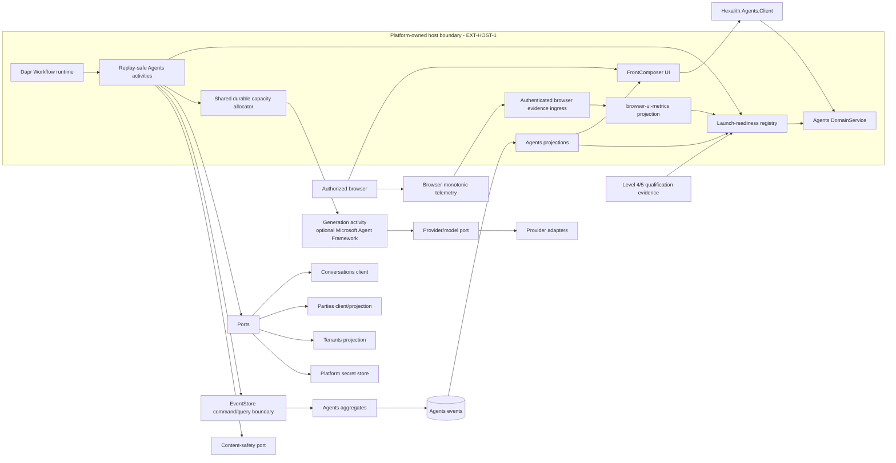
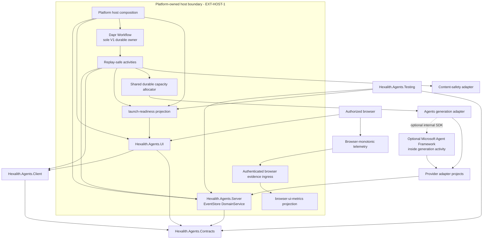

# Architecture Spine - Hexalith Agents

## Design Paradigm

Hexalith Agents is an event-sourced, Dapr-Workflow-orchestrated, hexagonal Hexalith domain module.

The domain core is EventStore-backed: aggregates decide from commands and current state, then emit domain or rejection events. The module ships domain contracts, aggregates, policies, query/projection handlers, a public client surface, domain-specific UI assets, and the shared EventStore DomainService SDK host. A platform-owned host supplies composition, Dapr, telemetry, health, and EventStore infrastructure. Dapr Workflow is the sole V1 durable execution owner. An Agents-owned readiness registry and capacity gate fail closed before unsafe execution; browser-monotonic telemetry supplies UI evidence without becoming business truth. Microsoft Agent Framework may run inside a generation activity for typed agent/session and Provider integration only after its SDK is selected, but it owns neither orchestration nor domain state. Python DurableAgent, MCP tools, A2A agents, and alternative workflow owners are out of V1.


```mermaid
flowchart LR
  Browser[Authorized browser] --> UI
  Browser --> BrowserTelemetry[Browser-monotonic telemetry]
  subgraph PlatformBoundary[Platform-owned host boundary - EXT-HOST-1]
    API[Agents DomainService]
    UI[FrontComposer UI]
    Workflow[Dapr Workflow runtime]
    App[Replay-safe Agents activities]
    CapacityGate[Shared durable capacity allocator]
    ReadinessRegistry[Launch-readiness registry]
    Proj[Agents projections]
    EvidenceIngress[Authenticated browser evidence ingress]
    BrowserMetrics[browser-ui-metrics projection]
  end
  UI --> Client[Hexalith.Agents.Client]
  Client --> API
  Workflow --> App
  App --> ReadinessRegistry
  App --> CapacityGate
  CapacityGate --> Generation[Generation activity<br/>optional Microsoft Agent Framework]
  App --> Ports[Ports]
  App --> ES[EventStore command/query boundary]
  ES --> Agg[Agents aggregates]
  Agg --> Events[(Agents events)]
  Ports --> Conversations[Conversations client]
  Ports --> Parties[Parties client/projection]
  Ports --> Tenants[Tenants projection]
  Generation --> ProviderPort[Provider/model port]
  ProviderPort --> Provider[Provider adapters]
  App --> Safety[Content-safety port]
  Ports --> Secrets[Platform secret store]
  Events --> Proj
  Proj --> UI
  Proj --> ReadinessRegistry
  BrowserTelemetry --> EvidenceIngress
  EvidenceIngress --> BrowserMetrics
  BrowserMetrics --> ReadinessRegistry
  Evidence[Level 4/5 qualification evidence] --> ReadinessRegistry
  ReadinessRegistry --> API
```

## Invariants & Rules

### AD-1 - Agents Is A Full EventStore Domain Module [ADOPTED]

- **Binds:** all V1 capabilities.
- **Prevents:** proposal, provider, and audit state being split between a transient orchestrator and unrelated modules.
- **Rule:** Hexalith Agents owns durable Agent configuration, provider governance, Agent interactions, generated/edited/regenerated proposal versions, approval decisions, posting outcomes, audit evidence, and operational status as EventStore-backed domain state.

### AD-2 - Aggregate Boundaries

- **Binds:** FR-1..FR-18, FR-24, FR-25.
- **Prevents:** one tenant-wide hot aggregate or split call/proposal records with incompatible audit history.
- **Rule:** Use separate aggregate boundaries: `Agent` owns identity link, lifecycle, instructions, provider/model selection, response policy, and approver policy; `ProviderCatalog` owns provider/model records, capability metadata, enablement, and secret references; `AgentInteraction` owns each call, generation attempt, proposal lifecycle when applicable, version history, approval/rejection/abandonment/expiry, automatic-post evidence, and posting outcome.

### AD-3 - Pure Aggregates, Side Effects Outside

- **Binds:** all write paths.
- **Prevents:** replay-unsafe provider calls, HTTP calls, timers, or dependency reads inside aggregate logic.
- **Rule:** Aggregate `Handle` methods emit events only. Provider calls, Conversations reads/posts, Parties validation/provisioning, Tenants projection reads, expiry timers, and notifications run in application orchestration/adapters and feed results back through commands.

### AD-4 - Interaction Snapshot

- **Binds:** FR-5, FR-6, FR-7, FR-13..FR-18, FR-24.
- **Prevents:** pending interactions changing model identity, instructions, response mode, or approval authority when administrators edit configuration later, without freezing stale provider safety constraints.
- **Rule:** `AgentInteraction` snapshots Agent configuration version, instructions version, response mode, approver policy version, `ProviderId`, `ModelId`, provider capability version, content-safety policy version, caller `PartyId`, source `ConversationId`, and context-build policy at request time. Later Agent configuration and provider/model selection changes affect future interactions only. Current provider readiness and safe capability limits are re-evaluated under AD-10 and may tighten or block an in-flight interaction, but they never retarget it.
- *Epic 2 reconciliation (2026-06-24): the shipped `AgentInteractionSnapshot` contract folds in `ContentSafetyPolicyVersion` (added to the list above) and carries the context-build policy as `ContextPolicyReference` (V1 default `full-conversation-v1`). Both were added additively during implementation, anticipating the Story 2.4 safety check and the Story 2.3 context policy, without a contract break.*

### AD-5 - Proposal Lifecycle

- **Binds:** FR-13..FR-18, FR-24.
- **Prevents:** drafts being mistaken for Conversation messages or edits overwriting generated versions.
- **Rule:** Proposal state is append-only: generated, edited, regenerated, approved, rejected, abandoned, expired, posting pending, posted, posting failed. Each generated/edited/regenerated content version is immutable. Approval selects exactly one version. Rejected, abandoned, and expired interactions preserve all versions and cannot later post.

### AD-6 - Conversations Boundary

- **Binds:** FR-2, FR-8..FR-12, FR-17.
- **Prevents:** Agents bypassing Conversations authorization, idempotency, governance, and typed error contracts.
- **Rule:** Agents reads context and posts final messages through supported `Hexalith.Conversations.Client`/API boundaries, especially `GetConversationAsync` and `AppendMessageAsync`. Agent membership is established only through the Conversations-owned contract committed as `EXT-CONV-AI-1`; an `Uncommitted`, unavailable, or incompatible record blocks consuming stories and runtime callability. Agents never writes Conversation streams/events directly, and a Proposed Agent Reply is never a Conversation Message.

### AD-7 - Agent Party Identity And Membership

- **Binds:** FR-2, FR-11, FR-17.
- **Prevents:** anonymous system authors, caller-authored AI messages, or duplicated Party PII.
- **Rule:** Agents stores stable `PartyId` references only. Agent creation/linking validates or provisions identity through Parties adapters. Before posting, Agents ensures the Agent `PartyId` is valid and present in the source Conversation as `ParticipantType.AiAgent` with `ParticipantRole.Member` through the `EXT-CONV-AI-1` Conversations-owned membership command. Posting fails closed if Party state, membership state, dependency commitment, or the Conversations seam is missing, disabled, ambiguous, unavailable, or incompatible.

### AD-8 - Approver Policy Resolution

- **Binds:** FR-7, FR-15..FR-18, FR-20.
- **Prevents:** each proposal workflow inventing a different meaning for owner, caller, role, or predefined approver.
- **Rule:** ApproverPolicy is Agents-owned configuration with V1 sources: caller `PartyId`, predefined `PartyId`s, tenant roles resolved from the local Tenants projection, and conversation authority resolved from Conversations detail. Current Conversations contracts expose `ParticipantRole.Facilitator` but no owner field; V1 treats product "conversation owner" authority as Conversation Facilitator unless Conversations adds an explicit owner resolver before implementation.

### AD-9 - Provider Adapter And Catalog Boundary

- **Binds:** FR-4, FR-5, FR-10, FR-24, FR-25.
- **Prevents:** provider SDK types, credentials, or provider-specific errors leaking into public contracts, UI, audit, or events.
- **Rule:** Provider integration is hidden behind Agents-owned generation adapters committed through `EXT-PROVIDER-1`; Provider and Agent Framework SDKs remain unselected until that record commits an immutable target and compatibility command. Secret resolution is supplied only through `EXT-SECRETS-1`. Public contracts and durable events expose only `ProviderId`, `ModelId`, safe capability/readiness metadata, versioned pricing metadata, usage/status, safe error classes, and secret reference/configured state.

### AD-10 - Provider Capability Floor

- **Binds:** FR-4, FR-5, FR-9, FR-10, FR-16, FR-21, FR-24, OQ-7.
- **Prevents:** incompatible provider metadata shapes, stale or disabled catalog state being trusted at runtime, snapshot/effective-version provenance being conflated, or retries reusing one attempt identity with changed provider inputs.
- **Rule:** `ProviderCatalog` V1 capability metadata includes `ProviderId`, `ModelId`, display label, enabled state, secret reference/configured state, text-generation capability, context-window token limit, max-output token limit, timeout policy, optional safe capability flags, input/output pricing units and currency with an effective version, and `CapabilityVersion`. `CapabilityVersion` is a non-reusable unsigned monotonic sequence scoped to the global catalog key (`ProviderId`, `ModelId`); any observed decrease is a blocker. Its public `ProviderReadinessResult` contains `OperationalState` (`Ready`, `Degraded`, or `Blocked`), `Callability` (`Callable` or `Blocked`), `ReasonCode`, `CapabilityVersion`, `ObservedAt`, and exclusive `ValidUntil`. `ProviderReadinessReasonCode` is a versioned additive enum with `Unknown = 0`, `None`, `NonBlockingOperationalWarning`, `DependencyUnavailable`, `EntryMissing`, `Stale`, `Disabled`, `Unconfigured`, `Unpriced`, `InvalidLimits`, `SecretUnavailable`, `CapabilityVersionRegressed`, `AdapterUnavailable`, `ProviderHealthFailed`, and `Indeterminate`; unknown codes fail closed. The only valid triples are (`Ready`, `Callable`, `None`), (`Degraded`, `Callable`, `NonBlockingOperationalWarning`), and (`Blocked`, `Blocked`, one defined blocker code). `Degraded` exists only when every hard gate passes: `EXT-PROVIDER-1` is `Available` and verified, the live entry is fresh at `ObservedAt <= now < ValidUntil`, enabled, configured, text-generation capable, currently priced, secret-resolvable, Provider-health-valid, and has valid positive limits required by the step. Missing, stale, unconfigured, unpriced, invalid-limit, failed, disabled, regressed-version, unknown, or indeterminate state is `Blocked`, never `Degraded`; UI or host policy cannot override `Callability`. The interaction's durable capability high-water mark starts at the snapshot `ProviderCapabilityVersion` and advances to every identified live version observed by context, generation, or regeneration, including a version whose entry later fails readiness or limit validation. Every provider-dependent step requires a trust-bearing fresh live entry for the snapshotted `ProviderId`/`ModelId` with `CapabilityVersion >=` that mark; it then advances the mark and re-evaluates every hard gate. Enable/disable does not bump `CapabilityVersion`, so version comparison never substitutes for readiness. Context build reports `ModelBudgetUnavailable` on failure; otherwise it uses current safe limits. The snapshot version remains request provenance; `EffectiveProviderCapabilityVersion` is the accepted live version consumed by a runtime step and is carried consistently through its internal request, provider request, outcome, and success/failure evidence. Exact equality is not required.
- *Implementation gaps (2026-08-01): current context, generation, and regeneration paths do not maintain a durable capability high-water mark or a distinct effective-version contract. Context build neither compares the live version with the snapshot nor independently rejects disabled/unconfigured entries. Generation and regeneration consume current catalog limits while carrying the snapshot version as provider/evidence provenance. These paths are non-conformant until the runtime reconciliation follow-up implements fresh lower/equal/higher reads, current readiness, high-water/effective-version evidence, pre-invocation revalidation, and retry binding.*

### AD-11 - Conversation Context Bounds

- **Binds:** FR-9, FR-10, OQ-10.
- **Prevents:** silent truncation, summary substitution, or provider calls on stale/partial context.
- **Rule:** V1 context is built only from authorized Conversations detail and visible timeline content. Exact measurement uses the Provider/model-specific tokenizer committed through `EXT-TOKEN-1`; an uncommitted, missing, unsupported, stale, or incompatible tokenizer blocks before Provider invocation. If full source context cannot be loaded fresh enough or cannot fit the selected model context budget after reserving configured output tokens, record context-blocked failure and create no provider call, proposal, or Conversation Message. `ContextReady` authorizes progression but does not freeze a later provider input: immediately before generation or regeneration prepares a provider attempt, it repeats the authorized fresh content read, exact token measurement, AD-10 capability high-water/readiness check, and full budget calculation. The prepared input proceeds only if this revalidation passes; otherwise the step fails closed with no provider side effect.

### AD-12 - Authorization And Dependency Uncertainty

- **Binds:** FR-19..FR-21.
- **Prevents:** JWT-only authorization, UI-only authorization, or side effects on stale projections.
- **Rule:** Authorization gates run before every side effect and fail closed on missing, stale, ambiguous, disabled, or unavailable dependency state. Tenant access comes from Agents' local Tenants projection; conversation access/context from Conversations authorized queries; Party state from Parties adapters/projections; provider/model readiness from ProviderCatalog projections; approver rights from the AgentInteraction policy snapshot plus current dependency availability. A UI/BFF user session permits at most one pending high-risk command for the same resource and operation family. Normative families are `ProposalResolution`, `PolicyPublication`, `TenantBudgetUpdate`, `LegalHold`, `ExportRequest`, and `DeletionRequest`; unrelated resources or families may proceed concurrently. The advisory lock begins on submission and clears only when authoritative status reports rejection before acceptance or a terminal result; an accepted-pending acknowledgement keeps the lock held. A client timeout forces refresh and never implies success.

### AD-13 - Idempotent External Effects

- **Binds:** FR-10..FR-18, FR-24.
- **Prevents:** duplicate provider attempts, duplicate messages, or duplicate proposal versions during retry/replay.
- **Rule:** External side effects are causally tied to deterministic Agents ids. The EventStore `AgentInteraction` aggregate is the sole owner of the prepared-attempt lifecycle and business facts; the budget ledger owns reservation balance and reconciliation; the shared capacity allocator owns only admission leases and queue order; Dapr Workflow owns execution only. The ordered state machine is: (1) append one prepared descriptor binding deterministic `AttemptId` to Provider/model, `EffectiveProviderCapabilityVersion`, validated limits/timeout, and canonical request fingerprint; (2) atomically reserve maximum cost under deterministic `ReservationId` and append the reference; (3) acquire or queue deterministic `AdmissionId` plus monotonic `AdmissionFence`; (4) after admission, append `ProviderInvocationAuthorized` at the expected EventStore revision, binding the descriptor, reservation, admission fence, and evaluated readiness/matrix versions; (5) call the allocator's linearizable `BeginInvocation` with that fence, which must prove the lease is current/unexpired and transition it from `Admitted` to `InvocationActive`; (6) invoke the Provider only after steps 4 and 5 succeed; (7) append the outcome, reconcile/release the reservation, and release admission. Reclamation, cancellation, or expiry increments/invalidates the fence, so stale authorization can never invoke. A crash before step 4 permits no Provider call. If admission exists without the authorization fact, recovery queries by `AttemptId` and appends the same fact idempotently; if authorization exists without `InvocationActive`, recovery must re-run `BeginInvocation` and block on a stale fence. `EXT-PROVIDER-1` must provide deterministic idempotent invocation and outcome lookup so a crash after step 6 cannot duplicate a request. Only transient transport/timeout failures may retry before a terminal domain outcome; every retry rechecks current readiness and reuses the exact descriptor, reservation, admission/fence, and Provider idempotency key. Any capability version, readiness, capacity identity/fence, reservation, or request-fingerprint change fails closed under that attempt id; the same interaction or regeneration action never substitutes a replacement attempt. Conversation posting uses deterministic `MessageId` and idempotency key derived from `AgentInteractionId` plus approved/generated `VersionId`. UI/BFF locking under AD-12 is advisory only: EventStore optimistic concurrency, deterministic command/effect identity, and idempotency are authoritative across sessions, tabs, retries, replay, and process restarts.

### AD-14 - Sensitive Content And Secret Safety

- **Binds:** FR-4, FR-22, FR-24, data governance NFRs.
- **Prevents:** generated content, prompts, provider credentials, or provider payloads leaking through logs, telemetry, status, UI, or audit summaries.
- **Rule:** Generated, edited, prompt-derived, and context-derived content is sensitive conversation-derived content. Content-bearing Agents events/projections must use EventStore payload-protection/redaction conventions before production use; if protection is unavailable, content-bearing workflows stay disabled. Logs, telemetry, browser measurements, status, and audit summaries never include raw content, raw provider payloads, stack traces, Party PII, or secrets. Provider credentials live only behind secret references resolved through the committed `EXT-SECRETS-1` platform contract; unavailable or incompatible secret resolution blocks use.

### AD-15 - Public Surface And UI Parity

- **Binds:** FR-22, FR-23, UX spine.
- **Prevents:** UI-only workflows or client integrations that need EventStore/provider internals.
- **Rule:** Admin UI and API/client surfaces share the same public Agents contracts and authorization outcomes. FrontComposer UI registers an Agents domain/nav like Tenants, uses policy-gated entries, and calls Agents API/BFF/client boundaries rather than EventStore streams, provider SDKs, or aggregate internals.

### AD-16 - Platform-Owned Operational Topology [CORRECTED 2026-08-01]

- **Binds:** deployment and environments.
- **Prevents:** domain modules duplicating or contradicting platform hosting, Dapr, telemetry, health, identity, or EventStore plumbing.
- **Rule:** Hexalith Agents does not ship module-owned AppHost, Aspire, or ServiceDefaults projects. It continues to expose the reusable Agents domain service through the shared EventStore DomainService SDK host and owns domain-specific UI assets. The platform-owned host committed as `EXT-HOST-1` composes that service and UI with EventStore, Conversations, Parties, Tenants, Provider adapters, the Content Safety adapter, the readiness registry, capacity admission, browser evidence ingestion, and Dapr Workflow for local, test, and deployed environments. Platform composition owns Dapr sidecars, telemetry, health, secrets through `EXT-SECRETS-1`, identity, and EventStore security wiring.
- *Implementation gap (2026-08-02): the current solution still contains `Hexalith.Agents.AppHost`, `Hexalith.Agents.Aspire`, and `Hexalith.Agents.ServiceDefaults`. Their presence is non-conformant and is not evidence of `EXT-HOST-1`; replacement Story 5.1 owns removal/boundary correction, and replacement Story 5.6 owns consumption and proof of the platform-hosted composition.*

### AD-17 - Readiness Registry, Projection Inventory, And Test Gates [AMENDED 2026-08-02]

- **Binds:** FR-23, FR-25, FR-28, NFR-11..NFR-14, implementation readiness, and `RQ-1`.
- **Prevents:** launch-critical invariants relying on manual QA, host-only configuration, implicit freshness, unnamed projections, or undocumented client behavior.
- **Rule:** `launch-readiness-register.md` is the normative readiness authority and `EXT-TOPOLOGY-1` supplies its production-like fixture. Each record contains `GateId`, `TenantScope`, `EnvironmentProfile`, `State`, `Owner`, `SourceVersion`, `ObservedAt`, `ValidUntil`, `RequiredEvidenceLevel`, `EvidenceReference`, `ConfigurationOrMeasurementContract`, and safe `BlockerCode`; states are `Pass`, `Block`, `InsufficientEvidence`, and `Stale`. The EventStore `LaunchReadinessGate` aggregate is the only record writer for each logical key (`GateId`, `TenantScope`, `EnvironmentProfile`). Immutable observations carry deterministic `ObservationId`; EventStore stream revision supplies serialization and `RegistryRevision`. The `launch-readiness` projection selects the greatest committed revision, never greatest `ObservedAt`; an invalid, incomplete, or stale newest observation blocks without falling back to an older `Pass`. Producers, UI, and host configuration submit evidence commands but cannot write readiness state. `RQ-1` evaluates one consistent projection checkpoint across all logical keys and retries or fails closed if the checkpoint changes during evaluation. At evaluation time `T`, only a complete current-source record with `State == Pass`, qualifying evidence, and `ObservedAt <= T < ValidUntil` passes. Missing records block; expired or superseded source/configuration/measurement contracts are stale; each gate declares its own validity and no global implicit freshness applies. Minimum GateIds are `LR-TOPOLOGY`, `LR-EVENTSTORE`, `LR-TENANT-ACCESS`, `LR-PARTY-IDENTITY`, `LR-CONVERSATION-CONTEXT`, `LR-CONVERSATIONS-MEMBERSHIP-POSTING`, `LR-PROVIDER`, `LR-TOKENIZER`, `LR-SAFETY`, `LR-SECRETS`, `LR-COST`, `LR-AUDIT-PROTECTION-DELETION`, `LR-RECOVERY`, `LR-CAPACITY-FAIRNESS`, `LR-UI-CONFORMANCE`, `LR-RUNTIME-PERFORMANCE`, `LR-UI-PERFORMANCE`, and `LR-PRODUCT-METRICS`. The versioned `OperationGateMatrix` in the register is the single mapping consumed by API, BFF, UI, workflow, and readiness projection; a missing operation family, unknown matrix version, or gate outside the minimum inventory blocks. The `QualificationExecutionGateSet` permits explicitly authorized controlled evidence collection only when every external seam executed is `Available` and its command passes against the deployed target; `Committed` permits development/contract work only. The `ReleaseQualificationGateSet` is all 18 minimum GateIds; only all-current `Pass` results plus `Available` consumed external dependencies allow `RQ-1` READY and production enablement. Authoritative projection IDs are `agent-setup-readiness`, `provider-capability-pricing`, `agent-interaction-status`, `proposal-detail`, `proposal-version-history`, `pending-proposal-queue`, `pending-proposal-count`, `audit-evidence`, `budget-reservation-usage`, `retention`, `legal-hold`, `export`, `deletion`, `launch-readiness`, `runtime-metrics`, `browser-ui-metrics`, and `product-metrics`; readiness, purge, and evidence criteria name IDs rather than saying all affected projections. Public contracts are versioned and additive-first. Tests cover aggregate purity, authorization fail-closed paths, immutable proposal versions, Dapr Workflow replay/restart/idempotency, generation/posting retry identity, tenant isolation, complete-context blocking, Provider/tokenizer/safety/secrets/cost/capacity gates, FrontComposer UI conformance and browser timing, retention/export/deletion, recovery, and audit completeness. Evidence Levels 1-5 retain their PRD meanings; production-like readiness requires qualifying Levels 4 and 5, and skips, placeholders, lower levels, or conditional results remain visible blockers.

### AD-18 - Dapr Workflow Owns V1 Execution [CORRECTED 2026-08-01]

- **Binds:** FR-9..FR-18, FR-24, runtime orchestration, deployment and environments.
- **Prevents:** double orchestration, in-memory background workers, alternate workflow ownership, direct provider SDK loops, or framework-specific runtime types leaking into public contracts or aggregates.
- **Rule:** Dapr Workflow is the single durable owner for every V1 `AgentInteraction` lifecycle, including context preparation, generation, confirmation waits, proposal expiry, posting, retries, and restart recovery. Each replay-safe activity re-evaluates the applicable authorization/policy gates and dispatches at most one deterministic trusted command using the implementation convention. EventStore remains business truth; workflow history is execution state only. Microsoft Agent Framework may be used inside a generation activity for typed agent/session and Provider integration, but it owns neither orchestration nor domain state. Python Dapr Agents `DurableAgent`, MCP tools, A2A agents, and alternative workflow owners are unbound and out of V1. Public contracts and EventStore aggregates do not depend on Microsoft Agent Framework, provider SDK, or workflow SDK types.

### AD-19 - Future Tool And Remote-Agent Protocol Boundaries [DEFERRED OUT OF V1]

- **Binds:** post-V1 tool integration, remote-agent integration, and governance only.
- **Prevents:** each agent, tool host, or adapter choosing incompatible protocols, using workflow-backed MCP for trivial calls, or bypassing domain commands for business mutations.
- **Rule:** V1 exposes no tools, MCP servers/clients, A2A agents, Python agent workers, or remote-agent protocol surface. A future approved scope must select protocol ownership and threat controls before enabling any of them. Domain mutations remain domain commands, and any future tool contract must carry tenant context, idempotency, correlation, authorization, and audit metadata.

### AD-20 - Two-Stage Content Safety

- **Binds:** FR-10, FR-26, FR-27, FR-28.
- **Prevents:** unsafe or unauthorized content reaching a Provider, proposal, Conversation side effect, or weaker retry path.
- **Rule:** Prompt plus complete authorized Conversation Context pass a fresh versioned decision through the safety adapter committed as `EXT-SAFETY-1` before Provider invocation, and generated output passes a fresh versioned decision before proposal creation or Conversation posting. An uncommitted/incompatible adapter or missing, stale, unversioned, or indeterminate safety state fails closed. Always-blocked classes are child sexual abuse/exploitation, credible imminent serious-harm threats or instructions, encouragement/instruction for suicide or self-harm, credential theft/malware/unauthorized compromise, secrets or private credentials, cross-tenant or unauthorized personal/conversation data, and control-bypass attempts. Restricted hate, harassment, sexual, violent, illegal-activity, or sensitive-personal content requires an explicitly permitted tenant use case and Confirmation Response Mode. Approvers cannot override a failure. A retry uses policy at least as restrictive as its first attempt; policy updates affect future attempts and never resurrect a failed attempt.

### AD-21 - Cost Reservation And Reconciliation

- **Binds:** FR-4, FR-10, FR-25, FR-28.
- **Prevents:** unpriced calls, concurrent overspend, retry double charging, or reporting-only launch controls.
- **Rule:** Production-like enablement requires the `EXT-PROVIDER-1` Provider contract and `EXT-SECRETS-1` resolution contract, valid Provider/model input/output/timeout limits, current versioned pricing, a numeric monthly tenant budget, and numeric per-call caps. The EventStore budget-ledger aggregate is the single authority for balances and deterministic `ReservationId`; budget status warns at 80% and fails closed at 100%. Before capacity admission and Provider authorization, one atomic ledger command reserves the maximum estimated attempt cost against both caps and the `AgentInteraction` records the reservation reference; retries query and reuse it. Actual usage is reconciled, unused reservation is released only after an authoritative no-usage result, and every adjustment is auditable. Missing, stale, uncommitted, incompatible, indeterminate, or exhausted pricing/budget/dependency state blocks Provider invocation. Reporting-only monitoring cannot satisfy launch readiness.

### AD-22 - Sensitive Audit Governance

- **Binds:** FR-24, FR-25, FR-28 and data-governance NFRs.
- **Prevents:** indefinite sensitive-content retention, unaudited exports, apparent deletion that leaves readable projections, or rewriting immutable EventStore history.
- **Rule:** Sensitive Agent content is retained for 365 days after terminal interaction unless legal hold suspends expiry. Authorized export is tenant-scoped, encrypted, time-limited, manifested, and audited. EventStore history is never rewritten. Retention expiry or approved deletion cryptographically erases or redacts protected sensitive payloads and records restrictive completion for each content-bearing projection ID named by AD-17 and the launch-readiness register while retaining only a support-safe non-content tombstone. Deletion is not complete until payload protection and every named purge outcome confirm restrictive state. Posted Conversation Messages remain governed by Conversations retention.

### AD-23 - NFR-11 Recovery Qualification

- **Binds:** NFR-11, FR-24, FR-28, `LR-RECOVERY`.
- **Prevents:** recovery claims that lose accepted business state, duplicate external effects, change terminal decisions, or measure only process restart.
- **Rule:** Using the `EXT-TOPOLOGY-1` production-like failure-injection fixture, `RecoveryExerciseId` identifies one frozen cohort: every durable nonterminal interaction eligible immediately before fault injection. One injected monotonic clock with `RecoveryClockOriginId` captures `RecoveryStartedTick` when the fault makes processing unavailable and `RecoveryVerifiedTick` when every cohort member is accounted for, EventStore state and required projections are current, and terminal outcomes are observable; the difference must be at most 15 minutes. UTC `ObservedAt`/`ValidUntil` govern record freshness only and are never used for the duration. After restart, current safety, authorization, cost, and capacity gates are re-evaluated; each cohort member must resume or reach a safe durable blocked/terminal state carrying the recorded gate change. Pre-fault terminal decisions are immutable, and interactions created after injection or ineligible at the freeze instant are excluded. Pre/post evidence proves EventStore RPO 0 and inventories deterministic Provider attempt IDs, proposal version IDs, timer/expiry decisions, budget reservations/ledger totals, Conversation `MessageId`/idempotency keys, and terminal decisions. Any unaccounted cohort member, lost accepted event, duplicate effect/version, changed terminal decision, mixed clock origin, or absent Levels 4/5 evidence blocks `LR-RECOVERY`.

### AD-24 - NFR-12 Capacity Admission And Fairness

- **Binds:** NFR-12, FR-10, FR-25, FR-28, `LR-CAPACITY-FAIRNESS`.
- **Prevents:** hidden or unlimited concurrency, unbounded queues, tenant starvation, retry double-admission, or rejection after Provider cost is incurred.
- **Rule:** Each environment profile version defines positive `PerTenantConcurrencyLimit`, `SystemConcurrencyLimit`, `PerTenantQueueDepthLimit`, `SystemQueueDepthLimit`, `OverflowBehavior` (`Queue` or `Reject`), `FairnessPolicyKind = WeightedRoundRobinV1`, and a positive integer `TenantWeight` from 1 through 100 for every admitted tenant scope. One platform-composed capacity-admission component is the sole owner of shared tenant/system leases and queue order across replicas; process-local counters or queues are forbidden. Its linearizable acquire returns admitted with `AdmissionId` plus monotonically increasing `AdmissionFence`, queued with durable `QueueId`, or rejected. `ProviderInvocationAuthorized` binds the fence; immediately before transport, linearizable `BeginInvocation(AttemptId, AdmissionId, AdmissionFence)` must validate the current unexpired lease and transition `Admitted` to `InvocationActive`. Reclamation or terminalization invalidates/increments the fence. Within a tenant, order is allocator sequence then `AttemptId`; across eligible nonempty tenants, a persisted rotating cursor grants exactly `TenantWeight` slots per complete cycle of `sum(active TenantWeight)`, so complete-cycle share is `TenantWeight / sum(active TenantWeight)`. Retries reuse the same `QueueId`/position and never earn weight again. Cancellation or queue expiry is a durable terminal admission result and permits no Provider call. Dapr Workflow checkpoints and queries the identity. An `InvocationActive` lease is reclaimed only after a recorded terminal attempt or after expiry beyond Provider timeout and Provider outcome lookup confirms no active invocation. Production-like evidence through `EXT-TOPOLOGY-1` saturates at least two tenants for complete cycles and proves exact shares, fencing, no starvation, replica/crash/cancel/expiry recovery, and no duplicate admission while concurrency, queue, and AD-21 cost caps remain unbreached. Missing/host-only values, process-local state, unbounded queues, or insufficient evidence block callability and `LR-CAPACITY-FAIRNESS`.

### AD-25 - NFR-13 UI Conformance

- **Binds:** FR-22, FR-23, NFR-13, `LR-UI-CONFORMANCE`.
- **Prevents:** API/UI authorization drift, inaccessible or partially localized controls, or high-impact actions proceeding when required context is not visible.
- **Rule:** The versioned browser/component conformance suite executed through `EXT-TOPOLOGY-1` covers every interactive V1 route and high-impact state through the same public contracts as API clients and proves WCAG 2.2 AA behavior, keyboard/focus order, semantic labels/live regions, whole-string localization, English/French key parity, and FrontComposer plus Fluent UI Blazor V5 inheritance. At the most restrictive supported viewport, `ProposalResolution`, `PolicyPublication`, `TenantBudgetUpdate`, `LegalHold`, `ExportRequest`, and `DeletionRequest` remain blocked whenever required decision context cannot be presented safely. Missing routes, locale keys, viewport evidence, or conditional skips produce `InsufficientEvidence`.

### AD-26 - NFR-14 Browser Monotonic Timing Evidence

- **Binds:** FR-22, FR-25, FR-28, NFR-14, `LR-UI-PERFORMANCE`.
- **Prevents:** mixed browser/server clocks, optimistic client state, missing accessibility announcement timing, or incomplete samples producing a false UI-performance pass.
- **Rule:** One injected browser-monotonic clock and `ClockOriginId` measures each page lifecycle in the `EXT-TOPOLOGY-1` browser profile; browser ticks are never subtracted from server/projection wall-clock timestamps. A versioned discriminated `BrowserTimingSample` has deterministic `SampleId = (QualificationSessionId, ExecutionId, SampleKind)` and one `SampleKind`: `PageUsability` requires only `NavigationStartedTick` and `PageUsableTick` after authorized non-loading operable render (p95 <= 2.5 s); `AuthoritativePending` requires only `CommandSubmittedTick` immediately before dispatch and `AuthoritativePendingRenderedTick` after receipt/render of a server/EventStore-accepted pending identity plus projection/version (p95 <= 500 ms); `TerminalRenderAnnouncement` requires only `AuthoritativeTerminalReceivedTick`, `TerminalRenderedTick`, and `LiveRegionAnnouncedTick`, using the later end tick (p95 <= 2 s). The live-region tick is captured after render commit when the localized terminal-text mutation is observable in its `aria-live` or `role=status` node; it asserts announcement-ready DOM state, not speech completion. Variant-forbidden ticks, mixed origins, or invalid ordering reject the sample. Only samples from an authenticated versioned qualification session enter `browser-ui-metrics`; platform ingress verifies the safe trace/projection against server evidence, treats an exact duplicate `SampleId` as an idempotent no-op, and rejects a conflicting duplicate. Unattested telemetry cannot qualify. Each kind needs at least 30 qualifying production-like samples. Missing required ticks, non-authoritative state, absent live-region mutation, failed attestation/correlation, conflicting duplicate, or insufficient samples yields `InsufficientEvidence`.


```mermaid
flowchart TB
  Browser[Authorized browser]
  BrowserTelemetry[Browser-monotonic telemetry]
  Contracts[Hexalith.Agents.Contracts]
  Client[Hexalith.Agents.Client]
  subgraph PlatformBoundary[Platform-owned host boundary - EXT-HOST-1]
    PlatformHost[Platform host composition]
    Server[Hexalith.Agents.Server<br/>EventStore DomainService]
    UI[Hexalith.Agents.UI]
    DaprWorkflow[Dapr Workflow<br/>sole V1 durable owner]
    Activities[Replay-safe activities]
    CapacityGate[Shared durable capacity allocator]
    ReadinessRegistry[launch-readiness projection]
    EvidenceIngress[Authenticated browser evidence ingress]
    BrowserMetrics[browser-ui-metrics projection]
  end
  GenerationAdapter[Agents generation adapter]
  AgentFramework[Optional Microsoft Agent Framework<br/>inside generation activity]
  SafetyAdapter[Content-safety adapter]
  ProviderAdapters[Provider adapter projects]
  Testing[Hexalith.Agents.Testing]

  Browser --> UI
  Browser --> BrowserTelemetry
  BrowserTelemetry --> EvidenceIngress
  EvidenceIngress --> BrowserMetrics
  PlatformHost --> Server
  PlatformHost --> UI
  PlatformHost --> DaprWorkflow
  PlatformHost --> ReadinessRegistry
  Client --> Contracts
  Server --> Contracts
  DaprWorkflow --> Activities
  Activities --> Server
  Activities --> Client
  Activities --> ReadinessRegistry
  Activities --> CapacityGate
  CapacityGate --> GenerationAdapter
  GenerationAdapter -. optional internal SDK .-> AgentFramework
  GenerationAdapter --> ProviderAdapters
  Activities --> SafetyAdapter
  AgentFramework --> ProviderAdapters
  UI --> Client
  UI --> Contracts
  ReadinessRegistry --> UI
  ProviderAdapters --> Server
  Testing --> Contracts
  Testing --> Server
  Testing --> ReadinessRegistry
```

```mermaid
sequenceDiagram
  participant Caller as Authorized browser
  participant BrowserTelemetry
  participant AgentsAPI
  participant Readiness as Readiness registry
  participant Interaction as AgentInteraction
  participant Workflow as Dapr Workflow
  participant Capacity as Capacity gate
  participant Safety
  participant Conv as Conversations
  participant Provider

  Caller->>AgentsAPI: request hexa(SourceConversationId, prompt)
  AgentsAPI->>Readiness: evaluate matrix v1 at one registry revision
  Readiness-->>AgentsAPI: callable or safe blockers + revisions
  alt missing, stale, insufficient, or blocked gate
    AgentsAPI-->>Caller: safe blocked response; no interaction or Provider call
  else applicable gates pass
    AgentsAPI->>Interaction: RequestInteraction at expected revision
    Interaction-->>AgentsAPI: InteractionRequested snapshot
    AgentsAPI-->>Caller: authoritative pending id + projection version
    Caller->>BrowserTelemetry: AuthoritativePending sample
    AgentsAPI->>Workflow: start deterministic interaction workflow
    Workflow->>Conv: authorized complete Conversation read
    Conv-->>Workflow: details/timeline/freshness
    Workflow->>Safety: validate prompt + complete context
    Safety-->>Workflow: versioned allow/block
    alt context or prompt blocked
      Workflow->>Interaction: RecordContextOrSafetyBlocked
    else context and prompt pass
      Workflow->>Interaction: PrepareAttempt descriptor
      Workflow->>Interaction: reserve cost and record ReservationId
      Workflow->>Capacity: acquire by AttemptId
      Capacity-->>Workflow: admitted, queued, or rejected
      alt rejected, cancelled, or expired
        Workflow->>Interaction: RecordCapacityBlocked; no Provider call
      else admitted now or after durable queue
        opt queued
          Workflow->>Interaction: RecordCapacityPending with QueueId
          Capacity-->>Workflow: later admission with same QueueId
        end
        Workflow->>Interaction: append ProviderInvocationAuthorized
        Workflow->>Capacity: BeginInvocation with AdmissionFence
        Capacity-->>Workflow: InvocationActive or stale fence
        alt stale or reclaimed fence
          Workflow->>Interaction: RecordCapacityBlocked; no Provider call
        else InvocationActive
          Workflow->>Provider: idempotent exact prepared request
          Provider-->>Workflow: generated content or safe failure
          Workflow->>Capacity: release AttemptId lease
          Workflow->>Safety: validate generated output
          Safety-->>Workflow: versioned allow/block
          Workflow->>Interaction: RecordGeneratedVersion or GenerationFailed
          alt automatic and output allowed
            Workflow->>Conv: ensure AIAgent member + AppendMessage
            Conv-->>Workflow: accepted or typed error
            Workflow->>Interaction: RecordPostingSucceeded/Failed
          else confirmation and output allowed
            Caller->>AgentsAPI: edit/regenerate/approve/reject/abandon
            AgentsAPI->>Interaction: proposal command at expected revision
            Interaction-->>AgentsAPI: version or terminal event
            Workflow->>Workflow: durable wait or expiry timer
            Workflow->>Conv: Append approved version
            Conv-->>Workflow: accepted or typed error
            Workflow->>Interaction: RecordPostingSucceeded/Failed
          end
        end
      end
    end
    AgentsAPI-->>Caller: authoritative terminal projection/version
    Caller->>BrowserTelemetry: TerminalRenderAnnouncement sample
  end
```

## Consistency Conventions

| Concern | Convention |
| --- | --- |
| Command steps | A durable step decision dispatches at most one server-trusted command. Follow the [orchestrator to single-command to twin-policy convention](IMPLEMENTATION-CONVENTIONS.md) for permitted zero-dispatch exits, ordered multi-event results, visibility, and test obligations. |
| Naming | Domain terms are `Agent`, `ProviderCatalog`, `AgentInteraction`, `ProposedAgentReply`, `VersionedProposalContent`, `ApproverPolicy`, `AgentCall`, `AgentResponse`, `AuditEvidence`. Use `hexa` only as the first configured Agent, not as a type name. |
| Identity | Agents owns `AgentId`, `AgentInteractionId`, `ProposalVersionId`, `ProviderId`, `ModelId`. Parties owns `PartyId`; Conversations owns `ConversationId` and `MessageId`; Tenants owns tenant membership/roles. |
| Mutation | Only EventStore commands mutate Agents state. External effects return through follow-up commands/events. |
| Runtime orchestration | Dapr Workflow is the sole V1 durable owner. Activities are replay-safe and idempotent; Microsoft Agent Framework may be an internal generation-activity implementation detail only after its SDK is committed through `EXT-PROVIDER-1`. |
| Tool and protocol boundary | Tools, MCP, A2A, Python agent workers, and alternate workflow owners are out of V1. |
| Data planes | EventStore events/projections are domain truth. Dapr Workflow history and optional Agent Framework session/checkpoint state are execution/supporting state only. |
| Time | Expiry and time-based decisions use injected time and stored policy. The default proposal lifetime is 24 hours, configurable from 1 hour through 30 days for future proposals; no aggregate wall-clock reads. |
| Idempotency | API commands accept idempotency metadata. Provider attempts, version ids, and Conversation posts derive deterministic ids from interaction/version context. |
| High-risk command concurrency | A user session permits one pending command per resource and operation family; UI/BFF locking is advisory, while EventStore concurrency, deterministic identity, and idempotency remain authoritative. |
| Provider attempt fingerprint | One shared canonicalizer hashes the length-prefixed, stable-order prepared provider request with SHA-256. The descriptor stores the digest and safe scalar inputs, never raw context; all retry paths compare through that canonicalizer. |
| Provider readiness | Public readiness exposes `OperationalState`, `Callability`, versioned safe `ReasonCode`, globally key-scoped monotonic `CapabilityVersion`, `ObservedAt`, and `ValidUntil`; only the defined non-blocking warning permits callable `Degraded`. |
| Errors | Business failures are typed rejection/status events or structured public errors. Provider errors are mapped to safe classes. |
| Content | Prompt/generated/edited/context content is sensitive. No raw content in logs, telemetry dimensions, status badges, queue summaries, or provider errors. |
| Authorization | Every API/UI/provider/post/proposal/audit path evaluates tenant, Party, Conversation, Agent, Provider, and ApproverPolicy gates before side effects. |
| Safety | Prompt/context is gated before Provider invocation and output before proposal/posting; missing or indeterminate state fails closed, no Approver override exists, and retries cannot weaken policy. |
| Cost | Atomic maximum-cost reservation precedes Provider invocation; actual usage is reconciled and eligible retries reuse the same reservation. |
| Capacity | One shared allocator enforces numeric tenant/system limits and `WeightedRoundRobinV1` before durable Provider authorization; retries reuse durable admission/queue identity. |
| Evidence | EventStore-serialized readiness observations own freshness, supersession, evidence level, safe blockers, NFR-11–14 qualification, and `RQ-1`; one matrix version and registry checkpoint govern each decision. |
| Projections | Readiness, evidence, and deletion use the explicit logical projection IDs in AD-17; stale state must not be rendered or treated as fresh. |
| Browser timing | One injected browser-monotonic clock and discriminated sample kind measure navigation-to-usable, submit-to-authoritative-pending-render, and terminal-receipt-to-render/live-region announcement; wall clocks are never mixed into durations. |
| UI | Agents UI inherits FrontComposer and Fluent UI V5 semantics; proposed replies are distinct from Conversation Messages, and high-impact actions fail closed when the viewport cannot present required context. |

## Stack

| Name | Version |
| --- | --- |
| .NET SDK | `10.0.301` with `rollForward: latestPatch` from root `global.json` |
| Target framework | `net10.0` |
| C# language | `14` from root `Directory.Build.props` |
| Solution format | `.slnx` |
| Package management | Central Package Management via `Directory.Packages.props` |
| Hexalith.EventStore | local sibling source commit `30810727` |
| Hexalith.Conversations | local sibling source commit `331ec28e` |
| Hexalith.Parties | local sibling source commit `3295560a` |
| Hexalith.Tenants | local sibling source commit `085e5021` |
| Hexalith.FrontComposer | local sibling source commit `62841406` |
| .NET Aspire Hosting / AppHost SDK | `13.4.6` from imported workspace catalog and local AppHost SDK declarations |
| Dapr .NET packages | `1.18.5` from imported workspace catalog |
| Dapr Workflow | `1.18.5` from imported workspace catalog |
| CommunityToolkit Aspire Hosting Dapr | `13.4.1-beta.687` from imported workspace catalog |
| MediatR | `14.2.0` from imported workspace catalog |
| FluentValidation | `12.1.1` from imported workspace catalog |
| OpenTelemetry | `1.17.0` from imported workspace catalog |
| Fluent UI Blazor | `5.0.0-rc.4-26180.1` from root-selected catalog |
| xUnit v3 | `3.2.2` from root-selected catalog |
| Shouldly | `4.3.0` from root-selected catalog |
| NSubstitute | `5.3.0` root-selected override |
| Provider SDK | `Unselected` until `EXT-PROVIDER-1` is committed |
| Agent Framework SDK | `Unselected` until `EXT-PROVIDER-1` is committed |

## Structural Seed

```text
agents/
  global.json
  Directory.Build.props
  Directory.Packages.props
  NuGet.config
  Hexalith.Agents.slnx
  src/
    Hexalith.Agents.Contracts/
    Hexalith.Agents.Client/
    Hexalith.Agents.Server/
      Aggregates/
      Application/
        Agents/
        Workflows/
        Activities/
      Ports/
      Projections/
    Hexalith.Agents/
    Hexalith.Agents.UI/
    Hexalith.Agents.Testing/
  test/
    Hexalith.Agents.Contracts.Tests/
    Hexalith.Agents.Server.Tests/
    Hexalith.Agents.Client.Tests/
    Hexalith.Agents.UI.Tests/
    Hexalith.Agents.IntegrationTests/
```

*Implementation gap:* the checked-in solution still includes module-owned `Hexalith.Agents.AppHost`, `Hexalith.Agents.Aspire`, and `Hexalith.Agents.ServiceDefaults` projects. They are excluded from the conformant seed above. Replacement Story 5.1 owns their removal and package/boundary correction; Story 5.6 consumes `EXT-HOST-1` and proves the platform-owned host boundary.


```mermaid
classDiagram
  class Agent {
    AgentId
    PartyId
    Lifecycle
    InstructionsVersion
    ProviderSelection
    ResponsePolicy
    ApproverPolicy
  }
  class ProviderCatalog {
    ProviderId
    ModelId
    Enabled
    SecretReference
    Capabilities
  }
  class ProviderReadinessResult {
    OperationalState
    Callability
    ReasonCode
    CapabilityVersion
    ObservedAt
    ValidUntil
  }
  class AgentInteraction {
    AgentInteractionId
    SourceConversationId
    CallerPartyId
    Snapshot
    State
    Versions
    PostingOutcome
  }
  class ProposedAgentReply {
    CurrentState
    ExpiresAt
    SelectedVersionId
  }
  class ProposalVersion {
    VersionId
    Kind
    Author
    ProviderModel
  }
  class LaunchReadinessRecord {
    GateId
    TenantScope
    EnvironmentProfile
    State
    Owner
    SourceVersion
    ObservedAt
    ValidUntil
    RequiredEvidenceLevel
    EvidenceReference
    ConfigurationOrMeasurementContract
    BlockerCode
  }
  class ReadinessObservation {
    ObservationId
    RegistryRevision
    LogicalGateKey
    Record
  }
  class OperationGateMatrix {
    OperationGateMatrixVersion
    OperationFamily
    RequiredGateIds
  }
  class ProviderAttempt {
    AttemptId
    ReservationId
    AdmissionId
    AdmissionFence
    ProviderInvocationAuthorizedRevision
    ProviderIdempotencyKey
  }
  class CapacityProfile {
    ProfileVersion
    TenantAndSystemLimits
    QueueLimits
    OverflowBehavior
    FairnessPolicyKind_WeightedRoundRobinV1
    TenantWeight_1_to_100
  }
  class BrowserTimingSample {
    SampleId
    QualificationSessionId
    ExecutionId
    SampleKind
    ClockOriginId
    RouteOrOperationFamily
    AuthoritativeProjectionId
    AuthoritativeProjectionVersion
    SafeTraceReference
    ViewportProfile
    Locale
    OutcomeClassification
  }
  class PageUsabilitySample {
    NavigationStartedTick
    PageUsableTick
  }
  class AuthoritativePendingSample {
    CommandSubmittedTick
    AuthoritativePendingRenderedTick
  }
  class TerminalRenderAnnouncementSample {
    AuthoritativeTerminalReceivedTick
    TerminalRenderedTick
    LiveRegionAnnouncedTick
  }
  class RecoveryExercise {
    RecoveryExerciseId
    RecoveryClockOriginId
    RecoveryStartedTick
    RecoveryVerifiedTick
    FrozenInteractionCohort
  }

  AgentInteraction --> Agent : snapshots version
  AgentInteraction --> ProviderCatalog : snapshots capability
  ProviderCatalog --> ProviderReadinessResult : publishes
  AgentInteraction --> ProposedAgentReply
  ProposedAgentReply --> ProposalVersion
  AgentInteraction --> ProviderAttempt : authorizes durably
  AgentInteraction --> CapacityProfile : admitted under
  ReadinessObservation --> LaunchReadinessRecord : serializes current record
  OperationGateMatrix --> LaunchReadinessRecord : selects applicable keys
  LaunchReadinessRecord --> ProviderReadinessResult : consumes
  BrowserTimingSample <|-- PageUsabilitySample
  BrowserTimingSample <|-- AuthoritativePendingSample
  BrowserTimingSample <|-- TerminalRenderAnnouncementSample
  BrowserTimingSample --> LaunchReadinessRecord : qualifies UI gate
  RecoveryExercise --> LaunchReadinessRecord : qualifies recovery gate
```

## Capability To Architecture Map

| Capability / Area | Lives In | Governed By |
| --- | --- | --- |
| Agent identity/config/lifecycle | `Agent` aggregate, Agents API/UI | AD-1, AD-2, AD-4, AD-7, AD-15 |
| Provider governance/model selection | `ProviderCatalog` aggregate and Provider generation adapters | AD-2, AD-9, AD-10, AD-14, AD-18, AD-21 |
| Provider readiness/callability | `ProviderReadinessResult`, versioned reason codes, `provider-capability-pricing`, `agent-setup-readiness` | AD-9, AD-10, AD-17 |
| Explicit conversation invocation | Agents API/client and Conversation-owned **Call hexa** action | AD-3, AD-6, AD-11, AD-12, AD-18 |
| Agent runtime/workflow execution | Platform-composed Dapr Workflow, replay-safe Agents activities, `AgentInteraction` commands/events | AD-3, AD-9, AD-13, AD-18 |
| Content safety | Versioned safety adapter and `AgentInteraction` evidence | AD-12, AD-14, AD-20 |
| Automatic response posting | `AgentInteraction` + Dapr Workflow + Conversations client | AD-5, AD-6, AD-7, AD-13, AD-18 |
| Confirmation/proposal workflow | `AgentInteraction` proposal state + Dapr Workflow waits/timers | AD-4, AD-5, AD-8, AD-13, AD-18 |
| Authorization/tenant isolation | Agents application gates/projections | AD-8, AD-12 |
| Admin UI/API contracts and high-risk pending state | Agents Client/API/UI and authoritative status projections | AD-12, AD-13, AD-15, AD-17, AD-25 |
| Audit/status evidence | Agents events/projections/queries and payload-protection lifecycle | AD-5, AD-13, AD-14, AD-17, AD-22 |
| Cost governance | ProviderCatalog pricing plus atomic tenant/call reservation and reconciliation | AD-10, AD-13, AD-21 |
| Launch readiness and release qualification | EventStore `LaunchReadinessGate`, `OperationGateMatrix`, `launch-readiness`, and normative gate/projection inventories | AD-10, AD-17, AD-23, AD-24, AD-25, AD-26 |
| Recovery | Dapr Workflow replay, EventStore truth, deterministic effect inventories, production-like fixture | AD-13, AD-17, AD-18, AD-23 |
| Capacity/backpressure/fairness | Shared durable allocator, weighted-round-robin profile, admission/queue identities, readiness evidence | AD-13, AD-17, AD-21, AD-24 |
| Browser telemetry and UI performance | Discriminated browser-monotonic samples, authenticated evidence ingress, and `browser-ui-metrics` | AD-14, AD-17, AD-25, AD-26 |
| Deployment/dev topology | `EXT-HOST-1` platform host composing DomainService/UI, Dapr Workflow, readiness, capacity, and telemetry; current module-owned projects are a Story 5.1/5.6 gap | AD-16, AD-17, AD-18 |

## External V1 Prerequisites

The [external dependency register](../../external-dependency-register.md) is authoritative. All seven records are currently `Uncommitted`; their consumers remain blocked from `ready-for-dev`, and `RQ-1` requires the consumed targets to be `Available` with qualifying live evidence.

| Dependency | Governing decisions | Consumers |
| --- | --- | --- |
| `EXT-CONV-AI-1` | AD-6, AD-7 | 6.6, 7.4; `RQ-1` |
| `EXT-HOST-1` | AD-16 | 5.1, 5.6 onward; `RQ-1` |
| `EXT-PROVIDER-1` | AD-9, AD-10, AD-21 | 5.3, 5.5, 6.4, 7.3; `RQ-1` |
| `EXT-SAFETY-1` | AD-20 | 6.3, 7.3, 7.4; `RQ-1` |
| `EXT-TOKEN-1` | AD-11 | 6.2, 7.3; `RQ-1` |
| `EXT-SECRETS-1` | AD-9, AD-14, AD-16, AD-21 | 5.6, 6.4, 8.2, 8.3; `RQ-1` |
| `EXT-TOPOLOGY-1` | AD-17, AD-23, AD-24, AD-25, AD-26 | 5.6, 6.1, 6.5, 8.5, 8.6, 8.7; `RQ-1` |

## Deferred Beyond V1

| Decision | Reason It Can Wait |
| --- | --- |
| Whether Conversations adds a first-class owner field | V1 resolves conversation authority through the Facilitator role; a future explicit owner changes only the resolver. |
| Dapr Conversation API adoption | It remains an evolving capability and is unnecessary for the selected V1 full-context and Provider boundaries. |
| Memory, tools, MCP, A2A, Python DurableAgent, project/folder activation, ambient triggers, external channels, and multiple named Agents | Explicitly out of V1; each requires a separately approved architecture and governance scope. |
