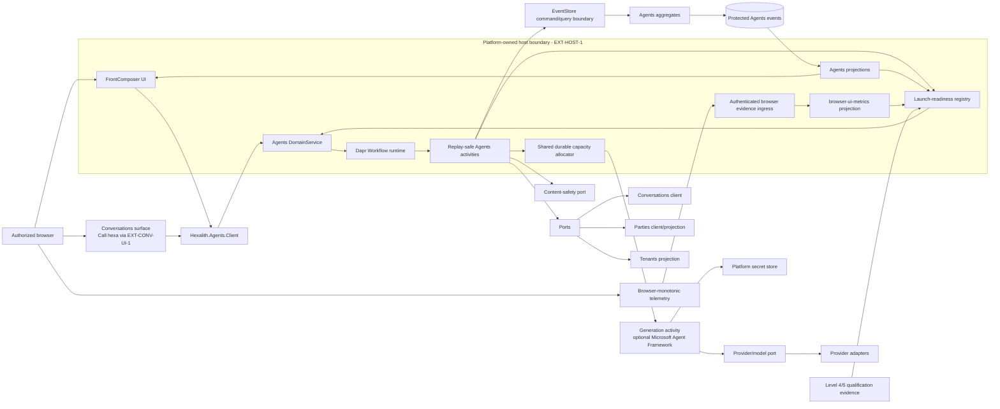
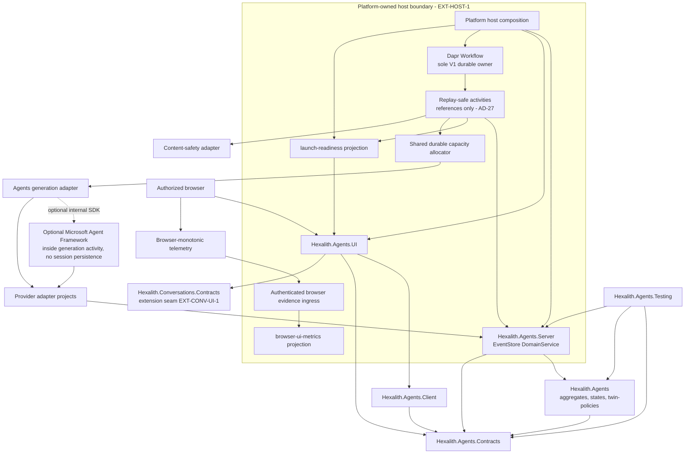
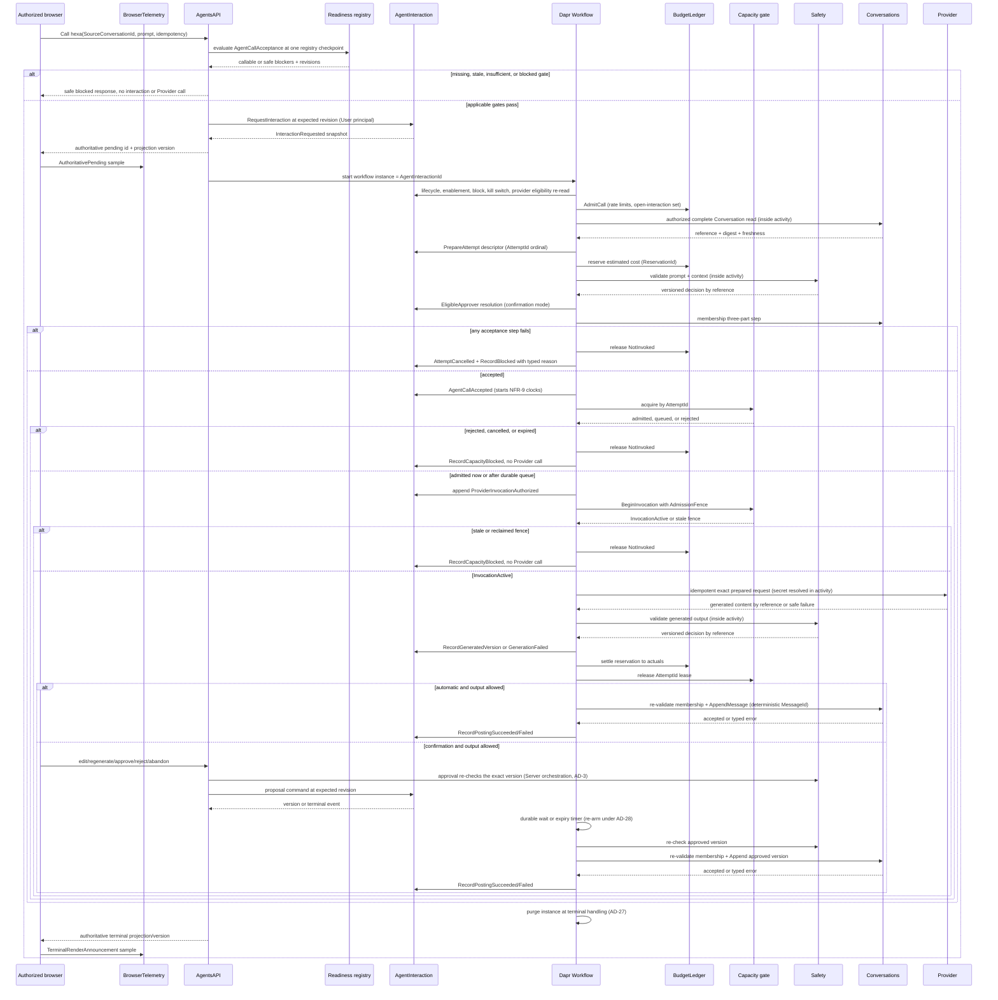
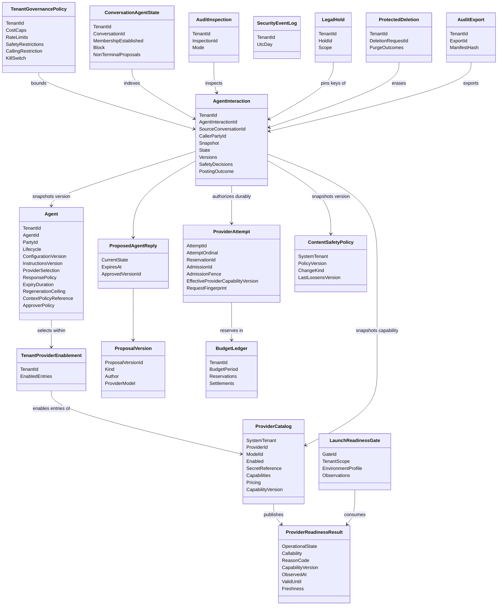

# Architecture Spine - Hexalith Agents

## Design Paradigm

Hexalith Agents is an event-sourced, Dapr-Workflow-orchestrated, hexagonal Hexalith domain module: EventStore aggregates in the `Hexalith.Agents` domain assembly are business truth, replay-safe Server orchestrators and workflow activities coordinate every side effect through ports, adapters implement Conversations, Parties, Tenants, Provider, safety, secret, and FrontComposer integration, and a platform-owned host composes it all.


```mermaid
flowchart LR
  Browser[Authorized browser] --> UI
  Browser --> BrowserTelemetry[Browser-monotonic telemetry]
  Browser --> ConvSurface[Conversations surface<br/>Call hexa via EXT-CONV-UI-1]
  ConvSurface --> Client
  subgraph PlatformBoundary[Platform-owned host boundary - EXT-HOST-1]
    API[Agents DomainService]
    UI[FrontComposer UI]
    Workflow[Dapr Workflow runtime]
    App[Replay-safe Agents activities]
    CapacityGate[Shared durable capacity allocator]
    ReadinessRegistry[Launch-readiness registry]
    Proj[Agents projections]
    EvidenceIngress[Authenticated browser evidence ingress]
    BrowserMetrics[browser-ui-metrics projection]
  end
  UI --> Client[Hexalith.Agents.Client]
  Client --> API
  API --> Workflow
  Workflow --> App
  App --> ReadinessRegistry
  App --> CapacityGate
  CapacityGate --> Generation[Generation activity<br/>optional Microsoft Agent Framework]
  App --> Ports[Ports]
  App --> ES[EventStore command/query boundary]
  ES --> Agg[Agents aggregates]
  Agg --> Events[(Protected Agents events)]
  Ports --> Conversations[Conversations client]
  Ports --> Parties[Parties client/projection]
  Ports --> Tenants[Tenants projection]
  Generation --> ProviderPort[Provider/model port]
  ProviderPort --> Provider[Provider adapters]
  App --> Safety[Content-safety port]
  Generation --> Secrets[Platform secret store]
  Events --> Proj
  Proj --> UI
  Proj --> ReadinessRegistry
  BrowserTelemetry --> EvidenceIngress
  EvidenceIngress --> BrowserMetrics
  BrowserMetrics --> ReadinessRegistry
  Evidence[Level 4/5 qualification evidence] --> ReadinessRegistry
  ReadinessRegistry --> API
```

## Invariants & Rules

### AD-1 - Agents Is A Full EventStore Domain Module [ADOPTED]

- **Binds:** all V1 capabilities.
- **Prevents:** proposal, provider, governance, and audit state being split between a transient orchestrator and unrelated modules.
- **Rule:** Hexalith Agents owns durable Agent configuration, provider governance, tenant enablement, Agent interactions, generated/edited/regenerated proposal versions, approval decisions, posting outcomes, budget, safety and governance policy, legal hold, export, deletion, readiness evidence, and operational status as EventStore-backed domain state.

### AD-2 - Aggregate Boundaries And Tenant Scope

- **Binds:** FR-1..FR-18, FR-24..FR-26, FR-28, FR-30, FR-32, FR-33, OQ-20.
- **Prevents:** two owners for one entity, an unbounded tenant-wide hot aggregate, a cross-tenant catalog, or governance state that lives only in a projection.
- **Rule:** V1 aggregates are exactly, with identity key and tenant scope: `Agent` (`TenantId`, `AgentId`; `hexa` is one `Agent` per tenant, created at tenant enablement under the `Platform` principal, with a tenant-wide response mode, proposal expiry duration, regeneration ceiling, Conversation Context Policy, and Party identity link), `ProviderCatalog` (reserved EventStore tenant `system`, one stream per `ProviderId` + `ModelId`; provider/model records, capability metadata, versioned pricing, secret reference state, platform enablement), `TenantProviderEnablement` (`TenantId`; which platform entries the tenant may see and select, mutated by the Platform Operator [ASSUMPTION A-10]), `AgentInteraction` (`TenantId`, `AgentInteractionId`; each call, prepared attempts, safety decisions, proposal lifecycle, version history, approval/rejection/abandonment/expiry, posting outcome), `BudgetLedger` (`TenantId`, `BudgetPeriod` as the UTC calendar month; balances, reservations, settlement; one reservation event per attempt bounds the stream), `TenantGovernancePolicy` (`TenantId`; cost caps, rate limits, tenant safety restrictions, calling restriction [ASSUMPTION A-11], and the per-tenant kill switch), `ConversationAgentState` (`TenantId`, `ConversationId`; membership-established fact, the Agents-owned block, and the index of non-terminal proposals for that Conversation), `AuditInspection` (`TenantId`, `InspectionId`; compliance inspections, never under an interaction key), `SecurityEventLog` (`TenantId`, `UtcDay`; content-free, rate-bounded authorization denials and security events), `ContentSafetyPolicy` (`system`; published policy versions with `ChangeKind` and `LastLoosensVersion`), `LaunchReadinessGate` (`GateId`, `TenantScope`, `EnvironmentProfile`), `LegalHold` (`TenantId`, `HoldId`; scope grammar `interaction:<AgentInteractionId>` list or `class:<ContentClass>` plus a UTC range), `AuditExport` (`TenantId`, `ExportId`), and `ProtectedDeletion` (`TenantId`, `DeletionRequestId`). The `Agent` aggregate stores no safety policy; the interaction snapshot's safety version is the pair (`ContentSafetyPolicy` version, `TenantGovernancePolicy` version). Any decision whose wrong answer is unrecoverable (deletion under hold, key destruction, export scope) reads hold and policy state from the owning aggregate at an expected revision, never from a projection. `TenantId` is a mandatory component of every aggregate identity, deterministic id, idempotency tuple, projection key, query cursor scope, allocator call, and ledger call; a query for a key outside the caller's tenant, or for a platform entry not enabled for it, returns exactly the absent-key response.

### AD-3 - Pure Aggregates, Side Effects Outside

- **Binds:** all write paths.
- **Prevents:** replay-unsafe provider calls, HTTP calls, timers, or dependency reads inside aggregate logic.
- **Rule:** Aggregate `Handle` methods emit events only and live, with their states and internal twin-policies, solely in the `Hexalith.Agents` domain assembly. Provider calls, Conversations reads/posts, Parties validation/provisioning, Tenants projection reads, expiry timers, secret resolution, and notifications run in Server orchestration, workflow activities, or adapters and feed results back through commands under the [implementation convention](IMPLEMENTATION-CONVENTIONS.md).

### AD-4 - Interaction Snapshot

- **Binds:** FR-5, FR-6, FR-7, FR-13..FR-18, FR-24.
- **Prevents:** pending interactions changing model identity, instructions, response mode, or approval authority when administrators edit configuration later, and pending interactions approving or posting under a disabled Agent or a stopped tenant.
- **Rule:** `AgentInteraction` snapshots at request time the Agent `ConfigurationVersion`, `InstructionsVersion`, response mode, proposal expiry duration, regeneration ceiling, `ApproverPolicyVersion`, `ProviderId`, `ModelId`, the `ProviderCapabilityVersion` read from the tenant enablement view of the platform catalog entry, the safety version pair, caller `PartyId`, source `ConversationId`, and `ContextPolicyReference`. `ConfigurationVersion` increments on every accepted `Agent` configuration or lifecycle event. Later configuration and selection changes affect future interactions only. Agent lifecycle state, tenant Provider enablement, the per-Conversation Agent block, and the tenant kill switch are never frozen: every side-effecting step re-reads them under AD-12 and fails closed. Current Provider readiness and safe limits are re-evaluated under AD-10 and may tighten or block an in-flight interaction but never retarget it.

### AD-5 - Proposal Lifecycle

- **Binds:** FR-13..FR-18, FR-24, FR-25.
- **Prevents:** drafts being mistaken for Conversation messages, edits overwriting generated versions, or a second version posting after approval.
- **Rule:** A Proposed Agent Reply occupies exactly one public `ProposedAgentReplyState`: `Pending`, `Edited`, and `Regenerated` await a decision and differ only in the latest version kind; `Approved`, `PostingPending`, and `PostingFailed` follow a decision; `Posted`, `Rejected`, `Abandoned`, and `Expired` are terminal; `Unknown = 0` is a sentinel, never recorded. Every generated, edited, or regenerated version is immutable. Approval selects exactly one version, pins `ApprovedVersionId`, removes edit, regenerate, and approve, and freezes expiry. `ExpiresAt` applies only while awaiting a decision and is enforced on every read and command regardless of timer delivery. `PostingFailed` allows a bounded audited retry of at most 3 attempts within 15 minutes of the first `PostingFailed` command's `EvaluatedAt` [ASSUMPTION A-7], and an administrative retry is one audited attempt per command, after which the proposal persists until an Eligible Approver abandons it, the Tenant Agent Administrator administratively retries it or, audited and without Conversation read access, abandons it only when the Source Conversation is gone or inaccessible to the Agents service principal, or the system abandons it. Failed or incomplete generated content, when retained, is a separate `GenerationFailureRecord` under AD-14 protection and is never a `ProposalVersion`. Abandon is legal from every awaiting-decision state and from `PostingFailed`, never from `Approved` or `PostingPending`, which complete or fail on their own terms; the administrative retry and abandon are `ProposalResolution` commands needing no Conversation read access. System abandonment carries a typed reason (`NoEligibleApprover`, `SourceConversationUnavailable`, `RemovedInConversations`). Automatic-mode posting shares the same bound: the workflow retries transient posting failures with the same `MessageId` and idempotency key, then records terminal `PostingFailed` on `AgentCallOperationStatus`, and the sole recovery is a new Agent Call. Terminal proposals preserve all versions and never post.

### AD-6 - Conversations Boundary

- **Binds:** FR-2, FR-8..FR-12, FR-17, FR-30.
- **Prevents:** Agents bypassing Conversations authorization, idempotency, governance, and typed error contracts.
- **Rule:** Agents reads context and posts final messages only through supported `Hexalith.Conversations.Client`/API boundaries. The six Conversations-owned seams committed as `EXT-CONV-AI-1` [ASSUMPTION A-1, A-2, A-3, A-4, A-15, A-16] (idempotent AI membership with participant-state read and AI-participant removal, idempotent posting with trace and provenance metadata, Facilitator resolution, active-Conversation count, tenant-scoped content/roster/existence reads under the Agents service principal, and a Conversation deletion signal) are the only membership, posting, resolution, and deletion-propagation paths; an `Uncommitted`, unavailable, or incompatible record blocks consuming stories and runtime callability. Conversations persists the Agents-supplied `MessageId` and idempotency key verbatim or rejects the append. Agents never writes Conversation streams or events directly, and a Proposed Agent Reply is never a Conversation Message.

### AD-7 - Agent Party Identity And Membership

- **Binds:** FR-2, FR-11, FR-17, FR-33.
- **Prevents:** anonymous system authors, caller-authored AI messages, duplicated Party PII, or an Agent silently re-joining a Conversation a Facilitator removed it from.
- **Rule:** Agents stores stable `PartyId` references only; the shipped link and replace commands validate or provision identity through Parties adapters, and a missing identity is the `MissingPartyIdentity` activation blocker. Membership is the last acceptance step of a call, after which only the AD-13 invocation protocol remains before the Provider, and has three ordered parts: read `hexa`'s participant state; if `ConversationAgentState` records membership as established there and `hexa` is now absent, record the external removal on that aggregate at its expected revision, which sets the block, abandon that Conversation's non-terminal proposals, and reject with `RemovedInConversations`; otherwise, and only when no block is set, add `hexa` as `ParticipantType.AiAgent` with `ParticipantRole.Member` under the Agents service principal, idempotently. The block is set by the Tenant Agent Administrator, the Conversation Facilitator [ASSUMPTION A-9], or the membership step on detecting an external removal, is cleared only by the first two, is audited, and is mirrored to the Conversations participant list through the removal seam. Before every post the same three-part step re-runs together with block, Party state, Agent lifecycle, and Conversation accessibility checks; an external removal found there sets the block, abandons the Conversation's other non-terminal proposals, and records `PostingFailed` with `RemovedInConversations`, and `MembershipUnavailable` and `MembershipRejected` are `PostingFailed` reasons produced only by this re-validation, never by acceptance.

### AD-8 - Approver Policy Resolution

- **Binds:** FR-7, FR-13, FR-15..FR-18, FR-20.
- **Prevents:** each proposal workflow inventing a different meaning for facilitator, role, or predefined approver, or a caller approving their own call.
- **Rule:** ApproverPolicy is Agents-owned configuration with V1 sources Conversation Facilitator, predefined `PartyId`s, and tenant roles; the caller source is retired on the FR-23 deprecate-and-reject register. Conversation authority resolves to `ParticipantRole.Facilitator` [ASSUMPTION A-3], carried on the stable legacy wire identifier `ApproverPolicySourceKind.ConversationOwner` and labelled Conversation Facilitator on every surface; adopting a Conversations owner field requires an AD-8 amendment and a new `ApproverPolicyVersion`, and in-flight interactions keep their snapshot. Resolution is Conversation-scoped: a source contributes only current Participants holding read access. The Eligible Approver predicate (resolved now, not the caller, not the last editor of the version, holding current Conversation read access) is applied at configuration time (a policy naming no Conversation-dependent source and fewer than two predefined Parties is rejected; Facilitator-only is valid), call time (typed `NoEligibleApprover` before Provider work), edit time (refuse an edit that leaves none), and approval time; current read access is re-read from Conversations at discovery, edit, regeneration, approval, rejection, abandonment, and audit-content inspection and fails closed when absent, stale, or unavailable. Every resolution appends an `AgentInteraction` event listing the resolved `PartyId`s, and discovery, queue, and count return full content only to a currently-readable resolved Approver, existence and state only to a previously-resolved Party that lost read access, and the absent-key response to anyone never resolved. Every source declares a PRD FR-7 disclosure category defaulting to operator-only, shared by API and UI; a restricted tenant-role source can never be user-visible.

### AD-9 - Provider Adapter And Catalog Boundary

- **Binds:** FR-4, FR-5, FR-10, FR-24, FR-25.
- **Prevents:** provider SDK types, credentials, vault addresses, or provider-specific errors leaking into public contracts, UI, audit, or events.
- **Rule:** Provider integration is hidden behind Agents-owned generation adapters committed through `EXT-PROVIDER-1`; Provider and Agent Framework SDKs remain unselected until that record commits an immutable target and compatibility command, and catalog-truth publication is adapter-independent. `SecretReference` is the shipped opaque `ConfigurationReferenceId`: an operator-supplied, pattern-restricted handle with no infrastructure meaning (never a vault address or URI), bound to a secret only inside `EXT-SECRETS-1`; rotation keeps the handle; `SecretConfigured` is a durable catalog fact appended from a server-side resolvability probe (`Resolvable`, `Unresolvable`, `Denied`, `ObservedAt`), never computed in a query path; secrets are resolved only inside the generation activity immediately before transport, held in memory for the request, and never enter events, workflow state, exports, or logs. Public contracts and durable events expose only `ProviderId`, `ModelId`, safe capability/readiness metadata, versioned pricing, usage/status, and safe error classes; the `SecretConfigured` fact and the handle are visible to the Platform Operator only, and a tenant sees configuration problems solely as the AD-10 `PlatformNotReady` readiness code.

### AD-10 - Provider Capability Floor And Readiness

- **Binds:** FR-4, FR-5, FR-9, FR-10, FR-16, FR-21, FR-24, OQ-7.
- **Prevents:** incompatible capability shapes, stale or disabled catalog state trusted at runtime, snapshot and effective version conflated, or a retry reusing one attempt identity with changed provider inputs.
- **Rule:** The V1 capability floor per platform entry is `ProviderId`, `ModelId`, display label, enabled state, `SecretReference` and configured state, text-generation capability, context-window and max-output token limits, timeout policy, an optional per-model retry budget, optional safe capability flags including `ProcessingRegion`, input/output pricing with currency and a `PricingVersion` that starts at 1 and strictly increases, and `CapabilityVersion`, a non-reusable unsigned monotonic sequence per (`ProviderId`, `ModelId`) in the `system` catalog; comparisons across keys are undefined and forbidden, and any observed decrease is a blocker. Every catalog write is serialized by the entry's expected EventStore revision (`EntryRevision`), and capability-bearing writes additionally carry an expected `CapabilityVersion`: below the stored value rejects as regressed, above as stale. An Agent whose selected entry is disabled remains inspectable read-only in a named migration state. Tenant-facing readiness is the platform entry joined with `TenantProviderEnablement`; a by-key query for a non-enabled or absent entry returns the not-found response and `EntryMissing` is reported only for the Agent's own selected entry inside `AgentReadinessStatus`; its public `ProviderReadinessResult` fixes `OperationalState`, `Callability`, safe `ReasonCode`, `CapabilityVersion`, `ObservedAt`, `ValidUntil`, and AD-17 `Freshness`, with the enum vocabulary and valid triples bound by `launch-readiness-register.md` section Provider Readiness Contract. `Degraded` is callable only when every hard gate passes; missing, stale, unconfigured, unpriced, invalid-limit, failed, disabled, not-enabled, regressed, unknown, or indeterminate state is `Blocked`, and unknown codes fail closed; a tenant sees platform-only blockers as the additive `PlatformNotReady` code. Enable/disable never bumps `CapabilityVersion`, so version comparison never substitutes for readiness. The interaction's durable capability high-water mark starts at the snapshot version and advances to every identified live version; every provider-dependent step requires a trust-bearing fresh entry with `CapabilityVersion` at least that mark, then advances the mark and re-evaluates every hard gate. The snapshot version is provenance; `EffectiveProviderCapabilityVersion` is the accepted live version a step consumed and is carried through its request, provider call, outcome, and evidence.

### AD-11 - Conversation Context Bounds

- **Binds:** FR-8, FR-9, FR-10, FR-31, OQ-10.
- **Prevents:** silent truncation, summary substitution, or provider calls on stale, partial, or over-budget context.
- **Rule:** The versioned Conversation Context Policy is `Agent` configuration snapshotted as `ContextPolicyReference`; V1 publishes exactly one version declaring no Approved Bounded Context Behavior, the public mode enum is `Unknown`, `Full`, `Bounded`, `Blocked`, and a request carrying `Bounded` while the policy declares no behavior is a typed rejection, never a fallback. V1 context is built only from authorized Conversations detail and visible timeline content, treated as untrusted data. Exact measurement uses the Provider/model tokenizer committed through `EXT-TOKEN-1`; a missing, unsupported, stale, or incompatible tokenizer blocks before Provider invocation. The Safe Context Budget is the model context limit minus the reserved output allowance, Agent Instructions, caller prompt plus system framing, and a margin defaulting to 10 percent (range 5 to 25) [ASSUMPTION A-5]; each term is recorded in audit evidence. If the complete source cannot be loaded fresh enough or exceeds the budget, the interaction records the additive `Blocked` context mode with a typed reason and creates no provider call, proposal, or Conversation Message. `ContextReady` authorizes progression but freezes nothing: immediately before generation or regeneration prepares an attempt, the step repeats the authorized fresh read, exact measurement, AD-10 check, and budget calculation, and fails closed on any change.

### AD-12 - Authorization, Dependency Uncertainty, And Emergency Stop

- **Binds:** FR-19..FR-21, FR-28, FR-33.
- **Prevents:** JWT-only or UI-only authorization, side effects on stale projections, or work continuing under a disabled Agent or stopped tenant.
- **Rule:** Authorization gates run before every side effect and fail closed on missing, stale, ambiguous, disabled, or unavailable dependency state. Tenant access comes from Agents' local Tenants projection; conversation access and context from Conversations authorized queries; Party state from Parties adapters/projections; provider readiness from the AD-10 view; approver rights from the AD-8 predicate on the snapshot policy; role rights from the FR-33 matrix carried by the AD-30 principal. Every side-effecting step (Provider invocation, proposal creation, edit, regeneration, approval, posting) re-reads Agent lifecycle, tenant enablement, the per-Conversation block, and the per-tenant kill switch; a disabled Agent has kill-switch semantics for its own proposals (awaiting proposals may be rejected or abandoned, never approved, edited, or regenerated; `Approved` and `PostingPending` complete or fail on their own terms). The kill switch, a `TenantGovernancePolicy` fact read at its expected revision by every side-effecting step (family `TenantKillSwitch`), is pulled immediately by the Platform Operator on any confirmed cross-tenant or unauthorized action, by the Release Operator only on the recorded triggers (blocked-call share above 50 percent or posting failures above 10 percent sustained seven days), and by a recorded Product decision after two consecutive launch-health misses at the 30-day, 60-day, or monthly review [ASSUMPTION A-17], with `product-metrics` as the only trigger source; pulling it blocks call acceptance, Provider invocation, new descriptors, edit, regeneration, and approval tenant-wide, cancels queued admissions, lets an `InvocationActive` attempt complete and dispatch its outcome command (including the version it records), lets `Approved` and `PostingPending` complete or fail on their own terms, suspends `PostingFailed` and administrative retries with the retry-window clock paused, leaves awaiting proposals rejectable or abandonable by humans and otherwise expiring, never system-abandons or deletes anything, and is released only by the same roles with audited justification; `agent-setup` and `launch-readiness` expose the stop state. A UI/BFF user session (the authenticated principal plus one browser circuit, identified by an opaque session id carried as the accepted-by reference on pending status) permits at most one pending command per resource within a lock-bearing family; the lock-bearing subset is `ProposalResolution`, `PolicyPublication`, `TenantBudgetUpdate`, `LegalHold` (also `LegalHoldRelease`), `ExportRequest` (also `ExportDownload`), `DeletionRequest`, `ProviderCatalogMutation` (also `TenantProviderEnablement`), `AgentSetupMutation` (also `TenantKillSwitch`), and `AgentActivation`; `AgentCallAcceptance`, `ProposalEdit`, and `ProposalRegeneration` are not lock-bearing and rely on the AD-29 client idempotency key; the family vocabulary is owned by the register matrix version. The advisory lock begins on submission and clears only on authoritative rejection or a terminal result; a client timeout forces refresh and never implies success.

### AD-13 - Idempotent External Effects

- **Binds:** FR-8, FR-10..FR-18, FR-24.
- **Prevents:** duplicate provider attempts, duplicate messages, or duplicate proposal versions during retry, replay, or recovery.
- **Rule:** External side effects are causally tied to AD-29 identities. `AgentInteraction` is the sole owner of the prepared-attempt lifecycle and business facts; `BudgetLedger` owns reservation balance and settlement; the shared capacity allocator owns admission leases and queue order only; Dapr Workflow owns execution only. Acceptance follows the FR-8 order (authorization, lifecycle, provider eligibility, rate limits, context measurement, reservation, pre-Provider safety, Eligible Approver resolution, membership) and ends with one `AgentCallAccepted` event whose commit instant starts the NFR-9 clocks and counts the SM-2 numerator. Immediately after context measurement the interaction (1) appends one prepared descriptor, consuming the next `AttemptOrdinal` and binding `AttemptId` to Provider/model, `EffectiveProviderCapabilityVersion`, validated limits/timeout, and the canonical request fingerprint, then (2) reserves the estimated cost under `ReservationId` and appends the reference, exactly one reservation per descriptor; a later acceptance failure appends `AttemptCancelled` with `NotInvoked` and the regeneration ceiling counts descriptors beyond the first. After acceptance, Provider invocation continues: (3) acquire admission and validate the fence per AD-24; (4) append `ProviderInvocationAuthorized` at the expected revision, binding descriptor, reservation, fence, and evaluated readiness/matrix versions; (5) invoke only after step 4 and a current `InvocationActive` lease; (6) append the outcome, settle the reservation, then release admission. Whichever trusted step terminalizes an attempt before step 5 releases its reservation as `NotInvoked` and cancels its admission or queue entry in that same step. A crash before step 4 permits no Provider call; recovery re-derives every identity, appends missing facts idempotently, and blocks on a stale fence. `EXT-PROVIDER-1` provides idempotent invocation and outcome lookup by `ProviderIdempotencyKey`. A retry before a terminal outcome is authorized only when outcome lookup by `ProviderIdempotencyKey` confirms no usage and the entry's per-model retry budget is not exhausted; a transport failure or timeout without that confirmation resolves the attempt to `Indeterminate` and is never retried. An authorized retry reuses the exact descriptor, reservation, admission, and key while rechecking readiness; any change to the fingerprint, version, readiness, fence, or reservation fails closed under that attempt id, and the same action never substitutes a replacement attempt. The fingerprint covers `TenantId`, `ProviderId`, `ModelId`, `EffectiveProviderCapabilityVersion`, `InstructionsVersion`, the structured role/provenance message sequence with per-message content digests, generation parameters, reserved output tokens, and the evaluated safety policy versions; nothing else invalidates a retry. Conversation posting uses the AD-29 `MessageId` and idempotency key derived from the pinned `ApprovedVersionId` or the generated `ProposalVersionId`. UI/BFF locking under AD-12 is advisory; EventStore optimistic concurrency, deterministic identity, and idempotency are authoritative across sessions, tabs, retries, replay, and restarts.

### AD-14 - Sensitive Content And Secret Safety

- **Binds:** FR-4, FR-22, FR-24, data governance NFRs.
- **Prevents:** generated content, prompts, provider credentials, or provider payloads leaking through logs, telemetry, status, UI, audit summaries, or execution state.
- **Rule:** Generated, edited, prompt-derived, and context-derived content is sensitive conversation-derived content. Content-bearing Agents events and projections use EventStore payload protection under the AD-22 key hierarchy before production use; if protection is unavailable, content-bearing workflows stay disabled. Execution state carries content only as references under AD-27. Logs, telemetry, browser measurements, status, queue summaries, and audit summaries never include raw content, raw provider payloads, stack traces, Party PII, or secrets. Provider credentials live only behind AD-9 secret handles resolved through `EXT-SECRETS-1`; unavailable or incompatible resolution blocks use.

### AD-15 - Public Surface And UI Parity

- **Binds:** FR-22, FR-23, FR-29, FR-33, UX spine.
- **Prevents:** UI-only workflows, client integrations that need EventStore or provider internals, or UI states with no public contract.
- **Rule:** Admin UI and API/client surfaces share the same public Agents contracts, the FR-33 role matrix, and authorization outcomes. FrontComposer UI registers an Agents domain/nav like Tenants, uses policy-gated entries, and calls Agents API/BFF/client boundaries rather than EventStore streams, provider SDKs, or aggregate internals. Every UX-required state has a public contract before its route ships: `ProviderReadinessResult` with a by-Provider/model query, `AgentCallOperationStatus` growth (`SafetyBlocked`, `BudgetBlocked`, `RateLimited`, `CapacityQueued`, `CapacityRejected`, `UnknownOutcome`, `PostingPending`, `Posted`, `PostingFailed`), `AgentReadinessStatus` growth (`ActiveNotProvenCallable`, `Stale`, `AuthorityUnresolved`), the accepted-by session reference for pending commands, and the `IProjectionChangeDetailNotifier` nudge are owned by the stories the UX Known-gaps table names. Accepted writes return the FR-29 authoritative pending identity and projection version (HTTP 202) through the `*CommandAcceptance` contracts; `Submitted` is a client-local stage claiming no server acceptance, and a write never returns callability. The UI proves projection confirmation only by polling the authoritative projection after an accepted write; `IProjectionChangeDetailNotifier` over the FrontComposer projection-change channel is the only nudge, is filtered to the register's projection ids, triggers an immediate poll, never replaces it, and Agents owns no hub; poll exhaustion keeps the pending state and is never success or `Stale`, and the cadence is UX-owned. Every public read carries its projection id, version, and `Freshness`; proposal reads carry `ExpiresAt`, the configured window, `EvaluatedAt`, `RegenerationCount`, `RegenerationCeiling`, and a server-evaluated per-version approve verdict with a safe reason, so the UI never compares Parties or clocks; `Posted` carries the `MessageId`; `RateLimited` carries scope, window, and `ResetAt`; and pending proposals are queryable by `ApproverPolicyVersion`. `agent-setup` and `product-metrics` are the only sources of the per-tenant FR-25 counters (calls blocked by context policy, safety, cost cap, `NoEligibleApprover`, `RemovedInConversations` or the block; system-abandoned proposals by reason; reserved versus settled spend with the 80 and 100 percent states), and a caller's status query returns only the outcomes of that caller's own interactions.

### AD-16 - Platform-Owned Operational Topology

- **Binds:** deployment and environments.
- **Prevents:** domain modules duplicating or contradicting platform hosting, Dapr, telemetry, health, identity, secrets, or EventStore plumbing.
- **Rule:** Hexalith Agents ships no module-owned AppHost, Aspire, or ServiceDefaults project; guard tests enforce the boundary. It exposes the reusable Agents domain service through the shared EventStore DomainService SDK host and owns domain-specific UI assets. The platform-owned host committed as `EXT-HOST-1` must compose that service and UI with EventStore, Conversations, Parties, Tenants, Provider adapters, the Content Safety adapter, the readiness registry, capacity admission, browser evidence ingestion, and Dapr Workflow for local, test, and deployed environments, and owns Dapr sidecars, telemetry, health, secrets through `EXT-SECRETS-1`, identity, backup/restore procedure, and EventStore security wiring. Hosting package versions are the platform's, not the spine's.

### AD-17 - Readiness Registry, Freshness, Projections, And Test Gates

- **Binds:** FR-23, FR-25, FR-28, NFR-11..NFR-14, implementation readiness, `RQ-1`.
- **Prevents:** launch-critical invariants relying on manual QA, host-only configuration, two definitions of fresh, unnamed projections, platform evidence that never satisfies tenant evaluation, or live seams shipped without live tests.
- **Rule:** `launch-readiness-register.md` is the normative readiness authority for the record schema, state vocabulary, minimum GateId inventory with `ScopeKind` and `AuthorizedProducer`, gate sets, `OperationGateMatrix` versions, projection inventory, and measurement contracts; the spine binds only the invariants below. The `LaunchReadinessGate` aggregate is the only writer for each logical key (`GateId`, `TenantScope`, `EnvironmentProfile`); `TenantScope` is the closed grammar `tenant:<TenantId>` or `platform` (`tenant:system` is invalid), evaluation for a tenant reads `platform` records for Platform-scoped gates and `tenant:<id>` records for Tenant-scoped gates, and `EnvironmentProfile` is `<name>@<ProfileVersion>` where a version change invalidates the old profile's records. Observations are immutable, carry the AD-29 `ObservationId`, and are serialized by EventStore revision; an exact duplicate is a no-op, the same id with a different payload is a conflict, and re-observation with an unchanged `SourceVersion` is legal. Submissions whose principal kind is not the gate's `AuthorizedProducer` are rejected before append. The `launch-readiness` projection selects the greatest committed revision; an invalid, incomplete, or stale newest observation blocks without falling back. Every readiness evaluation is stamped with the `RegistryRevision` of the checkpoint it read and carries it unchanged to API, BFF, UI, and the audit record; `RQ-1` evaluates one consistent checkpoint across all keys, reads the `ReleaseQualificationGateSet`, admits only pre-enablement evidence a qualification cohort can produce, and records an `UnretiredAssumption` blocker for every unretired Product, Architecture, or Governance assumption in PRD section 8.1 or in this spine's Architecture Assumptions index. Every controlled execution re-evaluates its declared operation family from one matrix version; a missing family, unknown version, or gate outside the inventory blocks, and every public command and workflow activity declares exactly one family in its contract. `Freshness` is one versioned discriminated value (`Basis` `ValidityWindow` or `RevisionLag`, `EvaluatedAt`, expected and observed revision, `ValidUntil`) evaluated once on the server under AD-28 and carried unchanged to API, BFF, and UI, which never recompute it; readiness records and Provider readiness use `ValidityWindow`, read-your-writes queries use `RevisionLag` with the caller-supplied accepted-write reference as `ExpectedRevision` (absent it, only `ObservedRevision` is reported and the read is fresh; servers never read the aggregate to compute lag), a surface combining both bases is stale if either is, and `ProviderReadinessReasonCode.Stale` maps to `LaunchReadinessRecord` state `Stale` on `LR-PROVIDER` and `Blocked` callability, with no other mapping. `agent-setup` and `provider-catalog` are the shipped setup-detail projections; every other projection id in the register inventory is authoritative for the story that builds it, and readiness, purge, and evidence criteria name ids, never all affected projections. The register's Live-Seam Matrix section maps every seam to its authority, `BindingStatus` (`Deferred`, `DeferredOutOfV1`, or `Live`), and required integration test, and a seam flips only by a register amendment in the same change as its test; the story that flips a seam to `Live` adds and passes the matching `Hexalith.Agents.IntegrationTests` coverage asserting persisted state-store or read-model end state in the same change, and a live seam without its named passing test blocks completion, and the projection and query seams Stories 5.2 and 5.3 bound before the project existed receive their coverage in Story 5.6. Tests cover aggregate purity, authorization fail-closed paths, immutable versions, Dapr Workflow replay/restart/idempotency, identity derivation, tenant isolation including catalog and enablement, context blocking, Provider/tokenizer/safety/secrets/cost/capacity gates, execution-state content sweeps, FrontComposer UI conformance and browser timing, retention/export/deletion, recovery and restore, and audit completeness. Evidence Levels keep their PRD meanings; a Level 4 or 5 claim cites its harness and environment in the evidence manifest or is unproven; production-like readiness requires qualifying Levels 4 and 5; skips, placeholders, lower levels, or conditional results remain visible blockers; any per-Agent readiness value is transitional and reconciles to `launch-readiness` before `RQ-1`; and `RQ-1` records NOT READY naming any gate metric at `InsufficientEvidence`.

### AD-18 - Dapr Workflow Owns V1 Execution

- **Binds:** FR-9..FR-18, FR-24, runtime orchestration, deployment and environments.
- **Prevents:** double orchestration, in-memory background workers, alternate workflow owners, direct provider SDK loops, or framework-specific runtime types leaking into public contracts or aggregates.
- **Rule:** Dapr Workflow is the single durable owner for every V1 `AgentInteraction` lifecycle: context preparation, generation, confirmation waits, proposal expiry, posting, retries, and restart recovery. The workflow instance id is the `AgentInteractionId`; because Dapr 1.18 never re-creates a non-terminal instance id, recovery resumes or terminalizes the existing instance and never re-creates it, and a terminal purged id is re-created only by AD-23 recovery to resume unfinished terminal handling, never to re-run a business step. Each replay-safe activity re-evaluates its declared gates and dispatches at most one deterministic trusted command under AD-30. EventStore remains business truth; workflow history is execution state bound by AD-27 and purged at terminal handling. Microsoft Agent Framework may be used inside a generation activity for typed agent/session and Provider integration with session persistence disabled, but it owns neither orchestration nor domain state; its Durable Task and Azure Functions hosting, Python Dapr Agents `DurableAgent`, and any other workflow owner are excluded from V1. Public contracts and aggregates do not depend on Agent Framework, provider SDK, or workflow SDK types.

### AD-19 - No Tool Or Remote-Agent Surface In V1

- **Binds:** tool integration, remote-agent integration, and their governance.
- **Prevents:** each agent, tool host, or adapter choosing incompatible protocols or bypassing domain commands for business mutations.
- **Rule:** V1 exposes no tools, MCP servers or clients, A2A agents, Python agent workers, or remote-agent protocol surface, and the source tree reserves no folder for them. A future approved scope must select protocol ownership and threat controls before enabling any of them; domain mutations remain domain commands, and any future tool contract carries tenant context, idempotency, correlation, authorization, and audit metadata.

### AD-20 - Two-Stage Content Safety

- **Binds:** FR-10, FR-26, FR-27, FR-28, FR-31.
- **Prevents:** unsafe or unauthorized content reaching a Provider, proposal, or Conversation, a retry evaluating under weaker policy, or a safety decision with no durable record.
- **Rule:** Prompt plus complete authorized Conversation Context pass a fresh versioned decision through the adapter committed as `EXT-SAFETY-1` before Provider invocation; generated output passes a fresh decision before proposal creation; the approval command evaluates the exact version being approved, generated or human-edited, under the pair the lineage rule below selects and on failure is rejected, leaves the proposal non-terminal, and marks that version; and when posting is not simultaneous with approval the posting step runs a fourth fresh decision on the pinned `ApprovedVersionId`, so no edit path places unscanned content in a Conversation. The effective policy is the platform `ContentSafetyPolicy` version (published by the Platform Operator with a recorded Security approval reference in the `PolicyPublication` command) plus the tenant's restrictions, which are declared per response mode and may only add categories or tighten thresholds, a loosening restriction being rejected at configuration; each published version (platform and tenant alike) records a publisher-declared `ChangeKind` and its `LastLoosensVersion`, the aggregate rejects a `Tightens` or `Neutral` declaration whose category set is not a superset of the previous version, and version B is at least as restrictive as version A only when `B.Version >= A.Version` and `B.LastLoosensVersion <= A.Version`, tested component-wise on the (platform, tenant) pair. A transport retry never re-evaluates safety and runs under the descriptor's bound pair; regeneration (a new descriptor), approval time, and pre-post evaluate under the current pair when it is at least as restrictive as the snapshot pair and under the snapshot pair exactly otherwise. Every decision is an `AgentInteraction` event carrying `SafetyDecisionId`, stage, policy versions, adapter version, outcome, category codes, and the content fingerprint, never content. The prepared request separates Agent Instructions from context using the Provider's role/message structure, never one concatenated string, and `ControlBypass` includes instruction-override attempts found in context. The verdict cache is keyed by (`TenantId`, `ConversationId`, keyed content digest, platform and tenant policy versions, adapter version) and invalidated on policy publication, and a pre-Provider decision event lists each reused verdict's content hash and originating policy version. A Conversation whose scanned history fails the effective policy is blocked for generation with the typed reason `HistoryFailsSafetyPolicy` until re-evaluated under a policy it passes; V1 offers no per-message redaction or exclusion (PRD OQ-18, decision due 2026-10-15 [ASSUMPTION A-14]). Always-blocked and restricted classes are bound by PRD FR-26 and OQ-9; restricted content requires an explicitly permitted tenant use case and Confirmation Response Mode; missing, stale, unversioned, or indeterminate state fails closed; Approvers cannot override a failure.

### AD-21 - Cost Reservation, Rate Limits, And Settlement

- **Binds:** FR-4, FR-8, FR-10, FR-25, FR-28, FR-32, NFR-10.
- **Prevents:** unpriced calls, concurrent overspend, retry double charging, denial-of-wallet within a tenant, reporting-only launch controls, or outage-wedged budgets.
- **Rule:** Production-like enablement requires `EXT-PROVIDER-1`, `EXT-SECRETS-1`, valid limits, current versioned pricing, and numeric monthly and per-call caps plus per-Party and per-Conversation rate limits over a stated rolling window, configured in `TenantGovernancePolicy` by the Platform Operator or Release Operator with no implicit defaults; the Tenant Agent Administrator may lower but never raise them, and a change applies to future calls and never touches settled spend. The regeneration ceiling and proposal expiry duration are `Agent` configuration written by the Tenant Agent Administrator anywhere within their PRD ranges through `AgentSetupMutation`, apply to future proposals only, and increment `ConfigurationVersion`; the `PostingFailed` retry bound is fixed by AD-5, not configurable. Before reservation, one atomic `BudgetLedger` `AdmitCall` command at FR-8 step 4 enforces the per-Party and per-Conversation windows and the `MaxConcurrentNonterminalInteractionsPerParty` set (a `TenantGovernancePolicy` field with no implicit default) and records the consumption, and the regeneration ceiling (default 3, range 1 to 10 [ASSUMPTION A-6]) is enforced by `AgentInteraction`; each yields a typed rejection with no reservation, admission, or Provider call. After context measurement and before safety, admission, and authorization, one atomic `BudgetLedger` command reserves the estimated attempt cost (measured input plus reserved output at the current pricing version) against the caps and attributes it to the current `BudgetPeriod`; the interaction records the reference and retries reuse it. Budget percentage is settled usage plus outstanding and `Unreconciled` reservations over the cap; it warns at 80 percent and fails closed at 100 percent. The tenant budget currency is authoritative, the catalog validates ISO 4217 well-formedness only, a platform entry whose pricing currency differs from the tenant budget currency is `Blocked` in the AD-10 tenant join with the tenant-scoped code `CurrencyMismatch` and refuses reservation, and a budget-currency change never converts settled spend. A later pre-Provider failure releases the reservation immediately as `NotInvoked`. A confirmed no-usage outcome releases; usage settles to actuals; an `Indeterminate` outcome holds the reservation for a configured period (default 24 hours, range 1 to 72) [ASSUMPTION A-8] and then settles `ChargedAtMaximum`, and is never retried. A reservation past its deadline with no authoritative outcome becomes `Unreconciled`, stays counted, and is settled only by an audited `TenantBudgetUpdate` operator command or at period close as `ChargedAtMaximum`; an orphan reservation found by recovery releases as `NotInvoked` when no `ProviderInvocationAuthorized` fact exists and follows the `Indeterminate` path otherwise; reservations never migrate between periods, and `BudgetPeriod` is the UTC calendar month of the reserving command's `EvaluatedAt`, which the period stream enforces. Only the postures `Quotas`, `Budgets`, and `ProviderModelLimits` satisfy readiness; `ReportingOnlyMonitoring` and `AcceptedLaunchRisk` are rejected at recording and surfaced as `ProhibitedCostControlPosture`. A cap override is audited, scoped, justified, Platform-Operator-only, carries a numeric ceiling and an expiry, and lapses at the earlier of the two.

### AD-22 - Sensitive Audit Governance

- **Binds:** FR-24, FR-25, FR-28, FR-30, FR-33, data-governance NFRs.
- **Prevents:** indefinite sensitive-content retention, unaudited or unverifiable exports, apparent deletion that leaves readable copies, undecidable erasure, or rewriting immutable EventStore history.
- **Rule:** Sensitive Agent content is retained 365 days after the AD-28 terminal instant unless legal hold suspends expiry. Sensitive content lives only in a field-level `ProtectedContent` envelope sealed by the Agents orchestrator with a per-`AgentInteraction` data-encryption key wrapped by a per-tenant key-encryption key custodied through `EXT-SECRETS-1` (operations `WrapDek`, `UnwrapDek`, `PinDek`, `UnpinDek`, `DestroyDek` with an irreversible destruction receipt) and supplied by the engine committed as `EXT-PROTECTION-1`; every other event field stays plaintext, `Apply` treats a destroyed-key field as the typed value `Erased` so streams stay replayable after erasure, the envelope stays sealed on the broker, in read models, and in any adapter cache, and content-bearing workflows stay disabled while that record is not `Available`. Cryptographic erasure destroys the DEK at interaction granularity; redaction rewrites projection copies only and never completes an EventStore erasure; a class-scoped deletion enumerates the in-range interactions and is rejected in full if any is pinned; snapshots and replay caches inherit the DEK so a restore cannot revive erased content. A hold protects keys, not queries: `ApplyHold` is two-phase, resolving its scope to explicit interaction keys at a recorded checkpoint, pinning each DEK, and becoming `Active` only when every pin is confirmed; erasure reads the interaction's own pinned-hold set at its expected revision, and a deletion or Conversation-deletion propagation on a nonterminal interaction terminalizes it before purging execution state. Restrictive completion means every protected event unprotects as unreadable, every named projection and the `workflow-execution-state` scope report purged, and only a support-safe non-content tombstone remains; deletion is not complete before that, and a Conversation deletion signal triggers the same deletion for derived content. Inspection has two levels: a current Participant with read access inspects posted provenance only; unposted versions, rejected content, and context metadata are inspectable only by a Party durably recorded as an Eligible Approver for that proposal or under a compliance inspection owned by `AuditInspection`, held by the Compliance Inspector, scoped to a named Conversation or case, justified, either pre-approved by a distinct Tenant Agent Administrator principal before any content read or post-hoc reviewed by one within the tenant's review window, rate-visible on the `audit-evidence` projection the Tenant Agent Administrator can read, and itself recorded as evidence that survives loss of the Source Conversation and erasure of the inspected interaction. Every lock-bearing-family command appends a change-evidence event carrying actor and role basis, family, resource identity, old-to-new values at the FR-20 disclosure level, published or pricing version, expected revision, and justification, and the set rendered in the confirmation is exactly the set recorded; `LegalHold`, `LegalHoldRelease`, `ExportRequest`, `DeletionRequest`, `PolicyPublication`, and `TenantBudgetUpdate` reject a missing or whitespace justification before append. `LegalHold`, `LegalHoldRelease`, and `ExportRequest` are Compliance Inspector commands; a `DeletionRequest` is submitted by the Platform Operator and becomes executable only after a recorded Compliance Inspector approval [ASSUMPTION A-12]. Export is tenant-scoped, encrypted under the tenant KEK into the export envelope key, time-limited, audited, and manifested: the manifest lists every item with `TenantId`, stream or projection id, revision range, SHA-256 of exported bytes, key versions, requester principal, and expiry, is sealed by a `ManifestSealed` event on `AuditExport` carrying the manifest hash, signature reference, and key versions from which the `export` projection derives; the export envelope key is delivered by the `EXT-SECRETS-1` custodian to the requesting Compliance Inspector principal, never in an Agents response, manifest, log, or projection, and expires with the export. EventStore history is never rewritten; posted Conversation Messages remain governed by Conversations retention.

### AD-23 - NFR-11 Recovery And Restore Qualification

- **Binds:** NFR-11, FR-24, FR-28, `LR-RECOVERY`.
- **Prevents:** recovery claims that lose accepted state, duplicate external effects, change terminal decisions, measure only process restart, or restore rebuildable stores past the truth.
- **Rule:** Recovery evidence uses the `EXT-TOPOLOGY-1` production-like failure-injection fixture over one frozen cohort of durable nonterminal interactions, measured by one injected monotonic clock from processing loss to full accounting, at most 15 minutes; UTC record freshness is never used for the duration. After restart every gate is re-evaluated and each cohort member resumes or reaches a safe durable blocked/terminal state; pre-fault terminal decisions are immutable; evidence proves EventStore RPO 0 and inventories every deterministic identity. EventStore is the only backed-up source of truth; workflow state, allocator state, and read models are rebuildable and are never restored later than the EventStore restore point; after any restore all admission fences are invalidated, `InvocationActive` leases are reclaimed through outcome lookup, open reservations follow AD-21, and every nonterminal interaction re-enters recovery. `EXT-HOST-1` owns the procedure and `LR-RECOVERY` includes one restore-from-backup exercise. Cohort, clock, inventory, and evidence-level details are bound by the register section NFR-11 Recovery Evidence Contract.

### AD-24 - NFR-12 Capacity Admission And Fairness

- **Binds:** NFR-12, FR-10, FR-25, FR-28, `LR-CAPACITY-FAIRNESS`.
- **Prevents:** hidden or unlimited concurrency, unbounded queues, tenant starvation, retry double-admission, or rejection after Provider cost is incurred.
- **Rule:** One platform-composed capacity-admission component is the sole owner of shared tenant/system leases and queue order across replicas; process-local counters or queues are forbidden. Its linearizable acquire returns admitted with `AdmissionId` plus a monotonic `AdmissionFence`, queued with the durable `QueueId`, or rejected; immediately before transport, linearizable `BeginInvocation(AttemptId, AdmissionId, AdmissionFence)` must validate the current unexpired lease and transition `Admitted` to `InvocationActive`; reclamation, cancellation, expiry, kill switch, or terminalization invalidates the fence so stale authorization never invokes. Retries reuse the same queue identity and never earn weight again; cancellation or queue expiry is a durable terminal admission result permitting no Provider call; an `InvocationActive` lease is reclaimed only after a recorded terminal attempt or after expiry beyond Provider timeout and outcome lookup confirms no active invocation. Numeric limits, overflow behavior, `WeightedRoundRobinV1` semantics, and evidence requirements are bound by the register section NFR-12 Capacity And Fairness Profile; missing or host-only values, process-local state, unbounded queues, or insufficient evidence block callability.

### AD-25 - NFR-13 UI Conformance

- **Binds:** FR-22, FR-23, NFR-13, `LR-UI-CONFORMANCE`.
- **Prevents:** API/UI authorization drift, inaccessible or partially localized controls, or high-impact actions proceeding when required context is not visible.
- **Rule:** The versioned browser/component conformance suite executed through `EXT-TOPOLOGY-1` covers every interactive V1 route and high-impact state through the same public contracts as API clients and proves WCAG 2.2 AA behavior, keyboard and focus order, live-region ownership, whole-string English/French parity, and FrontComposer plus Fluent UI Blazor V5 inheritance. At the most restrictive supported viewport every lock-bearing family remains blocked whenever required decision context cannot be presented safely. Expiry and nearing-expiry are rendered from server instants under AD-28. Missing routes, keys, viewport evidence, or conditional skips produce `InsufficientEvidence`; the contract details are bound by the register section NFR-13 UI Conformance Contract.

### AD-26 - NFR-14 Browser Monotonic Timing Evidence

- **Binds:** FR-22, FR-25, FR-28, NFR-14, `LR-UI-PERFORMANCE`.
- **Prevents:** mixed browser/server clocks, optimistic client state, missing announcement timing, or incomplete samples producing a false UI-performance pass.
- **Rule:** One injected browser-monotonic clock and `ClockOriginId` measure each page lifecycle in the `EXT-TOPOLOGY-1` browser profile; browser ticks are never subtracted from server or projection wall-clock timestamps. A discriminated `BrowserTimingSample` with the AD-29 `SampleId` carries exactly the ticks its kind requires; variant-forbidden ticks, mixed origins, or invalid ordering reject the sample. Only samples from an authenticated versioned qualification session enter `browser-ui-metrics`; ingress verifies the safe trace and projection reference against server evidence, treats an exact duplicate as a no-op, and rejects a conflicting duplicate. Sample kinds, required ticks, thresholds, and minimum counts are bound by the register section NFR-14 Browser Monotonic Timing Contract.

### AD-27 - Execution-State Content Boundary

- **Binds:** every Dapr Workflow input, activity input/output, custom status, timer or external-event payload, and any Agent Framework session or checkpoint under AD-18.
- **Prevents:** sensitive conversation-derived content persisting in workflow history or SDK session state where AD-14 protection and AD-22 erasure cannot reach it.
- **Rule:** Execution state carries only identities, versions, revisions, digests, safe classification codes, and `ProtectedContentReference`s resolvable only through the EventStore payload-protection store under the AD-22 keys. An activity that needs content materializes it inside the activity from the reference, uses it, and returns a reference plus digest; content never crosses an activity boundary. A `ProtectedContentReference` always names a sealed event on the owning `AgentInteraction` stream, never a side store. Generation, output safety, and the `RecordGeneratedVersion` or `GenerationFailed` dispatch are one activity: the Provider response is sealed on receipt, the output decision is taken on the plaintext still in memory, and exactly one command carries the sealed envelope and the decision. Agent Framework session persistence is disabled in V1. Terminal interaction workflows are purged from the workflow state store within terminal handling plus a 7-day operational window [ASSUMPTION ARCH-A-1], and `workflow-execution-state` is a named purge scope item whose confirmation AD-22 deletion completion requires. A content-bearing activity contract fails the AD-17 execution-state content sweep.

### AD-28 - Time Authorities

- **Binds:** every stored instant, deadline, freshness evaluation, timer, latency metric, and product metric.
- **Prevents:** one deadline or duration being computed from different clocks by the aggregate, the workflow, the projection, the metric calculator, and the UI.
- **Rule:** `DomainInstant`: every durable business instant used for measurement and retention (request time, version creation, decision time, terminal time, retention base) is the EventStore event-metadata commit timestamp of the creating event, which is server-stamped at persist; a deadline an aggregate must store (`ExpiresAt`, reservation deadline, retry-window start) is derived once from the creating command's `EvaluatedAt` and written into the payload, so no aggregate ever needs a commit timestamp to decide. `EvaluationInstant`: every server-side comparison against a stored instant or `ValidUntil` uses one injected `TimeProvider` supplied to the orchestrator and stamped into the trusted command or result as `EvaluatedAt`; aggregates compare supplied instants only and never read a clock. `SchedulingInstant`: Dapr Workflow uses `CurrentUtcDateTime` only to schedule; a timer activity re-reads the stored deadline, treats `EvaluatedAt >= deadline - 2 seconds` as elapsed [ASSUMPTION ARCH-A-7], otherwise re-arms for at least one second and at most three times, and on the third miss records a `TimerDrift` event on the interaction and hands it to the `SystemTimer` expiry sweep, which dispatches the terminal command for every proposal, reservation, or queue entry whose stored deadline has passed; the terminal instant is that command's commit. Monotonic fixture and browser clocks (AD-23, AD-26) measure durations only and never produce a `DomainInstant`. NFR-9 runtime latency and SM product metrics derive only from commit timestamps of named Agents events (`AgentCallAccepted` to `PostingSucceeded` or `ProposalCreated`; `ProposalApproved` to `PostingSucceeded`; `InteractionRequested` to the first blocking event whose reason needed no content-safety classifier call, with safety-scan latency its own series), calculated solely by `runtime-metrics` and `product-metrics` under the register measurement contracts; any Agents-side SM-2 denominator counts from a Conversations event feed, never from Agent Calls [ASSUMPTION A-4]. The UI never re-evaluates deadlines, expiry, or `ValidUntil` against a browser clock; it renders the server's `EvaluatedAt`-relative result.

### AD-29 - Deterministic Identity Derivation

- **Binds:** every identity in the Identity and Idempotency conventions, `ProviderAttempt`, `ReadinessObservation`, `BrowserTimingSample`, and API idempotency.
- **Prevents:** two derivations of one identity, an idempotency key naming two requests, or a replayed key disclosing another tenant's result.
- **Rule:** One shared `AgentsIdentity` canonicalizer (UTF-8, length-prefixed components, `U+001F` separators, SHA-256, lowercase hex, purpose tag as the first component) derives every deterministic id: `AgentInteractionId = H(TenantId, AgentId, SourceConversationId, CallerPartyId, ClientIdempotencyKey)` exactly as shipped, the one id without a purpose tag; `AttemptId = H(attempt, TenantId, AgentInteractionId, AttemptOrdinal)` where `AttemptOrdinal` is the aggregate-assigned 1-based count of prepared descriptors (generation is 1, each regeneration increments, a transport retry never increments); `ProviderIdempotencyKey = AttemptId` verbatim; `ReservationId = H(reservation, AttemptId)`; `AdmissionId = H(admission, AttemptId)`; `QueueId = AdmissionId`; `ProposalVersionId = H(version, AgentInteractionId, VersionOrdinal, Kind)` for every generated, edited, or regenerated output including automatic-mode output; `MessageId = H(message-id, AgentInteractionId, ProposalVersionId)` and posting `IdempotencyKey = H(idempotency-key, AgentInteractionId, ProposalVersionId)`; `SafetyDecisionId = H(safety, AttemptId, Stage)` for attempt-bound stages and `H(safety-version, ProposalVersionId, Stage, DecisionOrdinal)` for the approval and pre-post stages, where `DecisionOrdinal` is the aggregate-assigned count of decisions at that stage for that version; `ObservationId = H(observation, GateId, TenantScope, EnvironmentProfile, SourceVersion, EvidenceReference, ObservedAt)`; `SampleId = H(sample, TenantScope, QualificationSessionId, ExecutionId, SampleKind)`; `platform`-scoped `LaunchReadinessGate` streams live in tenant `system`. Ids never embed raw tenant text; tenant disjointness lives inside the hash input. API command idempotency is keyed by (`TenantId`, principal as (`PrincipalKind`, `PartyId` or `system`), operation family, client key) plus the payload fingerprint from the shared canonicalizer; the idempotency record lives on the target aggregate's stream; an exact replay (same tuple and fingerprint) returns the original authoritative identity and projection version, the same tuple with a different fingerprint is a conflict, and a different tuple is a new command. Every digest of sensitive content stored outside a `ProtectedContent` envelope (per-message digests, verdict-cache keys, evidence fingerprints) is an HMAC-SHA-256 under a per-tenant `DigestKey` custodied through `EXT-SECRETS-1`; unkeyed SHA-256 is used only for identities derived from identifiers.

### AD-30 - Principals And Trusted Envelope

- **Binds:** every command envelope, workflow activity dispatch, API ingress, and FR-33 role.
- **Prevents:** a workflow activity borrowing administrator authority, a forged reserved extension reaching an aggregate, or two role vocabularies for one matrix.
- **Rule:** Every Agents command envelope carries exactly one principal: `User` (`TenantId`, `PartyId`, resolved FR-33 roles), `Administrator` (a reserved `actor:*` extension populated only by the Agents API ingress after a fresh Tenants-projection role check, never from JWT roles alone), `Platform` (the `system`-tenant Platform Operator, carried as the reserved `actor:agentsProviderAdmin` extension), or `Workflow` (`AgentInteractionId` as instance id, activity name, `CorrelationId`, `OnBehalfOfPartyId` equal to the snapshot caller). The ingress removes every client-supplied reserved extension before any handler runs; a reserved extension arriving from a non-ingress path is a rejection and an audited security event. Each reserved extension is bound to an allowlisted command set and target scope, and aggregates verify both: `Workflow` may dispatch only `AgentInteraction` lifecycle-result commands, `BudgetLedger` admit, reserve, release, and settle for its own interaction, `ConversationAgentState` membership and external-removal records for its own Conversation, and under `SystemTimer` the timer-drift, period-close, retention-expiry, and purge commands, never `Agent`, catalog, enablement, policy, hold, export, deletion, or readiness-evidence commands. `Platform` carries `ActorTenantId = system`, targets the envelope `TenantId`, and may dispatch exactly the FR-33 platform rows in tenant `system` (`ProviderCatalogMutation`, platform `PolicyPublication`) and exactly the FR-33 tenant rows it names in a named target tenant (`TenantProviderEnablement`, `TenantBudgetUpdate` including cap override, `TenantKillSwitch`, `DeletionRequest` as requester, and the create-only `AgentSetupMutation` that provisions `hexa` at tenant enablement); readiness observations are the `ReadinessObservation` family, which Platform-kind gates accept only from `Platform` and Tenant-kind gates from `User` holding Release Operator or `Platform`; Tenant-kind gates are evaluated at the target tenant, and every other family rejects a `Platform` principal. Principal kind is selected by the command's declared family, never by the caller. Every reserved extension carries an HMAC tag issued to the Agents Server principal through `EXT-SECRETS-1` and verified by the Server command pipeline before the aggregate, which also rejects an untagged extension; a forged-extension test is part of `LR-TENANT-ACCESS`. Every denial and security event is appended, content-free, to `SecurityEventLog`. `Agents.Approver` is a navigation policy only; proposal authority is the AD-8 predicate alone. `OnBehalfOfPartyId` is the Party whose command initiated the current step (the caller for the first generation, the requesting Approver for a regeneration) and is the Party charged by per-Party limits, with `CallerPartyId` carried separately. FR-33 roles map one-to-one to FrontComposer policies `Agents.PlatformOperator` (Platform Operator), `Agents.Administrator` (Tenant Agent Administrator), `Agents.Approver`, `Agents.AuditOperator` (Compliance Inspector), and `Agents.Operator` (Release Operator); initial configuration or a raise of caps and rate limits is `Agents.Operator` or `Agents.PlatformOperator` and a lowering is `Agents.Administrator`; Conversation Participant is resolved from Conversations, and a missing, stale, or unavailable assignment fails closed. The caller `PartyId` is resolved at ingress from the authenticated subject through the Parties adapter and Tenants membership and fails closed when no unique active Party exists [ASSUMPTION ARCH-A-2]. Every authorized operation records its role basis at the FR-20 disclosure level.

### AD-31 - Conversation Surface Contribution

- **Binds:** FR-8, FR-11, FR-17, FR-22, UX seam `EXT-CONV-UI-1`.
- **Prevents:** a module dependency cycle, a deep-link entry point, or two mechanisms for the only V1 invocation entry.
- **Rule:** Conversations never references Agents packages. The **Call hexa** action and the per-message provenance decoration are Agents-owned UI contributions rendered through the Conversations-owned extension seam committed as `EXT-CONV-UI-1`: an action contribution with typed registration failure, a per-message decoration slot keyed by `MessageId` served by an Agents provenance accessor, and `GetCallabilityAsync(tenant, conversation)`, which reports the AD-10 and AD-12 gates only and never resolves Approvers; the panel submits through the Agents API ingress, which attaches the principal. Conversations owns the trigger; Agents owns the self-contained `ConversationAgentCallPanel` dialog body, which submits only the public Agents call command with the caller principal, `ConversationId`, and idempotency metadata and carries its own live regions and post-submit focus. The Conversation status entry is rendered through the same decoration slot from the same provenance accessor; no third seam exists. The pre-integration `/agents/conversation-call` harness is denied by the `AgentCallAcceptance` gate set in any production-like `EnvironmentProfile` and is removed before Story 6.7 closes; an `Uncommitted` record blocks that story.


```mermaid
flowchart TB
  Browser[Authorized browser]
  BrowserTelemetry[Browser-monotonic telemetry]
  Contracts[Hexalith.Agents.Contracts]
  Client[Hexalith.Agents.Client]
  Domain[Hexalith.Agents<br/>aggregates, states, twin-policies]
  ConvContracts[Hexalith.Conversations.Contracts<br/>extension seam EXT-CONV-UI-1]
  subgraph PlatformBoundary[Platform-owned host boundary - EXT-HOST-1]
    PlatformHost[Platform host composition]
    Server[Hexalith.Agents.Server<br/>EventStore DomainService]
    UI[Hexalith.Agents.UI]
    DaprWorkflow[Dapr Workflow<br/>sole V1 durable owner]
    Activities[Replay-safe activities<br/>references only - AD-27]
    CapacityGate[Shared durable capacity allocator]
    ReadinessRegistry[launch-readiness projection]
    EvidenceIngress[Authenticated browser evidence ingress]
    BrowserMetrics[browser-ui-metrics projection]
  end
  GenerationAdapter[Agents generation adapter]
  AgentFramework[Optional Microsoft Agent Framework<br/>inside generation activity, no session persistence]
  SafetyAdapter[Content-safety adapter]
  ProviderAdapters[Provider adapter projects]
  Testing[Hexalith.Agents.Testing]

  Browser --> UI
  Browser --> BrowserTelemetry
  BrowserTelemetry --> EvidenceIngress
  EvidenceIngress --> BrowserMetrics
  PlatformHost --> Server
  PlatformHost --> UI
  PlatformHost --> DaprWorkflow
  PlatformHost --> ReadinessRegistry
  Client --> Contracts
  Domain --> Contracts
  Server --> Domain
  Server --> Contracts
  DaprWorkflow --> Activities
  Activities --> Server
  Activities --> ReadinessRegistry
  Activities --> CapacityGate
  CapacityGate --> GenerationAdapter
  GenerationAdapter -. optional internal SDK .-> AgentFramework
  GenerationAdapter --> ProviderAdapters
  Activities --> SafetyAdapter
  AgentFramework --> ProviderAdapters
  UI --> Client
  UI --> Contracts
  UI --> ConvContracts
  ReadinessRegistry --> UI
  ProviderAdapters --> Server
  Testing --> Contracts
  Testing --> Domain
  Testing --> Server
```


```mermaid
sequenceDiagram
  participant Caller as Authorized browser
  participant BrowserTelemetry
  participant AgentsAPI
  participant Readiness as Readiness registry
  participant Interaction as AgentInteraction
  participant Workflow as Dapr Workflow
  participant Ledger as BudgetLedger
  participant Capacity as Capacity gate
  participant Safety
  participant Conv as Conversations
  participant Provider

  Caller->>AgentsAPI: Call hexa(SourceConversationId, prompt, idempotency)
  AgentsAPI->>Readiness: evaluate AgentCallAcceptance at one registry checkpoint
  Readiness-->>AgentsAPI: callable or safe blockers + revisions
  alt missing, stale, insufficient, or blocked gate
    AgentsAPI-->>Caller: safe blocked response, no interaction or Provider call
  else applicable gates pass
    AgentsAPI->>Interaction: RequestInteraction at expected revision (User principal)
    Interaction-->>AgentsAPI: InteractionRequested snapshot
    AgentsAPI-->>Caller: authoritative pending id + projection version
    Caller->>BrowserTelemetry: AuthoritativePending sample
    AgentsAPI->>Workflow: start workflow instance = AgentInteractionId
    Workflow->>Interaction: lifecycle, enablement, block, kill switch, provider eligibility re-read
    Workflow->>Ledger: AdmitCall (rate limits, open-interaction set)
    Workflow->>Conv: authorized complete Conversation read (inside activity)
    Conv-->>Workflow: reference + digest + freshness
    Workflow->>Interaction: PrepareAttempt descriptor (AttemptId ordinal)
    Workflow->>Ledger: reserve estimated cost (ReservationId)
    Workflow->>Safety: validate prompt + context (inside activity)
    Safety-->>Workflow: versioned decision by reference
    Workflow->>Interaction: EligibleApprover resolution (confirmation mode)
    Workflow->>Conv: membership three-part step
    alt any acceptance step fails
      Workflow->>Ledger: release NotInvoked
      Workflow->>Interaction: AttemptCancelled + RecordBlocked with typed reason
    else accepted
      Workflow->>Interaction: AgentCallAccepted (starts NFR-9 clocks)
      Workflow->>Capacity: acquire by AttemptId
      Capacity-->>Workflow: admitted, queued, or rejected
      alt rejected, cancelled, or expired
        Workflow->>Ledger: release NotInvoked
        Workflow->>Interaction: RecordCapacityBlocked, no Provider call
      else admitted now or after durable queue
        Workflow->>Interaction: append ProviderInvocationAuthorized
        Workflow->>Capacity: BeginInvocation with AdmissionFence
        Capacity-->>Workflow: InvocationActive or stale fence
        alt stale or reclaimed fence
          Workflow->>Ledger: release NotInvoked
          Workflow->>Interaction: RecordCapacityBlocked, no Provider call
        else InvocationActive
          Workflow->>Provider: idempotent exact prepared request (secret resolved in activity)
          Provider-->>Workflow: generated content by reference or safe failure
          Workflow->>Safety: validate generated output (inside activity)
          Safety-->>Workflow: versioned decision by reference
          Workflow->>Interaction: RecordGeneratedVersion or GenerationFailed
          Workflow->>Ledger: settle reservation to actuals
          Workflow->>Capacity: release AttemptId lease
          alt automatic and output allowed
            Workflow->>Conv: re-validate membership + AppendMessage (deterministic MessageId)
            Conv-->>Workflow: accepted or typed error
            Workflow->>Interaction: RecordPostingSucceeded/Failed
          else confirmation and output allowed
            Caller->>AgentsAPI: edit/regenerate/approve/reject/abandon
            AgentsAPI->>Safety: approval re-checks the exact version (Server orchestration, AD-3)
            AgentsAPI->>Interaction: proposal command at expected revision
            Interaction-->>AgentsAPI: version or terminal event
            Workflow->>Workflow: durable wait or expiry timer (re-arm under AD-28)
            Workflow->>Safety: re-check approved version
            Workflow->>Conv: re-validate membership + Append approved version
            Conv-->>Workflow: accepted or typed error
            Workflow->>Interaction: RecordPostingSucceeded/Failed
          end
        end
      end
    end
    Workflow->>Workflow: purge instance at terminal handling (AD-27)
    AgentsAPI-->>Caller: authoritative terminal projection/version
    Caller->>BrowserTelemetry: TerminalRenderAnnouncement sample
  end
```

## Consistency Conventions

| Concern | Convention |
| --- | --- |
| Command steps | A durable step decision dispatches at most one server-trusted command. Follow the [orchestrator to single-command to twin-policy convention](IMPLEMENTATION-CONVENTIONS.md) for permitted zero-dispatch exits, ordered multi-event results, visibility, and test obligations. |
| Package layout | The sibling Hexalith module shape (`Contracts`, `Client`, `Server`, `UI`, `Testing` plus the `Hexalith.Agents` domain assembly) is an accepted deviation from the per-layer reference layout in `hexalith-llm-instructions.md`; the domain-module boundary rule (shared boilerplate goes to the technical module) and the aggregate-organised test layout apply unchanged. `Hexalith.Agents.Testing` holds Agents-specific fixtures only. |
| Naming | Domain terms are `Agent`, `ConversationContextPolicy`, `ProviderCatalog`, `TenantProviderEnablement`, `AgentInteraction`, `ConversationAgentState`, `AuditInspection`, `SecurityEventLog`, `ProposedAgentReply`, `ProposalVersion`, `ApproverPolicy`, `AgentCall`, `AgentResponse`, `BudgetLedger`, `TenantGovernancePolicy`, `ContentSafetyPolicy`, `LaunchReadinessGate`, `ProviderAttempt`, `GenerationFailureRecord`, `LegalHold`, `AuditExport`, `ProtectedDeletion`, `AuditEvidence`. Use `hexa` only as the first configured Agent, not as a type name. |
| Identity | Every Agents identity carries `TenantId` (AD-2) and is derived under AD-29. Agents owns `AgentId`, `AgentInteractionId`, `AttemptId`, `ProposalVersionId`, `ProviderId`, `ModelId`, `HoldId`, `ExportId`, `DeletionRequestId`; Parties owns `PartyId`; Conversations owns `ConversationId` and the `MessageId` namespace and uniqueness while Agents supplies the deterministic value; Tenants owns tenant membership and roles. |
| Mutation | Only EventStore commands mutate Agents state. External effects return through follow-up commands and events. |
| Schema and stream evolution | Events evolve additively; a shape the spine supersedes (tenant-keyed catalog streams, legacy attempt ids, the unversioned route) is migrated by the owning story through an idempotent replay into new streams carrying a `MigratedFrom` reference, old streams are frozen and never rewritten, and folds record unrecognized values as `UnrecognizedValue` without deciding on them. |
| Trusted verdicts | Authorization and dependency verdicts reach aggregates only as server-populated reserved `actor:*` and `*:validation` envelope extensions under AD-30; orchestrators strip client-supplied reserved keys and repopulate them. Live EventStore dispatch is one `IAgentCommandDispatcher` seam, fail-closed `Deferred*` when no EventStore base URL is configured. Accepted writes return authoritative pending identities, never callability. |
| Runtime orchestration | Dapr Workflow is the sole V1 durable owner; activities are replay-safe, idempotent, and reference-only (AD-27). |
| Tool and protocol boundary | Tools, MCP, A2A, Python agent workers, and alternate workflow owners are out of V1 (AD-19). |
| Data planes | Protected EventStore events and projections are domain truth. Dapr Workflow history is execution state carrying references only and is purged at terminal handling. |
| Time | AD-28 governs every instant. The default proposal lifetime is 24 hours, configurable from 1 hour through 30 days for future proposals; nearing-expiry is 10 percent of the window or 1 hour before `ExpiresAt`, whichever is smaller, floored at 15 minutes, computed from server instants. |
| Idempotency | Every deterministic id and idempotency tuple follows AD-29; retries reuse identities and never mint new ones. |
| High-risk command concurrency | One pending command per user session, resource, and lock-bearing family (AD-12); the lock is advisory, EventStore concurrency and deterministic identity are authoritative. |
| Provider attempt fingerprint | One shared canonicalizer hashes the length-prefixed, stable-order prepared request with SHA-256 over the AD-13 field inventory; descriptors store the digest and safe scalar inputs, never raw context. |
| Provider readiness | Public readiness exposes `OperationalState`, `Callability`, safe `ReasonCode`, platform-key-scoped `CapabilityVersion`, `ObservedAt`, `ValidUntil`, and `Freshness`; only the defined non-blocking warning permits callable `Degraded`; tenants see platform-only blockers as `PlatformNotReady`. |
| Freshness | One server-evaluated discriminated `Freshness` value per read (AD-17); API, BFF, and UI render it and never recompute it. |
| Errors | Business failures are typed rejection or status events. The public error shape is one typed `AgentsProblem` with a safe `ReasonCode`; absent and cross-tenant keys return the identical not-found response; typed rejections map to HTTP 422, conflicts (including an idempotency replay with a different payload) to 409, blocked or unavailable dependencies to 503 with `Retryable`, accepted-pending to 202 with the authoritative identity and projection version; every problem carries the safe trace reference, and UI gateways define no status vocabulary of their own. Provider errors map to safe classes. |
| API and contract versioning | Public HTTP routes are versioned under `/api/v1/agents/...` matching the sibling Conversations prefix; the `Hexalith.Agents.Contracts` package major is the breaking-change unit; additive-first rules follow PRD FR-23 (`Unknown = 0` sentinel, `None = 0` for `[Flags]`, no removal or rename, unknown values fail closed); the FR-23 deprecate-and-reject register values stay declared and deserializable but are rejected with a typed error, `AgentSetupWriteStatus` gains `Unknown = 0` additively before the first tenant is enabled, and a Contracts major bump ships package-consumer compatibility tests. |
| Content | Prompt, generated, edited, and context content is sensitive. No raw content in logs, telemetry dimensions, status badges, queue summaries, provider errors, or execution state. |
| Authorization | Every API, UI, provider, post, proposal, governance, and audit path evaluates tenant, Party, Conversation, Agent, Provider, ApproverPolicy, FR-33 role, and kill-switch gates before side effects, under the AD-30 principal. |
| Safety | Prompt and context are gated before Provider invocation, output before proposal creation, and the approved version before posting; missing or indeterminate state fails closed, no Approver override exists, and retries cannot weaken policy (AD-20). |
| Cost | Rate limits precede reservation; atomic estimated-cost reservation follows context measurement and precedes safety, admission, and Provider authorization; usage settles to actuals and every reservation has a bounded exit (AD-21). |
| Capacity | One shared allocator enforces numeric tenant and system limits and `WeightedRoundRobinV1` before durable Provider authorization; retries reuse durable admission and queue identity. |
| Evidence | EventStore-serialized readiness observations own freshness, supersession, evidence level, safe blockers, NFR-11 to NFR-14 qualification, and `RQ-1`; one matrix version and registry checkpoint govern each decision. |
| Projections | Readiness, evidence, and deletion name the register's projection ids; stale state is rendered as stale and never treated as fresh. |
| Browser timing | One injected browser-monotonic clock and discriminated sample kind measure the NFR-14 lifecycles; wall clocks are never mixed into durations. |
| Audit envelope | Every Agents event carries the AD-30 principal, `OnBehalfOfPartyId` where applicable, `CorrelationId` (`AgentInteractionId` for every interaction-lifecycle command, else the ingress request id), `CausationId`, `TenantId`, and the W3C trace id as the safe trace reference; configuration events carry prior and new values where safe to expose. |
| Observability | Logs, spans, and metric exemplars carry only `TenantId`, `AgentInteractionId`, `AttemptId`, and the trace id as identifying dimensions. |
| Notifications | In-product only (queue, count, Conversation status entry); any notification is a non-authoritative adapter over projections and never grants or removes approval rights. |
| UI | Agents UI inherits FrontComposer and Fluent UI V5 semantics; proposed replies are distinct from Conversation Messages; governance writes require a typed justification; high-impact actions fail closed when the viewport cannot present required context. |

## Stack

| Name | Version |
| --- | --- |
| .NET SDK | `10.0.301` with `rollForward: latestPatch` from root `global.json`; siblings are on `10.0.400` (deviation ARCH-A-4) |
| Target framework | `net10.0` |
| C# language | `14` from root `Directory.Build.props` |
| Solution format | `.slnx` |
| Package management | Central Package Management via `Directory.Packages.props` importing the `Hexalith.Builds` catalog |
| Hexalith.EventStore | parent gitlink `1b6f08d4` at the spine `updated` date |
| Hexalith.Conversations | parent gitlink `73bcee6f` at the spine `updated` date |
| Hexalith.Parties | parent gitlink `fa423985` at the spine `updated` date |
| Hexalith.Tenants | parent gitlink `54fc4040` at the spine `updated` date |
| Hexalith.FrontComposer | parent gitlink `053b2008` at the spine `updated` date |
| Hosting (Aspire, Dapr hosting integrations) | platform-owned through `EXT-HOST-1` (`Hexalith.Platform@a66cdf34`); not pinned by Agents |
| Dapr .NET packages | `1.18.5` from imported workspace catalog (catalog-pinned; no Agents project references it until Story 6.1) |
| Dapr Workflow | `1.18.5` from imported workspace catalog |
| MediatR | `14.2.0` from imported workspace catalog (catalog-pinned; not referenced by Agents projects) |
| FluentValidation | `12.1.1` from imported workspace catalog |
| OpenTelemetry | `1.18.0` from imported workspace catalog |
| Fluent UI Blazor | `5.0.0-rc.5-26219.1` root pin matching the catalog |
| xUnit v3 | `3.2.2` root override; catalog `4.0.0` (Microsoft Testing Platform v2, which needs the `test.runner` entry in `global.json` that siblings carry and Agents lacks); accepted deviation until Story 5.6 aligns [ASSUMPTION ARCH-A-4] |
| Shouldly | `4.3.0` from root-selected catalog |
| NSubstitute | `5.3.0` root override; catalog `6.2.0`; same deviation as xUnit |
| bunit | `2.9.0` root pin |
| Provider SDK | `Unselected` until `EXT-PROVIDER-1` is committed |
| Agent Framework SDK | `Unselected` until `EXT-PROVIDER-1` is committed |

## Structural Seed

```text
agents/
  global.json
  Directory.Build.props
  Directory.Packages.props
  NuGet.config
  Hexalith.Agents.slnx
  src/
    Hexalith.Agents.Contracts/        # public commands, events, queries, models, enums
    Hexalith.Agents.Client/           # typed adopter API over the public contracts
    Hexalith.Agents/                  # domain assembly: aggregates, states, internal twin-policies
      Agent/
      AgentInteraction/
      ProviderCatalog/
      TenantProviderEnablement/
      BudgetLedger/
      TenantGovernancePolicy/
      ContentSafetyPolicy/
      LaunchReadinessGate/
      ConversationAgentState/
      AuditInspection/
      SecurityEventLog/
      LegalHold/
      AuditExport/
      ProtectedDeletion/
    Hexalith.Agents.Server/           # EventStore DomainService host and orchestration
      Api/
      Application/
        Agents/
        AgentInteractions/
        Queries/
        Workflows/
        Activities/
      Composition/
      Ports/
      Projections/
    Hexalith.Agents.UI/               # FrontComposer domain UI
      Components/
      Composition/
      Resources/
      Services/
    Hexalith.Agents.Testing/          # Agents-specific fixtures only
  test/
    Hexalith.Agents.Tests/            # domain aggregate and policy truth tables
    Hexalith.Agents.Contracts.Tests/
    Hexalith.Agents.Server.Tests/
    Hexalith.Agents.Client.Tests/
    Hexalith.Agents.UI.Tests/
    Hexalith.Agents.IntegrationTests/ # created by Story 5.6, which also covers the 5.2/5.3 seams
```


```mermaid
classDiagram
  class Agent {
    TenantId
    AgentId
    PartyId
    Lifecycle
    ConfigurationVersion
    InstructionsVersion
    ProviderSelection
    ResponsePolicy
    ExpiryDuration
    RegenerationCeiling
    ContextPolicyReference
    ApproverPolicy
  }
  class ProviderCatalog {
    SystemTenant
    ProviderId
    ModelId
    Enabled
    SecretReference
    Capabilities
    Pricing
    CapabilityVersion
  }
  class TenantProviderEnablement {
    TenantId
    EnabledEntries
  }
  class ProviderReadinessResult {
    OperationalState
    Callability
    ReasonCode
    CapabilityVersion
    ObservedAt
    ValidUntil
    Freshness
  }
  class AgentInteraction {
    TenantId
    AgentInteractionId
    SourceConversationId
    CallerPartyId
    Snapshot
    State
    Versions
    SafetyDecisions
    PostingOutcome
  }
  class ProposedAgentReply {
    CurrentState
    ExpiresAt
    ApprovedVersionId
  }
  class ProposalVersion {
    ProposalVersionId
    Kind
    Author
    ProviderModel
  }
  class ProviderAttempt {
    AttemptId
    AttemptOrdinal
    ReservationId
    AdmissionId
    AdmissionFence
    EffectiveProviderCapabilityVersion
    RequestFingerprint
  }
  class BudgetLedger {
    TenantId
    BudgetPeriod
    Reservations
    Settlements
  }
  class TenantGovernancePolicy {
    TenantId
    CostCaps
    RateLimits
    SafetyRestrictions
    CallingRestriction
    KillSwitch
  }
  class ContentSafetyPolicy {
    SystemTenant
    PolicyVersion
    ChangeKind
    LastLoosensVersion
  }
  class LaunchReadinessGate {
    GateId
    TenantScope
    EnvironmentProfile
    Observations
  }
  class ConversationAgentState {
    TenantId
    ConversationId
    MembershipEstablished
    Block
    NonTerminalProposals
  }
  class AuditInspection {
    TenantId
    InspectionId
    Mode
  }
  class SecurityEventLog {
    TenantId
    UtcDay
  }
  class LegalHold {
    TenantId
    HoldId
    Scope
  }
  class AuditExport {
    TenantId
    ExportId
    ManifestHash
  }
  class ProtectedDeletion {
    TenantId
    DeletionRequestId
    PurgeOutcomes
  }

  Agent --> TenantProviderEnablement : selects within
  TenantProviderEnablement --> ProviderCatalog : enables entries of
  ProviderCatalog --> ProviderReadinessResult : publishes
  AgentInteraction --> Agent : snapshots version
  AgentInteraction --> ProviderCatalog : snapshots capability
  AgentInteraction --> ContentSafetyPolicy : snapshots version
  AgentInteraction --> ProposedAgentReply
  ProposedAgentReply --> ProposalVersion
  AgentInteraction --> ProviderAttempt : authorizes durably
  ProviderAttempt --> BudgetLedger : reserves in
  TenantGovernancePolicy --> AgentInteraction : bounds
  ConversationAgentState --> AgentInteraction : indexes
  AuditInspection --> AgentInteraction : inspects
  LegalHold --> AgentInteraction : pins keys of
  ProtectedDeletion --> AgentInteraction : erases
  AuditExport --> AgentInteraction : exports
  LaunchReadinessGate --> ProviderReadinessResult : consumes
```

## Capability To Architecture Map

| Capability / Area | Lives In | Governed By |
| --- | --- | --- |
| Agent identity/config/lifecycle | `Agent` aggregate, Agents API/UI | AD-1, AD-2, AD-4, AD-7, AD-15, AD-30 |
| Platform provider governance and tenant enablement | `ProviderCatalog` (`system`), `TenantProviderEnablement`, Provider generation adapters | AD-2, AD-9, AD-10, AD-14, AD-30 |
| Provider readiness/callability | `ProviderReadinessResult`, `provider-catalog`, `agent-setup` | AD-9, AD-10, AD-17 |
| Explicit conversation invocation | Agents API/client, `ConversationAgentCallPanel` through `EXT-CONV-UI-1` | AD-3, AD-6, AD-11, AD-12, AD-31 |
| Call acceptance pipeline | Server orchestrators and workflow activities over `AgentInteraction`, `BudgetLedger`, `TenantGovernancePolicy` | AD-8, AD-11, AD-12, AD-13, AD-20, AD-21 |
| Agent runtime/workflow execution | Platform-composed Dapr Workflow, reference-only activities, `AgentInteraction` commands/events | AD-3, AD-13, AD-18, AD-27, AD-28, AD-30 |
| Content safety | `ContentSafetyPolicy`, tenant restrictions, versioned safety adapter, `AgentInteraction` decision events | AD-12, AD-14, AD-20 |
| Automatic response posting | `AgentInteraction` + Dapr Workflow + Conversations client | AD-5, AD-6, AD-7, AD-13, AD-18 |
| Confirmation/proposal workflow | `AgentInteraction` proposal state + Dapr Workflow waits/timers | AD-4, AD-5, AD-8, AD-13, AD-18, AD-28 |
| Authorization/tenant isolation | Agents application gates, projections, principals | AD-2, AD-8, AD-12, AD-29, AD-30 |
| Admin UI/API contracts and high-risk pending state | Agents Client/API/UI and authoritative status projections | AD-12, AD-13, AD-15, AD-17, AD-25 |
| Audit/status evidence and inspection | Agents events/projections/queries and the payload-protection lifecycle | AD-5, AD-13, AD-14, AD-17, AD-22 |
| Cost governance and rate limits | `ProviderCatalog` pricing, `TenantGovernancePolicy`, `BudgetLedger` | AD-10, AD-13, AD-21 |
| Governance operations | `LegalHold`, `AuditExport`, `ProtectedDeletion`, `TenantGovernancePolicy`, `ContentSafetyPolicy` | AD-2, AD-12, AD-20, AD-22, AD-30 |
| Launch readiness and release qualification | `LaunchReadinessGate`, `OperationGateMatrix`, `launch-readiness`, register inventories | AD-10, AD-17, AD-23, AD-24, AD-25, AD-26 |
| Runtime latency and product metrics | `runtime-metrics`, `product-metrics` over EventStore commit timestamps | AD-17, AD-28 |
| Recovery and restore | Dapr Workflow replay, EventStore truth, deterministic effect inventories, platform restore procedure | AD-13, AD-17, AD-18, AD-23, AD-29 |
| Capacity/backpressure/fairness | Shared durable allocator, weighted-round-robin profile, admission/queue identities | AD-13, AD-17, AD-21, AD-24 |
| Browser telemetry and UI performance | Discriminated browser-monotonic samples, authenticated evidence ingress, `browser-ui-metrics` | AD-14, AD-17, AD-25, AD-26 |
| Deployment/dev topology | `EXT-HOST-1` platform host composing DomainService/UI, Dapr Workflow, readiness, capacity, telemetry, secrets, backup | AD-16, AD-17, AD-18, AD-23 |

## External V1 Prerequisites

The [external dependency register](../../external-dependency-register.md) is authoritative for commitment status and consuming stories, which are read from it at evaluation time; the spine does not track them. Consumers of an `Uncommitted` record stay blocked from `ready-for-dev`, and `RQ-1` requires every consumed target to be `Available` with qualifying live evidence.

| Dependency | Governing decisions |
| --- | --- |
| `EXT-CONV-AI-1` | AD-6, AD-7, AD-22 |
| `EXT-CONV-UI-1` | AD-31 |
| `EXT-HOST-1` | AD-16, AD-23 |
| `EXT-PROVIDER-1` | AD-9, AD-10, AD-13, AD-21 |
| `EXT-SAFETY-1` | AD-20 |
| `EXT-TOKEN-1` | AD-11 |
| `EXT-SECRETS-1` | AD-9, AD-14, AD-16, AD-21, AD-22 |
| `EXT-PROTECTION-1` | AD-14, AD-22, AD-27 |
| `EXT-TOPOLOGY-1` | AD-17, AD-23, AD-24, AD-25, AD-26 |

Consuming stories, targets, and commitment status are read from the register; story numbers in this spine follow the replacement Epics 5 to 8 in `epics.md`.

## Architecture Assumptions

Spine-originated assumptions, keyed so `RQ-1` can name them as `UnretiredAssumption` blockers alongside the PRD section 8.1 rows the ADs cite inline.

| Key | Assumption | Where | Owner | Retired when |
| --- | --- | --- | --- | --- |
| ARCH-A-1 | Terminal workflow instances are purged within a 7-day operational window | AD-27 | Architecture + Platform Maintainer | `EXT-HOST-1` confirms the purge job and window |
| ARCH-A-2 | Caller `PartyId` is resolved at ingress through the Parties adapter and Tenants membership | AD-30 | Architecture + Platform Maintainer | Platform identity contract confirms the subject-to-Party mapping |
| ARCH-A-3 | `LR-UI-CONFORMANCE`, `LR-RUNTIME-PERFORMANCE`, and `LR-UI-PERFORMANCE` are Platform-scoped gates | AD-17, register | Architecture + Release PM | Product and the Release PM confirm before enablement |
| ARCH-A-4 | Root test-stack overrides (xunit.v3 3.2.2, NSubstitute 5.3.0, SDK 10.0.301) are aligned with the workspace catalog, including the Microsoft Testing Platform v2 `test.runner` entry in `global.json`, by Story 5.6 | Stack | Architecture | Story 5.6 aligns them or records a permanent override reason |
| ARCH-A-5 | Story 5.5 owns the catalog platform-scope migration and the `/api/v1/agents` route correction | AD-2, AD-10, conventions | Architecture + Epics | Sprint planning assigns or reassigns the follow-up |
| ARCH-A-6 | `Unreconciled` reservations settle `ChargedAtMaximum` at period close | AD-21 | Architecture + Product | Product confirms or replaces the settlement default |
| ARCH-A-7 | Timer skew tolerance of 2 seconds for elapsed-deadline evaluation | AD-28 | Architecture + Platform Maintainer | `EXT-TOPOLOGY-1` recovery and expiry evidence confirms or retunes it |

## Deferred Beyond V1

| Decision | Reason It Can Wait |
| --- | --- |
| Whether Conversations adds a first-class owner field | V1 resolves conversation authority to the Facilitator role on a stable wire identifier; adoption is an AD-8 amendment with a new policy version. |
| Two-person rule on legal-hold release | Product and Security own it; V1 releases a hold with a single Compliance Inspector command carrying typed justification, while deletion already requires two roles under AD-22. |
| Regional data residency and per-tenant retention overrides | Inherited from the platform host and the catalog entry's `ProcessingRegion` flag in V1; tenant-selectable residency needs a platform decision. |
| Legal basis and lawful-processing role for the 365-day retention | Governance owns it; V1 records the retention period and hold mechanics, and the basis is documented per tenant contract before enablement. |
| Dapr Conversation API adoption | It remains an alpha capability and is unnecessary for the selected V1 full-context and Provider boundaries. |
| Automatic-mode retraction metric | Needs a Conversations retraction seam that `EXT-CONV-AI-1` does not yet name (PRD OQ-23). |
| Memory, tools, MCP, A2A, Python DurableAgent, project/folder activation, ambient triggers, external channels, per-Conversation response mode, and multiple named Agents | Explicitly out of V1; each requires a separately approved architecture and governance scope. |
